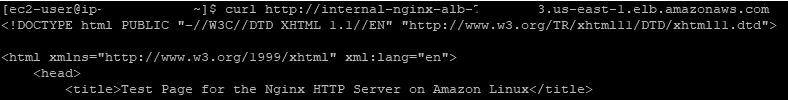
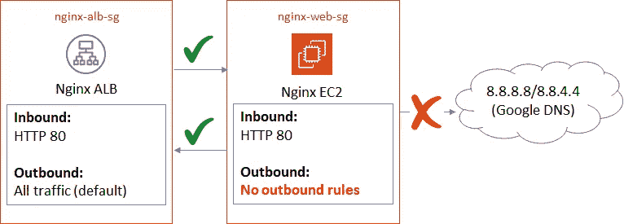
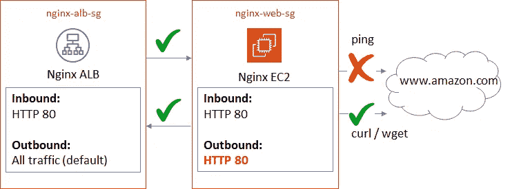

# AWS 安全组和网络 ACL 故障排除须知

> 原文：<https://levelup.gitconnected.com/what-you-should-know-to-troubleshoot-aws-security-groups-network-acls-115ca775dc3a>

## AWS 网络

## AWS 安全组和网络 ACL 的深入故障排除。您应该了解哪些故障排除知识？以及一些有用的网络工具。

照片由 [Unsplash](https://unsplash.com/s/photos/connection?utm_source=unsplash&utm_medium=referral&utm_content=creditCopyText) 上的 [israel palacio](https://unsplash.com/@othentikisra?utm_source=unsplash&utm_medium=referral&utm_content=creditCopyText) 拍摄

如果您已经在 [AWS](https://aws.amazon.com/) 上工作了一段时间，无论是管理基础设施还是创建一些花哨的无服务器应用程序，您一定至少遇到过一次由于 AWS 安全组或网络访问控制列表(ACL)的错误配置而导致的某种网络问题。

让我们看看为什么它们如此重要，以及如果您的 AWS 网络出现问题，知道如何对它们进行故障排除为什么如此重要。

在我们继续之前，让我们花点时间了解 AWS 安全组和网络 ACL 在 AWS 网络中的用途。

## AWS 安全组

在这种情况下，我们将仅指 VPC 安全组，而不是 EC2-Classic 安全组，因为我们不应再与 EC2 Classic 合作。

简单地说，AWS 安全组可以被描述为主机级的包过滤防火墙。通常，它们与 AWS EC2 实例相关联，并被视为抵御任何入侵的最后一道防线。

EC2 安全组与[弹性网络接口](https://docs.aws.amazon.com/AWSEC2/latest/UserGuide/using-eni.html) (ENI)相关联。因为它们附属于 ENIs，所以它们与其他服务一起使用，如 Amazon RDS、Amazon Elasticache 和 VPC 端点。

## 网络访问控制列表(NACL)

网络 ACL 是可以在 VPC 子网级别控制入/出流量的防火墙。NACLs 用于管理整个子网中所有 EC2 实例的流量规则。

NACL 被认为是 VPC 安全的一个可选层，有时人们生活在默认的 NACL 规则下，该规则允许进出流量跨越子网边界。

由于各种原因，如管理复杂性、安全组规则冗余以及对规则处理开销的担忧，人们普遍倾向于远离自定义 NACLs。尽管这些都是合理的考虑，但是在可能的情况下维护定制的 NACLs 是一个好的实践，以便拥有这个额外的网络安全控制层。为了前任。在任何 DDoS 攻击的情况下，阻止攻击者的 IP 范围可能会更容易和更快。

# 参考架构

让我们来看看由于 AWS 安全组和网络 ACL 错误配置而遇到的一些基于场景的 AWS 网络问题。作为参考，我们将考虑下面的简单架构。

这里，我们使用 AWS 应用程序负载平衡器(ALB ),以及 ALB 后面的 EC2 实例(在不同的子网中),它们也可以连接到一些外部网络。在这种情况下，我们将它视为公共互联网。另外，请注意，我们将子网连接到两个独立的网络 ACL。这是为了我们的故障排除场景，在实践中不必如此。

此外，这里假设我们有其他网络服务和组件，如路由表、互联网网关、NAT 网关等。配置正确。这里的重点是深入探讨与安全组和 NACLs 相关的问题，但在任何此类故障排除过程中，可能还必须考虑其他相关服务的配置。

*一旦我们深入以下几节中的故障排除场景，您应该能够将类似的概念应用到您的相关使用案例和场景中。*

参考架构

# AWS 安全组故障排除

## 场景 1:一切都使用默认出站规则

基于上面的架构，让我们理解安全组如何使用默认出站规则。

我为负载平衡器和 web 服务器考虑了两个独立的安全组。并且，我在两个安全组中打开了 1 `HTTP/80`入站规则，没有对出站规则进行任何更改。

*注意:为了简单起见，我考虑使用 HTTP/80 而不是安全的 HTTPS/443。尽管这不是一个好的实践。*😥

在这种情况下，您应该能够成功地`curl/wget`(或使用浏览器)负载平衡器的 DNS 名称(一个记录)或 CNAME(如果您有)。你会看到这样的 HTML 响应—

卷曲试验

现在，要查看 EC2 实例安全组的出站规则是如何工作的，您可以尝试 ping Google DNS IPs，它应该也能正常工作。

从 EC2 服务器 ping Google DNS IP

因此，我们检查了下面列出的交通流量，它们工作正常。

*   从用户到→ ALB 到→ EC2 的流量，以及返回的响应。
*   从 EC2(比如说，`ping 8.8.8.8`)到互联网的流量以及返回的响应。

在我们探索其他场景和配置选项之前，理解安全组的有状态行为和连接跟踪机制是很重要的。

> 那么，什么是连接跟踪，它如何使安全组有状态？

在上面讨论的场景中，让我们假设我们从附加到 EC2 实例的`nginx-web-sg`安全组中删除了出站规则。现在，来自负载均衡器的任何请求仍然会得到响应。这是因为响应通过在源端打开的临时端口返回到源端(无论是负载平衡器还是另一个 EC2 实例)。简而言之，这就是连接跟踪。

但是，来自 EC2 实例的任何流量(在本例中为`ping 8.8.8.8`)将无法流出。这是因为现在在`nginx-web-sg`安全组中没有适用于源流量的出站规则。

因此，我们有了安全组的有状态行为。

## 场景 2:无法从 EC2 实例连接到另一个网络

在这种情况下，已经删除了`nginx-web-sg`安全组的默认出站规则。如上所述，任何来自 EC2 实例的流量(在本例中为`ping 8.8.8.8`)都将无法流出。

如果您尝试运行`ping 8.8.8.8`或`curl -I https://[www.amazon.com](http://www.amazon.com,)`或[，](http://www.amazon.com,) egress 将会失败。您会看到 100%的数据包丢失。

但是，您仍然会看到对负载平衡器请求的成功响应。那么，它是如何工作的呢？从负载平衡器安全组到 EC2 安全组的连接跟踪使其工作。

卷曲试验

让我们快速检查一下为上述请求创建的 VPC 流日志条目。如果您还没有启用 VPC 流日志，我建议立即启用它，因为这是推荐的最佳实践。

由于 VPC 流量日志条目是根据 ENI 生成的，您可能需要查看与相关 Eni 对应的所有日志组。

单个 Eni 的 VPC 流量日志样本 CloudWatch 日志组:

请注意，默认日志格式如下所示。现在，如果需要，我们也可以配置自定义格式。

在下面的流日志中，我们有两个独立的事件。

第一条记录是在从`nginx-web-sg`安全组中删除安全出站规则的情况下发出`ping 8.8.8.8`请求时的条目。在这种情况下，流量无法流出 EC2 实例。

当默认出站规则存在时，日志显示 2 条类似于时间戳为`*16:22:27*`的记录。从 VPC 流量日志格式中，我们可以看到响应被成功接收— `request 10.0.4.80 → 8.8.8.8`和`response 8.8.8.8 → 10.0.4.80`。

## 场景 3:一些连接在 EC2 实例中工作正常，而另一些则不然

这里，`nginx-web-sg`安全组的默认出站规则已经被替换为自定义出站规则。让我们考虑一下`HTTP/80`已经向公众开放了互联网。

现在，只有来自我们 EC2 实例的特定流量(`HTTP/80`)能够流出，并且响应将被成功接收。任何其他像`ping 8.8.8.8`或`ping [www.amazon.com](http://www.amazon.com) -c 1`这样的请求都会因为缺少出站规则而失败。“ping”需要 ICMP 出站规则。

查看这些不同请求的源 ENI VPC 流日志。您将看到源 EC2 实例安全组阻止了“ping”流量的相关条目。对于`curl -Iv [www.amazon.com](http://www.amazon.com)`请求，将会有请求/响应条目。

注意，我在 curl 命令中使用了`-Iv`作为选项。这将在详细模式下打印标题信息。因此，我们会看到发出请求的 IP 地址。在搜索 VPC 流日志时，可以使用该 IP 地址。

样本“卷曲”和 VPC 流量测井输出:

## 场景 4:多个资源使用同一个安全组

有时，您可能希望对负载平衡器及其背后的服务器使用同一个安全组。但是，我不推荐这种方法，因为它不是一种非常整洁的方法，而且随着规则数量的增加，它会变得非常复杂。此外，保持隔离也变得很困难。

然而，我已经看到这种模式在多个场合被使用。因此，让我们探讨一下在这种情况下，我们需要如何配置规则，以使配置正常工作。

在这里，您会注意到规则中有对自身的引用。

对于入站规则，同一个安全组现在需要从所有可能的来源打开所有必需的规则。在这种情况下，它应该包括负载平衡器和 EC2 实例的规则。

此外，安全组应该包括一个规则，允许自己作为源。当 EC2 实例从负载平衡器接收流量时，将应用此规则。如果未配置此规则，EC2 实例将无法接收流量，因为没有匹配的入站规则。

另一个场景是不同的端口被用作负载平衡器和 EC2 实例的入站端口。例如，如果负载平衡器正在监听`HTTPS/443`，并且在 SSL/TLS 卸载后流量被发送到`HTTP/80`上的 EC2 实例，那么安全组需要在入站规则中允许`HTTP/80`和`HTTPS/443`。如果只配置了`HTTP/443`，那么流量将被阻塞，因为 EC2 实例的适用入站规则`HTTP/80`丢失。

关于出站规则，一种选择是保留默认规则，我们不必担心出站连接。但是，如果您可能使用自定义出站规则，请确保所有必需的端口和协议都是开放的。出站规则将适用于负载平衡器和 EC2 实例。

使用上图中的第一个出站规则，我们可以将流量从负载平衡器发送到 EC2 实例，因为该实例使用相同的安全组，并且自身也有一个入站规则。并且，第二个规则将允许`ping 8.8.8.8`成功，但不允许`ping 8.8.4.4`，因为该规则是特定于 IP 地址的。

如您所见，对多个入站/出站资源使用带有自定义出站规则的单个安全组会很快使事情变得复杂。

# 网络 ACL 故障排除

让我们将网络 ACL 融入其中，看看会发生什么。回顾我们的参考架构，我们在独立的子网中有 2 个 EC2 实例，它们与 2 个不同的网络 ACL 相关联。我们也可以拥有与 1 个 NACL 相关联的子网，但我将它分开，以便在这里讨论我们的故障排除场景。

参考架构

网络 ACL 是无状态的。与安全组不同，连接跟踪不适用于 NACLs。因此，我们需要为允许/拒绝规则配置所有相关的端口和协议。

默认 NACLs 允许所有入站/出站流量。但是，默认情况下，自定义 NACLs 会拒绝所有流量。需要添加允许/拒绝入口/出口规则。

NACL 的一个重要方面是规则处理顺序。基本上，数字越小，优先级越高。我们来看一个例子。

如果我们有一个更高规则号的出站 ICMP 拒绝规则(见下面的截图)，那么它仍然允许`ping 8.8.8.8`外出。

但是，如果规则的编号较低(因此优先级较高)，那么它会阻止流量。

## 分析 NACL 相关问题的 VPC 流量日志

既然我们已经了解了规则优先级在 NACL 中是如何工作的，那么让我们来看看如何分析 VPC 流日志并对 NACL 相关问题进行故障排除。

让我们考虑我们架构中的 2 个 EC2 实例。为简单起见，让我们考虑具有默认规则的安全组和具有默认允许入站/出站规则的子网 A(流量源)NACL。

## 场景 1:使用入站拒绝 NACL 规则的子网 B(流量目的地)

在这种情况下，源 EC2 实例和子网 A 的安全组和 NACL 分别允许出口流量。因此，流量应该到达目的子网和 EC2 实例。

请记住，在排除 NACL 问题时，我们需要检查源和目标 ENI VPC 流量日志。

源 EC2 ENI 的 VPC 流日志将显示如下所示的条目。

并且，目的地 EC2 ENI 的 VPC 流日志将只有如下 1 个条目。为什么？因为入站流量在到达 EC2 安全组之前被入站 NACL 规则阻止。

在下一个场景中，让我们看看添加拒绝出站规则而不是入站规则时会发生什么。

## 场景 2:使用出站拒绝 NACL 规则的子网 B(流量目的地)

像前面的场景一样，源 EC2 ENI VPC 流量日志条目将是可用的。

但是，在目的地 EC2 ENI 的情况下，我们将能够看到 2 个条目。第一个是入站接受条目，第二个是出站拒绝条目。

因此，有了可用的 VPC 流日志条目，您应该能够找出可能的配置问题。用 ping 或 curl 之类的命令测试上述规则配置，您应该会看到预期的输出。

# 有用的网络故障排除工具

下面列出了我在排除网络相关问题时通常使用的一些常用工具/实用程序。

尽管专业网络工程师可能会使用其他工具，但这些工具应该足以解决基本的 AWS 网络问题。

**ping** —用于通过 ICMP 在源和目的地之间进行基本连接测试。

**tracert** ， **traceroute** —用于查找从源到目的地路径的更详细信息。

**dig，nslookup** —查找 DNS 记录。

**ipconfig** ， **ifconfig** —查找主机的 IP 配置。

**netstat** —用于查找活动的 TCP 连接/端口。

**telnet** —用于检查可远程访问的 TCP 端口，或在开放端口上远程连接。

**netcat** —类似于 telnet，但提供更多功能，如使用 UDP 连接。

**路由** —查找或编辑路由信息。

**Wireshark** —网络数据包分析工具。这可以用于深度包检查。

# 总结想法

除了这些工具之外，在对 EC2 主机级别的基本网络问题进行故障排除时，您可能还需要考虑其他方面。

根据 Windows 与 Linux 系统的不同，您可能还需要查看主机级配置，比如 iptables /Windows 防火墙、主机网络配置文件、DNS 设置等等！

我希望这篇文章能帮助你理解 AWS 安全组和 NACL 规则是如何协同工作的，以及它们如何影响你的 AWS 环境中的连通性。

故障排除愉快！

# 参考

 [## 您的 VPC 的安全组

### 安全组充当实例的虚拟防火墙，控制入站和出站流量。当您启动…

docs.aws.amazon.com](https://docs.aws.amazon.com/vpc/latest/userguide/VPC_SecurityGroups.html)  [## 网络 ACL

### 网络访问控制列表(ACL)是 VPC 的一个可选安全层，可作为防火墙用于…

docs.aws.amazon.com](https://docs.aws.amazon.com/vpc/latest/userguide/vpc-network-acls.html)  [## VPC 流量测井

### VPC 流量日志是一项功能，使您能够捕获进出网络的 IP 流量信息…

docs.aws.amazon.com](https://docs.aws.amazon.com/vpc/latest/userguide/flow-logs.html) 

*跟我上* [*LinkedIn*](https://www.linkedin.com/in/bideep/) *，*[*Twitter*](https://twitter.com/bbideep)*。*

[*在媒体上订阅*](https://bbideep.medium.com/subscribe) *更多此类帖子。*