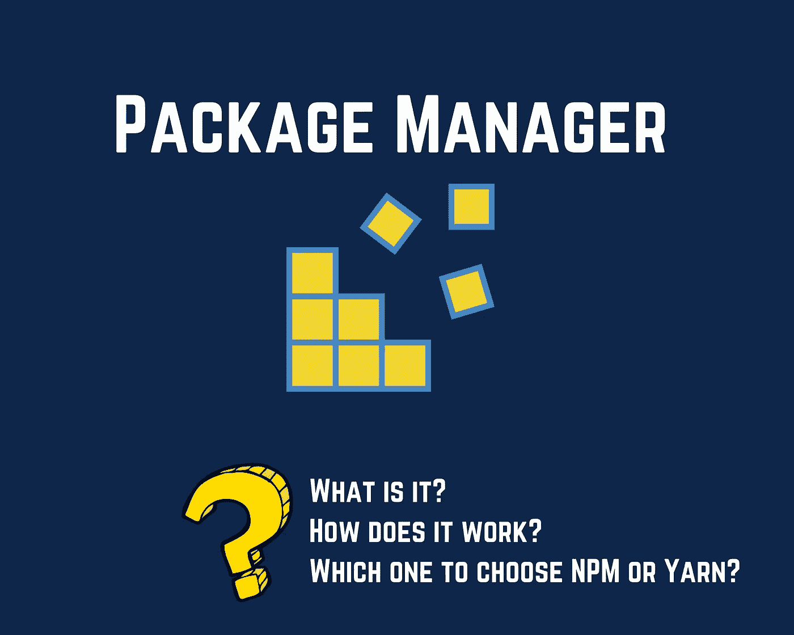
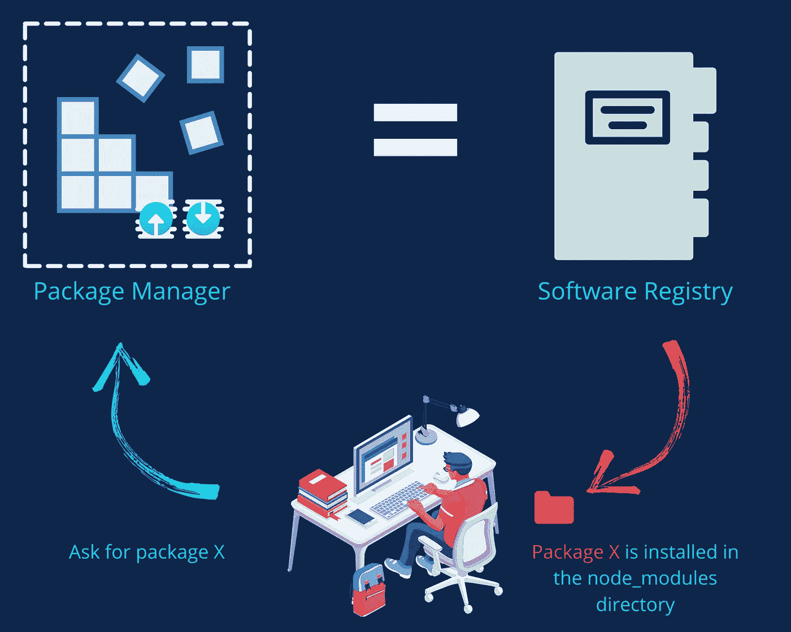
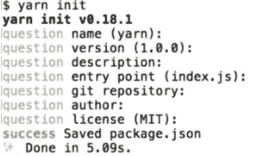

# Angular 中的包管理器是什么，它是如何工作的？

> 原文：<https://levelup.gitconnected.com/whats-a-package-manager-in-angular-and-how-it-works-58c4aedc58e8>

## NPM 和纱，选哪一个？



你用过软件包管理器吗？你想知道什么是包管理器吗，在前端世界里什么是最好的选择？你想知道它是如何工作的，以及如何选择适合你的包管理器吗？亲爱的读者欢迎你，这篇文章最终会给你脑海中一个清晰的画面。

# ❓What's 是包装经理吗？

顾名思义，包管理器是一个包或工具的集合，它自动化一些过程，以专注于更重要的事情，如应用程序逻辑和服务。

> 软件包管理器或软件包管理系统是一组软件工具，它们以一致的方式自动执行为计算机操作系统安装、升级、配置和删除软件包的过程。它通常维护一个软件依赖关系和版本信息的数据库，以防止软件不匹配和遗漏先决条件。— [维基百科](https://en.wikipedia.org/wiki/Package_manager)

因此，打包程序管理器以自动化的方式管理安装库和管理依赖项的过程。

如今，要在 Angular 中开发一个 web 应用程序，你不能先从头开始开发所有东西，因为许多开源第三方库提供了你想要开发的东西，并且已经非常好地工作了。因此，开发一个现有的功能最终会浪费时间和金钱。第二，在现实生活中的例子中，一个企业应用程序更复杂，公司最希望尽可能地降低成本。因此，即使您想自己开发整个应用程序，您也需要学习依赖项管理，因为总有一天您肯定会需要第三方库。

# 🛠:它是如何工作的？

软件包管理器只不过是一个大型的软件注册表。通过在您的开发环境中安装一些需求并调用正确的命令，包管理器下载您请求的库并将它们存储在您项目的`node_modules`目录中。



现在我们知道了它在角度应用中的工作原理。对于包管理器，我们可以使用两个众所周知的选项: ***NPM 和 Yarn*** 。两者有什么区别，哪个最好用？

# ️🥊NPM 和纱，选哪一个？

## **NPM(节点包经理)**

你可能已经知道 NPM，甚至使用过它。安装 Node.js 时默认安装。

>要安装这个，你只需要安装 node.js。

>安装依赖项:`npm install [package-name]@[version]`

>初始化项目:`npm init`

>我们可以用 NPM 做其他事情，比如构建启动应用、运行测试、用 lint 运行格式检查等等。

不幸的是，NPM 并不完美。这就是为什么开发了许多开源替代方案来解决它的问题。最著名的替代品是纱线。

## **纱线**

2016 年 10 月，脸书与 Exponent、谷歌和 Tilde 合作发布了 yarn。

> 我们在脸书的许多项目，像 React，都依赖于 npm 注册表中的代码。然而，当我们在内部扩展时，我们面临着跨不同机器和用户安装依赖项时的一致性问题，获取依赖项所花费的时间，以及 npm 客户端自动执行其中一些依赖项的代码的方式的一些安全问题。我们试图围绕这些问题构建解决方案，但是他们自己经常提出新的问题。—脸书工程公司

>要安装 Yarn，您可以通过 NPM 进行 ti:

```
npm install -g yarn
```

>如果您使用的是 Windows，可以下载[安装程序](https://yarnpkg.com/latest.msi)。

>如果您是 Unix 或 iOS 用户，您可以通过 shell 安装 Yarn:

```
curl -o- -L https://yarnpkg.com/install.sh | bash
```

>用纱线初始化项目:`Yarn init`

## **NPM 对纱**

***>不同的初始化结果***

尽管我们用同样的方式初始化一个项目，不管是用 Yarn 还是 NPM。但是，说到结果还是有参考的。对 NPM 来说，这有点快。而纱线则不同。它会回答您一些问题，以便在生成`package.json`文件之前根据您的需要定制初始化:



顺便说一句，如果你有依赖问题或者不知道`package.json`，这里有一篇文章对它进行了全面深入的解释:

[](https://medium.com/swlh/package-json-package-lock-json-angular-e50fd3eb624f) [## 包裹。JSON & Package-lock。JSON-角度

### 处理依赖性问题需要了解的事情

medium.com](https://medium.com/swlh/package-json-package-lock-json-angular-e50fd3eb624f) 

***>不同的注册表***

纱线用途`[https://registry.yarnpkg.com](https://registry.yarnpkg.com.)`。而 NPM 使用`[https://registry.npmjs.org](https://registry.npmjs.org.)`。

***>不同的执行时间，纱线更快***

Yarn 安装软件包的速度几乎是 NPM 的两倍。这是因为 Yarn 将操作并行化以最大化资源利用率。

=赢得时间和勇气


***>网络***

Yarn 管理离线模式。NPM 不支持它。您可能已经注意到，有时当您启动安装软件包的命令时，直到您第三次尝试时，它才会起作用。我已经有过几次这样的问题，最初我不知道哪里出了问题，我浪费了很多时间去调查和尝试安装包。真是浪费时间！

***>减少重复依赖***

NPM 有一个有趣的功能，允许你减少重复的依赖，减少你的包大小，清理你的应用程序。这可以通过下面的命令来完成:`npm dedupe`。

对于 Angular 企业应用程序，这个特性非常重要，因为当你在一个团队中工作时，我们最终会让团队中的某个人安装不同版本的相同包。相信我，我经历过这些。

不幸的是，这个选项在纱线上不存在。

# 💼外卖

*   Yarn 是脸书生产中使用的包装管理器。
*   Yarn 是 npm 的一个很好的高性能替代品。为了验证这一点，请尝试使用 Yarn。
*   对于 Yarn 用户来说，Yarn 的 Github 页面非常有趣。
*   纱线可以帮助你避免不愉快的时刻，保护你的神经和时间。
*   npm 问题依赖于跨不同机器安装依赖项时的一致性问题、一些安全问题、用于锁定依赖项版本的包膜 NPM 功能的问题等等。
*   NPM 仍然是一个不错的选择，尤其是对于一个小项目。

亲爱的读者朋友们，感谢你们的支持和宝贵时间。我希望这对你有用和有帮助。

**关注我上** [**中**](https://medium.com/@famzil/) **，**[**Linkedin**](https://www.linkedin.com/in/fatima-amzil-9031ba95/)**，** [**脸书**](https://www.facebook.com/The-Front-End-World) **，以及** [**推特**](https://twitter.com/FatimaAMZIL9) **获取更多文章。**

**后会有期(ﾉ◕ヮ◕)ﾉ*:･ﾟ✧**

**FAM**