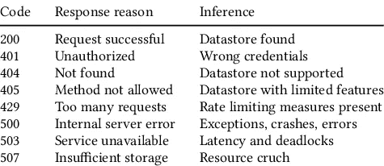
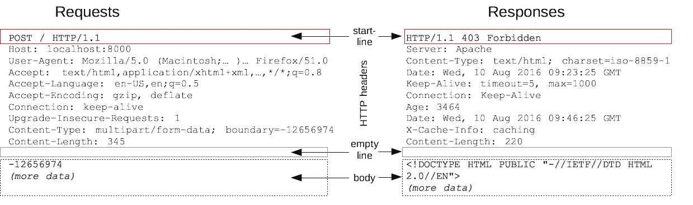

# 什么是 HTTP 请求？

> 原文：<https://levelup.gitconnected.com/whats-an-http-request-418fcfd60ae7>

# 什么是 HTTP？

HTTP 代表超文本传输协议，是一种用于构建互联网上计算机之间的请求和响应的协议。HTTP 遵循服务器-客户端模型，要求数据通过网络从一点传输到另一点。客户端通常是用户的设备，例如膝上型电脑、个人计算机或移动电话，而服务器通常是为客户端请求的数据提供服务的 web 主机。有几种动词或请求类型与 HTTP 相关联。

当发送 HTTP 请求时，客户端总是会收到一个响应代码，指示请求是被满足还是失败。如果 HTTP 请求已经成功完成，服务器将发回数据和成功响应代码。在请求失败的情况下，服务器将发回一个失败代码，指示发生了什么类型的失败，并且不会返回所请求的数据。也许这些失败代码中最臭名昭著的是*404: Page Not Found*。以下是一些其他响应代码及其含义的列表:

来源:[ [HTTP 响应代码和推断](https://www.researchgate.net/figure/HTTP-response-codes-and-inference_tbl1_328327565)

如果您想了解更多关于 HTTP 响应代码的信息，可以在这里查看 MDN 页面:[ [HTTP 响应状态代码— HTTP | MDN](https://developer.mozilla.org/en-US/docs/Web/HTTP/Status) ]

# HTTP 请求和响应的结构

HTTP 请求和响应由四部分组成:
1。起始行是请求的方法和带有参数的 url，或者是指示请求成功或失败的响应代码。
2。可以指定请求或描述消息体的标头。
3。空行，表示所有元信息都已发送。
4。与请求相关的所有数据的正文，例如来自 web 表单的数据，或者与响应相关联的文档，例如将向客户端显示的网页。

来源:[ [HTTP 消息— HTTP | MDN](https://developer.mozilla.org/en-US/docs/Web/HTTP/Messages) ]

# HTTP 请求的类型

当使用 HTTP 请求数据时，我们可以发出几种不同类型的请求。何时可以请求向服务器发送数据。我们可以请求服务器给我们一个特定的网页。我们可以请求服务器删除某段数据，比如评论或帖子。以下是一些最流行的 HTTP 请求方法:

也许最常用的 HTTP 请求方法是 Get 方法，它简单地请求服务器给我们一段特定的数据。这方面的一个例子是请求一个像 facebook 这样的网页。如果我们在浏览器中输入 https://www.facebook.com，我们就向脸书的服务器发送了一个 GET 请求，要求它返回 facebook.com 主页。

**Post** 这方面的一个例子就是提交一个 web 表单。设想一个 web 表单，其中包含您的姓名、地址和电话号码，POST 请求可能如下所示:

发布 http://example . com/API/name = " example " & address = " 123 example street " & phone = " 8675309 "

**Put** 要使用 put 方法，我们可以这样做，这将更新服务器上的姓名、地址和电话号码:

将 http://example . com/API/name = " Joe " & address = " 456 example drive " & phone = " 8573920 "

**Delete**
DELETE 是一个方法，它做的就像它听起来要做的一样:它删除用户请求删除的数据。

要阅读更多关于 HTTP 请求方法的内容，请查看这个 MDN 页面:[ [HTTP 请求方法— HTTP | MDN](https://developer.mozilla.org/en-US/docs/Web/HTTP/Methods) ]