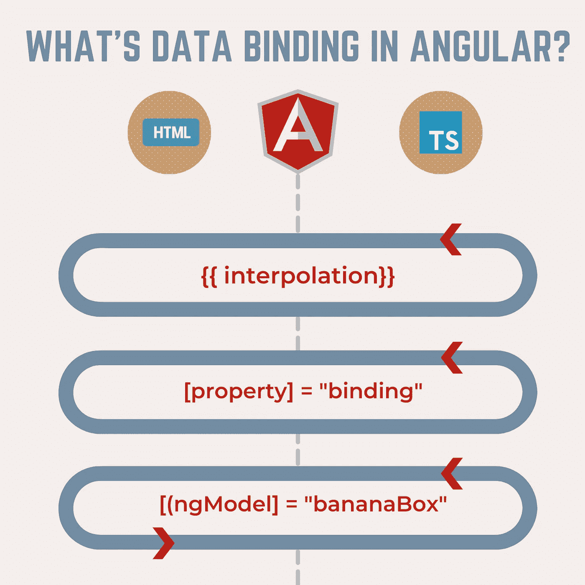

# Angular 中的数据绑定是什么？

> 原文：<https://levelup.gitconnected.com/whats-data-binding-in-angular-faddb0f64e89>

## 什么是插值？什么是属性绑定？什么是双向数据绑定？

您是否听说过数据绑定，并想知道它是什么以及它是如何工作的？这个问题一般是在面试提问的时候问的。由于 angular 遵循 MVC 架构，也就是模型-视图-控制器的意思。在模板(视图)中，我们需要访问组件提供的数据。这就是数据绑定出现的原因。为了构建任何角度的应用程序，数据绑定是一个必须知道的概念。

**在本文中，我将介绍:**

*   **什么是数据绑定**
*   **什么是插值？**
*   **什么是属性绑定？**
*   **什么是双向绑定，**

准备好了吗？让我们在棱角分明的世界里游泳吧(~˘▾˘)~)

# 什么是数据绑定

数据绑定是 Angular 前端框架的核心概念之一。这是一个重要的概念，它允许我们在组件和 DOM 之间进行通信。因为在 Angular 中，模板(HTML /View)是和组件(控制器)分开的。我们需要一种方法将数据和信息传递给模板，反之亦然。

因此，数据绑定是视图和控制器之间的数据通信方式。我说过，这不是唯一的方法。有 3 种类型的数据绑定。

*   **插补**
*   **属性绑定**
*   **双向绑定**

# 什么是插值？

插值是传递字符串变量或字符串类型的数据。

**语法** : ***{{*** 变量 ***}}***

⚠️变量名必须拼写正确(正如它在组件中声明的那样),这样通信才能工作。

# 什么是属性绑定？

有时我们需要将变量传递给属性。变量从组件传递到指定的属性。一个简单的、通常使用的例子是设置输入的值。

***语法:****属性*=**变量****

# ******什么是双向绑定？******

******最后一种是双向绑定，也叫香蕉盒或双向绑定。这种类型的数据绑定致力于将数据从组件发送到模板，反之亦然，通过视图(例如输入)修改变量，将新值发送回组件。因此，让数据双向流动。******

******语法:***[(*ng model*)]***= "值"******

******亲爱的读者朋友们，感谢你们的支持和宝贵时间。我希望这对你有用和有帮助。******

******订阅成为第一个收到新文章的人。******

********关注我上** [**中**](https://medium.com/@famzil/) **，**[**Linkedin**](https://www.linkedin.com/in/fatima-amzil-9031ba95/)**，** [**【脸书**](https://www.facebook.com/The-Front-End-World) **，**[**Twitter**](https://twitter.com/FatimaAMZIL9)**查看更多文章。********

******回头见(ﾉ◕ヮ◕)ﾉ*:･ﾟ✧)******

********FAM********