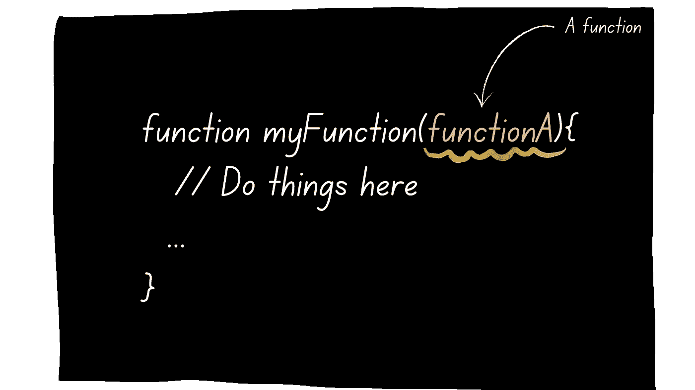

# JavaScript 中的 HoF 是什么？

> 原文：<https://levelup.gitconnected.com/whats-hof-in-javascript-9fb68a9c3f6f>

## 高阶函数有什么用？


作者:FAM

## 你好👋

今天，它是关于:

> 接受函数作为参数和/或返回函数的函数。



作者:FAM

在 JavaScript 中，函数是对象。因此，它们可以被赋值为变量的值，并且可以像任何其他引用变量一样被传递和返回。

## 示例:

```
**// Simple function**
function sum(a, b) {
   return a + b;
}**// Assign function to a variable**
const sum = (a, b) => {
   return a + b;
}// Use sum function
sum(2, 3);
```

## 示例:

在下面的示例中，我们希望过滤一个数组，只保留大于 20 的数字:

```
const data = [1, 48, 83, 9, 73];

const **result** = data.**filter**(**(num) => {
    return (num > 20);
}**);

console.log(result); // [48, 83, 73]
```

这是 HoF 的一个典型例子，因为我们将一个函数影响到一个变量(`result`)。我们使用了数组的过滤函数，它将另一个函数作为参数。

# 你为什么需要 HoF？

高阶函数可以带来代码大小的缩减和可重用性，非常适合函数式编程。

这里有一个有和没有 HoF 的例子。

*   **无高阶函数:**

```
const numbers = [1, 2, 3, 4, 5];function power2(array) {
  for (let i = 0; i < array.length; i++) {
    array[i] = array[i] * array[i];
  }
}power2(numbers)
console.log(numbers); //[1,4,9,16,25]
```

*   **带高阶函数:**

```
const numbers = [1, 2, 3, 4, 5];

numbers.***forEach***(***(number, index) => numbers[index] = number * number***);console.log(numbers); //[1,4,9,16,25]
```

如你所见，我们用更少的代码用高阶函数方法做了同样的事情。高阶函数`***forEach()***`对数字数组中的每个数字应用一个函数。

还有其他内置的 JS 高阶函数如:`***Array.prototype.forEach***`、`***Array.prototype.map***`、`***Array.prototype.filter***`、`***Array.prototype.reduce***`、**、*。***

**注意，** `**() => {}**` **与** `**function(){}**` **相同。**

高阶函数对于回调也是必不可少的。在接下来的文章中，我将回到关键字`***callback***`。但是，给你一个快速的概述，每当你想在一个特定的任务之后做额外的事情时，你将需要一个回调函数。例如，您想从后端获取一个产品列表，在获取数据后，您想停止进度条。

今天就到这里，看阿雅🙋

如果您有任何问题或反馈，请点击评论或通过 LinkedIn 联系我— **我洗耳恭听！**

[**想给我买杯咖啡吗？☕️**](https://www.buymeacoffee.com/fatimaamzil)

> 让我们为 2022 年打造一个更好的‘我们’！

## 了解有关 2022 年网络快车计划的更多信息:

I- [网络常识](https://medium.com/geekculture/2022-web-program-chapter-n-1-is-done-499fb0707220?source=your_stories_page----------------------------------------)

[II-网页框架:HTML](https://famzil.medium.com/your-html-essentials-69d9b2349355?source=your_stories_page----------------------------------------)

[III-网页样式:CSS](https://medium.com/geekculture/recap-of-the-css-chapter-ae388d51e564?source=your_stories_page----------------------------------------)

## IV- Web 交互:JavaScript

*   [异步代码](https://javascript.plainenglish.io/can-the-web-live-without-asynchronous-code-7f61fe2e862e?source=your_stories_page----------------------------------------)
*   [这个](https://medium.com/geekculture/this-for-developers-5dc91d499677?source=your_stories_page----------------------------------------)
*   [变量](https://medium.com/codex/js-variables-what-you-need-to-know-fb8994ed9d0d?source=your_stories_page-------------------------------------)
*   [范围&吊装](https://javascript.plainenglish.io/js-mechanism-you-should-know-12431e094103?source=your_stories_page-------------------------------------)
*   [操作员](https://javascript.plainenglish.io/js-operators-3511c8545719?source=your_stories_page-------------------------------------)
*   [关闭](https://famzil.medium.com/js-closures-99666fe36a6a?source=your_stories_page-------------------------------------)

> **高阶函数**

*   对象和方法
*   阵列、集合和地图
*   功能和箭头功能
*   超时和间隔
*   …

[](https://medium.com/geekculture/2022-web-program-is-launched-f38a3280af1a) [## 2022 网络计划启动！

### 改变来自心态和习惯

medium.com](https://medium.com/geekculture/2022-web-program-is-launched-f38a3280af1a) 

与想成为 web 开发人员的人分享该程序！这将有助于保持进步，并在旅途中互相帮助。

> 如果你喜欢我的文章， [**订阅**](https://famzil.medium.com/subscribe) 获取我的最新。如果你自己喜欢体验媒介，可以考虑通过[**注册会员**](https://famzil.medium.com/membership) 来支持我和其他成千上万的作家。它只需要每月 5 美元，它支持我们，作家，你也有机会用你的作品赚钱。当然，你可以随时取消会员资格。通过注册[这个链接](https://famzil.medium.com/membership)，你将直接用你的一部分费用来支持我，不会花你更多的钱。如果你这样做了，万分感谢！

让我们**联系上** [**中**](https://medium.com/@famzil/)**[**Linkedin**](https://www.linkedin.com/in/fatima-amzil-9031ba95/)**[**脸书**](https://www.facebook.com/The-Front-End-World)**[**insta gram**](https://www.instagram.com/the_frontend_world/)**[**YouTube**](https://www.youtube.com/channel/UCaxr-f9r6P1u7Y7SKFHi12g)**或**********

****[](https://famzil.medium.com/membership) [## 通过我的推荐链接——FAM 加入 Medium

### 作为一个媒体会员，你的会员费的一部分会给你阅读的作家，你可以完全接触到每一个故事…

famzil.medium.com](https://famzil.medium.com/membership)****