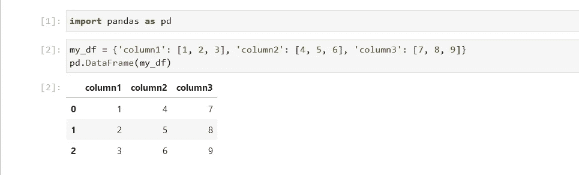
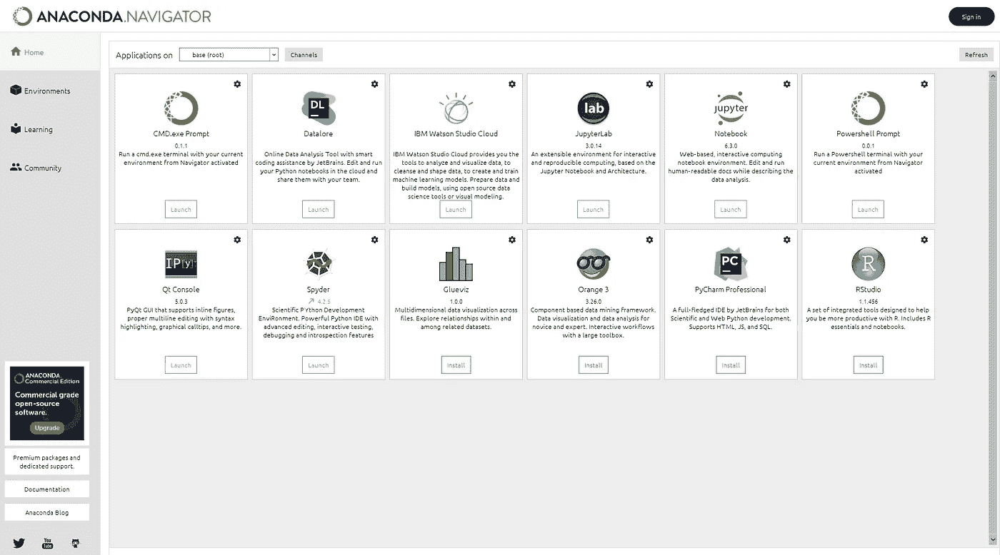
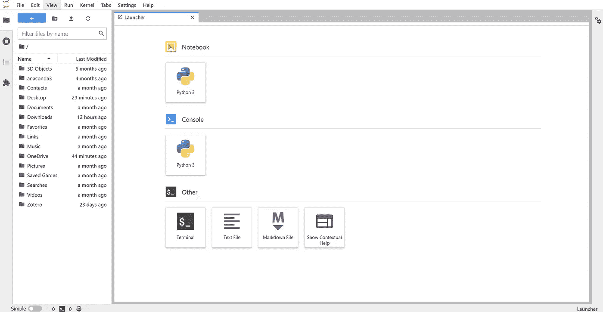

# Jupyter 笔记本里有什么？(Windows 版)

> 原文：<https://levelup.gitconnected.com/whats-in-a-jupyter-notebook-windows-edition-1f69c290a280>

## 解释您为什么应该使用 Jupyter 笔记本电脑，以及如何在您的 Windows 计算机上安装它们。


照片由[星球卷](https://unsplash.com/@planetvolumes?utm_source=medium&utm_medium=referral)在 [Unsplash](https://unsplash.com?utm_source=medium&utm_medium=referral)

如果您以任何身份处理数据，您绝对需要在工作中使用 Jupyter 笔记本。你会问，什么是 Jupyter 笔记本？好吧，请允许我满足你的要求。

## Jupyter 笔记本到底是什么？

从本质上讲，Jupyter 笔记本只不过是一个编程接口，使您能够在编写代码时通过清晰的显示和输出来测试代码，而不是重复保存文件并在终端中运行。它由一组代码单元组成，您可以一次运行一个代码单元来完成模块化任务。

例如，假设我创建了一个名为`my_df`的数据帧。在候机楼里，我别无选择，只能屈服于下面丑陋的显示:

```
>>> my_df = {'column1': [1, 2, 3], 'column2': [4, 5, 6], 'column3': [7, 8, 9]}
>>> pd.DataFrame(my_df)
   column1  column2  column3
0        1        4        7
1        2        5        8
2        3        6        9
```

Jupyter 笔记本的外观更加优雅易读:



印刷精美的数据帧。

漂亮！

## 为什么要用 Jupyter？

上图不言自明。数据处理和分析的工作方式与其他编程任务(如构建操作系统或设计网络)略有不同。

能够看到您的每一步数据非常有帮助:

*   清空了一列？Jupyter 使得快速复查代码是否达到了预期目的变得很容易。
*   制作了一个可视化？Jupyter 可以在你的正下方看到它，而不必运行 Python 文件并手动生成图像。
*   需要用你的数据讲故事？Jupyter 提供了将单元格转换为 Markdown 的能力(如果您不知道这是什么，它基本上是纯文本，带有一些特殊的格式功能，有助于粗体、项目符号、字体大小等。).这使您能够提供文本描述，并帮助用户理解他们在看什么。这就像将代码嵌入到一篇中型文章中，只不过您还可以自己编辑和运行它！

此外，Jupyter 笔记本并不局限于单一的编程语言。我自己是一个喜欢 Python 的人，但是如果你喜欢在 Julia 或 R 工作，Jupyter 会帮你搞定。事实上，这个名字就是这么来的:“Ju”代表 Julia，“Py”代表 Python，“R”代表——呃，好吧，R。

不管你喜欢哪种语言，Jupyter 都会让你的数据处理更加容易。

## 你是如何在电脑上安装 Jupyter 笔记本的？

现在，到了关键时刻——真正拿到朱庇特笔记本。我的简短介绍将集中于 Windows 用户，因为 1)我自己有一个 Windows，2)众所周知，在 Windows 上安装东西比在 Mac 或 Linux 上更难。

你有几个选择:

1.  你可以使用基于网络的 Jupyter 版本。
2.  您可以将它安装在本地计算机上。

我推荐第二种选择，这样你就不会在每次需要处理数据时受天气和不稳定网络连接的影响。

下面，我将简要描述如何使用 [Anaconda](https://www.anaconda.com/) 开始使用本地版本，这是一个数据科学包管理器，它减少了很多麻烦，因为它自动处理包可能需要的各种依赖项的安装。

第一步是在这个页面安装 Anaconda。这相当简单:你只需点击安装程序，然后点击足够的次数来完成这个过程。

完成后，进入左下方的 Windows“搜索”功能，查找上面应该已经安装的“Anaconda Navigator”。这将打开如下页面(请耐心等待，可能需要几分钟):



巨蟒领航员。

你可能注意到了，JupyterLab 和 Notebook 都对我说“发射”。这是因为我已经安装了它们。你的会说“安装”——我推荐使用 JupyterLab，因为你会得到 Jupyter 笔记本的所有功能以及更多功能(详情见这篇[堆栈溢出帖子](https://stackoverflow.com/questions/50982686/what-is-the-difference-between-jupyter-notebook-and-jupyterlab?rq=1))。

一旦你得到了它，你可以继续点击启动！或者，如果您喜欢命令行，您可以打开 Anaconda 提示符(Anaconda 版本的终端)并简单地输入命令`jupyter lab`。您将看到这样一个页面:



JupyterLab 界面。

现在，只需点击 Python3 笔记本，您就可以上路了！至于那些其他的语言，用几个快速的 Anaconda 命令就可以很容易地获得——例如，[查看本页，获得安装 r 的指南。](https://datatofish.com/r-jupyter-notebook/)

## 最后的想法

Jupyter 本质上是数据科学家的梦想成真。它的界面支持一种实时编程的形式，这使得实时处理和分析您的数据变得更加容易，这是我可以亲自证明的事实。使用它对我非常有帮助，我希望它对你也有帮助。

下次见，伙计们！

**想擅长 Python？** [**获取独家，免费获取我简单易懂的攻略**](https://witty-speaker-6901.ck.page/0977670a91) **。**