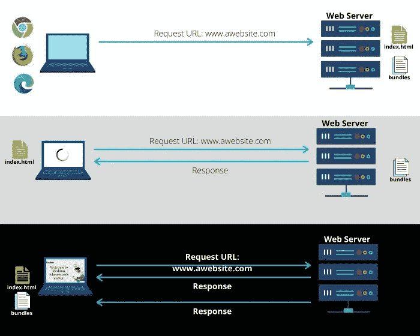
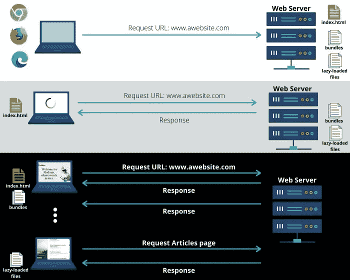
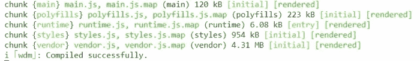
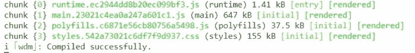

# 什么是懒加载

> 原文：<https://levelup.gitconnected.com/whats-lazy-loading-e3d967554863>

## 每个 web 开发人员都应该知道的基本技术之一！

作者:FAM

谁愿意等待应用程序被加载？我不知道。有时候我们选择抛弃 app，而不是等待。让用户访问你的网站并不容易。所以，付出了那么多努力，失去他真的是一种浪费。除此之外，第一印象很重要。这是我们赢得访客的机会。

因此，我们希望最大限度地缩短用户请求应用程序和显示其第一个模板之间的时间。对于这个问题，懒加载是我们最好的朋友。

说明性示例和文件基于 Angular app 结构。

# 什么是懒加载

通常，当我们想到懒惰加载时，我们会想到一些缓慢的东西。但是我们的路线可以同时懒惰和快速。

*   为了理解这个问题，这里有一个解释性的图像。当我们第一次在浏览器中查询网站时。网络服务器发送给我们一个 index.html 文件。该文件不会呈现整个应用程序，因为浏览器需要包含模块、功能和库的主包来运行应用程序。这就是一个应用程序的加载时间。而 app 要么空白，要么显示一个加载器告诉你:“*请等待*”如果开发者是好心的话。然后，我们收到本金包，我们的应用程序最终显示出来。

作者:FAM

以避免让用户等待应用程序开始。我们可以将我们的应用程序分成几个小部分。因此，开始时只下载需要的文件，其他文件在用户要求时才下载，也就是按需下载，这就是所谓的 ***延迟加载*** 。因此，我们会有这样的事情:

作者:FAM

这一次主包将花费更少的时间，因为我们没有加载所有的东西。因此，下载量更少，Angular 编译量也更少。**因此，启动应用程序的时间更少**。这大大缩短了启动时间，尤其是对于企业应用程序。

惰性加载是用来加快我们的应用程序的启动时间，给我们的应用程序最好的印象。

为了更深入地了解 Angular，让我们来看看 Angular 在有惰性加载和没有惰性加载的情况下是如何构建的:

*   包含我们的代码缩小，和丑化
*   `***polyfills.js***`拥有所需的 polyfills 脚本，以确保应用程序能够在所有现代浏览器中运行。
*   `***runtime.js***`是一个用来加载其他文件的文件。
*   `***style.js***`这个包包含应用程序风格
*   `***vendor.js***`包含运行应用程序所需的库，包括 Angular 库。

让我们在-prod 模式下启动应用程序。

您会注意到的第一件事是，编译要花费更多的时间。让我们分析一下捆绑包:

*   我们注意到 ***vender.js*** 已经消失了。那是因为，在生产模式下，Angular 使用了***【AOT】***编译器*(提前)*。我们所有的图书馆都在我们的主包里。
*   ***AOT*** 编译器将我们的模板和类型脚本代码转换成 Javascript 由浏览器呈现，而不需要每次都将编译器包含在捆绑包中为我们编译。
*   主包是一个巨大的包，这是意料之中的，因为它包含了我们所有的代码和所需的库。

如果我们想减少应用程序的加载时间，我们应该减少主包的大小。

而这就是**懒加载登场的地方。**

它的作用是构建应用程序启动和显示初始页面所必需的主包。需要时加载其他包。这就是为什么对了，这叫懒装。我们只按需装载。

# 外卖

*   我们可以通过延迟加载一些很少被请求的功能来优化我们的应用程序。
*   只有特定角色的用户才能访问的功能也可以延迟加载，以加快应用程序的加载速度。
*   延迟加载=延迟到需要时=仅按需加载=更小的包大小=更少的应用加载时间=更好的用户体验

> *当* [*有新的热门文章出来，第一个被通知*](https://famzil.medium.com/subscribe) *！*

如果你有兴趣成为付费会员，你可以使用我的推荐链接。下次见

亲爱的读者，感谢你在我生命中的存在。

**让我们在** [**上取得联系**](https://medium.com/@famzil/)**[**Linkedin**](https://www.linkedin.com/in/fatima-amzil-9031ba95/)**[**脸书**](https://www.facebook.com/The-Front-End-World)**[**insta gram**](https://www.instagram.com/the_frontend_world/)**[**Youtube**](https://www.youtube.com/channel/UCaxr-f9r6P1u7Y7SKFHi12g)**或**********

******参见我的关于网络要素和一般文化的电子书。******