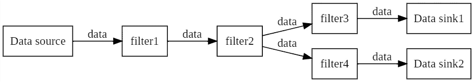

# 什么是 Mediastreamer2。介绍

> 原文：<https://levelup.gitconnected.com/whats-mediastreamer2-80fa1c5e617>


本文是关于使用 Mediastreamer2 引擎进行实时媒体处理的系列文章的开始。

# 介绍

Mediastreamer2 库旨在构建基于 VoIP 技术的音频和视频处理/传输系统。由于其多功能性和插件接口，Mediastreamer2 不仅可以用于这些系统的开发和原型制作，还可以用于处理其他数据。该库是 GPLv3 许可的自由软件。

本系列中给出的代码示例演示了如何使用 Mediastreamer2 处理音频数据，但这并不妨碍您在构建视频处理方案时应用所学到的知识。

章节**功能概述**和**过滤器使用示例**将描述如何使用 Mediastreamer2 和使用现成的 Mediastreamer2 过滤器编写 C 应用程序。

章节**将展示如何开发你自己的过滤器(插件)。对此将给出一个详细的例子。**

章节**数据移动**将描述 Mediastreamer2 中的数据移动机制，以帮助您的过滤器更有效地工作。

调试过滤器在章节**调试工艺过滤器**中讨论，它将向你展示如何找到并修复内存泄漏。

本系列的最后一章**管理**上的负载讨论了如何使数据流拓扑适应硬件平台的计算能力。

# 第 1 章功能概述

Mediastreamer2 库是流行的开源 VoIP 电话项目 Linphone 背后的媒体引擎:

[https://www.linphone.org/](https://www.linphone.org/)

它实现了 Linphone 的所有音频和视频功能。在此页面上可以看到该引擎功能的详细列表:

[http://linphone.org/technical-corner/mediastreamer2](http://linphone.org/technical-corner/mediastreamer2)

可以使用 Mediastreamer2 的平台列表可以由运行 Linphone 的平台列表确定，即 IOS、Android、macOS、Windows desktop、Gnu / Linux。如果我们谈论硬件平台，媒体流 2 是朴实无华的，可以在个人电脑、电话、拉斯贝里·皮·3B 等设备上工作。这次演讲将基于在个人电脑上使用 Ubuntu 操作系统的例子。

在故事的过程中，将会涉及到在 Linux 终端上工作和用 C 语言编程的最低限度的技能。

在此页面上可以看到该引擎功能的详细列表:

[*https://www.linphone.org/technical-corner/mediastreamer2*](https://www.linphone.org/technical-corner/mediastreamer2)

源代码在这里:

[GitLab](https://gitlab.linphone.org/BC/public/mediastreamer2)

它的创建历史并不完全清楚，但从源代码来看，他以前使用过 Glib 库，这似乎暗示了它与 GStreamer 之间可能的远亲关系。相比之下，Mediastreamer2 看起来更轻便。但是使用了相同的想法——通过松散连接的过滤器进行数据处理——具有严格定义的接口的软件模块。

GStreamer 的一个显著区别是，整个 Mediastreamer2 过滤器都经过了全面测试，而在 GStreamer 网站上，有一个特殊的表格，其中说明了每个过滤器是否经过测试。

Linphone 的第一个版本出现在 2001 年，由两名来自格勒诺布尔的法国人编写:Linphone 的原作者 Simon Morlat 和 Jehan Monnier，他们之前在惠普电信部门工作了多年。原来此刻，Mediastreamer2 已经存在和发展了快 20 年了。

Mediastreamer2 的核心是一种称为“数据流”的架构。这种架构的一个例子如图 1.1 所示。



图 1.1:数据流架构

在这种体系结构中，数据处理算法不是由程序代码指定的，而是由连接的程序模块的方案(图)指定的，程序模块可以以任何(几乎任何)顺序构建。这些模块被称为过滤器。

这种方法使得以连接到处理和传输方案的一组过滤器的形式实现媒体处理功能成为可能，例如 VoIP 电话的 RTP 流量。同时，开发人员有机会从过滤器内部的工作方式中抽象出来，从而在解决高层次任务时不会在细节上浪费时间。

将过滤器组合成任意方案的能力，新过滤器的简单开发，作为独立的单独库的 Mediastreamer2 的实现，允许您在其他项目中使用它。此外，该项目不一定来自 VoIP 领域，因为可以添加自己动手的过滤器。

# 1.1
现成过滤器清单

默认提供的过滤器集合非常丰富，正如已经提到的，可以用您自己设计的过滤器进行扩展。在本节中，我们将列出 Mediastreamer2 中包含的现成过滤器。在过滤器的简短描述之后，显示类型名称，当在程序代码中创建该过滤器的实例时使用该名称。

**—声音过滤器**

**-捕获并播放音频:**

*   alsa(Linux):Alsa 女士写，ALSA 女士读
*   Android 原生声音(lib media):MS _ ANDROID _ SOUND _ WRITE，
    MS_ANDROID_SOUND_READ
*   音频队列服务(Mac OS X):MS _ AQ _ 写，
    MS _ AQ _ 读
*   音频单元服务(Mac OS X)
*   Arts (Linux): MS_ARTS_WRITE，MS_ARTS_READ
*   direct sound(Windows):MS _ wins DDS _ WRITE，
    MS _ wins DDS _ READ
*   文件播放器(raw/wav/pcap 文件)(Linux):
    MS_FILE_PLAYER
*   文件播放器(raw/wav 文件)(Windows):
    MS_WINSND_READ
*   文件记录(wav 文件)(Linux): MS_FILE_REC
*   文件记录(wav 文件)(Windows): MS_WINSND_WRITE
*   Mac 音频单元(Mac OS X)
*   MME (Windows)
*   OSS (Linux): MS_OSS_WRITE，MS_OSS_READ
*   波迪奥(麦克·OS X)
*   脉冲音频(Linux): MS_PULSE_WRITE，MS_PULSE_READ
*   Windows 声音(Windows)

**-音频编码/解码滤波器:**

*   g . 711 a-法律:ALAW 女士，ALAW 女士
*   g . 711-法律:乌拉夫·德克女士、乌拉夫·恩茨女士
*   G.722: MS_G722_DEC，MS_G722_ENC
*   G.726: MS_G726_32_ENC，MS_G726_24_ENC，
    MS_G726_16_ENC
*   GSM: MS_GSM_DEC，MS_GSM_ENC
*   线性икм:MS _ L16 _ ENC，MS_L16_DEC
*   Speex: MS_SPEEX_ENC，MS_SPEEX_DEC

**-声音处理过滤器:**

*   声道转换(单声道->立体声，立体声->单声道):
    MS_CHANNEL_ADAPTER
*   会议:CONF 女士
*   DTMF 信号发生器:MS_DTMF_GEN
*   回声消除(speex): MS_SPEEX_EC
*   均衡器:MS _ 均衡器
*   混音器:MS_MIXER
*   丢包补偿器(PLC): MS_GENERIC_PLC
*   重采样器:MS_RESAMPLE
*   音调检测器:MS_TONE_DETECTOR
*   音量控制和信号电平测量:
    MS_VOLUME

**—视频过滤器:**

**-捕捉和播放视频的滤镜:**

*   Android 捕获
*   Android play
*   AV 基础采集(iOS)
*   AV 基础游戏(iOS)
*   DirectShow 捕获(Windows)
*   DrawDib 播放(Windows)
*   外部播放—向顶层发送视频
*   GLX play (Linux): MS_GLXVIDEO
*   MIRE——合成动画:MS_MIRE
*   OpenGL 播放器(Mac OS X)
*   OpenGL ES2 play (Android)
*   Quicktime 捕获(Mac OS X)
*   SDL 戏剧
*   显示静止图像:
    MS_STATIC_IMAGE
*   Linux 视频(V4L)捕获(Linux): MS_V4L
*   用于 Linux 2 (V4L2)捕获的视频(Linux): MS_V4L2_CAPTURE
*   视频 4windows (DirectShow)捕获(windows)
*   视频 4windows (DirectShow)捕获(Windows CE)
*   Windows 视频(vfw)捕获(Windows)
*   XV play (Linux)

**-视频编码/解码过滤器:**

*   H.263，h . 263–1998，MP4V-ES，JPEG，MJPEG，Snow:
    MS_MJPEG_DEC，MS_H263_ENC，MS_H263_DEC
*   H.264(仅解码器):MS_H264_DEC
*   Theora: MS_THEORA_ENC，MS_THEORA_DEC
*   VP8: MS_VP8_ENC，MS_VP8_DEC

**-视频处理过滤器:**

*   JPEG 快照
*   像素格式转换器:MS_PIX_CONV
*   尺寸调整器

**-通用过滤器:**

*   执行线程之间的数据块交换:
    MS_ITC_SOURCE，MS_ITC_SINK
*   将来自多个输入的数据块重定向到一个输出:
    MS_JOIN
*   RTP 接收/发送:MS_RTP_SEND，MS_RTP_RECV
*   将输入数据复制到多个输出的分离器:
    MS_TEE
*   匹配的负载:MS_VOID_SINK
*   沉默之源:MS_VOID_SOURCE

**—现有插件列表:**

**-音频:**

*   AMR-NB 编码器/解码器
*   G.729 编解码器
*   iLBC 编码器/解码器
*   丝绸编码器/解码器

**-视频**:

*   H.264 软件编码器
*   具有硬件加速的 H.264 V4L2 编码器/解码器

# 第二章

# 入门指南

在本章中，我们将在计算机上安装 Mediastreamer2，并基于它构建我们的第一个应用程序。

在 Linux Ubuntu 计算机或虚拟机上安装 Mediastremer2 不需要任何特殊技能。在下文中，“$”符号将表示用于输入命令的 shell 提示符。那些。如果在清单中，您在一行的开头看到这个符号，那么这是一行，其中显示了要在终端中执行的命令。

假设在本章描述的步骤中，您的计算机可以访问互联网。

# 2.1 软件包 libmediastremer-dev
安装

启动终端并键入命令:

```
$ sudo apt-get update
```

系统将提示您输入密码进行更改，输入密码，软件包管理器将更新其数据库。然后，您需要执行:

```
$ sudo apt-get install libMediastreamer2-dev
```

该命令将自动下载并安装所需的依赖包和 Mediastreamer2 库本身。下载的依赖 deb 包的总大小大约是 35 MB。可以使用以下命令找到关于已安装软件包的详细信息:

```
$ dpkg -s libMediastreamer2-dev
```

样本响应:

```
Package: libMediastreamer2-dev
Status: install ok installed
Priority: optional
Section: libdevel
Installed-Size: 244
Maintainer: Ubuntu Developers <ubuntu-devel-discuss@lists.ubuntu.com>
Architecture: amd64
Source: linphone
Version: 3.6.1-2.5
Depends: libMediastreamer2-base3 (= 3.6.1-2.5), libortp-dev
Description: Linphone web phone's media library - development files
Linphone is an audio and video internet phone using the SIP protocol. It
has a GTK+ and console interface, includes a large variety of audio and video
codecs, and provides IM features.
.
This package contains the development libraries for handling media operations.
Original-Maintainer: Debian VoIP Team <pkg-voip-maintainers@lists.alioth.debian.org>
Homepage: [http://www.linphone.org/](http://www.linphone.org/)
```

# 2.2 开发工具
安装

安装 C 编译器和相关工具:

```
$ sudo apt-get install gcc
```

我们通过请求编译器版本来检查结果:

```
$ gcc --version
```

答案应该是这样的:

```
gcc (Ubuntu 5.4.0-6ubuntu1~16.04.12) 5.4.0 20160609 Copyright (C) 2015 Free Software Foundation, Inc. This is free software; see the source for copying conditions. There is NO warranty; not even for MERCHANTABILITY or FITNESS FOR A PARTICULAR PURPOSE.
```

# 2.3 构建和运行
第一个应用程序

在 *home* 文件夹中为我们的项目创建一个新文件夹 *mstutorial* :

```
$ mkdir ~/mstutorial
```

要创建一个试用应用程序，请使用您喜欢的文本编辑器并创建一个名为 mstest.c 的 C 程序文件，其内容如下:

```
/* File mstest.c Trial application. */#include "stdio.h"
#include <Mediastreamer2/mscommon.h>
int main()
{
  ms_init();
  printf ("Mediastreamer2 is ready.\n");
}
```

它初始化 Mediastreamer2，打印一个问候语，然后退出。

保存文件，并使用以下命令编译示例应用程序:

```
$ gcc mstest.c -o mstest `pkg-config Mediastreamer2 - -libs - -cflags`
```

请注意，该行

```
`pkg-config Mediastreamer2 - -libs - -cflags`
```

用引号括起来，位于键盘上与“~”符号相同的位置。

如果文件不包含错误，那么在编译之后，mstest 文件将出现在目录中。运行程序:

```
$ ./mstest
```

结果会是这样的:

```
ALSA lib conf.c:4738:(snd_config_expand) Unknown parameters 0
ALSA lib control.c:954:(snd_ctl_open_noupdate) Invalid CTL default:0
ortp-warning-Could not attach mixer to card: Invalid argument
ALSA lib conf.c:4738:(snd_config_expand) Unknown parameters 0
ALSA lib pcm.c:2266:(snd_pcm_open_noupdate) Unknown PCM default:0
ALSA lib conf.c:4738:(snd_config_expand) Unknown parameters 0
ALSA lib pcm.c:2266:(snd_pcm_open_noupdate) Unknown PCM default:0
ortp-warning-Strange, sound card HDA Intel PCH does not seems to be capable of anything, retrying with plughw...
Mediastreamer2 is ready.
```

在这个清单中，我们看到了用于控制声卡的 ALSA 库显示的错误消息。Mediastreamer2 的开发者自己认为这些消息不需要被关注。在这种情况下，我们会不由自主地认同他们。

现在我们已经准备好使用 Mediastreamer2 了。我们安装了 Mediastreamer2 库、编译工具，并使用一个示例应用程序，验证工具已配置，Mediastreamer2 正在成功初始化。

(下一篇文章[什么是 Mediastreamer2。使用](/chapter-3-examples-of-using-filters-612f2121301)的过滤器示例