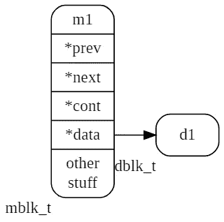
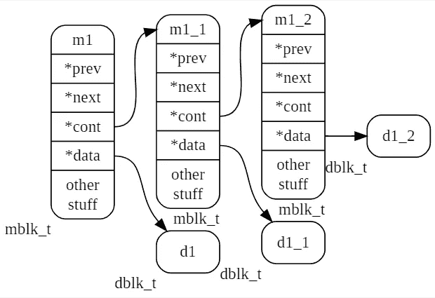
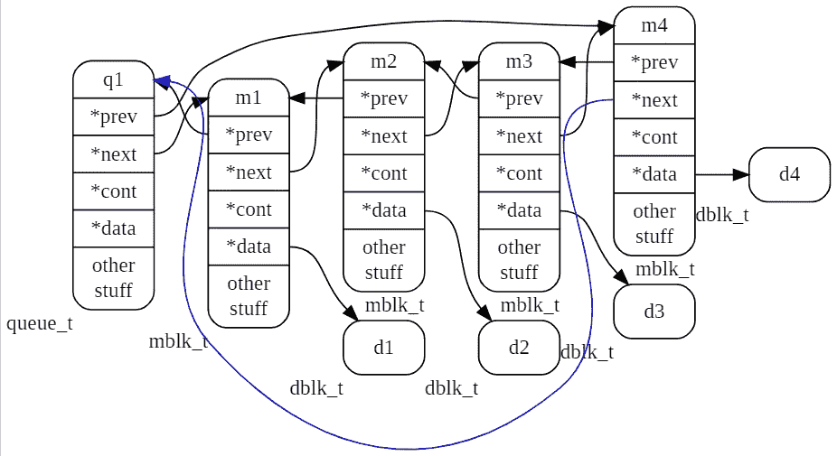
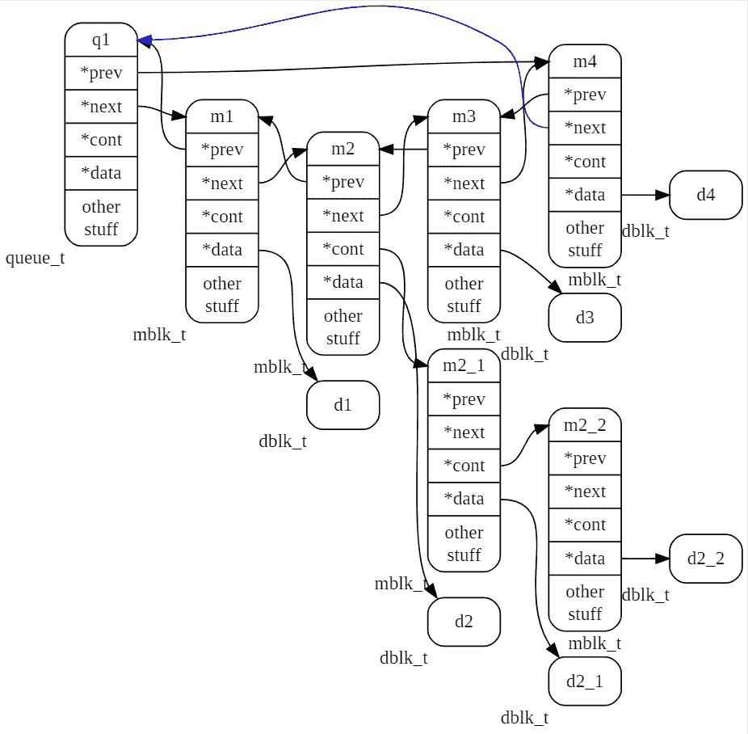

# 什么是 Mediastreamer2。数据移动机制

> 原文：<https://levelup.gitconnected.com/whats-mediastreamer2-data-movement-mechanism-29444d22d36b>


(上一篇文章[什么是 Mediastreamer2。过滤器开发](/whats-mediastreamer2-filters-development-4b7d05e09a0f)

媒体流中的数据移动是使用由 *queue_t* 结构描述的队列来执行的。 *mblk_t* 类型的消息序列沿着队列移动，消息本身不包含数据块，而仅包含对前一个、下一个消息和数据块的引用。另外我要特别强调的是，还有一个同类型消息链接的字段，可以让你把消息组织成一个单链表。由这样的列表联合的一组消息将被称为元组。因此，队列的任何元素都可以是单个消息 *mblk_t* ，或者可能是一组消息 *mblk_t* 的头。元组中的每个消息都可以有自己的数据块。稍后我们将讨论为什么需要元组。

如上所述，消息本身不包含数据块；相反，它只包含一个指向存储块的内存区域的指针。在这一部分中，mediastreamer 的工作概况类似于漫画“Monsters，Inc .”中的仓库门

现在，向上移动层次，让我们详细考虑 mediastreamer 中数据传输机制的列出的实体。

# 5.1 数据块 dblk_t

一个数据块由一个报头和一个数据缓冲区组成。报头由 *dblk_t* 结构描述，

清单 5.1:结构 dblk_t

```
typedef struct datab
{
  unsigned char *db_base; /* Pointer to the beginning of the data buffer. */
  unsigned char *db_lim;  /* Pointer to the end of the data buffer. */
  void (*db_freefn)(void*); /* The function of freeing memory when deleting a block. */
  int db_ref; /* Reference counter. */
} dblk_t;
```

结构字段包含指向缓冲区开头、缓冲区结尾和删除数据缓冲区的函数的指针。标题中的最后一个元素是引用计数 *db_ref* ，如果它达到零，这将作为一个信号从内存中删除该块。如果数据块是由 *datab_alloc()* 函数创建的，那么数据缓冲区将紧接在数据头之后放入内存。在所有其他情况下，缓冲区可以单独位于某个地方。数据缓冲器将包含信号样本或我们希望用滤波器处理的其它数据。

使用函数创建数据块的新实例:

```
dblk_t *datab_alloc(int size);
```

作为一个输入参数，它被传递给块将要存储的数据的大小。分配更多的内存是为了在分配的内存的开始放置一个头——一个 *datab* 结构。但是当使用其他函数时，这并不总是发生，在某些情况下，数据缓冲区可能与数据块的头分开。在创建过程中，结构字段被配置为使其 *db_base* 字段指向数据区的开头，而 *db_lim* 指向其结尾。参考计数 *db_ref* 被设置为 1。数据清理函数指针被设置为零。

# 5.2 消息 mblk_t

如上所述，队列元素属于类型 *mblk_t* ，其定义如下:

清单 5.2:结构 mblk_t

```
typedef struct msgb
{
  struct msgb *b_prev;   // Pointer to the previous item in the list.
  struct msgb *b_next;   // Pointer to the next item in the list.
  struct msgb *b_cont;   // Pointer for “gluing” other messages to a message to create a message tuple.
  struct datab *b_datap; // Pointer to the structure of the data block.
  unsigned char *b_rptr; // Pointer to the beginning of the data area to read data from the b_datap buffer.
  unsigned char *b_wptr; // Pointer to the beginning of the data area to write data to the b_datap buffer.
  uint32_t reserved1;    // Reserved field1, media streamer puts service information there.
  uint32_t reserved2;    // Reserved field2, media streamer places service information there.
  #if defined(ORTP_TIMESTAMP)
  struct timeval timestamp;
  #endif
  ortp_recv_addr_t recv_addr;
} mblk_t;
```

开始的 *mblk_t* 结构包含 *b_prev* ， *b_next* 指针，需要这些指针来组织一个双向链表(也就是 *queue_t* 队列)。

然后是 *b_contb_cont* 指针，它只在消息进入元组时使用。对于元组中的最后一条消息，该指针保持为空。

接下来，我们看到一个指向 *b_datap* 数据块的指针，该消息存在于其中。其后是指向块数据缓冲区内区域的指针。 *b_rptr* 字段指示将从哪个位置读取缓冲器中的数据。 *b_wptr* 字段指示写入缓冲区的位置。

其余字段是服务性质的，与数据传输机制的操作无关。

图 [5.1](#fig___________mblk_t) 显示了名为 *m1* 的单条消息和数据块 *d1* 。



图 5.1:消息 mblk_t

在图片上 [5.2](#fig_______________) 描绘了三个消息的元组 *m1* 、 *m1_1* 、 *m1_2* 。



图 5.2:三个消息的元组 *mblt_t*

# 5.2.1 使用 mblk_t 操作
的功能

函数 *allocb()* 创建了一条新消息 *mblk_t* :

```
mblk_t *allocb(int size, int pri);
```

它在内存中分配一个新消息 *mblk_t* 和一个指定*大小*的数据块，第二个参数 *pri* 在这个版本的库中没有使用。在它的位置你需要替换 BPRI _ 地中海宏(扩展宏后，零将被替换)。在该函数运行期间，将为新消息的结构分配内存，并将调用函数 *mblk_init()* ，该函数将该结构的已创建实例的所有字段清零，然后使用上述 *datab_alloc()* 创建一个数据缓冲区。之后，将配置结构中的字段:

```
mp->b_datap = datab;
mp->b_rptr = mp->b_wptr = datab->db_base;
mp->b_next = mp->b_prev = mp->b_cont = NULL;
```

在输出端，我们得到一个新消息，其中包含初始化的字段和一个空的数据缓冲区。要向消息中添加数据，需要将其复制到数据块缓冲区:

```
memcpy(msg->b_rptr, data, size);
```

数据数据源指针；数据的大小。

然后，您需要更新指向写指针的指针，使它再次指向缓冲区中空闲区域的开始:

```
msg->b_wptr = msg->b_wptr + size
```

如果您想从现有的缓冲区创建一条消息，而不进行复制，那么使用函数 *esballoc()* :

```
mblk_t *esballoc(uint8_t *buf, int size, int pri, void (*freefn)(void*));
```

创建消息和数据块结构后，它将设置指向地址 *buf* 的数据的指针。那些。在这种情况下，数据缓冲区并不位于数据块的头字段之后，因为数据块是由函数 *datab_alloc()* 创建的。传递给函数的数据的缓冲区将保持在原来的位置，但在指针的帮助下，它将被刺激到数据块的新创建的头，并相应地被刺激到消息。

几个数据块可以连接成一个消息 *mblk_t* 。这是通过 *appendb()* 函数完成的:

```
mblk_t * appendb(mblk_t *mp, const char *data, int size, bool_t pad);
```

将添加一个以上数据块的 mpa 消息；块的数据指针，其副本将被添加到消息中；大小数据大小；pad 标志所分配内存的大小应该沿 4 字节边界对齐(用零填充)。

如果现有消息数据缓冲区中有足够的空间，新数据将被粘在已有数据的后面。如果消息数据缓冲区中的空闲空间小于*大小*，则创建一个具有足够缓冲区大小的新消息，并将数据复制到其缓冲区中。这是一条新消息，使用 *b_cont* 指针连接到原始消息。在这种情况下，消息变成了一个元组。

如果您需要向元组中再添加一个数据块，那么您需要使用函数*msgapend()*:

```
void msgappend(mblk_t *mp, const char *data, int size, bool_t pad);
```

它将找到元组中的最后一条消息(这样的消息将具有零 *b_cont* )并为此消息调用函数 *appendb()* 。

您可以使用函数 *msgdsize()* 找出消息或元组中数据的大小:

```
int msgdsize(const mblk_t *mp);
```

它将遍历元组中的所有消息，并返回这些消息的数据缓冲区中的数据总量。对于每条消息，数据量计算如下:

```
mp->b_wptr - mp->b_rptr
```

要组合两个元组，请使用函数 *concatb()* :

```
mblk_t *concatb(mblk_t *mp, mblk_t *newm);
```

它将元组 *newm* 连接到 *mp* 的尾部，并返回指向结果元组的最后一条消息的指针。

如有必要，可以将元组转换成一条包含单个数据块的消息，这由函数 *msgpullup()* 完成:

```
void msgpullup(mblk_t *mp,int len);
```

如果 *len* 为-1，则自动确定分配的缓冲区的大小。如果 *len* 是一个正数，那么这个大小的缓冲区将被创建，元组的消息数据将被复制到其中。如果缓冲区中的位置结束，复制将在那里停止。元组的第一条消息将接收具有复制数据的新大小的缓冲区。其余的消息将被删除，内存返回到堆中。

在删除 *mblk_t* 结构时，考虑数据块的引用计数，如果在调用 *freeb()* 时结果是零，那么数据缓冲区连同指向它的 *mblk_t* 实例一起被删除。

初始化新消息字段 *mblk_init()* :

```
void mblk_init(mblk_t *mp);
```

在消息 *appendb()* 中增加一条数据:

```
mblk_t * appendb(mblk_t *mp, const char *data, size_t size, bool_t pad);
```

如果新数据不适合消息数据缓冲区的空闲空间，则将具有所需大小的缓冲区的单独创建的消息附加到该消息(指向添加的消息的指针设置在第一个消息中)，该消息变成元组。

向元组添加数据块*msgapend()*:

```
void msgappend(mblk_t *mp, const char *data, size_t size, bool_t pad);
```

该函数循环调用 *appendb()* 。

将两个元组合并成一个 *concatb()* :

```
mblk_t *concatb(mblk_t *mp, mblk_t *newm);
```

消息 *newm* 将被附加到 *mp* 上。

制作单个消息的副本 *copyb()* :

```
mblk_t *copyb(const mblk_t *mp);
```

包含所有数据块的元组的完整副本 *copymsg()* :

```
mblk_t *copymsg(const mblk_t *mp);
```

元组的元素由函数 *copyb()* 复制。

创建 *mblk_t* 消息的简单副本。在这种情况下，数据块不被复制，但是其链接的计数器 *db_ref* 增加:

```
mblk_t *dupb(mblk_t *mp);
```

制作元组的简单副本。不复制数据块，仅增加其引用计数 *db_ref* :

```
mblk_t *dupmsg(mblk_t* m);
```

将一个元组的所有消息合并成一条消息 *msgpullup()* :

```
void msgpullup(mblk_t *mp,size_t len);
```

如果 *len* 为-1，那么分配的缓冲区大小将自动设置。

删除消息或元组 *freemsg()* :

```
void freemsg(mblk_t *mp);
```

数据块的引用计数减 1。如果同时达到零，则数据块也被删除。

计算消息或元组中的数据总量。

```
size_t msgdsize(const mblk_t *mp);
```

将一个消息的保留字段的内容复制到另一个消息(实际上，这些字段包含媒体流所使用的标志):

```
mblk_meta_copy(const mblk_t *source, mblk *dest);
```

# 5.3 队列 queue_t

媒体流中的消息队列被实现为循环双向链表。列表中的每个元素都包含一个指向具有信号样本的数据块的指针。原来只有指向数据块的指针被依次移动，而数据本身保持不动。描述队列 *queue_t* 的结构，如下所示:

清单 5.3:结构 queue_t

```
typedef struct _queue
{
   mblk_t _q_stopper; /* Idle queue element, does not point to data, is used only for queue management. When initializing a queue(qinit()) its pointers are configured to point to itself. */
   int q_mcount;        /* Number of items in the queue. */
} queue_t;
```

该结构包含一个类型为 **mblk_t* 的字段指针 *_q_stopper* ，它指向队列中的第一项(消息)。该结构的第二个字段是队列中消息的计数器。下图 [5.3](#fig____________4_) 中一个名为 *q1* 的队列，包含 4 条消息 *m1* 、 *m2* 、 *m3* 、 *m4* 。



图 5.3:4 条消息的队列

如下图 [5.4](#fig____________3_) 一个名为 *q1* 的队列，包含 4 条消息 *m1* 、 *m2* 、 *m3* 、 *m4* ，其中*m2*——两条消息的元组。消息 *m2* 是包含另外两个消息 *m2_1* 和 *m2_2* 的元组的头。



图 5.4:3 条消息和一个元组的队列

# 5 . 3 . 1
使用 queue_t 的功能

队列初始化:

```
void qinit(queue_t *q);
```

*_q_stopper* 字段(以下我们称之为“stopper”)用 *mblk_init()* 函数初始化，设置它的前一个元素和下一个元素的指针，使它们指向自身。队列项计数器被重置为零。

添加新项目(消息):

```
void putq(queue_t *q, mblk_t *m);
```

一个新元素 *m* 被添加到列表的末尾，元素指针被调整，使得停止符成为它的下一个元素，并且它成为停止符的前一个元素。队列项计数器递增。

从队列中检索项目:

```
mblk_t * getq(queue_t *q);
```

取回止动器后，元件计数器递减。如果队列中没有元素，除了停止符，则返回 0。

将消息插入队列:

```
void insq(queue_t *q, mblk_t *emp, mblk_t *mp);
```

*mp* 元件插在 *emp* 元件之前。如果 *emp* 为 0，则消息被添加到队列的尾部。

从队列头提取消息:

```
void remq(queue_t *q, mblk_t *mp);
```

元素计数器递减 1。

读取指向队列中第一项的指针:

```
mblk_t * peekq(queue_t *q);
```

从队列尾部提取消息:

```
mblk_t *ms_queue_peek_last (queue_t *q);
```

从队列中移除所有项目，同时移除项目本身:

```
void flushq(queue_t *q, int how);
```

没有使用*和*参数。队列项计数器被设置为零。

读取指向队列最后一个元素的指针的宏:

```
mblk_t * qlast(queue_t *q);
```

使用消息队列时，请记住，当您使用指向消息的空指针调用 *ms_queue_put (q，m)* 时，该函数将会循环。你的程序会冻结。函数 *ms_queue_next (q，m)* 的行为类似。

# 连接过滤器

上述队列用于将邮件从一个过滤器传输到另一个过滤器，或者从一个过滤器传输到多个过滤器。过滤器和它们之间的连接形成了一个有向图。滤波器的输入或输出将被称为概括词“pin”。为了描述过滤器之间的连接顺序，mediastreamer 使用了“信号点”的概念。信号点是结构 *MSCPoint* ，它包含一个指向滤波器的指针和它的一个管脚的编号，分别描述了滤波器的一个输入或输出的连接。

## 
数据处理图的信号点

清单 5.4:结构化 MSCPoint

```
typedef struct _MSCPoint
{
  struct _MSFilter *filter; /* Pointer to the media streamer filter. */
  int pin;                 /* The number of one of the filter inputs or outputs, i.e. pin. */
} MSCPoint;
```

滤波器引脚从零开始编号。两个引脚与消息队列的连接由结构 *MSQueue* 描述，该结构包含一个消息队列和指向其连接的两个信号点的指针:

```
typedef struct _MSQueue
{
  queue_t q;
  MSCPoint prev;
  MSCPoint next;
}MSQueue;
```

我们称这种结构为信号链路。每个 mediastreamer 滤波器包含一个输入表和一个输出信号链接表( *MSQueue* )。创建过滤器时设置表格的大小，在第 [4](#chap_Filters_development) 章开发我们自己的过滤器时，我们已经使用类型为 *MSFilterDesc* 的导出变量完成了这项工作。下面，在清单 [5.5](#lis___________MSFilter) 中，显示了描述 mediastreamer 中任何过滤器的结构， *MSFilter* :

清单 5.5:струкураms filter

```
struct _MSFilter{
    MSFilterDesc *desc;    /* Pointer to filter descriptor. */
    /* Protected attributes, they cannot be shifted or removed, otherwise the work with plugins will be broken. */
    ms_mutex_t lock;      /* Mutex. */
    MSQueue **inputs;     /* Input links table. */
    MSQueue **outputs;    /* Output links table. */
    struct _MSFactory *factory; /* Pointer to the factory that created this filter instance. */
    void *padding;              /* Not used, will be used if protected fields are added. */
    void *data;                 /* Pointer to an arbitrary structure for storing data for the internal state of the filter and intermediate calculations. */
    struct _MSTicker *ticker;   /* A pointer to the ticker object, which must not be null when the function is called process(). */
    /*private attributes, they can be moved and changed at any time*/
    MSList *notify_callbacks; /* List of callbacks used to handle filter events. */
    uint32_t last_tick;       /* Last measure number when the call   of process() was made. */ 
    MSFilterStats *stats;     /* Filter statistics.*/
    int postponed_task; /* Number of pending tasks. Some filters may delay data processing (call process()) for several measures.*/
    bool_t seen;  /* The flag used by the ticker to indicate that it has already served this filter instance at this clock cycle.*/
};typedef struct _MSFilter MSFilter;
```

在我们按照我们的意图连接了 C 程序中的过滤器之后(但没有连接跑马灯)，我们由此创建了一个有向图，其节点是 *MSFilter* 结构的实例，边是信号链接 *MSQueue* 的实例。

# 5.4 幕后
报价机活动

当我告诉你 ticker 是一个时钟源过滤器时，并没有全部的真相。ticker 是一个对象，它每小时执行与其直接或间接连接的所有过滤器的 *process()* 函数。当我们在 C 程序中将滚动条连接到图形过滤器时，我们向滚动条显示一个图形，从现在起它将控制这个图形，直到我们关闭它。连接后，ticker 开始检查委托给它的图，列出它包含的过滤器列表。为了不“计数”同一个过滤器两次，它通过设置标志*来标记检测到的过滤器，见*。搜索是根据每个滤波器的信号链路表进行的。

在熟悉图表的过程中，ticker 检查过滤器中是否至少有一个过滤器，它充当数据块的来源。如果没有找到，那么这个图就被认为是不正确的，ticker 就会使程序崩溃。

如果该图被证明是“正确的”，则为每个找到的过滤器调用*预处理()*函数来初始化它。一旦到了下一个处理周期(默认情况下，每隔 10 毫秒)，ticker 就会为所有之前找到的源过滤器调用 *process()* 函数，然后为其余的列表过滤器调用。如果过滤器有输入链接，那么重复*过程()*功能，直到输入链接队列为空。之后，滚动条转到列表中的下一个过滤器并“滚动”它，直到输入链接中没有消息。滚动条从一个过滤器移动到另一个过滤器，直到列表滚动。这就完成了测量的处理。

现在我们将回到元组，并讨论为什么将这样的实体添加到 mediastreamer 中。一般情况下，滤波器内部算法所需的数据量并不一致，也不是输入数据缓冲器大小的倍数。例如，我们编写一个执行快速傅立叶变换的过滤器，根据定义，它只能处理大小等于 2 的幂的数据块。假设是 512 个样本。如果数据是由电话信道产生的，那么输入端的每个消息的数据缓冲器将带给我们 160 个信号样本。在信号链路达到所需的数据量之前，不从输入端获取数据是一种诱惑。但是在这种情况下，会与 ticker 发生冲突，ticker 会不成功地尝试滚动过滤器，直到输入链接为空。早先我们把这个规则称为过滤器的第三个原则。根据这个原则，过滤器的 *process()* 函数应该从输入队列中提取所有数据。

此外，不可能从入口仅拾取 512 个样本，因为只能拾取整个块，即滤波器必须拾取 640 个样本，使用其中的 512 个样本，并存储剩余的样本，直到累积新的数据部分。因此，除了它的主要工作之外，我们的过滤器必须为输入数据的中间存储提供辅助动作。用于解决这个一般问题的 mediastreamer 的开发者已经开发了一个特殊的对象—*ms bufferizer*(bufferiser)，它使用元组来解决这个任务。

# 5.5 缓冲对象
MSBufferizer

这是一个对象，它可以在过滤器中累积输入数据，并在信息量足以启动过滤器算法时立即开始处理这些数据。当缓冲器累积数据时，过滤器将在空闲模式下工作，而不消耗处理器的处理能力。但是，一旦从缓冲区读取的函数返回非零值，过滤器的 *process()* 函数就开始从缓冲区获取数据，并按所需大小的部分处理数据，直到它们用尽。无人认领的数据作为元组的第一个元素保留在缓冲区中，新输入数据的后续块附加到该元组中。

结构 *MSBufferizer* ，描述清单 [5.6](#lis___________MSBufferizer) 中显示的缓冲。

清单 5.6:构造 MSBufferizer

```
struct _MSBufferizer
{
  queue_t q; /* Message queue. */
  int size; /* The total size of the data currently in the buffer. */
};typedef struct _MSBufferizer MSBufferizer;
```

# 5.5.1 与 MSBufferizer 一起使用
的功能

创建 bufferiser 的新实例:

```
MSBufferizer * ms_bufferizer_new(void);
```

分配内存，在 *ms_bufferizer_init()* 中初始化，返回一个指针。

初始化功能:

```
void ms_bufferizer_init(MSBufferizer *obj);
```

队列 *q* 被初始化，大小*字段*被设置为零。

添加消息:

```
void ms_bufferizer_put(MSBufferizer *obj, mblk_t *m);
```

消息 *m* 被添加到队列。数据块的计算大小被加到*大小*中。

缓冲链路 *q* 的数据队列中的所有消息:

```
void ms_bufferizer_put_from_queue(MSBufferizer *obj, MSQueue *q);
```

使用函数 *ms_bufferizer_put()* 将消息从链路 *q* 传输到缓冲器。

从缓冲器中读取:

```
int ms_bufferizer_read(MSBufferizer *obj, uint8_t *data, int datalen);
```

如果缓冲器中累积的数据量小于请求的数据量( *datalen* )，该函数返回零，数据不会被复制到 *data* 中。否则，从缓冲区的元组中顺序复制数据。复制后，元组被删除，内存被释放。当 *datalen* 字节被复制时，复制结束。如果*数据中的空间*在源数据块中间结束，那么在这个消息中，它将被减少到剩余的、尚未复制的部分。在下一次调用时，复制将从这一点继续。

读取缓冲区中当前可用的数据量:

```
int ms_bufferizer_get_avail(MSBufferizer *obj);
```

返回缓冲器的*大小*字段。

丢弃缓冲区中的一些数据:

```
void ms_bufferizer_skip_bytes(MSBufferizer *obj, int bytes);
```

检索并丢弃指定字节数的数据。最旧的数据将被丢弃。

删除 bufferiser 中的所有消息:

```
void ms_bufferizer_flush(MSBufferizer *obj);
```

数据计数器被重置为零。

删除 bufferiser 中的所有消息:

```
void ms_bufferizer_uninit(MSBufferizer *obj);
```

计数器不会复位。

移除缓冲区并释放内存:

```
void ms_bufferizer_destroy(MSBufferizer *obj);
```

使用缓冲的示例可以在几个 mediastreamer 过滤器的源代码中找到。例如，在将样本中的字节从网络顺序交换到主机顺序的过滤器 MS_L16_ENC 中: [l16.c](https://github.com/BelledonneCommunications/mediastreamer2/blob/1a9e8dec369a65ed10db975f5b77b92dc999b096/src/audiofilters/l16.c)

在下一章，我们将看看调试过滤器。

*(* 下一篇[什么是 Mediastreamer2。调试
精心制作的过滤器](/whats-mediastreamer2-debugging-craft-filters-83a07192c341)

> 附言
> 
> 如果你对如何轻松绘制像 5.1–5.4 这样的精美图片感兴趣，你可以阅读我的文章:[Graphviz 和 C/C ++预处理器的协同](https://medium.com/swlh/synergy-of-graphviz-and-the-c-c-preprocessor-254e5d0db542)