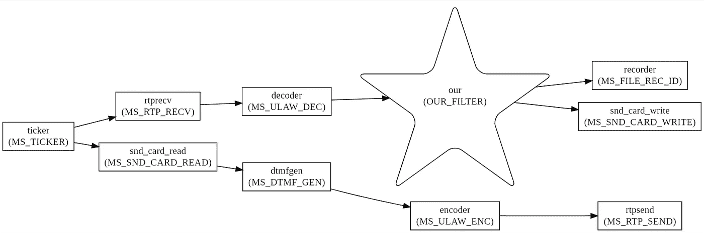

# 什么是 Mediastreamer2。过滤器开发

> 原文：<https://levelup.gitconnected.com/whats-mediastreamer2-filters-development-4b7d05e09a0f>


(上一篇文章[什么是 Mediastreamer2。使用](/chapter-3-examples-of-using-filters-612f2121301)的过滤器示例

在本文中，我们将学习如何编写过滤器并将它们添加到 intercom 项目中。

插件是独立编译的软件模块，它动态地连接到媒体流，并被设计成扩展其能力。这允许第三方开发者，即您，应用媒体流来解决其作者最初没有预想到的问题。

# 4.1 一般方法

要在你的程序中使用插件，你必须使用 *#include* 包含插件的头文件。之后在程序体中，使用函数 *ms_filter_register()* 注册一个新的过滤器。很自然，你的程序和插件源代码必须被编译和组装成一个应用程序。

现在让我们来写一个插件。所有的媒体流过滤器和插件都遵守通用的书面规范，这使得理解您要研究的下一个过滤器的结构变得容易得多。因此，更进一步，为了不增加实体，我们将调用插件过滤器。

# 4.2 入门
编写过滤器

假设我们要设计一个名为 OUR_FILTER 的新过滤器。它将执行一个基本的事情——从它的单个输入端接收块，并将它们传输到五个输出端。如果超过五个信号电平低于指定阈值的模块通过，以及超过五个信号电平高于阈值的模块通过，它也会生成事件。将使用过滤方法设置阈值。第二种和第三种方法将允许/拒绝块通过输出。

# 4.3 头文件

在媒体流中，实现了一个程序接口，用于它与过滤器的交互。因此，每个过滤器都必须有一个头文件，该头文件为媒体流 API 提供必要的声明，以便与该过滤器的实例正确交互。您需要从这个头文件开始编写过滤器。

在第一行中，它必须包含 *msfilter.h* 文件，使用 MS_FILTER_METHOD 宏来声明新过滤器的方法(如果有)，声明过滤器生成的事件(如果有)，并声明导出的类型为 *MSFilterDesc* 的结构以及过滤器参数的描述，如清单 4.1 所示。

清单 4.1:结构 MSFilterDesc

```
struct _MSFilterDesc{
    MSFilterId id;    /* Filter type identifier (integer number) specified in the file allfilters.h or by ourselves. */
    const char *name; /* Filter name.*/
    const char *text; /* Short text describing the filter. */
    MSFilterCategory category; /* A filter category that describes its role. */
    const char *enc_fmt; /* sub-mime used format, must be specified for filter categories: MS_FILTER_ENCODER or MS_FILTER_DECODER */
    int ninputs; /* Number of inputs. */
    int noutputs; /*Number of outputs.  */
    MSFilterFunc init; /* Initial filter initialization function. */
    MSFilterFunc preprocess; /* A function called once before starting the filter. */
    MSFilterFunc process; /* A function that performs the main work of the filter, called for each tick of a MSTicker. */
    MSFilterFunc postprocess; /* Filter shutdown function, called once after the last call process(), before removing the filter. */
    MSFilterFunc uninit; /* The filter shutdown function frees memory that was used when creating the internal filter structures. */
    MSFilterMethod *methods; /* Filter Method Table. */
    unsigned int flags; /* Special filter flags described in the enumeration  MSFilterFlags. */
};/*
 Structure for filter description.
*/
typedef struct _MSFilterDesc MSFilterDesc;
```

框架使用的类型可以通过查看 *msfilter.h* 文件来检查。我们的过滤器的头文件将如清单 4.2 所示。

清单 4.2:过滤器分离器和 noisegate 头文件

```
/* Файл our_filter.h, Filter-splitter and noise gate. */#ifndef myfilter_h
#define myfilter_h/* We include a header file with a list of mediastreamer filters. */
#include <Mediastreamer2/msticker.h>/* 
   Set the numeric identifier for the new filter type. This number should not match none of the other types in the file allfilters.h it has a corresponding enumeration  MSFilterId. Unfortunately, it is not clear how to determine the maximum occupied value other than looking into this file. But we will take obviously more as id for our filter value: 4000\.  We will assume that the developers adding new filters do not will get to this number soon. 
   */
#define OUR_FILTER_ID 4000/* 
   We define the methods of our filter. The second parameter of the macro should be the ordinal number of the method, a number from 0\. The third parameter is the type of the argument of method, a pointer to which will be passed to the method when called. Methods may or may not have arguments, as shown below. 
   */
#define OUR_FILTER_SET_TRESHOLD MS_FILTER_METHOD(OUR_FILTER_ID , 0, float)
#define OUR_FILTER_TUNE_OFF     MS_FILTER_METHOD_NO_ARG(OUR_FILTER_ID ,1)
#define OUR_FILTER_TUNE_ON      MS_FILTER_METHOD_NO_ARG(OUR_FILTER_ID ,2)/* Now we define the structure that will be sent along with the event. */
struct _OURFilterEvent
{
    /* This is the field that will act as a flag,
       0 - zeros appeared, 1 - there was a signal.*/
    char state; 
    /* Time when the event happened. */
    uint64_t time;
};
typedef struct _OURFilterEvent OURFilterEvent;/* Defining an event for our filter. */
#define OUR_FILTER_EVENT MS_FILTER_EVENT(MS_RTP_RECV_ID, 0, OURFilterEvent)/* We define the exported variable, which will be store of characteristics for a given filter type. */
extern MSFilterDesc our_filter_desc;#endif /* myfilter_h */
```

# 4.4 来源
文件

现在，您可以从原始文件开始。带有注释的过滤器的源代码如清单 4.3 所示。这是我们在头文件中声明的方法和所需的过滤函数实现的地方。然后，以特定顺序对方法和函数的引用被放在导出的结构 *our_filter_desc* 中。其被媒体流送器用来将这种类型的过滤器的实例“植入”到数据处理工作流程中。

清单 4.3:过滤分离器和 noisegate 的源文件

```
/* Файл our_filter.с, Describes filter splitter and noise gate. */#include "our_filter.h"
#include <math.h>#define OUR_FILTER_NOUTPUTS 5/* We define a structure that stores the internal state of the filter. */
typedef struct _our_filterData
{
    bool_t disable_out;  /* Permission to transfer blocks to the output. */
    int last_state;   /* The current state of the switch. */
    char zero_count;     /* Zero block counter. */
   char lag;            /* The number of blocks for making a noise gate decision. */
    char n_count;        /* Counter of non-zero blocks. */
    float skz_level;     /* RMS of signal inside block in which the filter will pass the signal. At the same time it is the threshold triggering by which the event will be generated.  */} our_filterData;/*----------------------------------------------------------*/
/* Mandatory initialization function. */
static void our_filter_init(MSFilter *f)
{
    our_filterData *d=ms_new0(our_filterData, 1);
    d->lag=5;
    f->data=d;
}/*----------------------------------------------------------*/
/* Mandatory function of finalizing the filter operation, memory is freed. */
static void our_filter_uninit(MSFilter *f)
{
    ms_free(f->data);
}/*----------------------------------------------------------*/
/* We define an exemplary array with zeros, obviously larger than the block. */
char zero_array[1024]={0};/* We define the filter event. */
OURFilterEvent event;/*----------------------------------------------------------*/
/* Event sending function. */
static void send_event(MSFilter *f, int state)
{
    our_filterData *d =( our_filterData* ) f->data;
     d->last_state = state;
    /* We set the time of the event occurrence, from the moment of the first tick. Time in milliseconds. */
    event.time=f -> ticker -> time;
    event.state=state;  
    ms_filter_notify(f, OUR_FILTER_EVENT, &event);
} /*----------------------------------------------------------*/
/* The function calculates the root mean square (effective) value of the signal within the block. */
static float calc_skz(our_filterData *d, int16_t *signal, int numsamples)
{
    int i;
    float acc = 0;
    for (i=0; i<numsamples; i++)
    {
        int s=signal[i];
        acc = acc + s * s;
    }
    float skz = (float)sqrt(acc / numsamples);
    return skz;
}/*----------------------------------------------------------*/
/* Mandatory function of the main filter loop, called with every tick. */
static void our_filter_process(MSFilter *f)
{
    our_filterData *d=(our_filterData*)f->data; /* Pointer to the input message containing the data block. */
    mblk_t *im;
    int i;
    int state;
    /* Reading messages from the input queue until it is completely empty. */
    while((im=ms_queue_get(f->inputs[0]))!=NULL)
    {
        /* If the outputs are disabled, then we simply delete the input message. */
        if ( d -> disable_out)
        {
          freemsg(im);
          continue;
        } /* We measure the signal level and make a decision about sending the signal. */
        float skz = calc_skz(d, (int16_t*)im->b_rptr, msgdsize(im));
        state = (skz > d->skz_level) ? 1 : 0; 
        if (state) 
        {
            d->n_count++;
            d->zero_count = 0;
        }
        else
        {
            d->n_count = 0;
            d->zero_count++;
        }
        if (((d->zero_count > d->lag) || (d->n_count > d->lag))
            &&  (d->last_state != state)) send_event(f, state); /* We proceed to copying the input message and layout by outputs. But only for those to which the load is connected. The original message will go to the output with index 0, and its copies will go to the other outputs.*/ 
        int output_count = 0;
        mblk_t *outm; /* Pointer to a message with an output data block. */
        for(i=0; i < f->desc->noutputs; i++)
        {
            if (f->outputs[i]!=NULL)
            {
                if (output_count == 0)
                {
                    outm = im;
                }
                else
                {
                    /* Create a light copy of the message.*/       
                    outm = dupmsg(im);
                }
                /* We place a copy or original of the input message on the next filter output. */ 
                ms_queue_put(f->outputs[i], outm);
                output_count++;
            }
        }
    }
}/*----------------------------------------------------------*/
/* Handler function for calling the OUR_FILTER_SET_LAG method. */
static int our_filter_set_treshold(MSFilter *f, void *arg)
{
    our_filterData *d=(our_filterData*)f->data;
    d->skz_level=*(float*)arg;
    return 0;
}/*----------------------------------------------------------*/
/* Handler function for calling the OUR_FILTER_TUNE_OFF method. */
static int our_filter_tune_off(MSFilter *f, void *arg)
{
    our_filterData *d=(our_filterData*)f->data;
    d->disable_out=TRUE;
    return 0;
}/*----------------------------------------------------------*/
/* Handler function for calling the OUR_FILTER_TUNE_ON method. */
static int our_filter_tune_on(MSFilter *f, void *arg)
{
    our_filterData *d=(our_filterData*)f->data;
    d->disable_out=FALSE;
    return 0;
}/*----------------------------------------------------------*/
/* We fill the table of filter methods, how many methods
 we have defined in the header file so many non-zero lines. */
static MSFilterMethod our_filter_methods[]={
    { OUR_FILTER_SET_TRESHOLD, our_filter_set_treshold },
    { OUR_FILTER_TUNE_OFF, our_filter_tune_off },
    { OUR_FILTER_TUNE_ON, our_filter_tune_on },
    { 0 , NULL } /* Marker of the end of table. */
};/*----------------------------------------------------------*/
/* Description of the filter for the media streamer. */
MSFilterDesc our_filter_desc=
{
    OUR_FILTER_ID,
    "OUR_FILTER",
    "A filter with noise gate that reads from input and copy to it's five outputs.",
    MS_FILTER_OTHER,
    NULL,
    1,
    OUR_FILTER_NOUTPUTS,
    our_filter_init,
    NULL,
    our_filter_process,
    NULL,
    our_filter_uninit,
    our_filter_methods,
    0
};MS_FILTER_DESC_EXPORT(our_filter_desc)
```

# 4.5 应用
新的过滤器

现在，毫不延迟地在之前完成的 3.9 对讲机中应用我们的过滤器，该对讲机现在将具有记录对话的功能，并且由于我们的过滤器，语音中的长时间停顿将不会被写入文件。

上图 4.1 显示了修改后的对讲机的示意图。我们希望以一种特别鲜明的方式描绘我们自己的过滤器。因此，您会立即在图上找到我们的过滤器。



图 4.1:电路中的滤波器

电路中增加了一个记录器滤波器，它将输入信号写入一个 *wav* 文件。根据设计，我们的过滤器将保存语音中长时间停顿的文件，从而节省磁盘空间。在本文的开始，我们描述了过滤器动作的算法。主应用程序处理它生成的事件。如果事件包含标志“0”，则主机暂停记录。一旦带有标记“1”的事件到达，记录就恢复。

清单 4.4 显示了程序的源代码。其中，在前面的命令行参数中又添加了两个参数: *— ng* ，用于设置过滤器阈值级别，以及 *— rec* ，用于开始写入名为 *record.wav* 的文件。

清单 4.4:带有记录器和噪声门的内部通信模拟器

```
/* File mstest9.c Intercom simulator with recorder and noisegate. */#include <Mediastreamer2/mssndcard.h>
#include <Mediastreamer2/dtmfgen.h>
#include <Mediastreamer2/msrtp.h>
#include <Mediastreamer2/msfilerec.h>/* We connect our filter. */
#include "our_filter.h"/* We include the file of common functions. */
#include "mstest_common.c"/*----------------------------------------------------------*/
struct _app_vars
{
    int  local_port;              /* Local port. */
    int  remote_port;             /* Intercom port on a remote computer. */
    char remote_addr[128];        /* The IP address of the remote computer. */
    MSDtmfGenCustomTone dtmf_cfg; /* Test signal generator settings. */
    MSFilter* recorder;           /* Pointer to the filter logger. */
    bool_t file_is_open;          /* Flag that the file is open for writing. */
    /* The threshold at which the recording of the received signal to the file stops. */
    float treshold; 
    bool_t en_rec;                /* Switch on writing to file. */    
};typedef struct _app_vars app_vars;/*----------------------------------------------------------*/
/* We create a duplex RTP-session. */
RtpSession* create_duplex_rtp_session(app_vars v)
{
    RtpSession *session = create_rtpsession (v.local_port, v.local_port + 1,
            FALSE, RTP_SESSION_SENDRECV);
    rtp_session_set_remote_addr_and_port(session, v.remote_addr, v.remote_port,
            v.remote_port + 1);
    rtp_session_set_send_payload_type(session, PCMU);
    return session;
}/*----------------------------------------------------------*/
/* Function to convert command line arguments to program settings. */
void  scan_args(int argc, char *argv[], app_vars *v)
{
    char i;
    for (i=0; i<argc; i++)
    {
        if (!strcmp(argv[i], "--help"))
        {
            char *p=argv[0]; p=p + 2;
            printf("  %s walkie talkie\n\n", p);
            printf("--help      List of options.\n");
            printf("--version   Version of application.\n");
            printf("--addr      Remote abonent IP address string.\n");
            printf("--port      Remote abonent port number.\n");
            printf("--lport     Local port number.\n");
            printf("--gen       Generator frequency.\n");
            printf("--ng        Noise gate treshold level from 0\. to 1.0\n");
            printf("--rec       record to file 'record.wav'.\n");
            exit(0);
        } if (!strcmp(argv[i], "--version"))
        {
            printf("0.1\n");
            exit(0);
        } if (!strcmp(argv[i], "--addr"))
        {
            strncpy(v->remote_addr, argv[i+1], 16);
            v->remote_addr[16]=0;
            printf("remote addr: %s\n", v->remote_addr);
        } if (!strcmp(argv[i], "--port"))
        {
            v->remote_port=atoi(argv[i+1]);
            printf("remote port: %i\n", v->remote_port);
        } if (!strcmp(argv[i], "--lport"))
        {
            v->local_port=atoi(argv[i+1]);
            printf("local port : %i\n", v->local_port);
        } if (!strcmp(argv[i], "--gen"))
        {
            v -> dtmf_cfg.frequencies[0] = atoi(argv[i+1]);
            printf("gen freq : %i\n", v -> dtmf_cfg.frequencies[0]);
        } if (!strcmp(argv[i], "--ng"))
        {
            v -> dtmf_cfg.frequencies[0] = atoi(argv[i+1]);
            printf("noise gate treshold: %f\n", v -> treshold);
        }
         if (!strcmp(argv[i], "--rec"))
        {
            v -> en_rec = TRUE;
            printf("enable recording: %i\n", v -> en_rec);
        }
    }
}/*----------------------------------------------------------*/
/* Callback function, it will be called by the filter as soon as it notices that silence has come, or vice versa, silence has been replaced by sounds. */
static void change_detected_cb(void *data, MSFilter *f, unsigned int event_id,
        OURFilterEvent *ev)
{
    app_vars *vars = (app_vars*) data; /* If the recording was not allowed, then exit. */
    if (! vars -> en_rec) return;    if (ev -> state)
    {
        /* We resume recording. */
        if(!vars->file_is_open)
        {
            ms_filter_call_method(vars->recorder, MS_FILE_REC_OPEN, "record.wav");
            vars->file_is_open = 1;
        }
        ms_filter_call_method(vars->recorder, MS_FILE_REC_START, 0);
        printf("Recording...\n");
    }
    else
    {
        /* We pause the recording. */
        ms_filter_call_method(vars->recorder, MS_FILE_REC_STOP, 0);
        printf("Pause...\n");
    }
}/*----------------------------------------------------------*/
int main(int argc, char *argv[])
{
    /* We set the default settings. */
    app_vars vars={5004, 7010, "127.0.0.1", {0}, 0, 0, 0.01, 0}; /* We set the program settings to according to the command line arguments. */
    scan_args(argc, argv, &vars); ms_init(); /* We create instances of transmitting path filters. */
    MSSndCard *snd_card =
        ms_snd_card_manager_get_default_card(ms_snd_card_manager_get());
    MSFilter *snd_card_read = ms_snd_card_create_reader(snd_card);
    MSFilter *dtmfgen = ms_filter_new(MS_DTMF_GEN_ID);
    MSFilter *rtpsend = ms_filter_new(MS_RTP_SEND_ID); /* We create an encoder filter. */
    MSFilter *encoder = ms_filter_create_encoder("PCMU"); /* We register load types. */
    register_payloads(); /* We create a duplex RTP-session. */
    RtpSession* rtp_session = create_duplex_rtp_session(vars);
    ms_filter_call_method(rtpsend, MS_RTP_SEND_SET_SESSION, rtp_session); /* We connect the transmitter filters. */
    ms_filter_link(snd_card_read, 0, dtmfgen, 0);
    ms_filter_link(dtmfgen, 0, encoder, 0);
    ms_filter_link(encoder, 0, rtpsend, 0); /* We create filters for the receiving path. */
    MSFilter *rtprecv = ms_filter_new(MS_RTP_RECV_ID);
    ms_filter_call_method(rtprecv, MS_RTP_RECV_SET_SESSION, rtp_session); /* We create a decoder filter. */
    MSFilter *decoder=ms_filter_create_decoder("PCMU");
    //MS_FILE_REC_ID /* We register our filter. */
    ms_filter_register(&our_filter_desc);
    MSFilter *our = ms_filter_new(OUR_FILTER_ID); /* Create a sound card filter. */
    MSFilter *snd_card_write = ms_snd_card_create_writer(snd_card); /* Create a logger filter. */
    MSFilter *recorder=ms_filter_new(MS_FILE_REC_ID);
    vars.recorder = recorder;    /* We connect the filters of the receiving path. */
    ms_filter_link(rtprecv, 0, decoder, 0);
    ms_filter_link(decoder, 0, our, 0);
    ms_filter_link(our, 0, snd_card_write, 0);
    ms_filter_link(our, 1, recorder, 0); /* We connect a callback function to the filter, and pass it as user data a pointer to a structure with program settings, in which, among others, there is a point to the logger filter. */
    ms_filter_set_notify_callback(our,
            (MSFilterNotifyFunc)change_detected_cb, &vars);
    ms_filter_call_method(our,OUR_FILTER_SET_TRESHOLD, &vars.treshold);    /* Create a ticker - source of ticks. */
    MSTicker *ticker = ms_ticker_new(); /* We connect the ticker. */
    ms_ticker_attach(ticker, snd_card_read);
    ms_ticker_attach(ticker, rtprecv); /* If the generator frequency setting is different from zero, then we start the generator. */   
    if (vars.dtmf_cfg.frequencies[0])
    {
        /* We set up the structure that controls the output signal of the generator. */
        vars.dtmf_cfg.duration = 10000;
        vars.dtmf_cfg.amplitude = 1.0;
    } /* We organize a generator restart cycle. */
    printf("Press ENTER to exit.\n ");
    char c=getchar();
    while(c != '\n')
    {
        if(vars.dtmf_cfg.frequencies[0])
        {
            /* We turn on the sound generator. */
            ms_filter_call_method(dtmfgen, MS_DTMF_GEN_PLAY_CUSTOM,
                    (void*)&vars.dtmf_cfg);
        }
        char c=getchar();
        printf("--\n");
    }
    if (vars.en_rec ) ms_filter_call_method(recorder, MS_FILE_REC_CLOSE, 0);
}
```

由于我们添加了文件并使用了 *math* 库，编译的命令行变得复杂了，看起来像这样:

```
$ gcc mstest9.c our_filter.c -o mstest9 `pkg-config Mediastreamer2 - -libs - -cflags` -lm
```

构建应用程序后，使用以下参数在第一台计算机上运行它:

```
$ ./mstest9 - -lport 7010 - -port 8010 - -addr <address of the second computer> - -rec
```

使用以下设置在第二台计算机上运行:

```
$ ./mstest9 - -lport 8010 - -port 7010 - -addr <address of the first computer>
```

之后，第一台电脑将开始将您所说的一切记录到第二台电脑的麦克风中。在这种情况下，这个词将被写入控制台

```
"Recording..."
```

一旦您进入静默状态，录音将会暂停，并显示一条消息

```
"Pause..."
```

您可能需要试验阈值。

在本文中，我们学习了如何编写过滤器。您可能已经注意到， *our_filter_process()* 函数对数据块执行操作。由于该示例是一个训练示例，为简单起见，媒体流的最小能力用于操纵数据块。

在下一篇文章中，我们将研究媒体流中的消息队列和消息管理特性。在未来，这将有助于您设计具有更复杂信息处理的过滤器。

(下一篇文章[什么是 Mediastreamer2。数据移动机制](/whats-mediastreamer2-data-movement-mechanism-29444d22d36b)