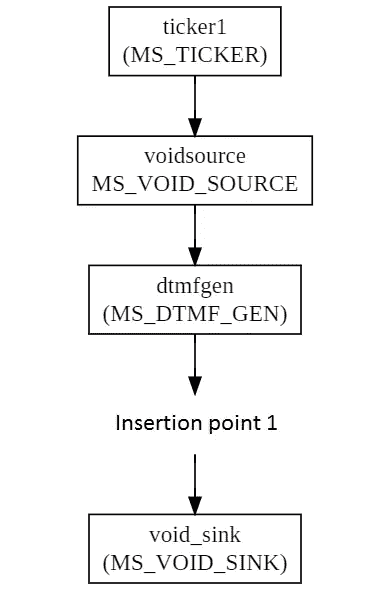
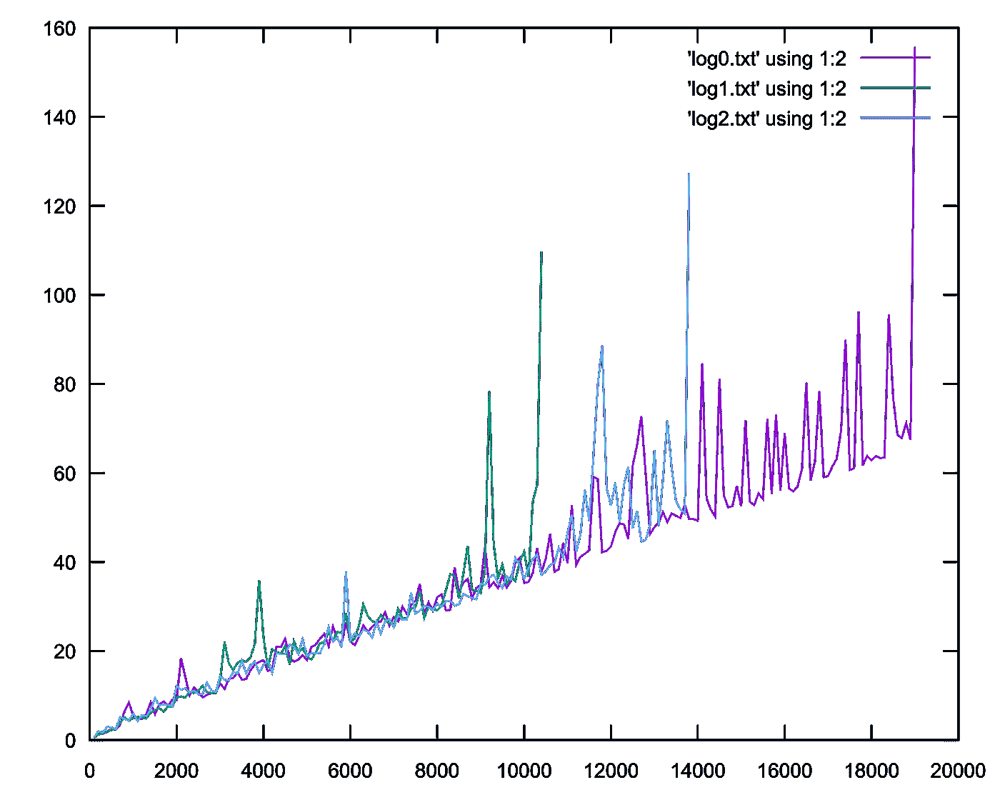
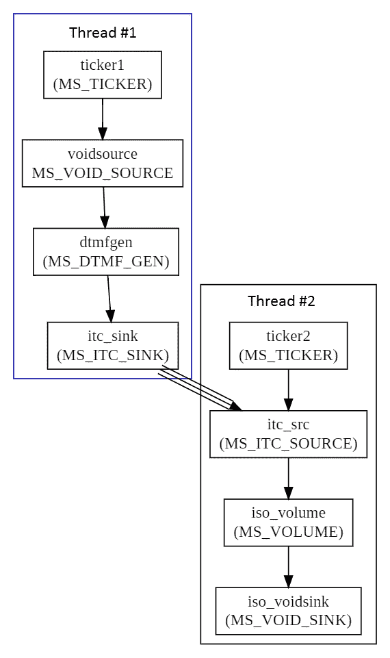
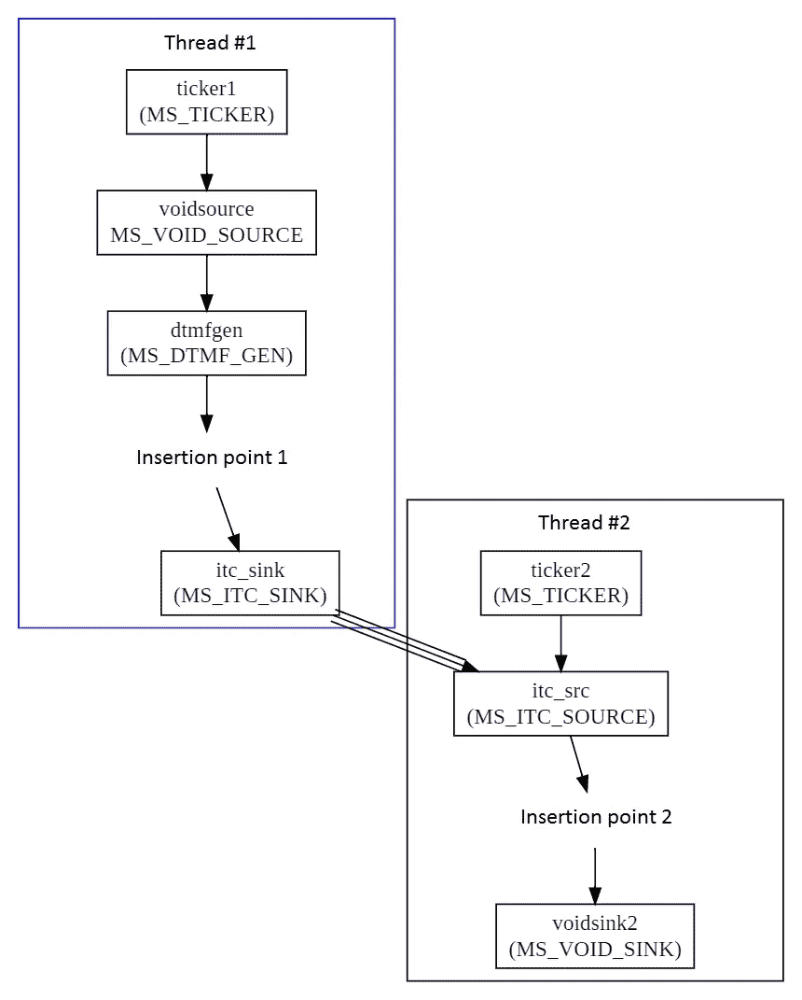
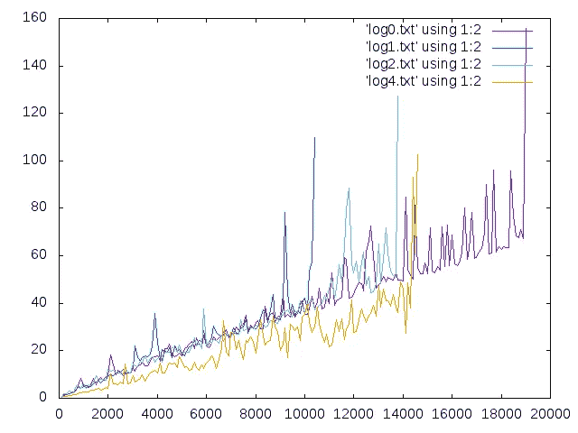

# 什么是 Mediastreamer2。跑马灯负载管理

> 原文：<https://levelup.gitconnected.com/whats-mediastreamer2-ticker-load-management-62d0efc9a9f0>


(上一篇文章[什么是 Mediastreamer2。调试
精心制作的过滤器](/whats-mediastreamer2-debugging-craft-filters-83a07192c341)

Ticker 负载的计算方法是，处理连接到此 tickser 的图形的所有过滤器所花费的时间与 tick 之间的时间间隔之比。默认情况下，时间间隔为 10ms，但如果您更改采样速率，则会根据您设置的值进行计算。计算是根据跑马灯在运行过程中积累的信息进行的。Mediastreamer 提供了一个函数，该函数返回多次测量的平均值，以百分比表示:

```
MS2_PUBLIC float ms_ticker_get_average_load(MSTicker *ticker);
```

如果返回值接近 100%，这意味着在下一个 tick 开始之前，这个 tick 只能勉强跟上它的工作。如果我们有一个不需要实时工作的应用程序(例如，它只是将声音写入一个文件)，那么下一次 ticker 调用被推迟了多长时间对我们来说并不重要。但在实时应用中，处理延迟会影响发送 RTP 包的时刻，进而影响声音或视频的质量。在某些情况下，可以通过在接收端使用分组缓冲器(所谓的抖动缓冲器)来消除单个分组的延迟影响。在这种情况下，您的声音将无缺陷地播放，但延迟与缓冲区长度成比例。在音频信号用于控制实时过程的情况下，这是不可接受的。

当 ticker 负载超过 80%限制时，您应该开始采取行动。有了这样的负载，ticker 开始处理时会有一定的时钟周期延迟。股票延迟是指下一次股票上市被推迟的时间。如果跑马灯延迟超过某个值，则生成一个事件 *MSTickerLateEvent* :

清单 7.1:结构 MSTickerLateEvent

```
struct _MSTickerLateEvent{
  int lateMs; /* The last time delay, in milliseconds. */
  uint64_t time; /* The time the event occurred, in milliseconds. */
int current_late_ms; /* Delay at the current tick, in milliseconds. */
};typedef struct _MSTickerLateEvent MSTickerLateEvent;
```

它会向控制台显示如下所示的消息:

```
ortp-warning-MSTicker: We are late of 164 miliseconds
```

使用函数

```
void ms_ticker_get_last_late_tick(MSTicker *ticker, MSTickerLateEvent *ev);
```

可以找到上一次此类事件的详细信息。

# 7.1
降低负载的方法

这里我们有两个选择。第一个是更改 ticker 的优先级，第二个是将 ticker 的部分任务转移到另一个线程。让我们考虑这些选择。

# 改变优先级

Ticker 优先级有三个等级，在枚举
*MSTickerPrio* 中定义:

清单 7.2:枚举 MSTickerPrio

```
enum _MSTickerPrio{MS_TICKER_PRIO_NORMAL, /* The priority corresponding to the default value for the given OS. */MS_TICKER_PRIO_HIGH, /* The increased priority is set under Linux/MacOS using setpriority() or sched_setschedparams(), the SCHED_RR policy is set. */MS_TICKER_PRIO_REALTIME /* The highest priority, for it under Linux the SCHED_FIFO policy is used. */
};typedef enum _MSTickerPrio MSTickerPrio;
```

为了试验 ticker 负载，我们需要一个电路，在运行期间提升负载，并在负载达到 99%时关断。我们将使用以下方案作为负载:通过在 *dtmfgen* 和 *voidsink* 之间添加新的信号电平控制(滤波器类型 MS_VOLUME)来增加负载，增益不等于 1，这样滤波器就不会偷懒。如图 [7.1](#fig____________________) 所示。

```
ticker -> voidsource -> dtmfgen -> voidsink
```



图 7.1:滚动条加载

清单 [7.3](#lis__________________________________1) 中显示了源代码，并提供了注释，因此很容易理解:

清单 7.3:可变的计算负载

```
/* File mstest13.c Variable computational load. */#include <stdio.h>
#include <signal.h>#include <Mediastreamer2/msfilter.h>
#include <Mediastreamer2/msticker.h>
#include <Mediastreamer2/dtmfgen.h>
#include <Mediastreamer2/mssndcard.h>
#include <Mediastreamer2/msvolume.h>/*----------------------------------------------------------*/
struct _app_vars
{
    int  step;              /* The number of filters to add at a time. */
    int  limit;             /* The number of filters on which to finish the job. */
    int  ticker_priority;   /* Ticker priority. */
    char* file_name;        /* Output file name. */
    FILE *file;
};typedef struct _app_vars app_vars;
/*----------------------------------------------------------*/
/* Function to convert command line arguments to   program settings. */
void  scan_args(int argc, char *argv[], app_vars *v)
{
    char i;
    for (i=0; i<argc; i++)
    {
        if (!strcmp(argv[i], "--help"))
        {
            char *p=argv[0]; p=p + 2;
            printf("  %s computational load\n\n", p);
            printf("--help      List of options.\n");
            printf("--version   Version of application.\n");
            printf("--step      Filters count per step.\n");
            printf("--tprio     Ticker priority:\n"
                    "            MS_TICKER_PRIO_NORMAL   0\n"
                    "            MS_TICKER_PRIO_HIGH     1\n"
                    "            MS_TICKER_PRIO_REALTIME 2\n");
            printf("--limit     Filters count limit.\n");
            printf("-o          Output file name.\n");
            exit(0);
        } if (!strcmp(argv[i], "--version"))
        {
            printf("0.1\n");
            exit(0);
        } if (!strcmp(argv[i], "--step"))
        {
            v->step = atoi(argv[i+1]);
            printf("step: %i\n", v->step);
        } if (!strcmp(argv[i], "--tprio"))
        {
            int prio = atoi(argv[i+1]);
            if ((prio >=MS_TICKER_PRIO_NORMAL) && (prio <= MS_TICKER_PRIO_REALTIME))
            {
                v->ticker_priority = atoi(argv[i+1]);
                printf("ticker priority: %i\n", v->ticker_priority);
            }
            else
            {
                printf(" Bad ticker priority: %i\n", prio);
                exit(1);
            }
        } if (!strcmp(argv[i], "--limit"))
        {
            v->limit = atoi(argv[i+1]);
            printf("limit: %i\n", v->limit);
        } if (!strcmp(argv[i], "-o"))
        {
            v->file_name=argv[i+1];
            printf("file namet: %s\n", v->file_name);
        }
    }
}/*----------------------------------------------------------*/
/* Structure for storing program settings. */
app_vars vars;/*----------------------------------------------------------*/
void saveMyData()
{
    // We close the file.
    if (vars.file) fclose(vars.file);
    exit(0);
}void signalHandler( int signalNumber )
{
    static pthread_once_t semaphore = PTHREAD_ONCE_INIT;
    printf("\nsignal %i received.\n", signalNumber);
    pthread_once( & semaphore, saveMyData );
}/*----------------------------------------------------------*/
int main(int argc, char *argv[])
{
    /* We set the default settings. */
    app_vars vars={100, 100500, MS_TICKER_PRIO_NORMAL, 0}; // We connect the handler Ctrl-C.
    signal( SIGTERM, signalHandler );
    signal( SIGINT,  signalHandler ); /* We set the program settings to 
       according to the command line arguments. */
    scan_args(argc, argv, &vars); if (vars.file_name)
    {
        vars.file = fopen(vars.file_name, "w");
    } ms_init();
    /* We create instances of filters. */
    MSFilter  *voidsource=ms_filter_new(MS_VOID_SOURCE_ID);
    MSFilter  *dtmfgen=ms_filter_new(MS_DTMF_GEN_ID); MSSndCard *card_playback=ms_snd_card_manager_get_default_card(ms_snd_card_manager_get());
    MSFilter  *snd_card_write=ms_snd_card_create_writer(card_playback);
    MSFilter  *voidsink=ms_filter_new(MS_VOID_SINK_ID); MSDtmfGenCustomTone dtmf_cfg; /* We set the name of our signal, keeping in mind that in the array       we must leave room for a zero that marks the end strings. */
    strncpy(dtmf_cfg.tone_name, "busy", sizeof(dtmf_cfg.tone_name));
    dtmf_cfg.duration=1000;
    dtmf_cfg.frequencies[0]=440; /* We will generate one tone, set the frequency of the second tone to 0\. */
    dtmf_cfg.frequencies[1]=0;
    dtmf_cfg.amplitude=1.0; /*This sine amplitude should correspond to a measurement result of 0.707.*/
    dtmf_cfg.interval=0.;
    dtmf_cfg.repeat_count=0.; /* We set variables to store the result. */
    float load=0.;
    float latency=0.;
    int filter_count=0; /* Create a ticker. */
    MSTicker *ticker=ms_ticker_new();
    ms_ticker_set_priority(ticker, vars.ticker_priority); /* We connect filters in a chain. */
    ms_filter_link(voidsource, 0, dtmfgen, 0);
    ms_filter_link(dtmfgen, 0, voidsink, 0); MSFilter* previous_filter=dtmfgen;
    int gain=1;
    int i; printf("# filters load\n");
    if (vars.file)
    {
        fprintf(vars.file, "# filters load\n");
    } while ((load <= 99.) && (filter_count < vars.limit))
    {
        // Temporarily disable the packet absorber from the circuit.
        ms_filter_unlink(previous_filter, 0, voidsink, 0);
        MSFilter  *volume;
        for (i=0; i<vars.step; i++)
        {
            volume=ms_filter_new(MS_VOLUME_ID);
            ms_filter_call_method(volume, MS_VOLUME_SET_DB_GAIN, &gain);
            ms_filter_link(previous_filter, 0, volume, 0);
            previous_filter = volume;
        }
        // We return the "absorber" of packets to the schema.
        ms_filter_link(volume, 0, voidsink, 0); /* We connect the clock source. */
        ms_ticker_attach(ticker,voidsource); /* We turn on the sound generator. */
        ms_filter_call_method(dtmfgen, MS_DTMF_GEN_PLAY_CUSTOM, (void*)&dtmf_cfg); /* We give time 100 milliseconds to accumulate data for averaging. */
        ms_usleep(500000); /* We read the measurement result. */
        load=ms_ticker_get_average_load(ticker); filter_count=filter_count + vars.step; /* Disable the clock source. */
        ms_ticker_detach(ticker,voidsource); printf("%i  %f\n", filter_count, load);
        if (vars.file) fprintf(vars.file,"%i  %f\n", filter_count, load);
    }
    if (vars.file) fclose(vars.file);
}
```

以名称 *mstest13.c* 保存它，并使用以下命令编译它:

```
$ gcc mstest13.c -o mstest13 `pkg-config Mediastreamer2 - -libs - -cflags`
```

接下来，我们启动我们的工具来估计优先级最低的 ticker 的负载:

```
$ ./mstest13 - -step 100 - -limit 40000 - -tprio 0 -o log0.txt$ ./mstest13 - -step 100 - -limit 40000 - -tprio 1 -o log1.txt$ ./mstest13 - -step 100 - -limit 40000 - -tprio 2 -o log2.txt
```

接下来，我们将生成的文件 *log0.txt、log1.txt、log2.txt* 馈送到优秀的 *gnuplot* 实用程序:

```
$ gnuplot -e "set terminal png; set output 'load.png'; plot 'log0.txt' using 1:2 with lines , 'log1.txt' using 1:2 with lines, 'log2.txt' using 1:2 with lines"
```

作为程序工作的结果，将创建*load.png*文件，其中的图形将如 [7.2](#fig____________________) 所示。



图 7.2:不同优先级的跑马灯负载

垂直显示 ticker 负载百分比，水平显示添加的负载过滤器数量。在该图中，我们看到，正如预期的那样，对于优先级 2(蓝线)，连接 6000 个滤波器时观察到第一个明显的过冲，而对于优先级 0(紫色)和 1(绿色)，过冲出现得更早，分别有 1000 个和 3000 个滤波器。分别是。

为了获得平均结果，您需要执行更多的程序运行，但是在这个图表中我们已经看到，ticker 负载与过滤器的数量成比例地线性增长。

# 7.1.2 将部分作业
转移到另一个线程

如果你的任务可以分成两个或多个线程，那么一切都很简单——创建一个或多个新的 tickers，并将你的过滤器连接到每个图。如果任务不能并行化，那么可以通过将过滤器链分成几个片段来“跨越”划分任务，每个片段将在单独的线程中工作(即，具有自己的跑马灯)。接下来，您需要“缝合”数据流，以便第一个片段的输出可以到达下一个片段的输入。线程间的这种数据传输是使用两个特殊的过滤器 MS_ITC_SINK 和 MS_ITC_SOURCE 来执行的，它们统称为“intertickers”。

## Intertickers

过滤器 MS _ ITC _ 提供线程的数据输出，它只有一个输入，没有输出。过滤器 MS_ITC_SOURCE 提供异步数据进入线程，它有一个输出，它没有输入。就媒体流而言，这一对过滤器使得在从不同跑马灯操作的过滤器之间传输数据成为可能。

要开始数据传输，需要连接这些过滤器，但连接方式不同于普通过滤器，即使用 *ms_filter_link()* 功能。在这种情况下，使用 MS_ITC_SINK 筛选器的 MS_ITC_SINK_CONNECT 方法:

```
ms_filter_call_method (itc_sink, MS_ITC_SINK_CONNECT, itc_src)
```

该方法使用异步队列连接两个筛选器。没有分离内部贴纸的方法。

## 使用 intertikers 的示例

下面，在图 [7.3](#fig_______________________) 中，展示了一个使用图的例子。三箭头显示了两个线程之间的异步队列。



图 7.3:交互滚动条应用程序

现在，我们根据这个方案修改我们的测试程序，以便由 intertikers 连接的两个线程在其中工作，如图所示。每个线程都有一个插入点，在那里可以添加新的加载过滤器实例，如图 [7.4](#fig__________________________) 所示。添加的过滤器数量将在线程之间精确地分成两半。



图 7.4:在两个线程之间分担负载

相应的程序代码如清单 [7.4](#lis_________________________________) 所示。

清单 7.4:inter ticker 的可变计算负载

```
/* File mstest14.c Variable computational load with inter-stickers. */#include <stdio.h>
#include <signal.h>#include <Mediastreamer2/msfilter.h>
#include <Mediastreamer2/msticker.h>
#include <Mediastreamer2/dtmfgen.h>
#include <Mediastreamer2/mssndcard.h>
#include <Mediastreamer2/msvolume.h>
#include <Mediastreamer2/msitc.h>/*----------------------------------------------------------*/
struct _app_vars
{
    int  step;              /* The number of filters to add at a time. */
    int  limit;             /* The number of filters on which law to work. */
    int  ticker_priority;   /* Ticker priority. */
    char* file_name;        /* Output file name. */
    FILE *file;
};typedef struct _app_vars app_vars;/*----------------------------------------------------------*/
/* Function to convert command line arguments to    program settings. */
void  scan_args(int argc, char *argv[], app_vars *v)
{
    char i;
    for (i=0; i<argc; i++)
    {
        if (!strcmp(argv[i], "--help"))
        {
            char *p=argv[0]; p=p + 2;
            printf("  %s computational load diveded for two threads.\n\n", p);
            printf("--help      List of options.\n");
            printf("--version   Version of application.\n");
            printf("--step      Filters count per step.\n");
            printf("--tprio     Ticker priority:\n"
                    "            MS_TICKER_PRIO_NORMAL   0\n" 
                    "            MS_TICKER_PRIO_HIGH     1\n"
                    "            MS_TICKER_PRIO_REALTIME 2\n");
            printf("--limit     Filters count limit.\n");
            printf("-o          Output file name.\n");
            exit(0);
        } if (!strcmp(argv[i], "--version"))
        {
            printf("0.1\n");
            exit(0);
        } if (!strcmp(argv[i], "--step"))
        {
            v->step = atoi(argv[i+1]);
            printf("step: %i\n", v->step);
        } if (!strcmp(argv[i], "--tprio"))
        {
            int prio = atoi(argv[i+1]);
            if ((prio >=MS_TICKER_PRIO_NORMAL) && (prio <= MS_TICKER_PRIO_REALTIME))
            { 
                v->ticker_priority = atoi(argv[i+1]);
                printf("ticker priority: %i\n", v->ticker_priority);
            }
            else
            {
                printf(" Bad ticker priority: %i\n", prio);
                exit(1);
            }
        } if (!strcmp(argv[i], "--limit"))
        {
            v->limit = atoi(argv[i+1]);
            printf("limit: %i\n", v->limit);
        } if (!strcmp(argv[i], "-o"))
        {
            v->file_name=argv[i+1];
            printf("file namet: %s\n", v->file_name);
        }
    }
}/*----------------------------------------------------------*/
/* Structure for storing program settings. */
app_vars vars;/*----------------------------------------------------------*/
void saveMyData()
{
    // We close the file.
    if (vars.file) fclose(vars.file);
    exit(0);
}void signalHandler( int signalNumber )
{
    static pthread_once_t semaphore = PTHREAD_ONCE_INIT;
    printf("\nsignal %i received.\n", signalNumber);
    pthread_once( & semaphore, saveMyData );
}/*----------------------------------------------------------*/
int main(int argc, char *argv[])
{
    /* We set the default settings. */
    app_vars vars={100, 100500, MS_TICKER_PRIO_NORMAL, 0}; // We connect the handler Ctrl-C.
    signal( SIGTERM, signalHandler );
    signal( SIGINT,  signalHandler ); /* We set the program settings to according to the command line arguments. */
    scan_args(argc, argv, &vars); if (vars.file_name)
    {
        vars.file = fopen(vars.file_name, "w");
    } ms_init(); /* Create filter instances for the first thread. */
    MSFilter  *voidsource = ms_filter_new(MS_VOID_SOURCE_ID);
    MSFilter  *dtmfgen    = ms_filter_new(MS_DTMF_GEN_ID);
    MSFilter  *itc_sink   = ms_filter_new(MS_ITC_SINK_ID); MSDtmfGenCustomTone dtmf_cfg; /* We set the name of our signal, remembering that in the array we must        leave room for a zero, which marks the end of the line. */
    strncpy(dtmf_cfg.tone_name, "busy", sizeof(dtmf_cfg.tone_name));
    dtmf_cfg.duration=1000;
    dtmf_cfg.frequencies[0]=440; /* We will generate one tone, set the frequency of the second tone to 0\. */
    dtmf_cfg.frequencies[1]=0;
    dtmf_cfg.amplitude=1.0; /* This sine amplitude should correspond to a measurement result of 0.707\. */
    dtmf_cfg.interval=0.;
    dtmf_cfg.repeat_count=0.; /* We set variables to store the result. */
    float load=0.;
    float latency=0.;
    int filter_count=0; /*Create a ticker. */
    MSTicker *ticker1=ms_ticker_new();
    ms_ticker_set_priority(ticker1, vars.ticker_priority); /* We connect filters in a chain. */
    ms_filter_link(voidsource, 0, dtmfgen, 0);
    ms_filter_link(dtmfgen, 0, itc_sink , 0); /* Create filter instances for the second thread. */
    MSTicker *ticker2=ms_ticker_new();
    ms_ticker_set_priority(ticker2, vars.ticker_priority);
    MSFilter *itc_src   = ms_filter_new(MS_ITC_SOURCE_ID);
    MSFilter *voidsink2 = ms_filter_new(MS_VOID_SINK_ID);
    ms_filter_call_method (itc_sink, MS_ITC_SINK_CONNECT, itc_src);
    ms_filter_link(itc_src, 0, voidsink2, 0); MSFilter* previous_filter1=dtmfgen;
    MSFilter* previous_filter2=itc_src;
    int gain=1;
    int i; printf("# filters load\n");
    if (vars.file)
    {
        fprintf(vars.file, "# filters load\n");
    }
    while ((load <= 99.) && (filter_count < vars.limit))
    { // Temporarily disable the packet “absorbers” from the schemes.
        ms_filter_unlink(previous_filter1, 0, itc_sink, 0);
        ms_filter_unlink(previous_filter2, 0, voidsink2, 0);
        MSFilter  *volume1, *volume2; // We divide the new load filters between the two threads.
        int new_filters = vars.step>>1;
        for (i=0; i < new_filters; i++)
        {
            volume1=ms_filter_new(MS_VOLUME_ID);
            ms_filter_call_method(volume1, MS_VOLUME_SET_DB_GAIN, &gain);
            ms_filter_link(previous_filter1, 0, volume1, 0);
            previous_filter1 = volume1;
        } new_filters = vars.step - new_filters;
        for (i=0; i < new_filters; i++)
        {
            volume2=ms_filter_new(MS_VOLUME_ID);
            ms_filter_call_method(volume2, MS_VOLUME_SET_DB_GAIN, &gain);
            ms_filter_link(previous_filter2, 0, volume2, 0);
            previous_filter2 = volume2;
        } // We return the packet “absorbers” to the schemas.
        ms_filter_link(volume1, 0, itc_sink, 0);
        ms_filter_link(volume2, 0, voidsink2, 0); /* We connect the clock source. */
        ms_ticker_attach(ticker2, itc_src);
        ms_ticker_attach(ticker1, voidsource); /* We turn on the sound generator. */
        ms_filter_call_method(dtmfgen, MS_DTMF_GEN_PLAY_CUSTOM, (void*)&dtmf_cfg); /* We give time to accumulate data for averaging. */
        ms_usleep(500000); /* We read the measurement result. */
        load=ms_ticker_get_average_load(ticker1); filter_count=filter_count + vars.step; /* Disable the clock source. */
        ms_ticker_detach(ticker1, voidsource); printf("%i  %f\n", filter_count, load);
        if (vars.file) fprintf(vars.file,"%i  %f\n", filter_count, load);
    }
    if (vars.file) fclose(vars.file);
}
```

接下来，我们编译并运行我们的程序，tickers 以最低优先级工作:

```
$ ./mstest14 - -step 100 - -limit 40000 - -tprio 0 -o log4.txt
```

获得的测量结果如图所示。 [7.5](#fig_____________________1)



图 7.5:使用额外线程时的 Ticker 加载

为了方便起见，从第一版程序中得到的曲线已经加到了图上。橙色曲线显示了程序的“双线程”版本的结果。从图中可以看出,“双线程”方案的跑马灯负载增长率较低。没有示出第二跑马灯上的负载。

如有必要，您可以连接在不同主机上运行的线程，只是在这种情况下，不要使用 intertikers，而是使用 RTP 会话(就像我们在前面创建内部通信时所做的那样)，这里您还需要考虑 RTP 数据包的大小受到 MTU 值的限制。

根据本章的结果，我们可以得出结论，改变跑马灯的优先级不会影响其性能，增加优先级只会降低跑马灯延迟的可能性。提高电路整体性能的方法是将处理图分成几组，每组都有各自的指示器。在这种情况下，减少跑马灯负载的代价是增加了从电路输入到输出的数据传输时间。