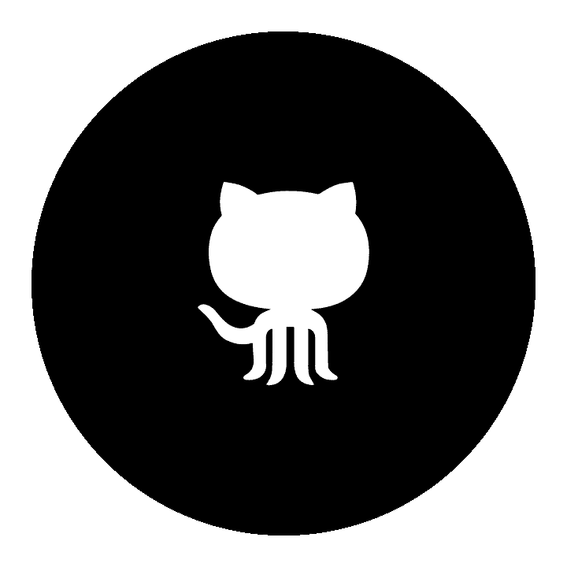

# 计算机科学学位缺少什么

> 原文：<https://levelup.gitconnected.com/whats-missing-from-cs-degrees-6036d8f76e05>

## 数据结构和 OOP 不足以在毕业后获得成功。

Hacky，scrappy，piece-meal，我循环使用所有这些形容词来描述我的非传统的计算机科学学位。不是我没受过素质教育；相反，我认为我的计算机科学学位是我所希望的最好的知识融合。然而，当我大一的时候，我们学校没有计算机科学专业。等我到了最后一个可能转专业的日子，CS 刚刚被我所在的学院批准为正式专业。

在我的四年里，我参加了很多第一次授课的课程，还有一些课程，随着学期的进行，我真的对我的教授很满意。在许多情况下，我有独特的学习机会和经历，让我对这个行业有了一个视角，我知道其他参加更传统项目的人没有接触过。尽管如此，我的学位(以及一般的计算机科学本科课程)还是有一些地方没有达到要求。我希望年轻的本科生、教授或其他持有计算机科学本科学位的人会阅读这篇文章，并反思改进之处。

## 在我开始之前，有两个警告:

1.  我不是软件工程师。作为我领导力发展项目的一部分，我已经做了 6 个月的开发人员，但是我还没有获得软件工程师的头衔。这就是为什么我联系了一群在软件行业工作的人。这个小组包括开发人员和普通技术人员，询问他们希望在进入现实世界之前在学校学到什么。
2.  **没人觉得学校为他们做好了毕业后工作的准备。几乎每个人都会说，他们的学位教会了他们很多在工作中永远用不到的 T4 知识。这并不是说本科学位没有用处或没有价值。只是它与你完成第一份工作所需的技能没有直接关联。大部分这些技能你一旦被雇佣就必须学习，就像我们其他人一样。**

这些是你在计算机科学本科阶段应该学习的东西。

# 如何为现有的代码库做出贡献

我们在大学期间花了几乎所有的时间自下而上地编写代码和项目，这从来没有意义。我从头开始编写定制的 Android 应用程序，第一次学会了如何初始化类和集成库，并创建了自己的定制 Jupyter 笔记本用于数据分析。作为一名学生，学习*如何*初始化东西是很重要的，即使要忍受负责端到端开发的艰辛。它塑造性格。

我们应该在学习过程中加入对现有代码库的贡献，考虑到如果你从事软件开发，这是你要做的 98%的工作。我甚至不确定许多年轻学生是否意识到这一点。作为一名专业软件开发人员，在任何 IDE 中创建一个新的空白项目都类似于编写自己的教科书:一个真正勤奋的人会这样做，以便成千上万的人可以在未来几年使用它。你几乎总是要负责修改现有的代码:试图理解它的意思，然后弄清楚如何编写逻辑，不会使原来的工作变得无用。与自下而上编写代码相比，这很困难，压力很大，而且可以说是完全不同的技能。当你独立编写代码时，*你*制定所有的规章制度。你想要一个描述每个函数/方法的注释吗？酷！是否要使用 switch 语句而不是 if 语句？去吧！你讨厌所有的 for 循环，并坚持把它们写成 while 循环，因为你是一个努力的人吗？那是你的特权。

在现实世界中，你不能制定规则。因为数百名开发人员都在为同一个项目做贡献，所以必须保持一致性。有命名约定、设计模式期望、文档标准。如果不遵守这些规则，您不仅会很难将您的代码签入到主分支中，而且还会损害您的工作表现。

这听起来有点循规蹈矩，而且是用“老大哥的能量”打造的，但是这种工作也有很多积极的一面。你可以和其他开发人员合作，向比你更有经验的人学习。一般来说，大多数代码质量标准都是高质量代码的标志。他们会提高你的技能。

在大学期间，我希望我的课程迫使我为 GitHub 上的一个开源项目做贡献。在真正的 GitHub 形式中，[有一个专门致力于开源项目的资源库](https://github.com/github/opensource.guide)。您不仅将实践我已经描述的内容，而且探索开源项目库将向您展示代码的潜力。在你有机会第一手观察软件行业之前，它给你一些软件行业的背景。另外，为了对这些库有所贡献，你必须测试你的 Git 技能，这是你毕业后从事软件工作时绝对需要的。

# 如何将愿景转化为需求

不缺少等待被写入下一个应用程序或网站的“精彩”想法。事实上，如果你在 LinkedIn 上花 5 分钟以上，你会发现至少有几个过于自信的“企业家”在用看似无穷无尽的资金资助他们新的人工智能驱动的区块链创业公司。算是开玩笑吧。

在想法和可以用代码开发的需求之间有一个巨大的飞跃。跨越这种差异实际上是相当困难的。假设你要求一个开发团队为你开发一个应用程序，这个应用程序可以找到离你当前位置最近的 5 家杂货店。很简单，对吧？我可以想象在没有更多细节的情况下开始那个项目。但是当我开始思考时，我想知道:

*   我如何在应用程序中找到我的当前位置？我必须打出来吗？我们会使用定位服务吗？
*   什么是“接近”如果我必须从我的位置走 200 多英里才能找到 5 家商店，这对用户来说还是有用的信息吗？
*   这在哪里可以买到？就美国？北美整体？全球？
*   什么*是*杂货店？什么是杂货？这取决于用户的偏好，还是我们应该预先确定一个列表？

当你在为一个人或一家公司，而不是为你自己或一位教授制造产品时，你的问题的答案变得*非常*重要。为你的客户制造符合正确规格的产品是一个在合同范围内工作并保持互惠互利的业务关系的问题。即使那个客户是你自己的公司，如果你没有交付合适的产品，公司也会损失很多钱。

在大多数软件公司中，我们使用[敏捷](https://en.wikipedia.org/wiki/Agile_software_development)(这也应该教授给所有计算机系本科生)将客户的需求转化为开发人员可以实际操作的工作。我们将定义史诗、特性、用户故事、任务、故事点，所有这些都是为了让我们能够清楚地知道我们正在构建什么。在本科阶段，让学生了解这个过程的困难是很重要的。与客户沟通的规律性和清晰性，创建现实时间表所需的组织和时间管理技能，以及管理非技术人员的期望(他们可能不知道自己真正需要做多少工作)都是至关重要的技能。

学生们被分成“客户”和“产品负责人”(PO)两人一组，这样的作业可以真正帮助他们学习这项技能。在初步的“远景”会议之后，PO 可以带着技术问题回到客户那里，并建立一个用户故事的储备来交付特性。最后，PO 和客户就成功的衡量标准达成一致。你怎么知道你的产品是否成功？单独做这个练习，甚至不为客户写代码，对学生来说是一个有益的练习。

# 如何编写文档

很多人讨厌文档。我明白，这感觉很迂腐和行政化，有时会让你远离软件开发周期中最令人兴奋的部分。老实说，这是保管工作，我不会告诉你这很有趣，很愉快。

不过，这是*关键*。

首先，让我们讨论一下写得好和写得差的文档。写得好的文档向非技术受众解释技术概念。可能是你的客户或其他消费者，也可能是项目的新技术人员。如果你的文档充满了太多的术语，非技术人员无法理解，那么你就失败了。读者可能会怨恨你的把关，并停止与你的开发团队进行有效的沟通。或者，他们会对自己参与项目的能力失去信心，这将真正损害你的入职过程，从而损害工作的可持续性。

然而，仅仅写得好是不够的。你还必须写下正确的事情。文档应该涵盖上一节中讨论的项目需求、开发完成时的进度，以及让新人加入项目所需的任何信息。

一个编写完成构造的例子。[图片来源](https://www.google.com/url?sa=i&url=https%3A%2F%2Fwww.sharonmwasco.com%2Fhome%2F2019%2F4%2F12%2Fi-like-to-write-it-do-it&psig=AOvVaw0E9y2onmUZNXmN5N7ji7Yp&ust=1613923688236000&source=images&cd=vfe&ved=0CA0QjhxqFwoTCOigsbjs-O4CFQAAAAAdAAAAABAD)。

当我七年级的时候，我曾经做过一个科学奥林匹克竞赛，叫做“[写出来做出来](https://scioly.org/wiki/index.php/Write_It_Do_It)”(我发誓，这是相关的)。孩子们成双成对。一个人将得到一些玩具或其他材料的结构，他必须写下说明，让他的搭档在稍后的时间重新组装这些结构，只给出其组件。我在这件事上表现很差。我总是忘记提到区分两种不同玩具的细节，所以我的伙伴总是有不完整的说明。这是您希望在文档中避免的。学生们应该站在一个人的立场上，这个人有一袋乐高玩具，但必须建造帝国大厦，并学会写文档清楚地解释这个过程。

# 如何评价自己

太多天真的年轻人在他们大学毕业并获得第一份工作时被利用，尤其是少数民族。重要的是在学校里了解你价值的三个方面，这样你才不会因挣得少或长得少而吃亏。

## 实用:你有什么技能，和其他毕业生相比如何。

学生们应该明白他们如何达到标准，即使这需要一个现实的检验。我拿到的是计算机科学学士学位，不是理学士学位。这确实有所不同。我在技术上不如一个全国顶尖项目的计算机系本科生熟练。从来没有人教我如何在不到 15 分钟的时间内编写 AVL 树，我真的很难通过我完成的几个技术面试，我不认为我会完全理解深度优先搜索。我是一名技术人员，拥有自然语言处理等特定领域的背景，但我不是“传统的”顶级软件开发人员。然而，我是一个很强的沟通者。我是一个优秀的作家和演说家，这些技能在科技领域非常重要。这些技能对我现在的角色来说比技术技能更重要。

重点不是拿自己和别人比较或者说一个比另一个好，而是要知道自己的立场。重要的是，既要知道自己的弱点，也要毫不掩饰自己的优点。一旦你开始工作，这真的会帮助你获得一份工作和更多适合你的机会。和你的教授谈谈你的技能，以及他们认为你需要进一步发展的地方，以及你擅长的地方。教授是出了名的好导师，他们善于读懂学生。我希望更多的人能和他们的学生一起建立定期的检查制度，来回顾他们的技能。

## 金钱:你应该得到多少报酬。

一旦你明白了你拥有什么技能和你想要的工作，你必须明白你应该得到多少报酬。对于进入技术领域的女性和少数族裔来说尤其如此。我们还没有被很好地代表，不幸的是，一些工作场所会利用这一点。

如果我是一名教授，我会认为通过工资谈判来指导我的学生是一种社会责任。学习如何为你申请的职位研究一个可行的工资范围，生活成本，福利待遇，生活设施，公司文化等等，需要实践。如果不是计算机系的教授，那么至少要参加学校职业服务中心的一系列必修课。令人欣慰的是，其他行业已经从这种方式中走了出来。如果你花了大量的钱来获得本科学位，他们至少可以教育你尽快还清债务。

## 赛尔夫:你有多能干，既不会伤害别人，也不会拉屎。

如果你不相信自己或不属于任何地方，成长和成功就会变得很有挑战性。还有什么地方比学习环境更适合你练习自我形象呢？大学是人生中最适合不适应自己的一段时间。对于完全迷失自我的人来说，这是一个安全而温馨的环境。你在你的教授身上，在你觉得最有趣的知识中，在毕业时你发现在你身边的人身上，找到安慰和指导。一旦你毕业了，你不需要知道所有的答案，但是希望你的学位给你留下了足够的能力，你会觉得你能解决它。

我希望我的大学教授们不会读到这篇文章，认为他们以某种灾难性的方式辜负了我。如果有什么不同的话，我写这篇文章的能力证明了他们的成功和支持。尽管我有“黑客”学位，但我不会改变我大学四年的生活。我回顾了我在西方学院的时光，那种上气不接下气地出现在注册办公室的记忆让我非常高兴，我准备争辩说，我的概率课程应该三倍计入我的专业和辅修课程，才能毕业。我考虑在半夜侵入图书馆的一个桌面，以确保我的算法能够继续训练，尽管在 15 分钟不活动后会自动注销。我想起我的朋友们开玩笑地称我为“计算机科学系主任”，因为我每周都会去我的研究顾问办公室询问新课程。

但大多数时候，我会想起大一第一堂 CS 101 课后的那个晚上。我第一次看到一个软件工程师的招聘信息，我确信地说，

> “我可以这么做。”

# 分级编码

感谢您成为我们社区的一员！ [**订阅我们的 YouTube 频道**](https://www.youtube.com/channel/UC3v9kBR_ab4UHXXdknz8Fbg?sub_confirmation=1) 或者加入 [**Skilled.dev 编码面试课程**](https://skilled.dev/) 。

 [## 编写面试问题+获得开发工作

### 掌握编码面试的过程

技术开发](https://skilled.dev)