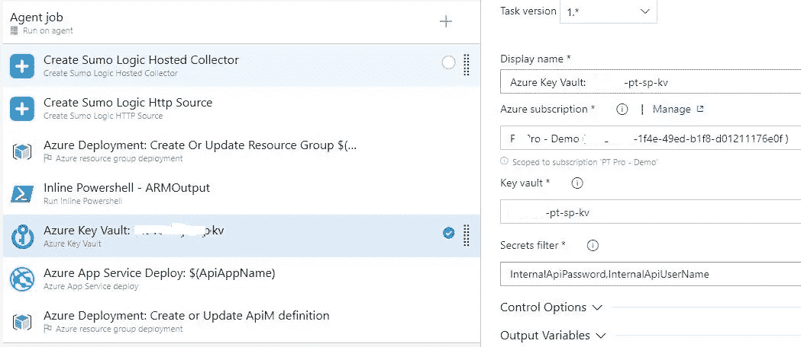
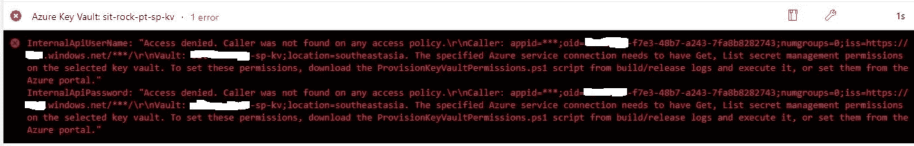
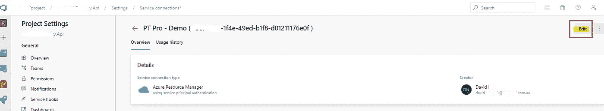
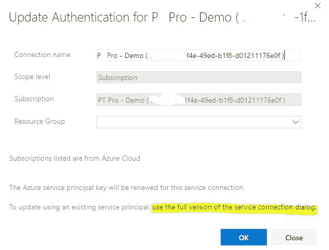
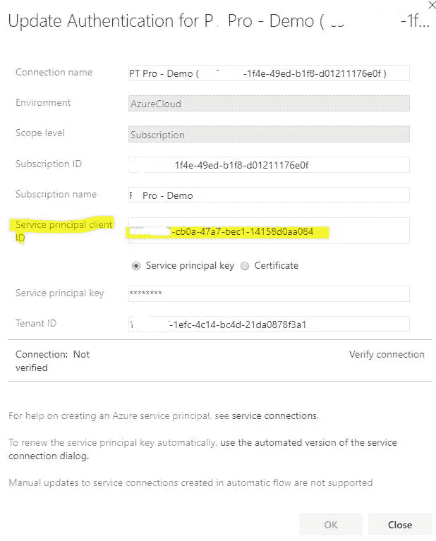
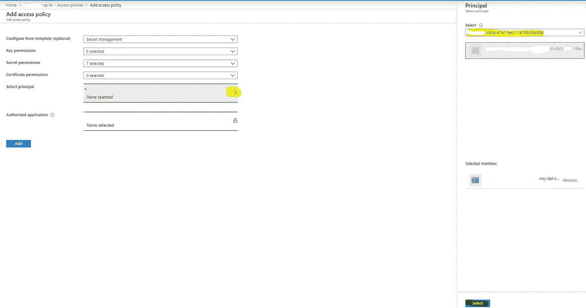

# 我的服务主要名称是什么？

> 原文：<https://levelup.gitconnected.com/whats-my-service-principal-name-b0bf498adac8>

## 如何从 DevOps 服务连接中找到 SPN

泽维尔·萨默在 [Unsplash](https://unsplash.com/s/photos/azure-devops) 上拍摄的照片

我在 Azure DevOps 中有这个 Azure Key Vault 发布管道步骤:

但是它给了我这个错误:

> 拒绝访问。在任何访问策略上都找不到调用者。指定的 Azure 服务连接需要对选定的密钥库拥有 Get，List secret 管理权限。

我需要在密钥库中授予我的服务连接读取权限。

当我在 Key Vault 中添加访问策略时，我不知道我的服务连接的 SPN 的名称是什么。

## 这就是我如何找到 SPN 的

点击“Azure 订阅”旁边的“管理”(见上图)。

然后点击“编辑”:

然后点击下面突出显示的“使用完整版…”:

复制“服务主体客户端 ID”值:

然后回到 Azure 门户中 Key Vault 的访问策略部分，点击“添加访问策略”并点击“选择主体”。

复制并粘贴您之前复制的 ID:

在您刚刚粘贴的 ID 的正下方，您将看到以灰色填充的矩形显示的 SPN。

点击屏幕右下角的“选择”，您的 Azure Key Vault 发布步骤现在将生效:)