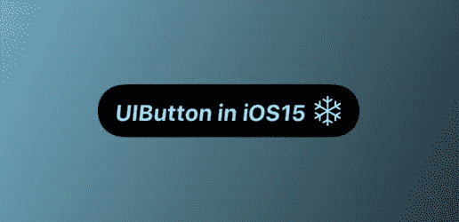
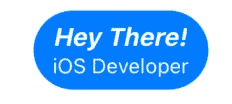
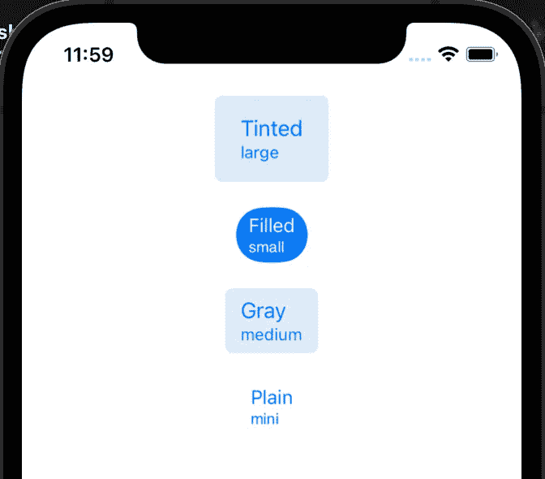
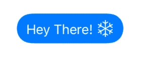
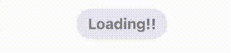
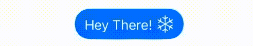

# iOS 15 中的 UIButton

> 原文：<https://levelup.gitconnected.com/whats-new-in-uibutton-in-ios-15-107370969f66>



首先让我们在这里介绍一些术语:

**UIButton。配置:**
它规定了按钮的行为和外观。[此处阅读更多内容](https://developer.apple.com/documentation/uikit/uibutton/configuration)。
有 4 种配置:
1。有色-给出有色背景
2。填充-给出一个填充的背景
3。灰灰色背景
4。普通的旧纽扣

```
**var** config = UIButton.Configuration.filled()
config = UIButton.Configuration.tinted()
config = UIButton.Configuration.gray()
config = UIButton.Configuration.plain()
```

**UIButton。配置允许您设置几个自定义属性。让我们一个一个来看:**

*   **cornerStyle :**
    帮助设置按钮的圆角半径属性。
    可用款式有:
    1。固定
    2。动态
    3。小型/大型/中型
    4。胶囊

```
config.cornerStyle = .fixed
config.cornerStyle = .dynamic
config.cornerStyle = .small / .large / .medium
config.cornerStyle = .capsule
```

*   **标题，属性标题:**
    使用该属性可以轻松设置标题。attributedTitle 使用 iOS 15.0 中引入的新 AttributedString
*   **副标题:** 使用该属性设置按钮的副标题。
    设置 titlePadding 属性来调整标题和副标题之间的间距。

```
config.title = "Hey There!"**var** attText = AttributedString.init("Hey There!")
attText.obliqueness = 0.2 // To set the slant of the text
attText.font = UIFont.systemFont(ofSize: 16.0, weight: .bold)
config.attributedTitle = attTextconfig.subtitle = “iOS Developer”
```



例子

*   **按钮大小:** 将按钮的大小设置为预定义的值

```
config.buttonSize = .large
config.buttonSize = .small
config.buttonSize = .medium
config.buttonSize = .mini
```

最后，将这个配置分配给按钮。

```
**let** button = UIButton.init(type: .system)
button.configuration = config
```

瞧！！下图显示了按钮副标题中标题和大小的配置:



风格和配置

*   **图像:**
    现在设置图像填充和位置的灵活性就在我们手中。

```
config.image = UIImage.init(systemName: “snowflake”)
config.imagePlacement = .trailing
config.imagePadding = 5
```



图像

*   **显示活动指示器:** 显示一个活动指示器，代替按钮中的图像。你可以简单地选择图像的位置和填充来显示这一点。

```
config.imagePadding = 5
config.showsActivityIndicator = **true**
```



> **注意:**这不需要你在按钮前设置图像

*   **configurationUpdateHandler:** 它是一个更新按钮配置的闭包。[阅读此处](https://developer.apple.com/documentation/uikit/uibutton/configurationupdatehandler)



在 configurationUpdateHandler 中，我们可以改变按钮的配置来改变它的属性。在第 5 行，我们使用新的`**titleTextAttributesTransformer**`来更新属性化的标题。[看这里](https://developer.apple.com/documentation/uikit/uibutton/configuration/3750802-titletextattributestransformer)。
在第 11 行我们可以使用新的`**imageColorTransformer**`来更新按钮中图像的颜色。最后，我们将这个配置分配给按钮。

**何去何从？** 肯定[**苹果文档**](https://developer.apple.com/documentation/uikit/uibutton/configuration) 对于**ui button . configuration .**给出了整个事情的一个很好的概述，并且用按钮来玩。

**与我联系:
LinkedIn:** [**科尔蒂卡·普里亚**](https://www.linkedin.com/in/keerthika-priya-118519205)