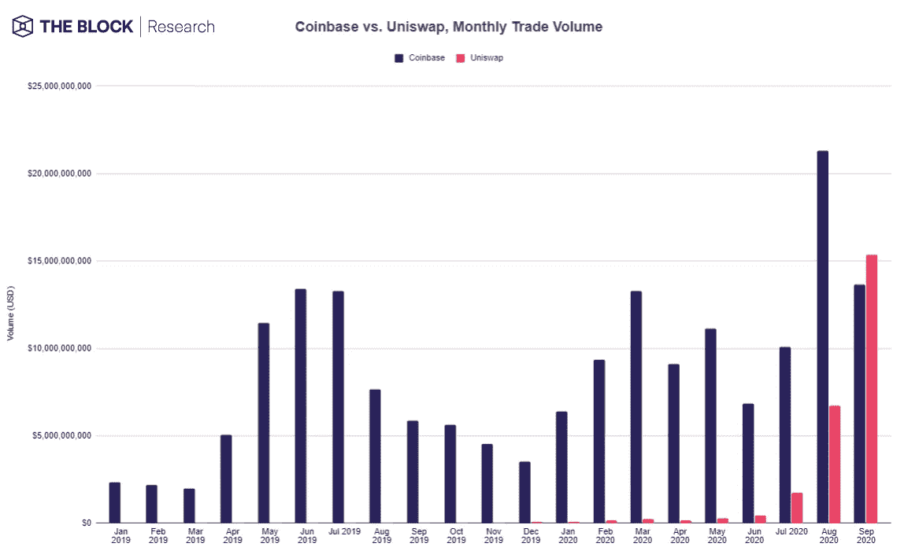
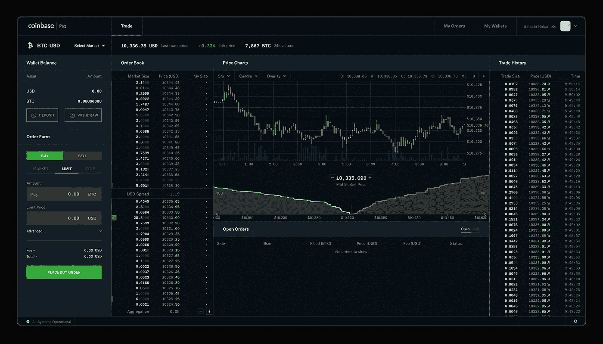
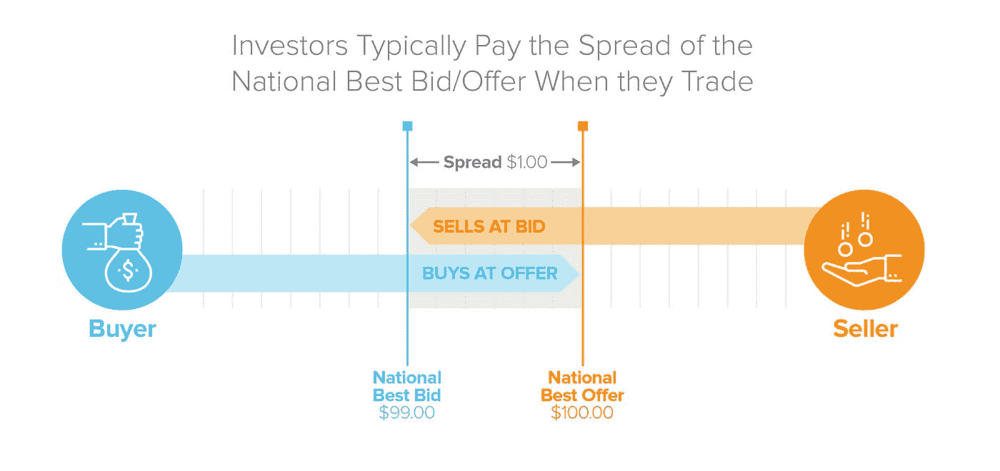
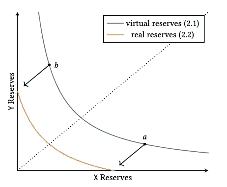
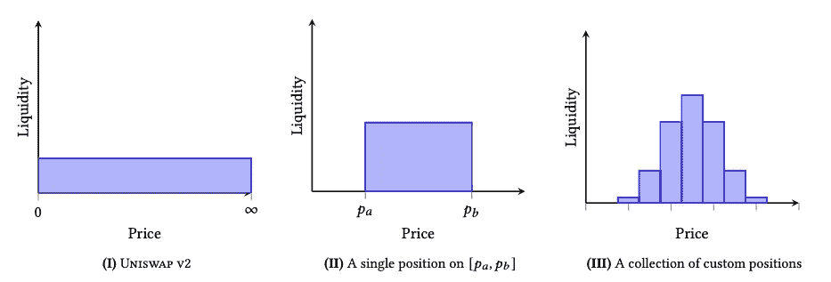
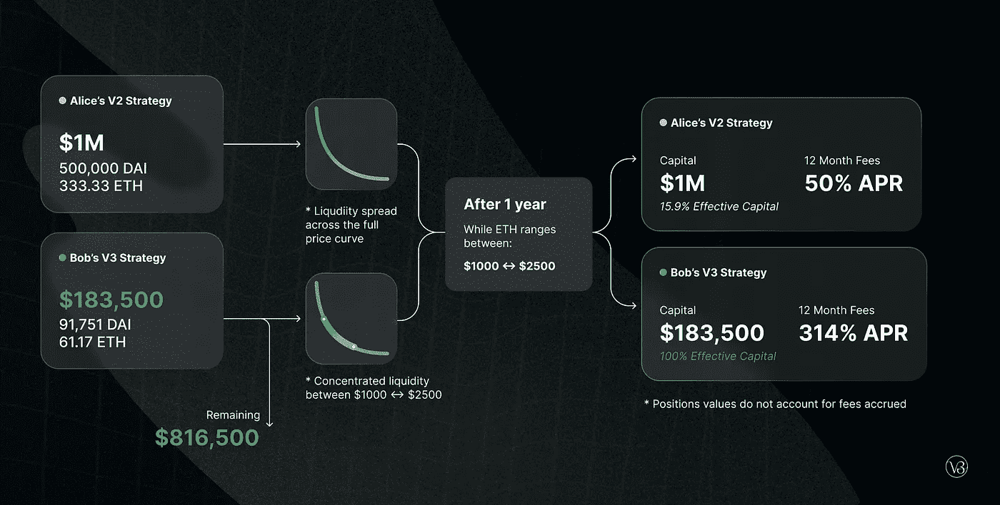

# Uniswap v3 有什么新功能？

> 原文：<https://levelup.gitconnected.com/whats-new-in-uniswap-v3-a04a8f2673bb>

Uniswap v3 中的集中流动性和多收费层如何改变自动化做市商和分散交易所的未来。

Uniswap 无疑是当今最重要的 DeFi 应用之一。按市值计算，它一直排在加密货币项目的前十名，其月度交易量甚至超过了去年 9 月的比特币基地(154 亿美元对 136 亿美元)。

图片来源:[街区](https://www.theblockcrypto.com/linked/79775/uniswap-coinbase-monthly-volume-september)

Uniswap 于 2018 年 11 月作为一个简单的分散交易所(DEX)推出，为用户提供了与以太坊交易 ERC20 令牌的能力，而无需经过像币安或比特币基地这样的集中交易所。2020 年 5 月，Uniswap 推出 v2，增加了 ERC20-ERC20 流动性池，并在使用量(迄今交易量超过 1350 亿美元)和 SushiSwap 和 PancakeSwap 等相关项目的创建方面出现了抛物线式增长。

2021 年 3 月 23 日，Uniswap 团队发布了 v3 的[白皮书，并宣布了 5 月 5 日 L1 以太坊 mainnnet 发布的计划，以及随后在乐观上的 L2 部署。从高层次来看，Uniswap v3 引入了两个新概念:](https://uniswap.org/whitepaper-v3.pdf)

*   **集中流动性**
*   **多个费用层级**

这些功能不仅为流动性提供者(LP)提供了更多选择，而且与现有协议相比，资本效率高达 4000 倍。在本帖中，我们将快速回顾流动性池、非永久性损失和自动市场标记(AMM)背后的机制，然后开始讨论 v3 的新功能如何改进 v2 的缺点。

# 流动性池

DeFi 中的流动性池是通过智能合约汇集和锁定的加密资产(令牌)储备，以提供更高的流动性和更快的 dex 交易执行。这个想法由 [Bancor](https://app.bancor.network/) 首创，由 [Uniswap](https://uniswap.org/) 推广，并由其他流行项目如 [Curve](https://curve.fi/) 和 [Balancer](https://balancer.finance/) 修改以获得更高的效率。

但是为什么 DeFi 需要流动性池呢？答案在于做市商在分散式网络中运营所面临的挑战。

## 做市商

在传统金融中，集中交易利用订单簿模型来调节买方出价和卖方要价之间的差异。当双方能够就价格达成一致时，交易就发生了。然而，买家的出价和订单金额与卖家的要价和库存数量同时完全相同的几率几乎为零。这是做市商填补这一缺口以提供流动性(即立即买入/卖出的能力)的地方，以换取净买入/卖出订单之间的差价利润。订单簿被保存以密切监控出价并实时询问价格。

图片鸣谢:[比特币基地 Pro](http://pro.coinbase.com/)

我们举个买卖股票的例子。在买方，人们希望以平均 99 美元/股的价格购买股票，而在卖方，期望的卖价是 100 美元/股。因此，当卖方发出市场卖出订单时，做市商立即以最佳市场买入价格(99 美元/股)履行订单，然后以最佳市场卖出价格(100 美元/股)出售给市场买方，根据价差获得 1 美元/股的净利润(实际上，价差通常小于 1 美分/股)。为了将风险转移给做市商，以便立即买入/卖出，投资者通常承担交易所的差价。

图片来源: [a16z](https://a16z.com/2021/02/17/payment-for-order-flow/)

因此，在这种模式下，做市商的成功依赖于在一段时间内净买入和卖出订单以获取利润的能力。在 DeFi 世界中，这种模式失败有两个主要原因。首先，如果没有第二层扩展解决方案，以太坊目前每秒只能处理 12-15 个事务。最重要的是，每一次与网络的交易都会产生汽油费。这意味着做市商可能无法足够快地更新他们的订单，以对已经波动的加密价格做出反应，并可能支付比他们从价差中获得的利润更多的天然气费用。

## 自动做市商

在 DeFi 中，流动性池不是由做市商承担风险，而是由提供两个或更多相同价值代币的有限合伙人创建。举一个具体的例子，当有限合伙人提供足够的 USDC 来匹配当时 ETH 的公平市场价值(例如，如果当时的公平市场价格为 2000 美元/ETH，则 2000 USDC 兑换 1 个 ETH)时，就创建了 USDC/ETH 流动性池。作为提供这种流动性的交换，有限合伙人将根据所提供的流动性与锁定在该池中的总流动性之比，获得有限合伙人代币。当用户通过该池完成交易时，所有 LP 令牌持有人将获得 0.3%的费用补偿，费用与持有的 LP 令牌数量成比例。当有限合伙人想要索回其流动性(即 USDC/ETH 对)时，这些令牌会被烧掉。

由于每次代币交换都会改变锁定在池中的资产的基本比率，因此代币的价格会根据确定性算法进行调整，以响应这种变化。各种 dex 使用的算法略有不同，但这种机制作为一个整体被称为自动做市商。Uniswap 使用[常量产品做市商算法](https://github.com/runtimeverification/verified-smart-contracts/blob/uniswap/uniswap/x-y-k.pdf)来调整价格:

> (令牌 A) *(令牌 B) =常数

在我们的 USDC/ETH 的例子中，如果有人购买 ETH 来交换 USDC，那么集合中 ETH 的供应减少，而 USDC 的供应增加。由于这两种代币的乘积必须是常数，ETH 相对于 USDC 的价格会增加，以反映新的比率。由于较大的资金池受单个交易(即滑点)的影响较小，dex 鼓励有限合伙人通过额外的代币提供更多的流动性，以获得更好的用户体验。Uniswap 为有限合伙人提供 UNI 令牌，有限合伙人可以通过交易获取更多利润。这个概念也被称为产量农业。

## 非永久性损失

只要有限合伙人愿意提供任何两个或更多等值的代币，就可以创建流动性池。通过 AMM，只要供应充足，流动性池理论上可以在任何规模下运行。然而，有限合伙人承担着非永久性损失的风险。为了理解这个概念，让我们重温一下 USDC/联邦理工学院的例子。

假设您以 2000 美元/ETH 的价格向 Uniswap 50/50 池供应 10，000 USDC 和 5 ETH。一开始，USDC 和 ETH 提供的公平市场价值是相等的。外部，以太坊利好消息下降。这可能是埃隆·马斯克或马克·库班关于它的推文，也可能是第二层扩展实验的积极结果。在币安或比特币基地等其他交易所，ETH 的价格开始飙升至 2500 美元。聪明的套利者可以利用这种价格差异，以较低的价格在 Uniswap 上快速买入 ETH，然后立即在外部交易所以较高的价格卖出。最终，Uniswap 的价格会重新设定，以反映这种变化，但套利者将从价差中受益，直到 AMM 能够赶上。

对于有限合伙人来说，这意味着理论上的利润损失。如果 LP 没有提供流动性并持有资产，LP 可能会在外部交易所触及 2500 美元时出售其 ETH。这种差异被称为非永久性损失，因为“损失”是暂时的，因为 ETH 的价格可以回到 2000 美元，抵消了理论上的损失。

不同的协议以不同的方式减轻非永久性损失的风险。例如，Curve 只关注成对的类似价值，如 stable coins(USDC/戴)或同一资产的包装代币(wETH/sETH)。平衡器允许有限合伙人加入拥有两项以上资产的池或加权池(80/20)。最后，Bancor v2 利用与 oracle 集成的动态 AMMs 来自动调整权重。

要在 Uniswap 上了解有关非永久性损失的更多信息，请观看此视频:

# Uniswap v3

那么 Uniswap v3 如何解决 v2 的一些缺点呢？首先，v3 引入了一个新的概念，叫做**集中流动性。**正如我们在 Curve 的稳定外汇交易方法中所看到的，一些交易对仅利用很小的流动性窗口(例如和戴交易对分别为 0.999 美元和 1.001 美元)，尽管 AMM 算法允许 0 到无穷大之间的所有价格。这使得该范围之外流动性效率低下，并增加了有限合伙人因非永久性损失或滑动而承担的风险。在 v3 中，Uniswap 允许有限合伙人构建他们的定制价格范围，并根据这些价格曲线集中他们的流动性:

图片来源: [Uniswap 白皮书](https://uniswap.org/whitepaper-v3.pdf)

现在，LP 可以将我们的 50/50 USDC/以太网池从 v2 转换为自定义范围，并相应地拆分资本。例如，1000 美元可以分配给 USDC/联邦理工学院，价格为 1850-2250 美元，另外 500 美元在 2500-3000 美元范围内。换句话说，有限合伙人现在只需要为他们的固定产品池创造的“真实储备”提供足够的流动性，在一个更大的、理论上的“虚拟储备”范围内运作，这个范围仍然从 0 到无穷大。

与此同时，希望交换代币的用户仍在交易所有个人定制价格曲线的组合流动性，因此汽油费没有增加。在该价格范围内，LP 按比例收取交易费。

图片来源: [Uniswap 白皮书](https://uniswap.org/whitepaper-v3.pdf)

集中的流动性在资本效率方面对有限合伙人有着深远的影响。理性 LP 可以将他们的头寸集中在围绕当前价格的狭窄交易范围内，并根据价格变化更新他们的定制头寸，以最大化收益。

以 Uniswap 的博客为例，如果两个用户(Alice 和 Bob)都有 100 万美元可投资，v2 用户(Alice)和 v3 用户(Bob)锁定的流动性差异可能是 100 万美元，而集中在 1000-2500 美元 DAI/ETH 范围内的差异仅为 18.35 万美元。这不仅允许 Bob 将他的剩余资本投资于其他协议，如果 ETH 下降到 0 美元，他的下行风险也更小。

图片来源: [Uniswap](https://uniswap.org/static/ce989cd290d463cbcdf3082af846bbfe/2cb21/example_1.png)

但是当价格超出 LP 的定制范围时会发生什么呢？首先，有限合伙人将不再赚取费用，他们的资产将全部转换为两种资产中价值较低的一种。实际上，有限合伙人的流动性被从资金池中移除。然而，Uniswap 现在还启用了**范围订单、**的概念，其作用类似于传统的限价订单。在这种情况下，LP 可以在当前价格之外的自定义范围内存放单个资产。一旦市场价格进入这一范围，原始资产将被出售给另一对，同时在此过程中赚取互换费用。这种策略可以补充获利回吐或逢低买入的市场订单。

## 灵活的费用和高级甲骨文

除了集中流动性之外，Uniswap v3 现在还提供三种不同费用等级的有限合伙人:0.05%、0.30%和 1.00%。这些费用反映了有限合伙人为预期波动提供流动性的风险。因此，对于稳定的和相关的配对，用户可以享受更低的费用，因为有限合伙人聚集到 0.05%层。像 USDC/ETH 这样不受欢迎的配对可能会收取 0.30%的费用，而新的或外来的配对可能会收取 1.00%的费用。为了帮助有限合伙人制定他们的理想策略，Uniswap 还宣布了改进的 TWAP(时间加权平均价格)oracles，它可以在单个链上调用中计算过去 9 天的任何 TWAP，允许围绕移动平均线或异常值分析进行更便宜的计算。

# 新机遇

Uniswap v3 的新功能使有限合伙人能够采用各种策略来最大化收益，同时降低风险。从博弈论的角度来看，我们可能会看到一些有限合伙人专注于流行的狭窄范围，而其他人则专注于极端的离群值。集中的流动性和多种费用等级使 Uniswap 能够与其他 AMM 竞争，这些 AMM 以前在服务特定用例方面具有优势(例如，具有稳定 coins 的曲线)。另一方面，更多的选项意味着新 LP 的复杂性增加。我们还可能看到建立在 Uniswap 之上的新服务，帮助用户优化他们的策略，并通过收费抽象出潜在的复杂性。一旦 Uniswap 在乐观的基础上启动，我们可能会看到 Uniswap 的另一次爆炸，资本效率提高，汽油费降低。

*免责声明:这篇文章不是投资或财务建议。这里表达的所有观点都是我自己的。*