# Windows 11 要求和新功能

> 原文：<https://levelup.gitconnected.com/whats-new-in-windows-11-88278e668b7>

## 还有能不能装 Windows 11？

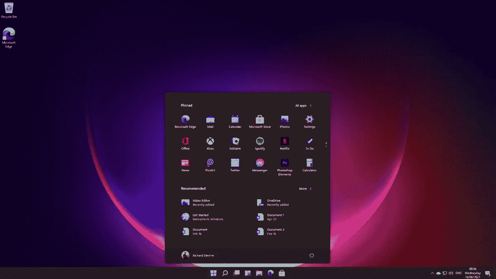

在这篇文章中，我将分享下一次 windows 11 更新的预期——如何更新？在即将到来的升级中有什么值得期待的？新升级的尺寸？还有很多。

这是官方消息，Windows 将进行下一次重大升级。它将有一个全新的设计和一些更新的功能。最近举行的虚拟活动展示了一些主要特征。

 [## Node.js vs .NET Core 谁更胜一筹？

### 是的，我们有一个赢家

levelup.gitconnected.com](/node-js-vs-net-core-the-winner-5ba06efb4c35) 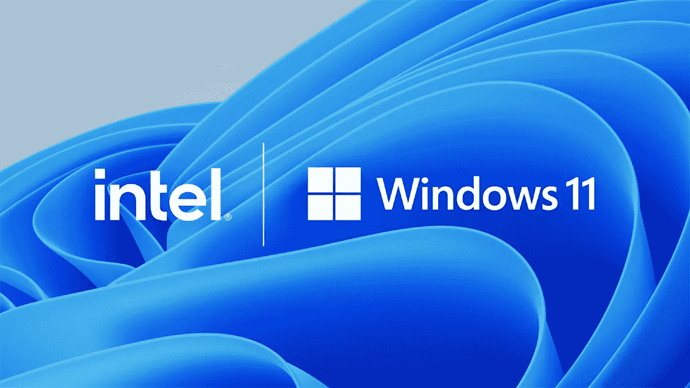

Windows 11 是 Windows 操作系统的下一个重大更新。而且是 Windows 10 的下一次进化。根据微软的说法，Windows 11 专注于灵活、流畅的用户体验，可以提高最终用户的工作效率。它旨在专注于 PC+移动的混合工作环境。让我们看看即将推出的一些主要特性。

# Windows 11 是免费升级吗？

大多数人都很好奇 Windows 11 是免费升级的。虽然我想先回答这个问题。答案是 Yeeeeeesss windows 11 是 Windows 10 客户的免费升级。但是有一些硬件条件。稍后我会深入讨论它们。因此，如果你有一个正版的 windows 10 版本，你就可以免费升级到 windows 11。

# Windows 11 有哪些新功能和升级？

最明显的变化是在桌面菜单上。有一个新的**开始菜单**和一个更新的**开始按钮**，它们都在任务栏的中央。这个设计类似于之前取消的 windows 10X 项目。我们可以看到在 windows 版本 10X 上所做的努力，UI /UX 的变化在 windows 11 上有所体现。

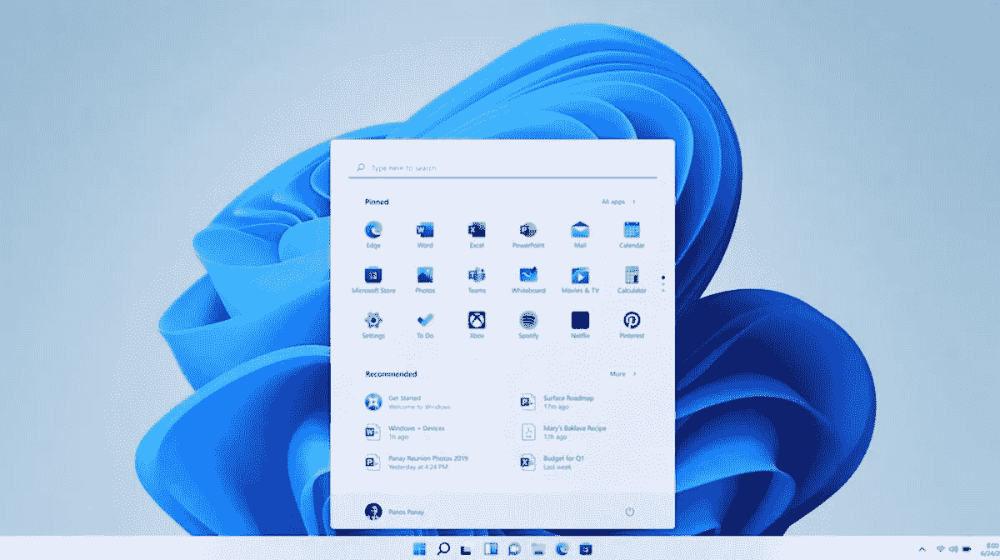

微软

在“开始”菜单中，可以像往常一样看到图标磁贴，这种磁贴设计最初来自 windows 8。有应用程序、最近的文档和单独的搜索界面。我们可以看到圆角，就像我们在 Android 和 iOS 中看到的一样。

Windows 11 还将包括更新的黑暗和光明主题。据说比现在现存的 windows 主题要好很多。

# 管理多个屏幕的快照布局

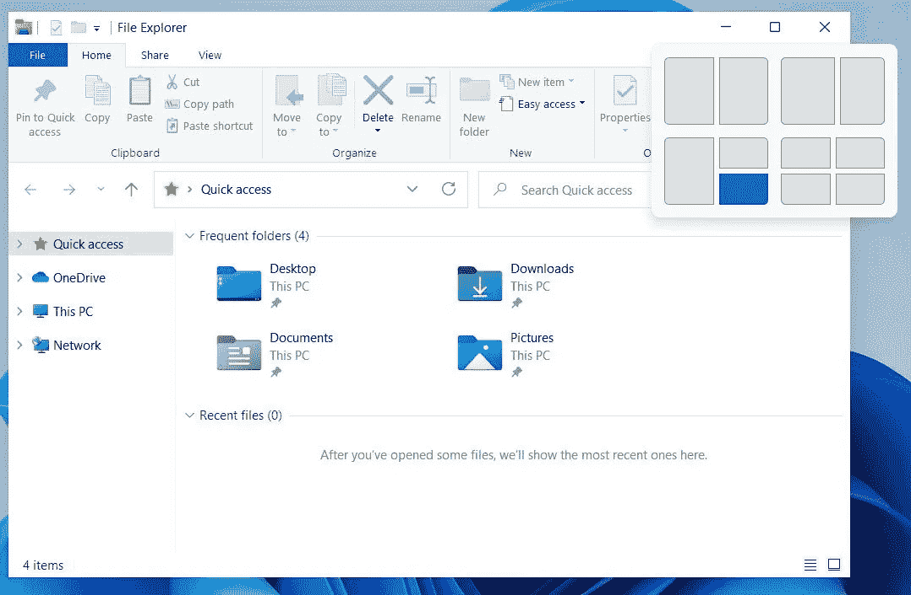

Windows 11 主要集中在多个窗口。Windows 快照布局有助于管理电脑屏幕上的应用。它还能够对应用程序进行分组并记住它们。这有助于管理多台显示器，并确保正确的应用程序是否在正确的屏幕上打开。

有了**全新的坞站和非坞站体验**如果您关闭了外接显示器，其他应用程序将不会妨碍您，它将被最小化。如果你有一个连接的显示器，这是一个有用的功能。

# Windows 11 应用商店中的 Android 应用

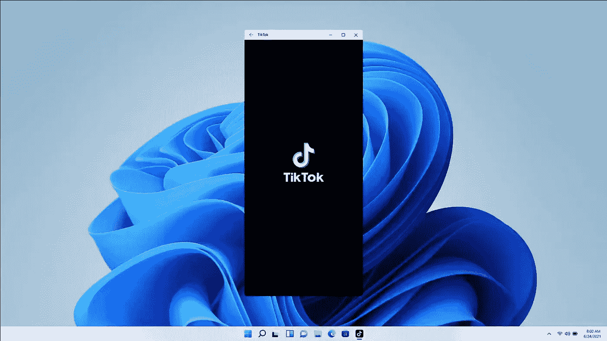

是的，现在 Windows 也支持 android 应用程序，这使得混合工作空间成为可能。您可以在工作时在 pc 上运行您最喜欢的 android 应用程序。所以你不需要在电脑和手机之间切换。微软已经确定了在手机和个人电脑上工作的新的混合模式。

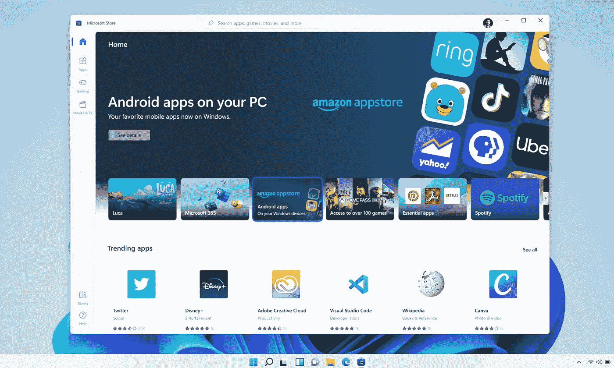

你可以通过微软 AppStore 获取应用，并在 PC 上运行。使用英特尔桥技术，微软已经使**亚马逊 Appstore** 应用可见，并且也可以从 Windows 11 AppStore 下载。

# 带有电视节目和电影的桌面应用商店

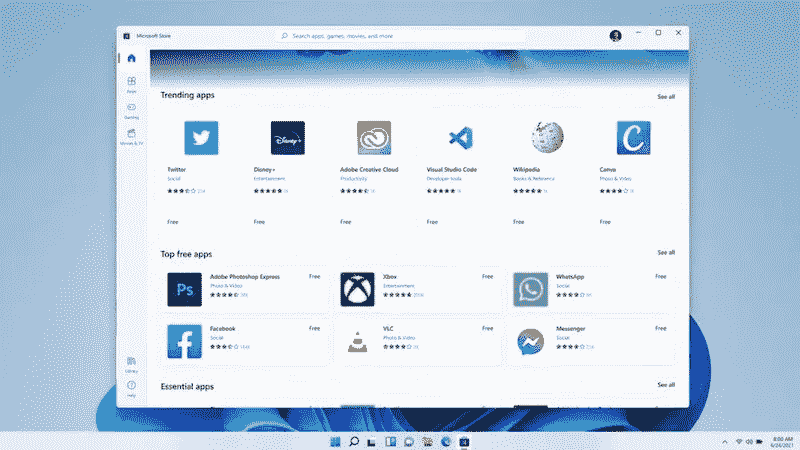

微软

从谷歌 chrome 到 steam 的每个应用都可以在新的 Windows 11 商店购买。这将是一个一站式商店，也有第三方开发商开发的应用程序。微软将让开发者在这些应用中使用他们自己的商务功能，开发者可以保留 100%的收入。

微软提高了 windows store 的速度，除了应用程序之外，它还有电视节目和电影。看起来新的 Windows 应用商店将会更上一层楼。

# 集成的微软团队

Windows 11 已经整合了微软团队。它可以在新的任务栏中找到。Skype 被捆绑在 Windows 10 上，而随着新的 Windows 11 的推出，Teams 已经占据了一席之地。

Windows 11 还推出了一个由人工智能驱动的个性化小工具。它还实现了触摸手势。微软还在改进你可以在平板电脑和触摸目标上使用的手势。Windows 11 不是切换到平板电脑模式，而是简单地适应，让您可以轻松地触摸操作系统。并改进了语音打字。

# 这里和那里不再有更新

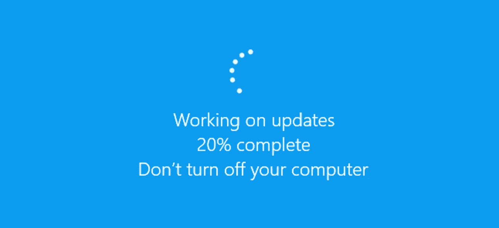

Windows 11 正试图通过更新变得更好。更新量减少了 40%,并且将在后台进行。由于之前对 windows 10 更新的负面反馈给用户带来了一些负面体验，Windows 11 计划每年发布一次**大型**更新。因此，这就像苹果的 macOS 和苹果的 iOS 和 IP ados——它们每年都会进行一次大的更新，而不是两次。

# Windows 10 的应用在 Windows 11 上还能用吗？

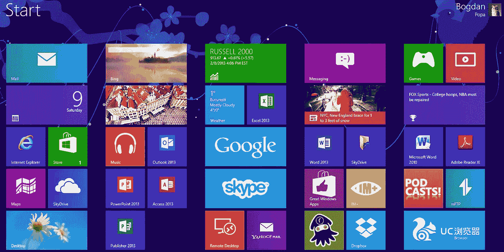

是的，Windows 11 建立在相同的 windows 10 基础上。Windows 11 还承诺保持应用程序的兼容性。所以你在 Windows 10 工具上的投资不会白费。

# Windows 11 要求

照片由 [Kiwihug](https://unsplash.com/@kiwihug?utm_source=medium&utm_medium=referral) 在 [Unsplash](https://unsplash.com?utm_source=medium&utm_medium=referral) 上拍摄

尽管据说所有 Windows 10 正版用户都有能力更新，但这是有条件的。

你的电脑应该有 UEFI 固件和安全引导功能。
兼容的 64 位处理器或片上系统(是的，32 位芯片不合适:/)
需要 TPM 模块芯片版本 2.0

## 如何检查您的 bios UEFI 固件

进入 windows，输入`msinfo` ，打开系统信息。窗户。在 bios 模式项的前面，应该有 UEFI

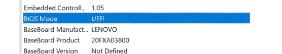

## 如何检查 TPM 模块芯片版本

按 Win+R 键并键入 tmp.msc，然后单击确定

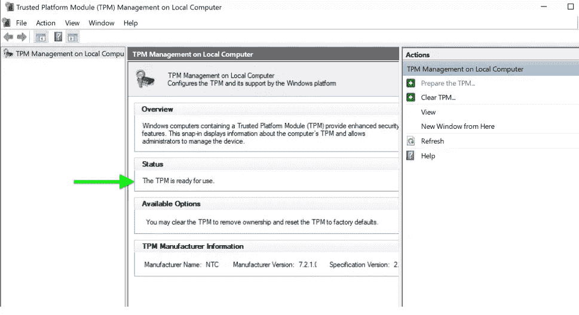

你可以得到你的 TMP 版本，如果有的话。

# 检查 windows 11 兼容性的最简单方法

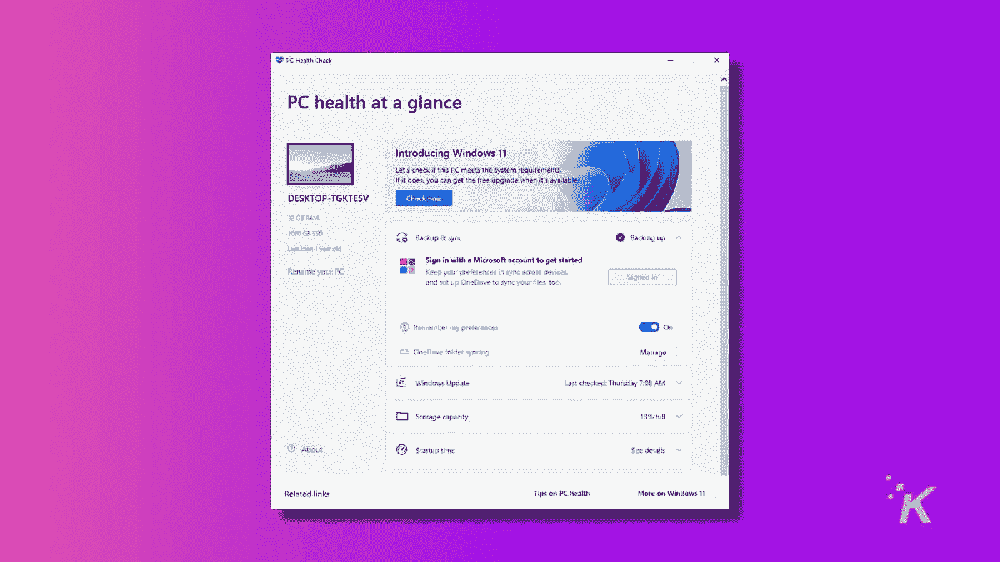

最简单的方法是使用 Windows PC 运行状况检查应用程序。你可以从[这里](https://aka.ms/GetPCHealthCheckApp)下载并安装，然后检查兼容性

# 如何下载 Windows 11

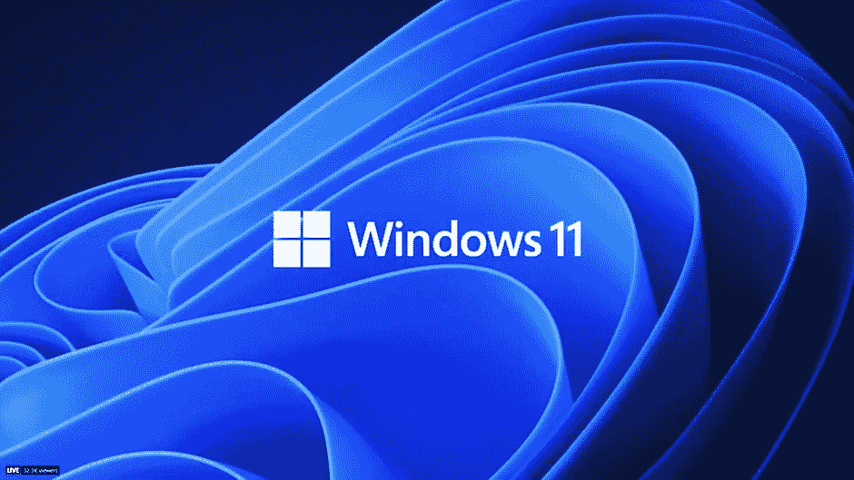

微软

Windows 11 预览版将于 2021 年 6 月 28 日这一周的某个时候开始提供。如果您想在其他人之前提前获得预览，您可以通过加入 Windows Insider 计划获得预览，而且是免费的

一旦 Windows 11 可用，你就可以
进入**设置>更新&安全> Windows 更新**，点击**检查更新**。如果可以的话，你会看到 Windows 11 的**功能更新。点击**下载并安装**。**

# windows 11 升级的规模有多大

安装 Windows 11 需要 64GB 或更高的存储空间。未来的更新和特定功能可能需要额外的存储空间。