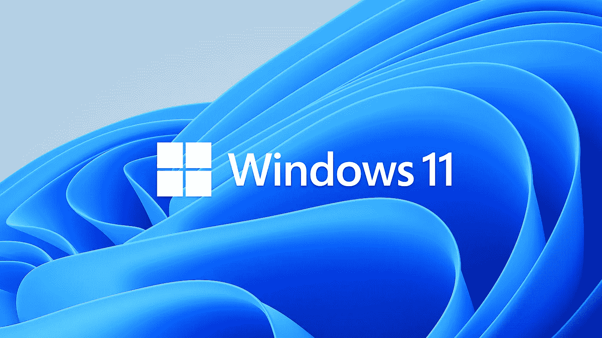
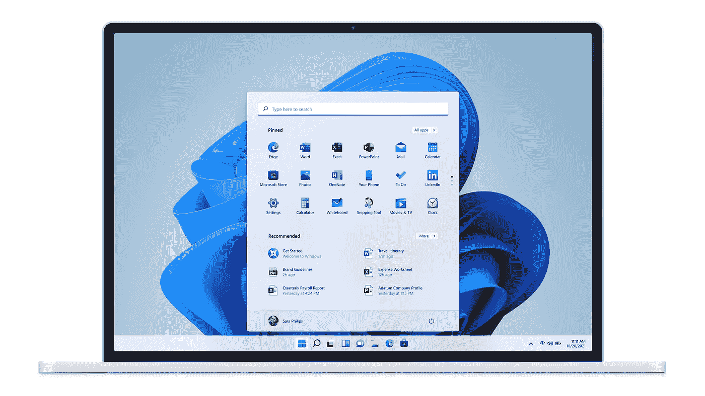
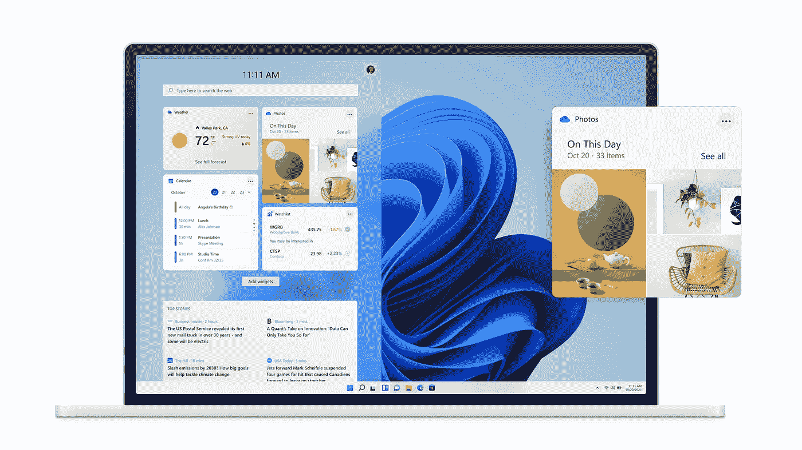

# 你的电脑可能无法运行 Windows 11

> 原文：<https://levelup.gitconnected.com/whats-new-in-windows-11-b36dcf5d1d5a>

## 你的电脑能运行它吗？看看新的功能。

Windows 11 即将推出，图片来自[microsoft.com](https://www.microsoft.com/en-ca/windows/windows-11)。

[Windows 10 将成为 Windows](https://www.theverge.com/2015/5/7/8568473/windows-10-last-version-of-windows) 的最后一个版本。

至少我们是这么认为的。

一周前，[微软宣布了 Windows 11](https://www.microsoft.com/en-ca/windows/windows-11) ，并将于秋季发布。这将是一个针对 Windows 10 用户的[免费更新](https://www.cnet.com/how-to/windows-11-download-the-upgrade-will-be-free-and-heres-how-to-get-it/)(如果你的电脑符合条件的话)，所以它更像是最近的一些功能更新。然而，没有一个最新的更新得到任何重大的新的报道。“只是一个随机的 Windows 更新”不会像“Windows 11”一样产生那么多的宣传。

所以让我们来看看 Windows 11 即将推出的新功能，以及是否值得升级到新的操作系统。

# 硬件要求

看看最低硬件要求，乍一看并没有什么特别的: [1GHz CPU，4GB RAM，DirectX 12 兼容 GPU，64GB 存储空间](https://www.microsoft.com/en-ca/windows/windows-11)。这对于过去十年中更低规格的系统来说都是合理的。

然而，还有一个要求将阻止许多计算机运行 Windows 11。[需要 TPM 2.0](https://www.microsoft.com/en-ca/windows/windows-11) 。 [TPM 代表可信平台模块](https://docs.microsoft.com/en-us/windows/security/information-protection/tpm/trusted-platform-module-overview)，是一个安全的硬件加密处理器，具有集成的加密密钥存储。它们可以在你的主板上，也可以集成到你的 CPU 中。然而，它们只成为新一代 CPU 的标准，它至少需要第八代英特尔处理器或 Zen 2 AMD CPU。这将阻止 2010 年代上半年的大多数系统运行 Windows 11。

然而，即使是较新的计算机，也可能需要对 BIOS 进行一些更改才能运行 Windows 11。当微软第一次宣布新的操作系统时，他们有一个小程序可供下载，它可以检查你的电脑是否能运行 Windows 11。当我运行它时，它告诉我我的不能，但没有给出任何解释为什么。这在许多用户中造成了很大的混乱，[微软在](https://www.tomsguide.com/news/windows-11-confusion-microsoft-taking-pc-health-check-app-down)后不久就撤下了该工具。在仔细阅读之后，我发现我不得不[改变 BIOS 设置来为我的 CPU](https://dotesports.com/general/news/how-to-turn-on-tpm-on-bios-for-windows-11-in-windows-10) 启用 TPM。之后，该工具确认我的电脑可以运行 Windows 11。

关于 Windows 11 的 TPM 要求有很多混乱，微软已经表示他们可能会允许更多的 CPU 来运行它。从安全的角度来看，这当然是有益的，但是让数百万用户无法升级并不好。仅仅是 BIOS 的改变对一些用户来说会是一个问题。我知道如何对我的 BIOS 进行修改，并且对此感到很舒服，但是如果我告诉我的母亲如何进入 BIOS 并修改那些对她来说听起来完全是胡说八道的设置，她会非常困惑。还有数百万像她一样的 Windows 用户，他们不会理解底层的硬件细节。

# Windows 11 的变化

## 新型设计

Windows 11 采用了完全革新的设计。它有磨砂玻璃的外观和圆角，而不是 Windows 10 的方形外观。从我们目前所看到的来看，情况相当不错。

## 居中的任务栏和开始菜单

与 Windows 10 最明显的不同是，任务栏图标和开始菜单现在位于屏幕中央，类似于 macOS 中的情况。这是包括我在内的许多 Windows 用户必须习惯的，如果你喜欢的话，我希望他们能提供一个向左移动的选项。将它们放在中间可能有利于更大的显示器，或者这可能只是一种营销策略，以转换一些 macOS 用户。

新的 Windows 11 设计，开始菜单在中间，图片来自 microsoft.com。

## 开始菜单更改

没有对开始菜单进行任何更改的 Windows update 不会是真正的 Windows update，Windows 11 也不例外。现场的瓷砖已经被移除，我不认为任何人会错过他们。相反，它有一个固定应用程序和最近使用的程序和文件的列表。然而，我不记得我最后一次正确使用开始菜单是什么时候了，我只使用过搜索功能来输入我想要启动的程序的名称，所以只要它还能工作，我对开始菜单的任何改变都没问题。

## 更好的多显示器支持

Windows 11 将改进多显示器支持，并在您插入和拔出多显示器时记住您的程序布局。对于任何曾经试图从你看不到的第二个显示器上钓鱼的人来说，我希望这在 Windows 11 中将成为过去。

## 对齐布局

对齐布局是 Windows 为打开的程序建议布局的一种方法。我很高兴你已经可以将多个窗口一个接一个地布局了，所以我不知道对齐布局是否会比当前的系统有任何显著的优势。

## 小工具

窗口小部件又回到了 Windows 11。我从来没有在 Vista 或 Windows 7 中使用过它们，我认为我将来也不会使用它们，但可能有少数用户喜欢这些小部件，并认为它们很有用。

Windows 11 小工具，图片来自[microsoft.com](https://www.microsoft.com/en-ca/windows/windows-11)。

## 原生 Android 应用

你将能够在 Windows 11 上运行一些原生的[安卓应用。它们将由亚马逊应用商店提供，可以通过 Windows 商店访问。这可能是一个有用的特性。如果你的手机坏了，没有信号，或者是一个](https://www.theverge.com/2021/6/24/22548428/microsoft-windows-11-android-apps-support-amazon-store)[太旧的安卓版本](https://medium.com/geekculture/planned-smartphone-obsolescence-a0786ee8b133)，你也许可以在你的电脑上运行一些安卓应用程序，并且还可以通过键盘和鼠标获得额外的可用性改进。

## 新的游戏功能

Windows 11 还为游戏玩家增加了两个新功能，这两个功能在 Xbox 上都已经有了。首先是 AutoHDR，这是一种通过拨动开关将 SDR 游戏转换成 HDR 的方式。第二个是 [DirectStorage](https://devblogs.microsoft.com/directx/directstorage-is-coming-to-pc/) ，允许 GPU 直接访问系统内存，而无需经过 CPU。这大大增加了延迟和带宽，并使更多的详细级别能够从硬盘传输。虽然 DirectStorage 必须由游戏开发者来实现，所以还没有任何 Windows 游戏标题使用这个特性。

## 团队整合

微软团队正在整合到 Windows 中，这样你就可以“直接从你的桌面上[与你关心的人即时联系”。虽然，我觉得不应该集成到 Windows 里面。这是另一个大多数人不得不禁用的功能，如 Cortana、Edge 和所有 Windows 原生应用程序。使用团队的人(我也必须使用)可以像现在一样下载程序。保持操作系统干净快速。](https://www.microsoft.com/en-ca/windows/windows-11)

## 强制微软账号？

如果你看看最低系统要求，它说“[安装 Windows 11 家庭版需要微软账户和互联网连接](https://www.microsoft.com/en-ca/windows/windows-11)”。这听起来好像你需要有一个微软账户才能使用 Windows 11 家庭版。这是另一个我不认同的特性。我不想为了使用 Windows 而被迫使用微软账户。想使用大量微软服务的人应该可以选择使用他们的微软账户，但其他人应该可以不用账户就能使用 Windows。

我个人不喜欢 Windows 的发展方向。它变得与太多的服务联系在一起。我宁愿有一个快速和简约的操作系统，所有附加服务都是选择加入而不是选择退出(如果选择退出是可能的)。虽然我已经使用了很多 Linux，但在可预见的未来，我将需要一台 Windows 机器，所以我也打算更新到 Windows 11。我可能不会使用许多新添加的内容，但新的设计看起来令人耳目一新，DirectStorage、原生 Android 应用程序和更好的多显示器支持将会很有用。

所以，我期待着今年年底亲自尝试 Windows 11，并希望它将是一个改善 Windows 体验的更新。