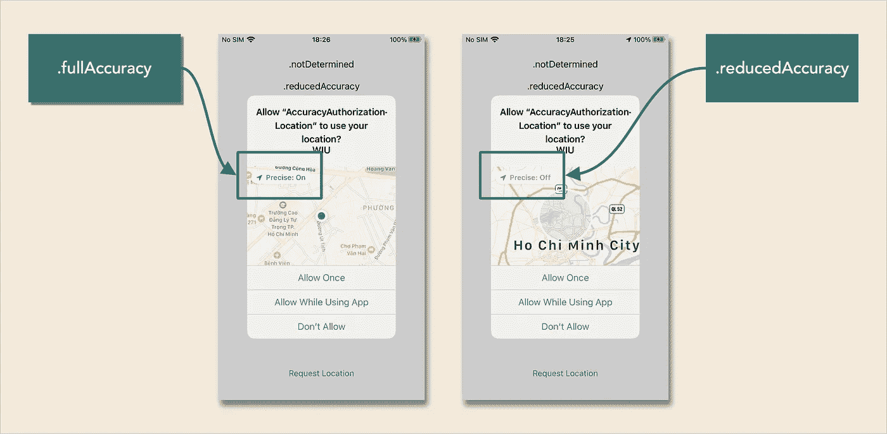
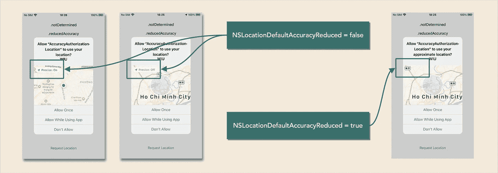
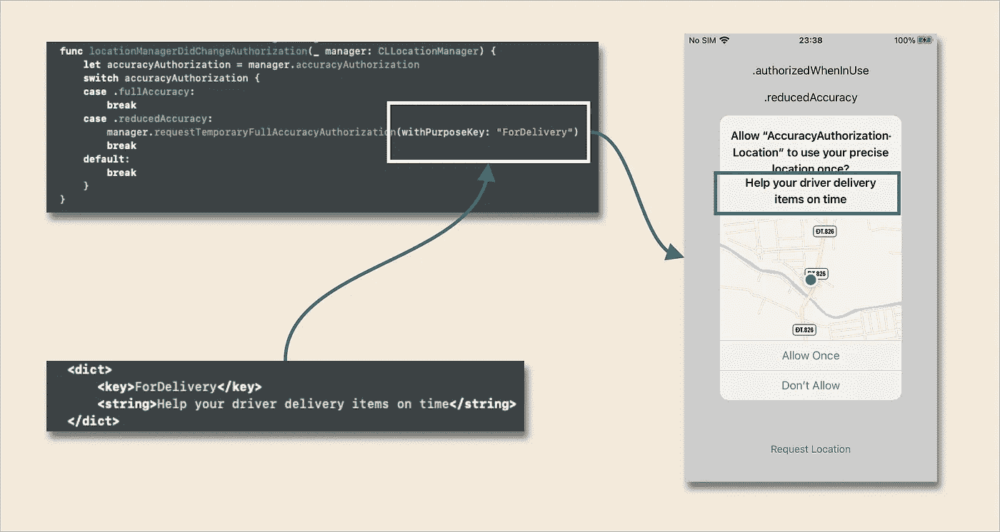

# iOS 14 的 CoreLocation 有什么新功能

> 原文：<https://levelup.gitconnected.com/whats-new-with-corelocation-in-ios-14-bd28421c95c4>

iOS 14 中新的准确度授权

在 **WWDC 20** 中，苹果为 iOS 用户推出新的位置隐私授权是 **CLAccuracyAuthorization** ，其中包括: **fullAccuracy** 和 **reducedAccuracy** 。它们是什么？

> **fullAccuracy:** 接收准确的位置信息。
> 
> **降低精确度:**位置估计的水平精确度约为**5 公里**。应用程序应该准备好接收 20 分钟前的位置。

在 iOS 14 里看起来怎么样？

从哪里获得这种状态的代码？

如果您为您的 **locationManager** 设置了一个代理，您可以在此功能中获取状态(从 iOS 14)

> func**locationmanagerdichangeauthorization**(**_**管理者:CLLocationManager)

上面的函数是这个函数的替代品(适用于所有 14 以下的 iOS)

> func**location manager**(**_**manager:CLLocationManager，didChangeAuthorization status)

下面是处理用户选择哪种准确性授权的示例代码

有一个键**NSLocationDefaultAccuracyReduced**(Bool)**可以让你在请求位置授权时设置默认精度降低与否。在 **Info.plist** 中设置该键**

**如果将**NSLocationDefaultAccuracyReduced**设置为 true 或 false 会怎么样？**

****假**:可以切换选择。**全精度**或**。降低精确度****

****真**:默认为。**降低精确度****

****

**当用户选择**精确**是**关闭**但你想问他们准确的位置时，苹果还在 iOS 14 中支持我们 2 个新功能:**

**这里的**目的键**是什么？**

****目的键**是一个键，让应用程序知道您在 **Info.plist** 中设置的每种情况的解释**

**例如，如果你在 **Info.plist** 文件中设置了这些键和值**

**当你用**目的键**请求临时完全准确授权时:“交货”**

**你会看到这样的弹出窗口**

****

**这两个函数仅在 accuracyAuthorization 为。**降低精确度****

**以上都是 iOS 14 对 **CoreLocation 的一些改动。****

**完整的代码供您尝试**

** [## ryanisnhp/准确性 _ 授权

### iOS 14 新增精度授权。创建一个帐户，为 ryanisnhp/accuracy _ authorization 开发做贡献…

github.com](https://github.com/ryanisnhp/accuracy_authorization)**