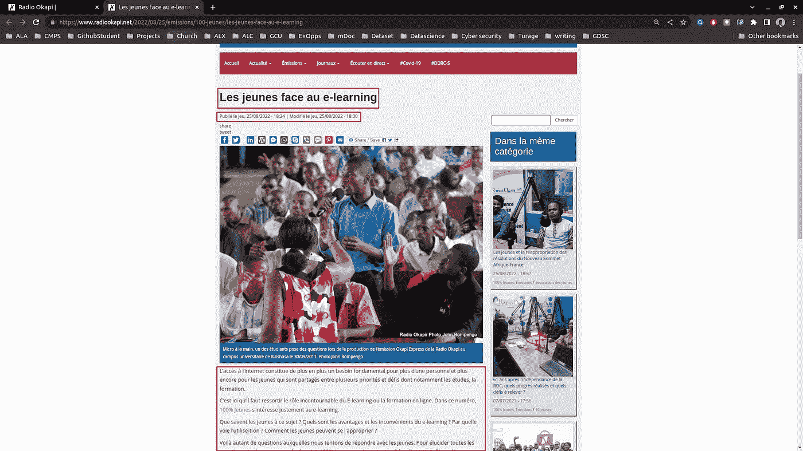

# 新闻上有什么？—网上搜集和分析来自霍加皮电台的出版物

> 原文：<https://levelup.gitconnected.com/whats-on-the-news-732a275e3a3e>


brotiN biswaS 拍摄的照片

新闻上有什么？如果你经常离开房间或查看早间新闻，你可以很容易地回答这个问题。一个更有趣的问题是，不要用“是”来指最近的新闻，而是用一个更宽泛的时间框架来表述这个问题。新闻里有什么？或者，更准确地说，过去 10 年或 20 年的新闻是什么？

媒体对我们如何看待世界有着重大影响。不仅仅是最新的新闻，对“新闻上的是什么**”的回答也是我们成长过程中接触到的媒体。在某种程度上，你最喜欢的足球队或你的政治立场可能根植于你从年轻时就开始主动或被动参与的更广泛的连续叙事。一条条新闻叠加在一起，构成了一本完整的故事书，而故事的创作过程逐渐消失在过去，赋予了故事更多的生命，仿佛它们永远属于现在。**

现在，我们能回答一个比“新闻上的是什么**”更宽泛的问题吗。我们可以用“新闻上的**是什么**的形式来回答这个问题吗？”**

我们将探讨这个话题，重点关注刚果民主共和国当地媒体——联合国驻刚果(金)稳定特派团 Okapi 电台撰写的文章。联合国驻刚果(金)稳定特派团是一支联合国维和部队，自 1999 年以来一直试图在刚果民主共和国东部维持和平。虽然他们的存在值得质疑，但由于我们似乎没有在刚果民主共和国东部保持太多的和平，冲突持续了 20 多年，本文将重点分析他们新闻网站的内容。我们将从获取数据集的过程转向一些高层次的见解。在下一篇文章中，我们将使用 NLP(自然语言处理)技术更深入地研究文章的内容。如你所料，网站是法语的；本文中的一些关键词被翻译成英文。

# **获取数据集:网页抓取**

霍加皮电台没有他们文章的公共数据集，更没有查询他们数据的 api。我们将刮网站，但首先，我们需要分析它，并计划我们将如何去做。

从他们的 news feed */actualite* (图 1)中，他们对页面进行了分页，每页显示 10 篇文章(不考虑设计)。通过传递 [GET 请求](https://www.w3schools.com/tags/ref_httpmethods.asp)上的页码来获取每个页面，比如: */actualite？page= < PAGE_NUMBER >* ，其中 *PAGE_NUMBER* 截止到 2022 年 8 月，范围为 0 到 9059。


图 1-来自 https://www.radiookapi.net/actualite?page=0[Okapi 电台](https://www.radiookapi.net/actualite?page=0)的截图

由此，我们知道我们看到的是 9060 页，每一页有 10 篇文章。那可是 **90 600** 篇文章。我们知道如何形成每个页面的 URL，从它们那里，我们可以得到每篇文章的 URL 和标题。

我们将使用 [*grequests*](https://pypi.org/project/grequests/) ，这是一个用于生成异步 [HTTP 请求](https://rapidapi.com/blog/api-glossary/http-request-methods/)的 python 包。虽然异步运行多个请求可以极大地节省时间，但是我们会受到运行任务的计算机内存以及目标网站响应多个请求的能力的限制。我们应该考虑到我们抓取的网站是为其他用户服务的，我们不应该为我们的网页抓取工作占用太多的带宽。在我们的例子中，我们将一次生成 1 000 个，处理结果，并重复这两个步骤，直到覆盖 90 600 页。那将做十次重复或十批。事实上，如果我们没有网络限制，我们可以并行运行这十个批处理，就像我们在这里对[密码暴力工作负载](https://blog.devgenius.io/brute-force-attack-can-you-guess-the-password-c7945d6973ae)所做的那样。

尽管如此，在网络限制上，我们将把[补偿因子](https://urllib3.readthedocs.io/en/latest/reference/urllib3.util.html#module-urllib3.util.retry)设置为 1。在与网络相关的响应失败后，backoff 参数会延迟后续请求。退避因子为 1 时，在第一次响应失败后，将有 1 秒的等待时间，然后是 2、4、8、16、32……遵循来自 [urllib3](https://urllib3.readthedocs.io/) 的退避策略:

```
{backoff factor} * (2 ** ({number of total retries} - 1))
```

值得注意的是，一些网站会阻止 IP 地址发送过多的 HTTP 请求。在您自己的计算机上运行工作负载之前，您可能希望在评估目标网站时包括该详细信息。

查看日志(图 2)，对于每 1000 个页面，HTTP 请求(从网站获取数据)花费大约 6 分钟，解析并在 GCP 上保存数据花费大约 1 分 30 秒。这些数字不能作为基准，因为运行环境不是孤立的。

图 2 —创建时带有[花饰。工作室](https://flourish.studio)

总的来说，整个过程用了 1 小时 16 分钟，HTTP 请求用了 1 小时，解析和保存数据集用了 16 分钟。

现在，我们有 10 个数据集，包含内容、链接和为 90k 页解析的文章数量，还有 10 个数据集，包含每篇文章的链接和标题。第一个数据集包含了每个页面的全部内容，所以如果有一部分网站内容需要进一步分析，我们可以返回到这个数据集。现在，我们将关注文件集，即 *articles_{batch}。拼花地板*。

尽管我们预计**会有 90 600 篇文章**，但在探索数据集时，我发现**有 71 篇**文章有相同的标题和链接，还有 **2 871 篇**文章有相同的标题和发表日期。最后，我们有从 2004 年到 2022 年 8 月发表的 **87 213** 篇独特的文章。

从这里，我们已经可以回答这样的问题，他们每年有多少出版物？或者，从我们最初的谈话中，他们为我们宏大的故事书贡献了多少故事——假设我们一直在阅读他们的故事？

图 3 —使用[花饰创建。工作室](https://flourish.studio)

从这里，我们可以质疑为什么我们在 2008-2009 年和 2015-2018 年有下降趋势，或者仔细看看月度出版物。

图 4 —用[花饰创建。工作室](https://flourish.studio)

从图 4 中，我们可以看到随着时间的推移，发布数量有了更多的变化。抛开网站上线后的头几个月，我们可以猜测重大事件可能发生在特定的选择上。例如，2006 年 7 月发表的文章只有 5 篇，恰好是选举时期。

尽管如此，在不分析文章内容的情况下，我们可以从 URL(图 5)中查看排名靠前的出版物类别。我们有我们的前 5 个类别:新闻、未分类、社会、政治和安全，不包括其他类别，这是几个出版物类别的集合。

图 5 —创建时带有[花饰。工作室](https://flourish.studio)

现在，我们可以使用数据集上的链接来获取网站内容。同样，在这里，我们需要检查网站结构，看看在哪里可以获得具体的信息，如文章内容、标题和发表日期。图 6 用红色突出显示了我们要瞄准的数据点。



图 6 —来自【Okapi 电台的截图

在分析网站的 HTML 代码后，我们看到标题始终是 H1，出版和修改日期部分是第一个 DIV，包含类'*窗格-内容'*，最后，内容是第一个 DIV，包含类'*字段*。除了目标数据点之外，我们还将保存每个页面的完整 HTML 代码，以便将来进行潜在的分析，或者作为安全备份，以防某些页面不符合我们确定的模式。

这个花了大约 6 个小时在云上运行。它无法从并行化中受益，因为网站网络的限制，它只能在多个节点上运行。这 6 个小时并没有太大的伤害，因为我晚上运行它，早上检查状态。

有了这些内容(我们接下来将在 NLP 分析中使用),我们已经可以查看一些高级统计数据了。从图 7 中，我们可以看到他们的文章长度随着时间的推移发生了相当大的变化。我们的平均长度是 275 个单词，从第 25 百分位的 164 个单词到第 75 百分位的 329 个单词。

图 7——用[创造的繁荣。工作室](https://flourish.studio)

接近尾声时，我们回顾了如何废弃我们的目标网站来获取数据，并运行了一些探索性分析来深入了解我们的数据集。在这些见解的指导下，我们将进入下面的文章，以分析文章内容，探索诸如所涵盖的主要主题、语气、表达的情感等见解，并可能以文章内容和类别为特征训练一个人工智能模型。在那之前，你对媒体有什么经验？你认为这会如何影响你对世界的看法？请在评论中告诉我们！

# 分级编码

感谢您成为我们社区的一员！在你离开之前:

*   👏为故事鼓掌，跟着作者走👉
*   📰查看[升级编码出版物](https://levelup.gitconnected.com/?utm_source=pub&utm_medium=post)中的更多内容
*   🔔关注我们:[Twitter](https://twitter.com/gitconnected)|[LinkedIn](https://www.linkedin.com/company/gitconnected)|[时事通讯](https://newsletter.levelup.dev)

🚀👉 [**加入升级人才集体，找到一份神奇的工作**](https://jobs.levelup.dev/talent/welcome?referral=true)