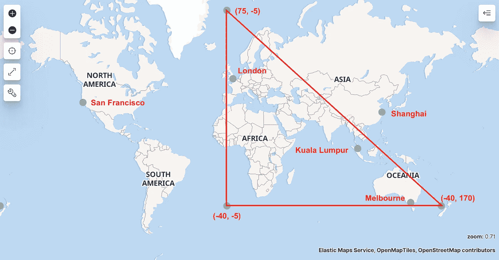
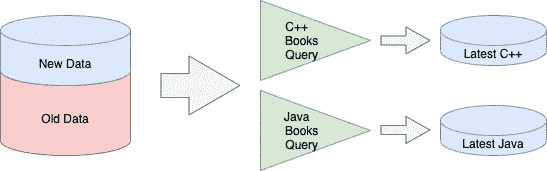
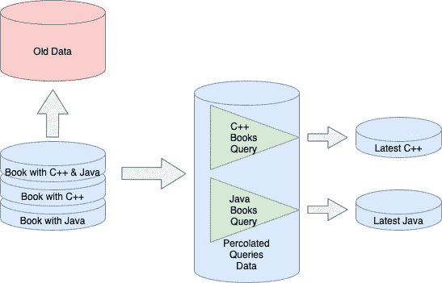

# Elasticsearch 有什么特别之处

> 原文：<https://levelup.gitconnected.com/whats-so-special-about-elasticsearch-d97f652fcedc>

## 学习软件开发

## 非关系数据库和灵活搜索的结合


[rishikesh yogpeeth](https://unsplash.com/@rishikeshyogpeeth?utm_source=medium&utm_medium=referral) 在 [Unsplash](https://unsplash.com?utm_source=medium&utm_medium=referral) 上拍摄的照片

如果你听说过 Elasticsearch，但不知道它有什么特别之处，这是给你的。下面提供了 Elasticsearch 可以做什么的例子和一个实际的代码显示它是如何做的。

要设置和学习基本的弹性搜索，你可以参考下面的博客。

[](/learning-elasticsearch-basic-easily-441f37b8bd8d) [## 轻松学习弹性搜索基础

### 轻松快速体验 Elasticsearch

levelup.gitconnected.com](/learning-elasticsearch-basic-easily-441f37b8bd8d) 

让我们开始吧…

# 模糊搜索

当我们搜索数据库时，我们使用通配符搜索整个单词或单词的一部分。但是错别字呢？

这就是弹性搜索的模糊性可以发挥作用的地方。

我们有一份数据清单如下

```
POST books/_bulk
{"index":{}}
{ "title": "Kotlin", "description": "Kotlin came from Java" }
{"index":{}}
{ "title": "JVM", "description": "Java, Kotlin and Scale" }
{"index":{}}
{ "title": "Web", "description": "JavaScript, Python, PHP, HTML" }
```

我们搜索`Java`的时候，不小心打了`Jawa`。

模糊度设置为 1，如下所示

```
GET books/_search
{
  "query": {
    "match": {
      "description": {
        "query": "Jawa",
        "fuzziness": 1
      }
    }
  }
}
```

我们仍然得到如下结果

```
"Kotlin came from Java"
"Java, Kotlin and Scale"
```

# 搜索并排列结果的顺序

在一个典型的数据库中，我们可以搜索，但无法控制搜索结果的排名(不排序)。

在 Elasticsearch 中，我们可以对结果进行过滤和排序。

我们有下面的数据清单。

```
POST books/_bulk
{"index":{}}
{ "title": "Kotlin", "description": "Kotlin came from Java" }
{"index":{}}
{ "title": "JVM", "description": "Java, Kotlin and Scale" }
{"index":{}}
{ "title": "Web", "description": "JavaScript, Python, PHP, HTML" }
{"index":{}}
{ "title": "C++", "description": "C++ is better than Java" }
{"index":{}}
{ "title": "Java", "description": "Java is easier than C++" }
{"index":{}}
{ "title": "OOP", "description": "C++ is object oriented" }
```

当我们想要查找所有带有`Java`的内容时，优先显示带有`C++`的内容。查询如下所示。

```
GET books/_search
{
  "query": {
    "bool": {
      "filter": {
        "match": {
          "description": "Java"
        }
      },
      "should": {
        "match": {
          "description": "C++"
        }
      }
    }
  }
}
```

结果将会显示

```
"C++ is better than Java"
"Java is easier than C++"
"Kotlin came from Java"
"Java, Kotlin and Scale"
```

人们可以使用`weight`和`boost`来进一步提高搜索排名

[](https://www.elastic.co/guide/en/app-search/current/relevance-tuning-guide.html) [## 相关性调整指南、权重和提升|弹性应用搜索文档[7.11] |弹性

### 开箱即用，应用搜索提供高质量的搜索相关性。建立在 Elasticsearch 之上的应用程序搜索是一个受管理的…

www.elastic.co](https://www.elastic.co/guide/en/app-search/current/relevance-tuning-guide.html) 

# 英语分析器搜索

有时我们有基于英语单词的课文。我们希望从`housing`中识别相关的单词，例如`house`，并且我们希望省略简单的连接单词，例如`is`。

在 Elasticsearch 中，我们首先需要定义要进行英语分析的字段，如下所示

```
PUT books
{
  "mappings": {
    "properties": {
      "description": {
        "type": "text",
        "analyzer": "english"
      }
    }
  }
}
```

然后我们就有了数据。

```
POST books/_bulk
{"index":{}}
{ "title": "Sell", "description": "Housing price estimation" }
{"index":{}}
{ "title": "Develop", "description": "How to build houses" }
{"index":{}}
{ "title": "Climax", "description": "Horse is better than car" }
```

当我们搜索像`is`、`to`等基本连接词时，什么都不会出来。但是，如果我们搜索`house`，它会识别`houses`和`housing`，但会忽略`horse`

```
GET books/_search
{
  "query": {
    "match": {
      "description": {
        "query": "house"
      }
    }
  }
}
```

结果如下

```
"Housing price estimation"
"How to build houses"
```

# 邻近排序搜索

想象一下，如果你只想找到大约 200 页长的书。那些最接近 200 页的将是首选，不管他们是多还是少。

你可以在 Elasticsearch 中使用函数 score，而不是制作复杂的绝对不同的数学函数

想象一下，如果我们有 3 本书


```
POST books/_bulk
{"index":{}}
{ "title": "Sell", "pages": 140 }
{"index":{}}
{ "title": "Develop", "pages": 200 }
{"index":{}}
{ "title": "Climax", "pages": 250 }
```

当执行搜索时，对接近 200 页的页面进行高斯计算

```
GET books/_search
{
  "query": {
    "function_score": {
      "query": {
        "match_all": {}
      },
      "functions": [
        {
         ** "gauss": {
            "pages": {
              "origin": 200,
              "scale": 50,
              "decay": 0.5
            }
          }**
        }
      ]
    }
  }
}
```

结果如下

```
"Develop", "pages": 200
"Climax", "pages": 250
"Sell", "pages": 140
```

# 位置边界搜索

如果您有位置数据，并且您喜欢搜索所有数据

*   在某个地点的半径范围内
*   在矩形边界框内
*   在多边形边界框内

使用 Elasticsearch 可以轻松实现这些目标

需要将数据设置为`geo_point`

```
PUT cities
{
  "mappings": {
    "properties": {
      "geocode": {
        "type": "geo_point"
      }
    }
  }
}
```

我有如下几个城市的数据

```
POST cities/_bulk
{"index":{}}
{ "city": "San Francisco", "geocode": {"lat": 37.773972, "lon": -122.431297 } }
{"index":{}}
{ "city": "Melbourne", "geocode": {"lat": -37.840935, "lon": 144.946457 } }
{"index":{}}
{ "city": "Kuala Lumpur", "geocode": {"lat": 3.140853, "lon": 101.693207 } }
{"index":{}}
{ "city": "Shanghai", "geocode": {"lat": 31.224361, "lon": 121.469170 } }
{"index":{}}
{ "city": "London", "geocode": {"lat": 51.509865, "lon": -0.118092 } }
```

然后我喜欢在下图所示的三角形内搜索

```
GET cities/_search
{
  "query": {
    "geo_polygon": {
      "geocode": {
        "points": [
          {
            "lat": 75,
            "lon": -5
          },
          {
            "lat": -40,
            "lon": -5
          },
          {
            "lat": -40,
            "lon": 170
          }
        ]
      }
    }
  }
}
```



这个地图是使用 Kibana 生成的。关于如何让你的数据显示在地图上的信息，你可以看看这个视频[https://www.youtube.com/watch?v=1arB6i61qWs](https://www.youtube.com/watch?v=1arB6i61qWs)

从图中，从弹性搜索，你会得到 3 个城市，即墨尔本，吉隆坡和伦敦。

> 如果你喜欢多多边形搜索，你可以使用`[geo_shape](https://www.elastic.co/guide/en/elasticsearch/reference/current/query-dsl-geo-shape-query.html)`。

# 查询数据库

想象一下，如果我们想根据自上次查询以来的查询集提取所有最新的数据。



这种查询不会随着时间的推移而扩展。随着数据总量的增长，速度会越来越慢。

在 Elasticsearch 中，我们有不同的处理方式。我们也可以将我们的查询存储为文档(数据)。我们可以通过将字段定义为`percolator`来做到这一点。对于要存储的查询，我们需要确保要使用的字段也被定义，在我们下面的例子中，这将是`definition`

```
PUT interested-book-queries
{
  "mappings": {
    "properties": {
      "query-name": {"type": "keyword"},
      "query-field": {"type": "percolator"}, "description": {"type": "text", "analyzer": "english"}
    }
  }
}
```

这样，我们就可以存储我们的查询。在我们的例子中，我们存储一个搜索描述为`Java`的书籍的数据库，另一个搜索描述为`C++`的书籍的数据库

```
PUT interested-book-queries/_doc/1
{
  "query-name": "Java",
  "query-field": {
    "match": {
      "description": "Java"
    }
  }
}PUT interested-book-queries/_doc/2
{
  "query-name": "C++",
  "query-field": {
    "match": {
      "description": "C++"
    }
  }
}
```

当新书数据可用时，在插入数据时，可以在查询文档中运行它，并生成结果。



查询显示如下

```
GET interested-book-queries/_search
{
  "query": {
    "percolate": {
      "field": "query-field",
      "document": {
        "title": "Programming",
        "description": "C++ is Object Oriented"
      }
    }
  }
}
```

上述内容与 C++ book 查询相匹配，因此可以存储在最新的 C++ Book 数据库中

```
GET interested-book-queries/_search
{
  "query": {
    "percolate": {
      "field": "query-field",
      "document": {
        "title": "Android",
        "description": "Android with Java language"
      }
    }
  }
}
```

上述内容与 Java book 查询相匹配，因此可以存储在最新的 Java Book 数据库中

```
GET interested-book-queries/_search
{
  "query": {
    "percolate": {
      "field": "query-field",
      "document": {
        "title": "Compare",
        "description": "C++ and Java comparison"
      }
    }
  }
}
```

以上匹配 C++和 Java book 查询，因此可以存储在最新的 C++和 Java Book 数据库中。

这样的处理更具可扩展性，而不用担心旧的完整的图书数据不断增长。

这些是一些有趣的高级弹性搜索功能。要了解更多细节，请浏览 Elasticsearch 官方文档。

[](https://www.elastic.co/guide/index.html) [## 弹性堆栈和产品文档

### 弹性公共模式(ECS)参考[1.8] -其他版本

www.elastic.co](https://www.elastic.co/guide/index.html)