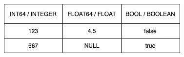
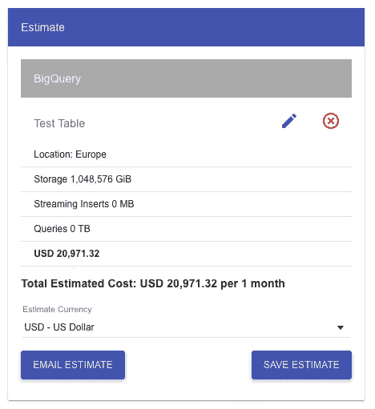

# 谷歌大查询是怎么回事，它的成本是多少？

> 原文：<https://levelup.gitconnected.com/whats-the-deal-with-google-bigquery-and-what-does-it-cost-9077c3f2fed0>

本文的目的是让您对 BigQuery 有一个大致的了解，并对它的定价因素有一些见解。尽管你可能想立即开始——相信我，我真的理解你——但我们总是建议你先了解你想使用的服务的价格，以确认它是否符合你的需求。我的意思是，我们没有人希望突然醒来看到他的云提供商的 10 万美元账单，因为我们不了解定价模型，对吗？不幸的是，这种事情发生在人身上的真实案例太多了。

[rupixen.com](https://unsplash.com/@rupixen)在 [Unsplash](https://www.unsplash.com/) 上拍照

# 简单地说，BigQuery

Google BigQuery 是一个无服务器、高度可扩展、经济高效、完全托管的企业数据仓库，用于使用 ANSI SQL 轻松快速地分析数 Pb 的数据和数十亿行。

这对你来说意味着什么？

*   没有服务器维护或配置
*   自动缩放至无穷大
*   唯一的职责是创建/维护表和数据
*   如果您熟悉非常流行的 ANSI SQL，那么您已经准备好开始了

→很容易上手。

**用超级简单的话来说**

通过 BigQuery，Google 提供了一个受管理的关系数据库，它采用了随用随付的模式，只对服务的实际使用情况收费。

此外，BigQuery 的一个额外优势是它可以毫不费力地与其他 GCP 产品集成。此外，您可以在 Google 的 Data Studio 中轻松可视化来自 BigQuery 的数据。

您可以用几种方式完成与 BigQuery 的整个交互。

*   使用 GCP 控制台
*   使用 CLI 命令
*   您选择的编程语言的客户端库

# 成本

直接从成本开始可能有点不寻常。但是，尤其是在云环境中，成本是一个重要因素，并且在许多情况下已经有所帮助，如果某些云技术对于预期的用例甚至是可行的，或者用例将使成本爆炸。

使用 BigQuery，您必须考虑三个不同的成本驱动因素。

*   存储成本(当前与长期)
*   插入成本(批处理与流处理)
*   查询成本(现收现付与统一定价)

**仓储费用**

对于云服务来说，Google 会根据你在 BigQuery 中使用的实际存储量向你收费。尤其是因为每月有 10 GB 的免费存储空间，当你想慢慢开始使用 BigQuery 时，你不必担心任何高额账单。在美国或欧盟多地区的情况下，谷歌将对任何额外的活动存储收取每月每 GB 0.020 美元的费用。

现在超级“聪明”的人可能会说:

“好吧，然后我会把我的 Pb 级数据加载到 BigQuery，做我所有的分析工作，然后我删除它，然后我几乎不用支付任何费用。既然月底我那里什么数据都没有！”

好主意，行不通。当然，谷歌超级智能，和其他所有无服务器产品类似；他们每秒都会在 BigQuery 中检查您的存储使用情况，每秒都会检查您的详细账单。

另一方面，与活动存储相比，长期存储的成本仅为活动存储的 50%，即截至目前，每月每 GB 0.010 美元。人们总是建议对数据进行结构化处理，以便长期存储，从而降低成本。

但是什么是长期储存，如何才能得到它呢？

**长期储存**

在 BigQuery 的长期存储是没有人可以在 GCP 预订的。这是谷歌根据一个简单的因素自动归类的东西。

当一个表或表分区——我们将在后面的文章中处理表分区——连续 90 天没有被修改时，Google 会自动将其归类为长期存储。

定义为“修改”的操作非常简单。每次向表中写入/插入数据都是一次修改，并重置 90 天计时器。像从表中查询、复制或导出数据以及更新表资源这样的操作——而不是表中的数据！—被视为“非修改”，因此不会重置计时器。

此外，这里要提到的一个重要方面是，长期存储并不意味着任何性能下降、耐用性、可用性或其他功能。谷歌只收取你更少的费用。

我们将在后面的文章中详细讨论一种构造数据以使用长期存储功能的方法。

**插入数据的方式及其费用**

在 BigQuery 中，有两种可能的方法将数据加载到表中。

*   批量装载
*   流动

使用批处理装载，您可以使用一个大的批处理操作将所有数据装载到 BigQuery 表中。这里的典型用例是导入 CSV 文件、外部数据库或一组固定的日志文件。

另一方面，流式方法允许您在 BigQuery 表中动态地插入一条或几条记录。这里的一个典型用例是，您的服务器直接将日志或用户交互(例如跟踪)直接写入您的 BigQuery，中间没有任何步骤。

使用按需定价批量加载的共享槽池是免费的。但流媒体插件不是免费的，每 200 MB 收费 0.010 美元(美国或欧盟多地区)。Google 认为你写的每一行的最小大小是 1 KB。

**查询费用**

BigQuery 的第三个成本来源是当您查询数据时。通过按需定价，谷歌对您的查询处理收取每 TB 5.00 美元的费用，即每字节 0.000000000005 美元，尽管每月有 1 TB 的免费层。

Google 通过选择的列及其列数据类型乘以找到的值来计算收费数据查询成本的总大小。

示例:

假设下表是您要对其运行查询的 BigQuery 表，而第一行概述了各个列的数据类型。这个例子没有显示列名。

从上表可以看出，一个 *INT64* 和 *FLOAT64* 数据类型计为 8 个字节， *BOOL* 为 2 个字节。除了这些之外，Google 将 *NULL* 值视为 0 字节，因此对于 *NULL* 值没有额外的成本。要查看类型及其计费大小的完整列表，您可以访问官方的 [BigQuery 定价文档](https://cloud.google.com/bigquery/pricing#data)。

综上所述，如果您查询上表中的所有列，将会花费您:

*   第 1 行:2x 8 字节，1x 2 字节
*   第 2 行:1x 8 字节，1x 0 字节，1x 2 字节
*   总计:28 字节(→ $0.00000000014)

当然，总共 28 个字节是非常低的，您可以运行无尽的查询，直到达到第一个空闲的 1 TB，但是通常情况下，一个表会比两行三列大。除此之外，值得一提的是，不管表有多大，Google 都定义每个查询至少 10 MB。

即使表只有 5mb——在上面的例子中是 28 字节——使用 10 MB 作为每个查询的最小开销，每个查询的最小开销是 0.00005 美元，这仍然很低。

一些人可能想到的另一个技巧是在 SQL 查询中使用 *LIMIT* ，这样 BigQuery 将返回更少的数据。尽管这不会影响计费，因为 BigQuery 对查询中读取的字节进行计费，而不是根据返回的结果。

# 做大

如果你的数据量很大，并计划在 BigQuery 中存储超过 1 PB 的数据，谷歌建议联系他们的销售代表，这样肯定有办法进一步降低数据量。

但是我说的“变大”是什么意思呢？让我们快速浏览一下 GCP 的定价计算器，看看使用 BigQuery 处理 1 PB 数据(活动存储)的成本是多少:

如您所见，仅没有任何插入或查询的存储每月成本就超过 2 万美元！此外，我认为这个价格足够和谷歌谈判了，特别是在这种情况下，BigQuery 很可能不是你在 GCP 上唯一的高成本。

# 下一步是什么？

在接下来的文章中，我们将看到如何开始使用 Google 的 BigQuery，它基于一个空的 GCP 项目，我们以编程方式创建新表，用我们的数据填充它们，并对它们运行查询。

# 常见问题解答

**问:Google BigQuery 是用来做什么的？**

答:大多数人使用 BigQuery 是为了大数据和数据科学主题。在这里，BigQuery 是一种快速且经济高效的方式来存储和分析数 Pb 的数据。

**问:Google BigQuery 是免费的吗？**

答:部分是。BigQuery 有一个免费层，包含 1 TB 的按需查询，10 GB 的存储，可以从 BigQuery 免费批量导出到 Google 云存储。因此，谷歌会对超出这些限制的所有内容收取费用。

**问:BigQuery 是一个什么样的数据库？**

答:BigQuery 是一个无服务器的企业数据仓库系统，基于 Google 内部基于列的数据处理技术，名为 *Dremel* 。与其他基于列的数据库系统一样，您可以使用 SQL 在其上运行查询。

## 你想联系吗？

如果你想联系我，请通过 [LinkedIn](https://www.linkedin.com/in/pascal-zwikirsch-3a95a1177/) 联系我。

另外，请随意查看我的书籍推荐📚。

 [## 我的书籍推荐

### 在接下来的章节中，你可以找到我对所有日常生活话题的书籍推荐，它们对我帮助很大。

mr-pascal.medium.com](https://mr-pascal.medium.com/my-book-recommendations-4b9f73bf961b)  [## 通过我的推荐链接加入 Medium—Pascal Zwikirsch

### 作为一个媒体会员，你的会员费的一部分会给你阅读的作家，你可以完全接触到每一个故事…

mr-pascal.medium.com](https://mr-pascal.medium.com/membership)