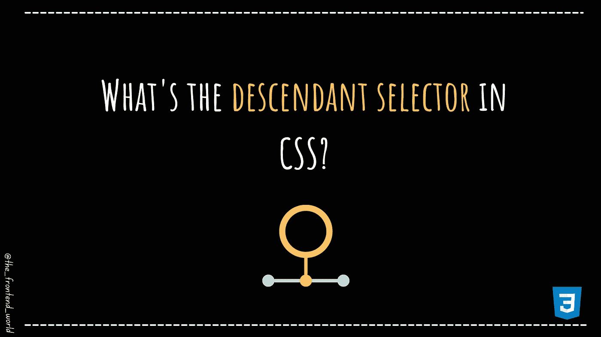

# CSS 中的后代选择器是什么

> 原文：<https://levelup.gitconnected.com/whats-the-descendant-selector-in-css-580e5b3fc959>

## 直观地了解 CSS 组合子！

作者:FAM

# 首先，什么是 CSS 组合子？

> "组合子解释了选择器之间的关系."— w3schools

CSS 中的选择器用于选择 HTML 元素，以便我们可以对它们进行样式化。选择器的示例可在此处找到:

 [## CSS 选择器参考

### 组织良好，易于理解的网站建设教程，有很多如何使用 HTML，CSS，JavaScript 的例子…

www.w3schools.com](https://www.w3schools.com/cssref/css_selectors.asp) 

一个 CSS 选择器可以包含多个简单的选择器。在简单的选择器之间，我们可以添加一个关系，这叫做组合子。

**CSS 中有许多不同的组合子。在本文中，我们将介绍:**

*   *后代选择器(* ***空格*** *)*

这里有一个大图，可以帮助你记住它们:

CSS 组合子

让我们进一步了解空间选择器。

# 后代选择器(空格)

后代选择器匹配作为指定元素后代的所有元素。比如:

以下 CSS 示例选择了`***
***`元素中的所有`***
***`元素:

**要不要自己测试一下？**

 [## 后代 CSS 组合子

### 添加外部样式表/笔此处添加的任何 URL 都将按顺序添加到编辑器中的 CSS 之前。如果…

codepen.io](https://codepen.io/famzil/pen/GRmeJEj) 

我希望这篇文章对你有帮助！

 [## 如果你喜欢看我的文章… ♥️

### 如果你喜欢读我的文章… ♥️，当我的文章发表时，欢迎你第一个得到通知…

famzil.medium.com](https://famzil.medium.com/subscribe) 

> 谢谢你，❤

如果你有兴趣成为付费会员，你可以使用我的推荐链接。下次见

亲爱的读者，感谢你在我生命中的存在。

**让我们在** [**上取得联系**](https://medium.com/@famzil/)**[**Linkedin**](https://www.linkedin.com/in/fatima-amzil-9031ba95/)**[**脸书**](https://www.facebook.com/The-Front-End-World)**[**insta gram**](https://www.instagram.com/the_frontend_world/)**[**YouTube**](https://www.youtube.com/channel/UCaxr-f9r6P1u7Y7SKFHi12g)**或**********

******参见我的关于网络要素和一般文化的电子书。******