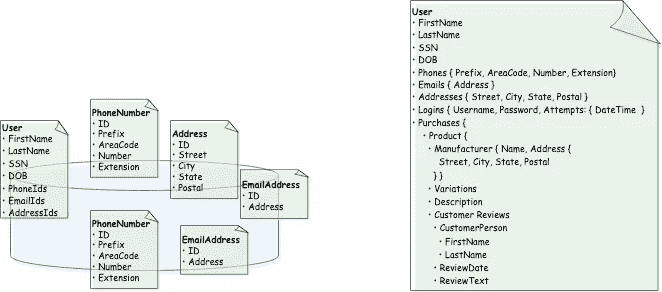

# 聚合上下文和有界上下文有什么区别

> 原文：<https://levelup.gitconnected.com/whats-the-difference-between-an-aggregate-and-a-bounded-context-85665c28411a>

## 它们真的不是一回事吗？

[国家癌症研究所](https://unsplash.com/@nci?utm_source=medium&utm_medium=referral)在 [Unsplash](https://unsplash.com?utm_source=medium&utm_medium=referral) 上拍摄的照片

领域驱动设计——或*DDD——*是由 Eric Evans 推广的一种软件设计方法。DDD 专注于*领域*；也就是说，组织内的主题领域，以及这些主题领域的专家。

对于我们这些从事微服务的人来说，DDD 有两个特别有用的模式:

*   [骨料](https://bpb.opendns.com/b/https/betterprogramming.pub/why-your-microservices-architecture-needs-aggregates-342b16dd9b6d)
*   [有界上下文](https://medium.datadriveninvestor.com/if-youre-building-microservices-you-need-to-understand-what-a-bounded-context-is-30cbe51d5085)

这些模式非常复杂，每个模式都有自己的文章。即使有了坚实的理解，也很容易混淆这两者。我自己曾经不经意地将这两者互换使用。

这是可以理解的。模式*和*有一些相似之处。它们都描述了事物的集合。两者都有一个常用的类比:一个*细胞*。事实上，细胞是一个不幸的有用的类比，它描述了聚合和有界环境的一些关键属性，即:

*   多个潜在复杂组件的封装
*   一个清晰的界限，把里面包含的东西和其他东西分开
*   决定什么可以进入，什么可以离开的表层

但实际上，这是两个根本不同的概念。当开发分布式系统时，理解两者之间的区别是很重要的。现在让我们来探讨一些最显著的差异。

# 聚合定义了业务实体模型。有界上下文定义了整个域。

聚合和有界上下文都表示事物的集合。但是那些“东西”根本不同。

聚合是离散数据的集合。这些数据共同构成了*商业实体模型*。这些实体实际上是原子的(它们不应该被孤立地操作)。这有许多原因，其中最重要的是加强[业务不变量](https://www.i2p.es/arch/ddd/business-invariants/)。因此，以下是聚合的常见示例:

*   ***用户*** —由以下数据组成:名/姓、地址、电话号码、电子邮件地址等。
*   ***产品*** —由名称、描述、尺寸、制造商 id 等数据组成。
*   ***支付方式***——由姓名、账户类型、账号等数据组成
*   ***购买***——由用户 id、产品、送货地址、数量、支付方式 id 等数据组成。

但是什么是实际意义上的集合呢？一种观点认为，聚合由相关数据库表的集合来表示。使用上面的一些例子，我们可以通过组合我们的`USER`、`ADDRESS`、`PHONE_NUMBER`和`EMAIL`表来形成一个*用户*集合。前一个表—— `USER` ——将代表我们的[聚合根](https://stackoverflow.com/questions/1958621/whats-an-aggregate-root)；其他表将通过外键来包含。

让我们对比一下我们的*购买*总量。注意，在我们前面的例子中，我们指出一个购买可能包含一个用户 ***id*** (强调“ ***id*** ”部分)。虽然我们仍然使用外键来关联，比如说，一个`USER`记录与一个`PURCHASE`记录，但是我们不认为*用户*业务实体是*购买*业务实体的一部分。相反，购买只是向用户提供一个*参考*。(但是，请注意，我们明智地包含了一个独特的*地址*记录，作为*购买*集合的一部分，以表示特定购买商品被运送到的确切地址。)

当然，聚合与任何底层技术都是完全正交的。因此，虽然我们使用了关系数据库表来说明，但我们可以使用各种工具对聚合进行建模。事实上，使用文档模型——而不是关系模型——可能更能说明问题。假设我们使用一个像 MongoDB 这样的文档数据库来存储我们所有的实体。显然，我们必须为每种文档类型定义清晰的界限。否则，我们将面临以下风险:

*   一堆微小的、相互关联的文档类型(例如 *UserDocument* 、 *PhoneNumberDocument* 、 *EmailAddressDocument* …),我们必须不断地、独立地获取它们，并将其缝合在一起，或者
*   巨大的、无限的文档最终变得无法控制(例如，一个 *UserDocument* ，它包含了与用户有一点点关系的所有东西:他们的联系信息、登录凭证和权限、购买历史等)

两种无可争议的建模用户文档的糟糕方法。两者都没有考虑什么属于总体，什么不属于总体。

这种观点使得我们为什么想要仔细设计我们的业务实体变得更加明显，规定什么属于给定的业务实体，什么不属于。

另一方面，我们使用有界上下文来建模业务*域*。虽然我们的组织可能是为了一个战略目的而存在的(比如说，在网上卖书),但是毫无疑问有许多功能是支持这个战略目的所需要的；例如

*   用户注册和认证
*   产品库存管理
*   网上购物和货币交易

这些功能就是我们所说的*域*。为了履行这些职能，我们组建了在各自领域有专长的团队。这些团队依次构建工件——需求和规范、服务和应用程序等——来定义和构建他们的领域。

正是这些团队，以及他们的工件，定义了我们的有界环境。

# 聚合位于有界的上下文中

聚合几乎总是比有界环境小，当然也不会比有界环境大。换句话说，有界上下文包含一个或多个集合。

正如我们上面所讨论的，有界上下文描述了一个团队——人和他们的工件——专注于组织内的特定领域。在低水平上，它们维持聚集。拥有 *Fulfillment* 有界上下文的团队可以创建、存储和维护集合，例如:

*   产品
*   仓库
*   运输公司

重要的是，团队负责多个聚合；因此，有界上下文包含多个集合。

在某些情况下，一个集合可能足够大或足够复杂，以至于它只能由一个团队来管理。然而，一个聚合应该*永远不要*跨越有界的上下文。聚集应该被认为是原子的和独立的，这是我们马上要讨论的概念。

我们可能会有一个问题:为什么称之为“有界语境”？为什么不干脆称之为“域”呢？

首先，从*这个词的语境*说起。团队有(或者应该有)他们自己的术语定义 Eric Evans 称之为 [*无处不在的语言*](https://thedomaindrivendesign.io/developing-the-ubiquitous-language/) 。这些定义在不同的团队中可能会有所不同。以“产品”为例。对于管理在线目录的团队来说，这个术语可能包括价格、制造商、照片、变化(颜色等)、描述、客户评论等。现在想象一下运输团队。他们对“产品”的看法可能完全不同，包括可用数量、装运尺寸和重量、仓库位置等。此外，每个团队可能在他们的“产品”概念上强加不同的[不变量](https://www.i2p.es/arch/ddd/business-invariants/)。

换句话说，“产品”根据*上下文*有不同的含义。因此，术语有界上下文是指特定的*边界*，在该边界内，人员、软件、文档等。所有共享相同的*上下文*。

这也证明了同名但定义不同的聚合可能出现在不同的有界上下文中。

# 聚合决定了微服务可以有多小。有界环境决定了一个人可以有多大。

在探索微服务时，人们总是会问的第一个问题是:微服务应该有多大？常见的答案从模棱两可的("*需要多大就有多大，*")到任意的("*小到可以在两周内完全重写的*")不等。

然而，理解聚合和有界环境给了我们一个更实际的答案。一个微服务不应该小于一个集合，也不应该大于一个有界的上下文。

聚集体本质上是一个原子单位。虽然该单元可能由不同的、截然不同的实体组成(回想一下，我们的*用户*集合可能包含*电话号码* s、*电子邮件地址* es 和*邮件地址* es，以及核心*用户*对象本身)，但是这些实体属于一起，不能分离。例如，电话号码本身并不存在。相反，它只在用户的上下文中有意义。

因此，如果我们构建数据访问服务，我们永远不会构建单独的`PhoneNumberService`、`EmailAddressService`等。相反，我们将构建一个单一的`UserService`来管理整个*用户*集合——联系信息等等。如果我们的团队负责另一个聚合，比如说， *LoginAccount* ，那么我们将构建一个单独的服务来管理这个聚合。

左边是太多微小的微服务。相反——如右图所示——属于一个聚合的所有数据应该属于一个微服务，该微服务本身管理一个数据库。

另一方面，一些团队更喜欢更大的、更通用的服务(有时也称之为*宏服务*)，而不是更小的服务层。在这种情况下，问题自然产生了:多大才算太大？什么时候服务不再是微观的，而变得更加庞大？

回想一下微服务的首要目的之一:团队自治。我们希望团队按照他们自己的节奏构建他们的功能。按照自己的时间表发布服务。完全拥有和维护他们的服务和应用程序。并且能够用他们自己无处不在的语言说话和编码。

还记得有界的上下文有助于划分团队和他们的工件。因此，单个微服务不应该跨越多个受限上下文。否则，it *所跨越的有限上下文的团队将会经历与共同拥有单一服务相关的痛苦:设计时依赖、仔细协调的发布、困难的维护(以及随叫随到的责任！)、混淆语言等。事实上，这就像维护一块巨石。*

在左边，我们让一个聚合溢出两个有界的上下文，这是一个麻烦的配方。右边的*实现*和在线目录绑定上下文各自有自己的产品集合；他们唯一需要分享的就是身份证。

# 摘要

管理微服务时，聚合和有界上下文是需要理解的两个重要概念。尽管它们有一些相似之处——值得注意的是，它们都代表了对事物进行分组的模式——但两者之间有一些根本的区别:

*   集合代表*业务实体*，因此在范围上比代表整个*域*的有界上下文更小
*   聚合封装数据，而有界上下文封装服务、团队成员和他们共享的语言

关于聚合的更多信息，可以考虑阅读我的其他关于聚合[和有界上下文](https://bpb.opendns.com/b/https/betterprogramming.pub/why-your-microservices-architecture-needs-aggregates-342b16dd9b6d)的文章。

觉得这个故事有用？想多读点？只需[在这里订阅](https://dt-23597.medium.com/subscribe)就可以将我的最新故事直接发送到你的收件箱。

你也可以支持我和我的写作——并获得无限数量的故事——通过今天成为媒体会员。