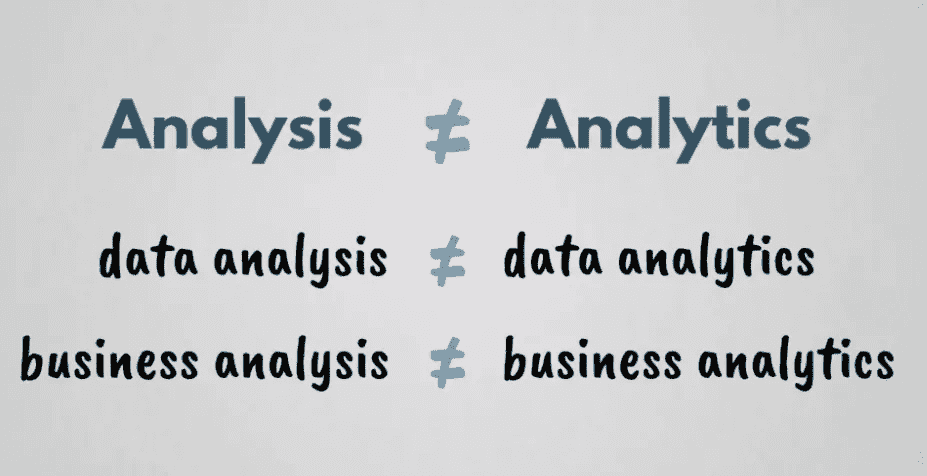
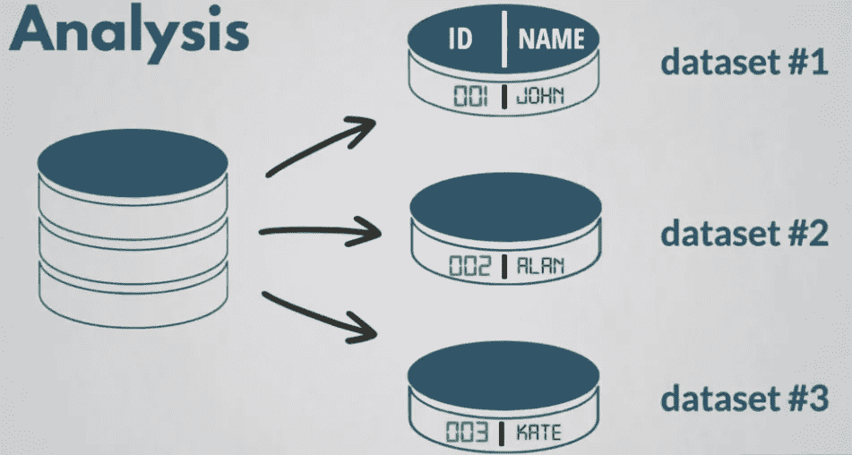
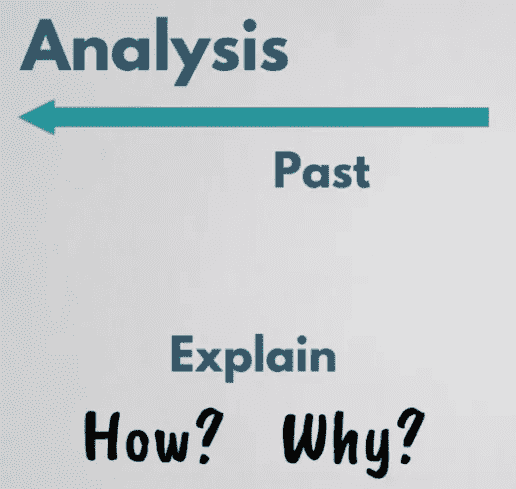
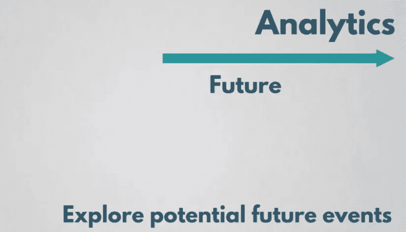
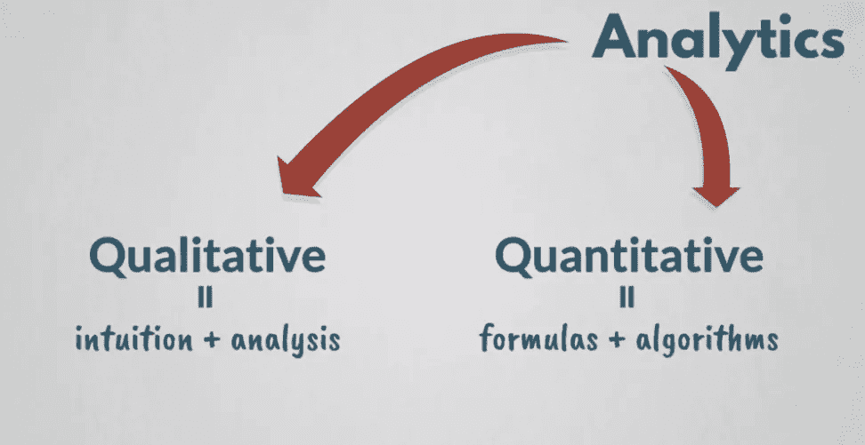

# 数据分析和数据分析有什么区别？

> 原文：<https://levelup.gitconnected.com/whats-the-difference-between-data-analytics-and-data-analysis-763f14f73b0b>

让我们讨论一下术语、分析和分析之间不太明显的区别。由于单词的相似性，一些人认为它们有相同的意思，可以互换使用。从技术上讲，这是不正确的。事实上，这两者之间有着明显的区别，所以不再赘述，让我们开始吧！

首先来讨论一下关于**分析**的问题。比方说，你有一个包含各种类型数据的巨大数据集，所以与其处理整个数据并冒被淹没的风险，不如把它分成更小的块，单独研究它们。这就是简而言之的分析。

记住，你对过去已经发生的事情进行分析，比如用分析来解释一个特定的故事是如何结束的，或者上周的销售额是如何下降的。所以基本上分析是为了解释事情是如何和为什么发生的！

现在，让我们讨论一下**分析**。分析基本上是指未来。它不是解释过去的事件，而是探索潜在的未来。将逻辑和计算推理应用于从分析中获得的发现基本上称为分析。使用从分析中获得的数据，您只是在寻找模式，并探索您将来可以用它们做什么。

***分析学*** 可分为两部分，即**定性分析学**和**定量分析学。**定性分析是利用你的直觉和经验以及分析来规划你的未来和商业决策。定量分析是将公式和算法应用到您从分析中收集的数字(数据)中。

例如，假设你是一家网上服装店的老板。你领先于竞争对手，非常了解客户的需求。你已经进行了非常详细的分析，并确定要遵循哪些时尚趋势。你可以利用这种直觉来决定开始销售哪种风格的服装。这可能是定性分析，但你可能不知道何时推出新系列。在这种情况下，依靠过去的销售数据和用户体验数据，您可以预测在哪个月推出新系列最合适。这是一个使用定量分析的例子。

至此，我们已经介绍了**分析**和**分析**之间的主要区别，希望这篇文章对您有所帮助。好吧，让我们很快在另一篇文章中见面，在那之前保重:)

❖ [*GitHub*](https://github.com/ritchiepulikottil)

❖ [*领英*](https://www.linkedin.com/in/ritchie-pulikottil-6876341aa/)

❖ [*推特*](https://twitter.com/dloqcamguy)

❖[insta gramt11】](https://instagram.com/ritchiepulikottil)