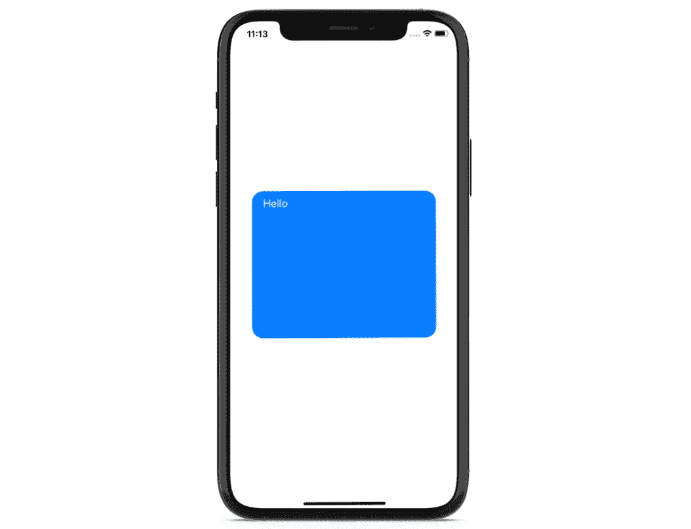
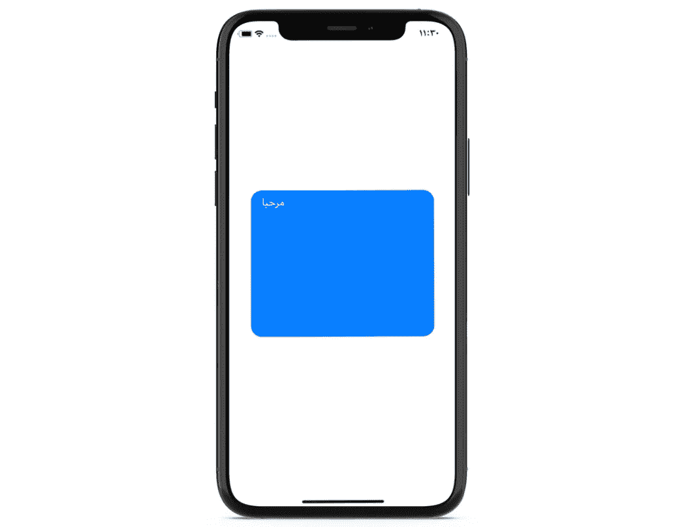
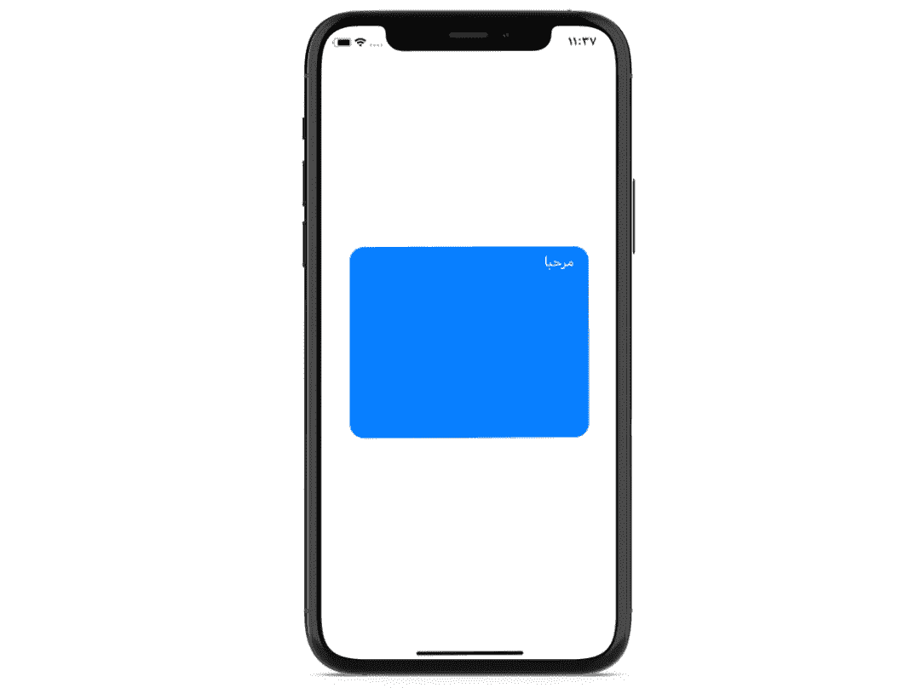

# Swift 中的前导约束和左约束、尾随约束和右约束有什么区别

> 原文：<https://levelup.gitconnected.com/whats-the-difference-between-leading-and-left-trailing-and-right-constraints-in-swift-3dfc29864f67>

## 添加对从右向左语言的支持

布鲁诺·沃尔夫在 [Unsplash](https://unsplash.com?utm_source=medium&utm_medium=referral) 上拍摄的照片

在本文中，我们将了解 Swift 中前导约束和左约束、尾随约束和右约束之间的区别。

简而言之，通过设置*前导*约束，我们设置了视图的*开始*点，而*尾随*约束设置了*结束*点。如果我们在应用程序中使用英语，那么*前导*和*左*锚是一回事，就像*尾随*和*右*锚一样。但是如果我们增加对 RTL(从右到左)语言的支持，如阿拉伯语、希伯来语或乌尔都语，*前导*将意味着*右，*和*尾随**将意味着*左。**

*现在让我们通过一个简单的例子来探究这种差异。*

# *我们开始吧*

*我们的`ViewController`有一个圆形的`UIView`包含一个`UILabel`:*

*注意，`titleLabel`显示了一个本地化的字符串。现在让我们为`viewDidLoad()`方法中的`roundedView`和`titleLabel`添加一些约束:*

*正如我们所看到的，我们将`titleLabel`的`leftAnchor`设置为与其父视图对齐，并有一个小的偏移量。当设备的语言为英语时，这为我们提供了以下布局:*

**

*如果我们想在应用程序中支持阿拉伯语，该怎么办？在将值添加到`Localizable.strings`文件、更改设备语言并重新运行我们的应用程序后，我们看到文本被正确翻译:*

**

*但是，因为阿拉伯语是一种 RTL 语言，所以标签现在应该与其父视图的右侧对齐。我们如何在不使用`if else`语句的情况下实现这一点呢？*

*让我们将之前提到的`leftAnchor`改为`leadingAnchor`:*

*如果我们运行该应用程序，我们会看到`titleLabel`现在已正确定位:*

**

*这样做的好处是，如果我们将语言改回英语，标签将再次位于左侧。*

*我希望你觉得这很有用。感谢阅读！*