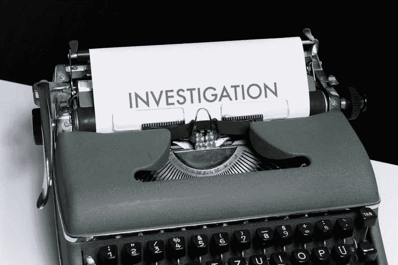

# 可观察性到底有什么意义？

> 原文：<https://levelup.gitconnected.com/whats-the-point-of-observability-anyway-14b64bdb921a>

2022 年 10 月 17 日

马库斯·温克勒在 [Unsplash](https://unsplash.com/s/photos/detective?utm_source=unsplash&utm_medium=referral&utm_content=creditCopyText) 上的照片

上周，我的团队取得了巨大的胜利:我们很快从生产中的一个错误中恢复过来。🎉

起初，这听起来不像是一个胜利。“你让一个窃听器接通了生产？这怎么会是胜利呢？!"

我同意产品中的 bug 并不好。但是在本文中，让我们先把这个问题放在一边，把注意力集中在 bug 进入生产环境后会发生什么。首先，我们在部署后几分钟内就检测到了 bug，并在不久后回滚了部署。第二，我们反应迅速。所有人都说，从漏洞被部署到回滚将其删除大约需要 15 分钟。最后，我们在第二天早上准备好了一个补丁，毫无问题地部署了它。如果您遵循 DevOps 和 DORA 指标的任何思想领导，您可能也会认为这是一个胜利。

我们检测并从这个错误中恢复的能力需要我们在过去几年中进行的一些最佳实践投资，包括自动化测试、持续部署和功能标记。但是今天我想谈谈另一个最佳实践和能力:可观察性。

如果没有好的可观察性工具，我们将永远无法检测到这个 bug，永远无法作为一个团队来响应它，并且永远无法证明我们已经恢复了。

今天我想谈谈为什么可观察性如此重要。如果做得正确，我坚信关注可观察性对于团队的效率和整体能力来说是一个倍增器。我在我工作过的几个团队中都见过，包括我现在的团队。

我们来看看为什么。

# 什么是可观测性？

可观察性(或简称为“olly ”)是软件工程行业的一个新的推动力，它包含了你用来观察你的软件的任何东西——日志记录、度量、警报和跟踪都在这个保护伞之下。

这些想法曾经是相关的，但仍然是不同的，并且存在于孤立的服务中。例如，日志记录将通过服务器的已装载卷上的文件来进行，并且一旦它们达到特定的大小或年限就进行轮换。指标将通过不同的工具出现，警报可能只出现在少数指标上，如 CPU、磁盘大小等。尽管软件服务的开发者或操作者本身是有帮助的，但是他们很难在一个仪表板中理解一个应用程序正在做什么以及它是如何执行的。

特别是随着向云原生技术和容器映像的迁移，我们看到了新的工具，这些工具允许应用程序通过一体化平台写入日志、记录指标和创建警报，并具有从日志、跟踪到指标等的无缝移动能力。DataDog、Honeycomb 和 New Relic 是这一领域最著名的几家公司。

将这些工具与 DevOps 团队(开发人员操作他们的软件，而不是一个单独的团队)结合起来，开发人员已经转变为考虑每个功能和 bug 修复的可观察性。这是一种思维方式的转变。

# 心态的转变

考虑可观察性时的思维转变是开发人员开始更多地考虑生产。而不是仅仅编写单元测试——这仍然会发生！！—开发人员开始考虑他们如何知道某个功能或修复是否按预期工作。开发人员会问，“我们如何知道这在生产中是可行的？”或者，更好的是，“我们如何知道这个*在生产中没有工作？”*

这些问题开始帮助开发人员编写代码，根据应用程序发出的日志和指标，清楚地讲述应用程序中正在发生的事情。以同样的方式，干净的代码促进读起来像故事的[代码，我们的日志和度量应该做同样的事情。](https://www.goodreads.com/quotes/7029841-clean-code-is-simple-and-direct-clean-code-reads-like#:~:text=Clean%20code%20reads%20like%20well,Grady%20Booch%20author%20of%20Object)

讲述一个令人信服的故事还包括当一个应用程序*没有按照预期运行时有明确的信号或阈值(为什么前面的第二个问题如此重要)。如果应用程序的延迟通常应该是< 100 毫秒，而最后一分钟的延迟是> 90 毫秒，这很可能向团队发出警告，他们需要开始注意了。如果延迟是> 100 毫秒，团队*必须*响应并主动了解应用程序发生了什么。*

# 什么是可观察性

讲述清晰故事的可观察性为软件团队带来了难以置信的能力。

首先，团队可以构建值得信赖的监视器和警报，因为应用程序有清晰的成功、警告和错误信号。不再有“喊狼来了的男孩”当一个团队可以信任他们的监控和警报*将*在出现问题时向他们发出警报，这也意味着他们可以合理地相信，如果没有警报发生，事情会正常工作。这意味着开发人员不需要对他们的软件在生产中的运行感到紧张或焦虑。这正是让我们的团队在大约 15 分钟内检测并回滚一个 bug 的原因，我在文章的开头分享了这一点。

其次，开发团队现在有更多的能力来试验和优化他们的代码。跟踪可以快速指出一个跟踪中最长的单个跨度，如果这个跨度(粗略地)与方法调用相关，团队就可以找出最慢的方法，并开始考虑优化它。更好的是，一旦团队有了一些实现优化的理论和想法，他们就可以部署一个实现并衡量它的效果。

我记得几年前我为一个专题做过这件事。我们构建了一个解析器，将一个相当大的决策树结构读入内存，我们注意到解析花费的时间比我们预期的要长。我们没有花费数周时间去寻找优化代码的最佳方法，而是设计了一些想法，并在一周内部署了每个想法的实现，用相同的数据集测量每个想法。在检查了结果之后，我们意识到虽然我们可以做一些微小的改进，但是我们的想法都不能给我们所需要的提升。我们开始重新思考，“如果我们不能改进解析器，我们能改变数据的形状吗？我们可以缓存任何东西吗？我们可以完全忽略树的某些部分吗？”然后我们做了同样的事情，并在另一周内，建立了一个新的数据重组，使我们更快地阅读和解析。如果没有清晰的指标和对应用程序的跟踪，实验和学习将会更加困难。

最后，良好的可观察性让你相信应用程序中发生的事情就是应用程序中实际发生的事情。我知道这听起来很简单，但是您会惊讶于系统中发生了多少次错误，并且没有日志、堆栈跟踪或指标来指示发生了什么。团队会假设好几天可能出了什么问题，但是如果你没有书面记录，这一切都是猜谜游戏。如果您想正确地调试一个问题，您需要良好的可观察性。

作为这篇文章的总结，我想强调一下什么是可观察性。它不是关于数字和仪表盘；它是关于你的团队理解和响应你的软件在生产环境中的行为的能力。知道你的软件在做什么，并且相信当有问题时你会被提醒，这给了你和你的团队继续构建你的产品的信心。作为一名工程师，这种感觉很棒。

实现良好的可观测性比我们在一篇文章中讨论的要长，尤其是因为每个工具都是不同的。首先，集中学习好的日志记录是什么样子，研究不同类型的度量标准(以及何时使用它们)，并阅读分布式跟踪。一旦你学会了基本知识，警觉通常会很快跟上。

好的可观察性实践的收益通常也不是线性的。不幸的是，构建“基础”需要几轮——集成库、构建有用的仪表板、确定正确的警报标准等等。—在您感觉到您的应用受到适当监控之前。

但就像一棵树，最好的开始时间是二十年前；下一个最好的时间是今天。

编码快乐！

*原发表于*[*https://dango slen . me*](https://dangoslen.me/blog/whats-the-point-to-observability-anyway/)*。*