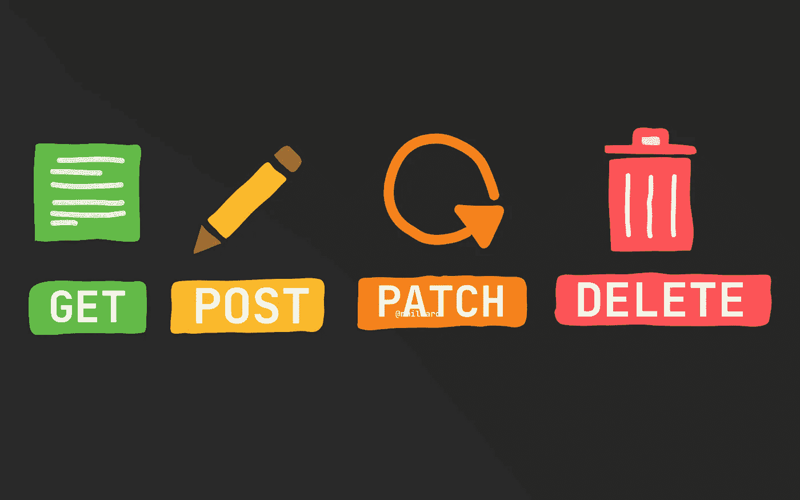
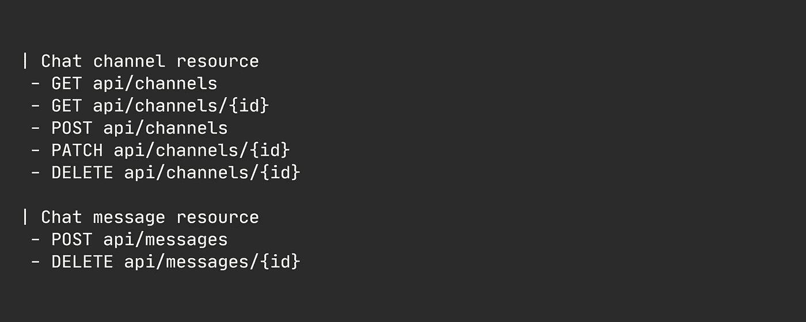
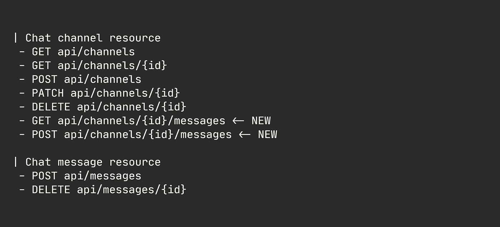
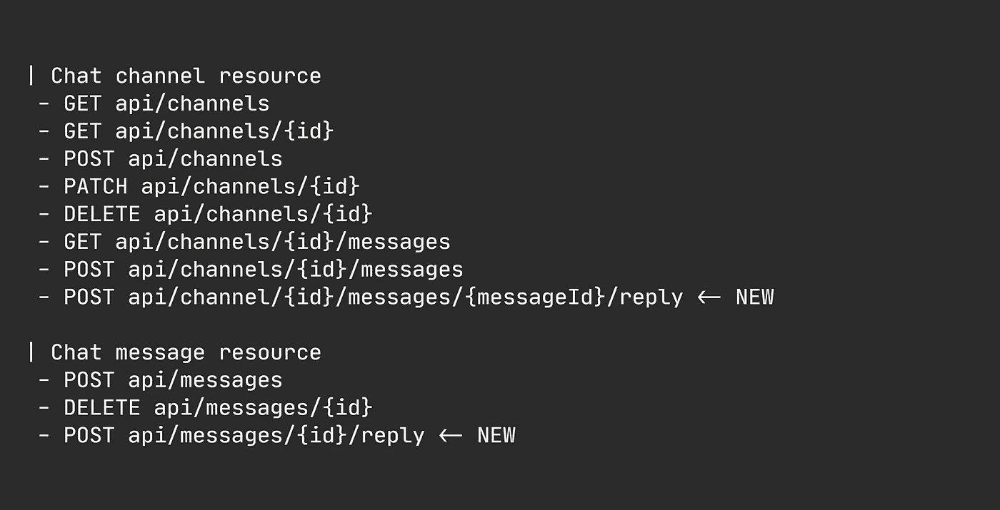
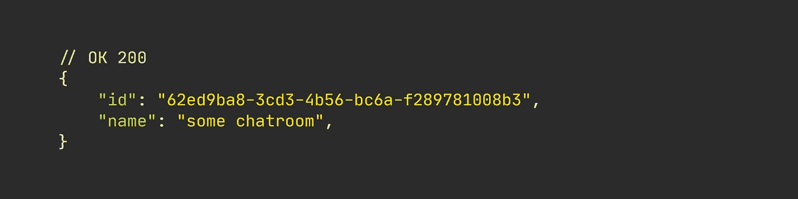
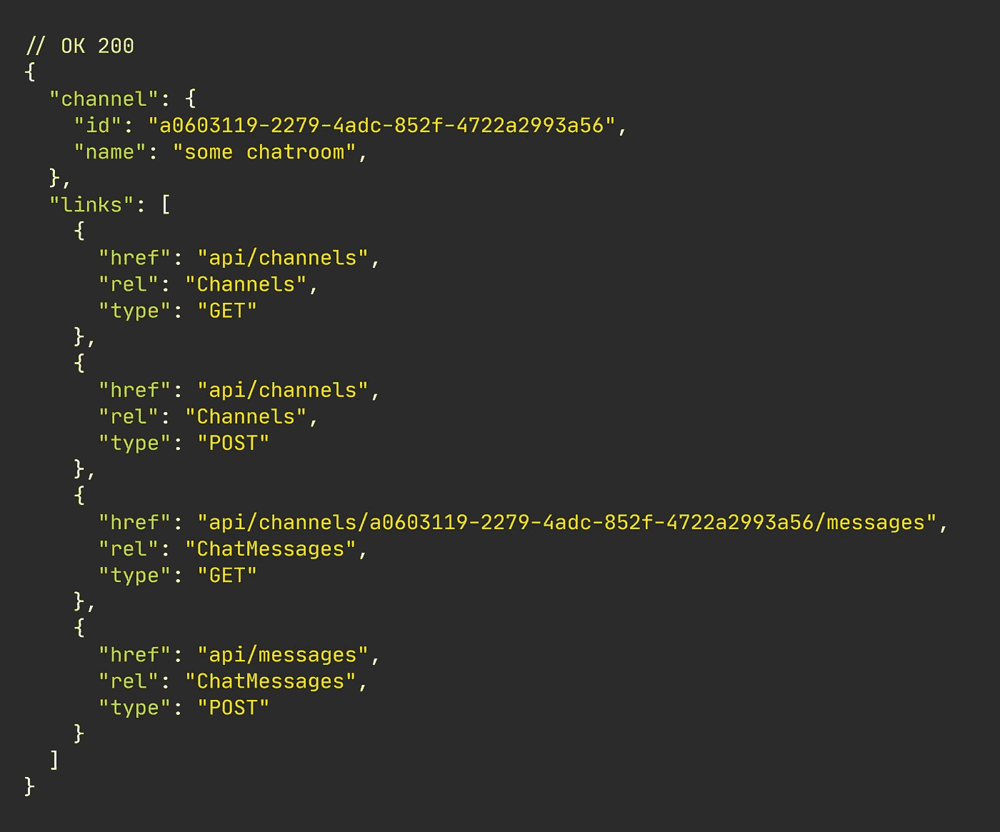
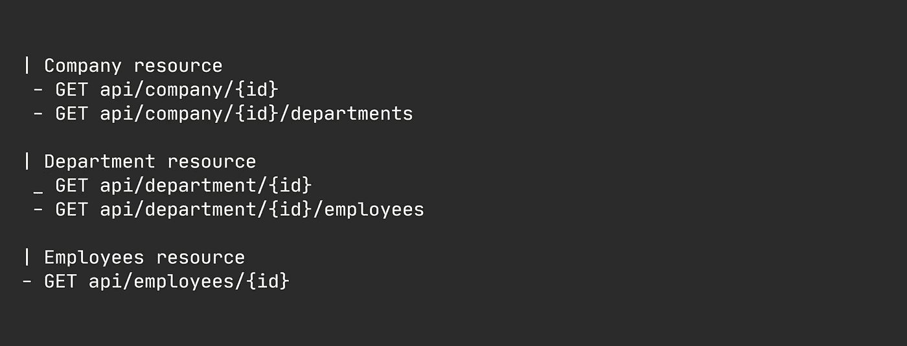
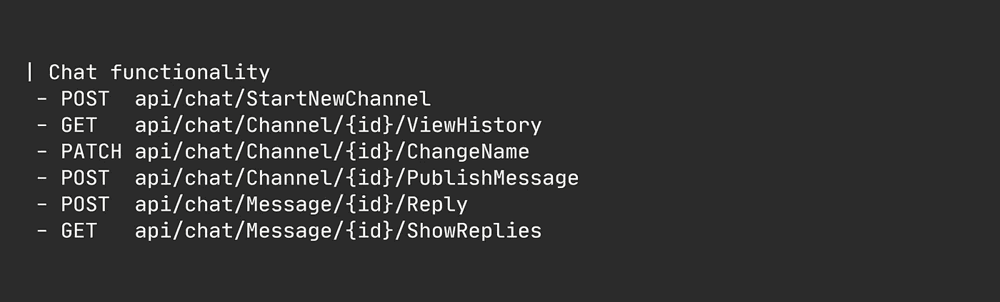

# 除此之外，你的 CRUD APIs 有什么问题吗？

> 原文：<https://levelup.gitconnected.com/whats-wrong-with-your-crudy-interfaces-besides-everything-bde4f4c8cb8a>

## 固执己见的观点

## 所以…我听说你崇拜粗糙的 REST 接口。

图片由[尼克拉斯·米勒德](https://medium.com/u/7c7a43b3d9de?source=post_page-----bde4f4c8cb8a--------------------------------)提供

许多 web 开发人员默认以类似 CRUD 的方式实现 REST APIs。他们太专注于坚持武断的、虚构的技术规则，完全忽视了业务和客户。

CRUD over REST 对于初学开发人员和创建 POC 来说可能很棒，因为它很容易上手，并且您可以在很大程度上忽略业务领域的某些方面。

好吧……让我马上声明这一点；我(大部分)对休息没有意见。

有一个关于[开发者如何默认创建基于 CRUD 的 REST API](/why-are-you-still-creating-crud-apis-8790ca261bfb)的普遍问题。出于某种原因，开发人员都认为每个资源都必须有一组相似的预定操作。

但是除了初学者和 PoC 用例，您真的应该避免创建粗糙的 REST APIs。

> 您最后一次从获取、创建、更新或删除资源的角度考虑您的域是什么时候？

我的大部分专业时间都花在构建现代 REST API(in。NET)服务于我们的客户，如 Stripe、Paysafe 和许多其他支付服务提供商(PSP)，我有一段时间注意到类似 CRUD 的 API 是如何阻碍系统理解的。

REST(大部分)是可以的，但是当我们试图将 CRUD 模式应用到面向客户端的接口时，整个事情就崩溃了。

## 让我们花几秒钟来回顾一个典型的、糟糕的界面。

在我讨论 CRUDy 接口的问题之前，让我演示一种普遍存在的、懒惰的方法来实现 REST 接口。

我假设每个人都有使用聊天网络应用程序的经验，所以这就是我们要做的。我们的聊天 app 超级简单，只支持频道和消息。因此，频道只是一个“消息容器”，任何人都可以通过它发布匿名消息。我们将保持匿名，因为我很懒，不想让用户管理之类的事情过于复杂。

下面是我们面向客户的粗糙界面。很可怕，对吧？

如果你真的想把实体看作文档，就像 REST 最初设计的那样，那么通道和消息就是两个独立的“文档”，需要它们自己的根端点。

铁杆 CRUD-boys 会告诉我这不是一个好的 API，因为我错过了消息`GET`操作。但是，完全没有必要这样做，因为孤立地查看单个消息没有意义。

另外，请注意，我们遗漏了 channels 文档中用于访问消息的嵌套资源——有时称为子资源。稍后我将再次讨论这个问题。

这种 API 组织结构让我想起了许多开发人员表现出的“按类型分类”的坏习惯，在这种情况下，代码一般是按其类型而不是代码所属的特性来组织的。

不管怎样……现在已经解决了这个问题，让我来解释一下为什么粗糙的界面是不受欢迎的。

## 所以，你认为休息是一个标准…

很多人把休息称为一种标准——事实并非如此。相反，REST 只是一种架构风格，有一组约束，受一些工程指导方针的指导，比如一般性原则。

当然，有一些标准化 REST 的尝试，但是它们大多是模糊的想法，没有得到太多的关注，比如如何格式化 [HATEOAS 链接](https://datatracker.ietf.org/doc/html/draft-kelly-json-hal-08)，一个 [Richardson 成熟度模型](https://martinfowler.com/articles/richardsonMaturityModel.html)等等。

web 开发人员中另一个有趣的话题是，您是否包含子资源的链接，或者它们是否应该有一个独立的“根”？在这一点上，我更倾向于子资源阵营，但我有所保留，因为它很容易失控。

哦，顺便说一下，任何使用 cookies 开发 web 应用程序的人都已经违反了 REST 原则。

## 粗糙的接口导致子资源嵌套地狱。

对，我之前提到过允许子资源很容易失控。现在让我来演示一下。

如果我们要使用子资源端点，那么我们可以在`api/channels`中增加几个端点，如下面的代码片段所示。

子资源端点。

现在，我们只需查询提供 id 的通道根，并导航到`/messages`，就可以访问任何给定通道的所有消息。这很容易。

我对此没有任何异议，除了你必须*知道*应用程序遵循哪个 REST 约定。

当在嵌套资源上执行操作时，事情开始变得棘手，比如允许线程——例如，在通道内回复消息。

你如何着手此事？你提供了另一个嵌套吗，或者这个功能你会放在`/api/messages`根中吗？谁知道呢。真的没有标准。

让我们看看那会是什么样子。

子资源的新功能

我已经展示了两个典型的例子，说明人们如何倾向于在嵌套资源上实现操作。

将它添加到聊天通道资源端点看起来很疯狂。将它添加到聊天消息资源有点打破了我们的模式。这些选项我都不喜欢，但我可能会选择第一个。

通常，您会发现 API 支持这两种选择，从而提供了多种方式来与同一个“资源”进行交互，根据 REST 的想法，这完全没问题。

## 但是等一下，你可能都没有休息…

我之前提到过 HATEOAS，这是我反对 CRUDy REST 的下一个理由。

你的“REST”API 可能终究不是*那种* restful。不过这个完全看你问谁了(标准就这么多，嗯？).

想象一下你称之为`GET api/channels/{id}`端点。

你期望得到什么？整个频道包括它包含的所有消息？只有与渠道本身相关的数据？你期待超媒体链接吗？

假设您获得了如下所示的数据。

无休息反应。

这是明智的回应。但这真的是一种“宁静”的反应吗？

还是那句话，这取决于你问谁。许多开发人员可能会说不，他们将 Richardson 成熟度模型的第 3 级和 Fielding 的超媒体称为应用程序状态约束的引擎。

考虑到 HATEOAS 约束，我们会期待类似这样的结果。

宁静的回应。

现在，响应中包含的链接有点像锚链接，但却是一种无 GUI 的方式。在我看来，这太疯狂了。

幸运的是，从我创建和使用许多不同 API 的经验来看，我很少遇到任何人在他们的 API 响应中包含这些链接。

## 您的 REST APIs 非常健谈。

如果你真的做了粗糙的休息，那么你的应用程序肯定会变得过于喋喋不休。

在“资源”的基础上访问您的实体可能看起来是一个好主意。但是，随着您对领域理解的加深和需求的发展，您可能会发现自己陷入了我喜欢称之为“嵌套资源检索疯狂”的境地

当您想要跨父级访问嵌套资源时，甚至当您需要初始调用无法检索到的嵌套资源细节时，就会产生这种疯狂。

我们的聊天应用程序的 API 不能很好地展示我的观点，所以，我将使用一个用于组织管理的即兴 API。

假设我们有如下所示的端点。

假设根上的每个嵌套资源只提供相关的 id，而不提供每个嵌套资源的细节，因为我们最初的想法是支持小数据包而不是大数据包。

现在假设您想要某个公司的所有员工。您是否循环各部门，并在部门级别上针对每个检索到的员工 ID 向`api/employees/{id}`发出请求？

或者是粗糙的 REST 开始变得太麻烦，你开始通过创建像`GET api/company/{id}/employees`或者甚至可能`GET api/company/{id}/employees-with-details`这样的端点来发散。

这似乎是一个完全虚构的方法，但是我以前见过这样做的。

## "但是其他人都在创建 CRUD APIs！"

当然，他们是。

他们很可能在学校时就学会了这个粗俗的术语，也懒得去调查或实验不同的方法。

REST 是为老派网站发明的，在老派网站中，导航的主要手段是锚链接——因此有了使用超媒体链接作为发现功能的手段的想法。它起到了一定的作用，减轻了过去真正的痛苦。“API”后来成为本周的流行语，出于某种原因，一些开发人员认为将 CRUD 模式应用于面向客户端的 REST APIs 是一件好事。

# "那么，我们如何才能构建更好的 web APIs 呢？"

我不能抨击一种方法而不至少提供一种替代方法。

## 基于任务的、以业务为中心的界面才是正确的选择。

在我看来，无论你做什么，你都需要记住业务和客户。帮助企业为客户服务始终是重中之重。

我不赞同武断的、虚构的技术规则，尤其是当它们纯粹植根于技术“智慧”而不是提供真正的商业价值时。

正如我在上一篇文章中提到的，你应该停止忽视你的客户，构建真正符合客户意图的 API。

考虑到我们的聊天 web 应用程序，一个更好、更容易推理并且总体上更好的端点可能如下所示。

它们看起来确实像 RPC，这很好。

请注意我们是多么注重功能。几乎毫无疑问，每个端点将做什么，但我们仍然可以很容易地遵守 REST 原则，如无状态、幂等运算、通用性原则等。

不再需要 HATEOAS，因为 API 现在已经很明显了。我认为 HATEOAS 的设计是出于对 REST 通用性的不满——Fielding 自己也提到了这种关于应用程序特定需求的权衡。

## “但是资源应该有统一的接口！”

现在，在我看来，统一接口约束被广泛误解为所有资源都必须符合某个通用模板，通常是 GET (single and all)、POST、PATCH 和 DELETE。

在多次阅读 Fielding 的作品后，我确实认为这个通用模板就是他所想的——但是，作为他写作时一个基本上未经测试的想法，我认为统一接口约束的含义应该现代化，只考虑资源级别的端点，而不是所有资源必须符合完全相同的接口的应用范围的约束。

以完全相同的方式连接两个资源通常是没有意义的。例如，你想以两种完全不同的方式与聊天室和聊天信息互动。

# 终于结束了。

虽然 REST 是 web APIs 事实上的架构方法，但我认为还有改进的空间，我们应该允许自己探索与我们的业务领域如何运作更一致的新途径，而不是取悦 REST 之神。

说到底，我们构建 web APIs 是为了支持我们的业务，而不是为了证明我们有能力遵循一个 21 岁的博士论文中提出的观点所强加的综合约束。无意冒犯菲尔丁或他的想法。它们无疑为 HTTP 上的现代 API 铺平了道路。

在我看来，忘掉武断的规则，开始构建以业务为中心的 API，帮助支持客户的意图并完成他们的任务。

# 我想你会喜欢类似的材料。

*   [干净代码示例(YouTube)](https://youtu.be/goVjlWLY9NQ)
*   [你为什么还在创建 CRUD APIs？](/why-are-you-still-creating-crud-apis-8790ca261bfb)
*   [拿掉你的 If-Else 和 Switch Cases](/remove-your-if-else-and-switch-cases-1ed2b625b4cf)
*   [为什么认知和圈复杂度在软件开发中很重要](/why-cognitive-and-cyclomatic-complexity-matters-in-software-development-5fce1efb56ab)
*   [编写更干净的代码(附例子)](/writing-cleaner-code-with-examples-69be2160b4c1)

# 好奇者的资源

*   📚[源代码【GitHub】](https://github.com/NMillard/SimpleWebApps/tree/master/src/GeneralPractices/CrudOrTaskBased/CrudApp)作者[尼可拉斯·米勒德](https://medium.com/u/7c7a43b3d9de?source=post_page-----bde4f4c8cb8a--------------------------------)
*   微软的 RESTful API 设计
*   架构风格和基于网络的软件架构的设计
*   [什么是代码学院的休息](https://www.codecademy.com/articles/what-is-rest)
*   [Crud 对休息不好吗？](https://www.infoq.com/news/2009/07/CRUDREST/)鲍里斯·卢布林斯基
*   restfulapi.net 的 HATEOAS 驱动的 REST APIs
*   [hate OAS——一个简单的解释](https://www.e4developer.com/2018/02/16/hateoas-simple-explanation/)作者 [Bartosz Jedrzejewski](https://www.e4developer.com/author/jedrus07/)
*   [为什么仇恨是无用的，它对休息意味着什么](https://medium.com/@andreasreiser94/why-hateoas-is-useless-and-what-that-means-for-rest-a65194471bc8)作者[安德里亚斯·赖泽](https://medium.com/u/1b1409faa609?source=post_page-----bde4f4c8cb8a--------------------------------)
*   [被认为有害的宁静](https://nurkiewicz.com/2015/07/restful-considered-harmful.html)
*   cqrs.wordpress.com 上基于任务的用户界面
*   Mathias Verraes 提出的 CRUD 是一个反模式
*   特洛伊·格里菲兹的《为什么休息很糟糕》