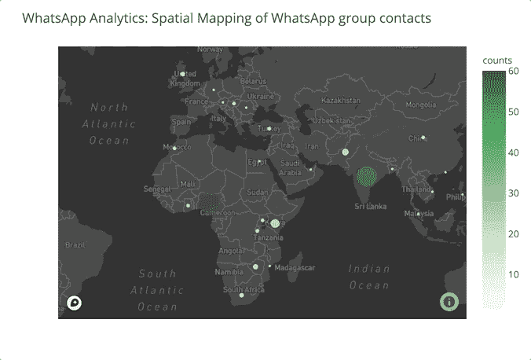
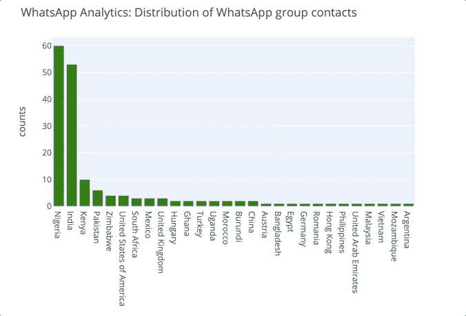
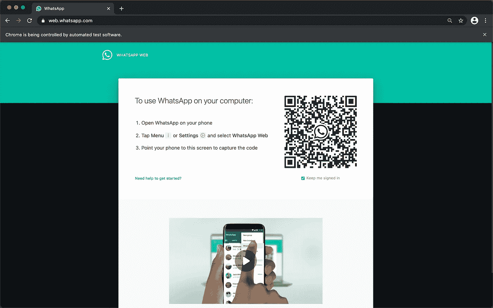

# WhatsApp Analytics:WhatsApp 群体用户的空间映射

> 原文：<https://levelup.gitconnected.com/whatsapp-analytics-spatial-mapping-of-users-of-whatsapp-groups-6c6f67f9291b>

WhatsApp 群组已经成为一个与世界各地的其他人建立集体对话的环境。

在本教程中，我们将基于 WhatsApp 群组的参与者生成和绘制分析。我们将对用户的位置进行地理编码，并生成国家级分布。这个接口将使用 Selenium、Plotly、Vonage Number Insight API、Google Maps API 和 Mapbox API 用 Python 构建。

# 先决条件

要遵循并完全理解本教程，您还需要具备:

*   [Python 3.6](https://www.python.org/) 或更新版本。
*   自动化基础知识用[硒](https://selenium-python.readthedocs.io/index.html)。
*   设置[谷歌地图 API](https://developers.google.com/maps/documentation) 。
*   设置 [Plotly](https://plotly.com/) 和 [Mapbox](https://www.mapbox.com/) 凭证。

# Vonage API 帐户

要完成本教程，您将需要一个 [Vonage API 帐户](http://developer.nexmo.com/ed?c=blog_text&ct=2021-04-06-whatsapp-analytics-spatial-mapping-of-users-of-whatsapp-groups)。如果您还没有，您可以今天就[注册](http://developer.nexmo.com/ed?c=blog_text&ct=2021-04-06-whatsapp-analytics-spatial-mapping-of-users-of-whatsapp-groups)并开始使用免费信用点数进行构建。一旦你有了一个帐户，你可以在 [Vonage API 仪表板](http://developer.nexmo.com/ed?c=blog_text&ct=2021-04-06-whatsapp-analytics-spatial-mapping-of-users-of-whatsapp-groups)的顶部找到你的 API 密匙和 API 秘密。

下面是您将构建的最终界面的结果:

# 文件结构

请参见下面该项目的文件目录概述:

上面目录树中列出的所有文件的内容将通过本教程的后续步骤创建。

# 设置 Python 虚拟环境

您需要一个独立的环境来管理这个项目特有的 python 依赖项。

首先，创建一个新的开发文件夹。在您的终端中，运行:

接下来，创建一个新的 Python 虚拟环境。如果您正在使用 Anaconda，您可以运行以下命令:

然后，您可以使用以下方式激活环境:

如果您使用的是 Python 的标准发行版，请通过运行以下命令创建一个新的虚拟环境:

要在 Mac 或 Linux 计算机上激活新环境，请运行:

如果您使用的是 Windows 计算机，请按如下方式激活环境:

无论您使用哪种方法来创建和激活虚拟环境，您的提示应该如下所示:

## 需求文件

接下来，在虚拟环境处于活动状态的情况下，安装项目依赖项及其特定版本，如下所示:

这些特定版本的包可以通过需求文件从您的终端安装:`$ pip install -r requirements.txt`或`conda install --file requirements.txt`(如果您在 Anaconda 上)，瞧！该程序的所有依赖项都将被下载、安装并准备好使用。

或者，您可以安装所有软件包，如下所示:

*   使用画中画:

*   使用 Conda:

# 设置 API 和凭证

接下来，您需要设置一些帐户并获得所需的 API 凭证。

## 谷歌地图 API

Google Maps API 将启用地理编码功能，这对于这个项目至关重要。该 API 在[谷歌云控制台](https://console.cloud.google.com/)上随时可用。
首先，你需要建立一个 [Google Cloud 免费等级账户](https://cloud.google.com/free)，在这里你可以获得 300 美元的免费积分来探索 Google Cloud 平台和产品。接下来，设置好谷歌云控制台后，您需要[创建一个 API 键](https://developers.google.com/maps/documentation/javascript/get-api-key)来将[谷歌地图平台](https://cloud.google.com/maps-platform)连接到应用程序。
最后，[激活 Google Maps 地理编码 API](https://console.cloud.google.com/apis/library/geocoding-backend.googleapis.com?filter=category:maps&id=42fea2de-420b-4bd7-bd89-225be3b8b7b0&project=maps-article-review) ，为项目启用它。

## Plotly API 和地图框凭证

为了创建漂亮的数据可视化，将使用 Python 上的 [Plotly](https://plotly.com/) ，并使用 [Mapbox](https://www.mapbox.com/) 增强美观。

Plotly plots 在线托管在 Chart Studio(plot ly Enterprise 的一部分)上；你需要[注册](https://chart-studio.plotly.com/Auth/login/#/)，生成并保存你的自定义 [Plotly API 密匙](https://plotly.com/python/getting-started-with-chart-studio/)。

为了实现想要的情节增强，你还需要注册[地图框](https://account.mapbox.com/auth/signup/)并创建[地图框授权令牌](https://docs.mapbox.com/help/tutorials/get-started-tokens-api/)。

## 设置参数和源代码的分离

在上一节中，您已经生成了各种 API 凭证。
最佳实践是将这些凭证存储为环境变量，而不是放在源代码中。

通过创建一个新文件并将其命名为`.env`，或者通过如下终端，可以轻松设置环境文件:

环境文件由键值对变量组成。例如:

您可以使用 [Python Decouple](https://pypi.org/project/python-decouple/) 内置模块在源代码中访问这些环境变量。

> 将`.env`文件添加到 [gitignore](https://git-scm.com/docs/gitignore) 文件中也是一个很好的做法。这样做可以防止 API 凭证等敏感信息公开。

这些脚本遵循面向对象的编程范例。以下是对每个脚本的高级解释。

## automate.py

这个项目工作流程的第一步是使用 [Selenium](https://selenium-python.readthedocs.io/) 的 WhatsApp automation。
Selenium 是一个开源的基于 web 的自动化工具，它需要一个驱动程序来控制浏览器。由于不同的浏览器配置，存在不同的驱动程序；下面列出了一些流行的浏览器驱动程序:

*   [镀铬](https://sites.google.com/a/chromium.org/chromedriver/downloads)。
*   [火狐](https://github.com/mozilla/geckodriver/releases)。
*   [游猎](https://webkit.org/blog/6900/webdriver-support-in-safari-10/)。
*   [缘](https://developer.microsoft.com/en-us/microsoft-edge/tools/webdriver/)。

> 本教程使用 Chrome 驱动程序。为了使它更快更容易访问，将下载的驱动程序文件移动到与使用它的脚本相同的目录中。参见上面的文件结构。

这个脚本包含一个`WhatsappAutomation`类，它通过路径加载 web 驱动程序，最大化浏览器窗口，并加载 Whatsapp Web 应用程序。启动的 30 秒延迟是为了提供扫描二维码的时间，以便在网络上访问您的 Whatsapp 帐户。

用手机扫描你的二维码，你的 Whatsapp 账户就会在网上打开。

`WhatsappAutomation`类有两个类

*   `get_contacts()`
*   `quit()`

> 浏览器将通知您“Chrome 正由自动化测试软件控制”，以表明 Selenium 将被激活以在浏览器中实现自动化。

接下来，您需要访问所需的组和联系人，如下所示。

自动化步骤包括定位包含电话号码的 WhatsApp 网页元素，如上图所示。有许多方法可以选择这些元素，如 [Selenium 文档](https://selenium-python.readthedocs.io/locating-elements.html)中所强调的。对于这个项目，使用`xpath`。

> 要访问这些元素选择器，您需要检查 Whatsapp 网页*。*

接下来，需要清理通过 Xpath 获得的联系人条目，并保存为 CSV 文件。您将使用[正则表达式](https://github.com/AISaturdaysLagos/Cohort3/blob/master/Beginner/Week3/Notebook/regular-expressions.ipynb)删除电话号码中的“+”字符和任何空格。
为了促进有效的内存管理，在会话完成时退出 selenium 浏览器。

## 分析. py

接下来，您将使用[Vonage Number Insights API](https://developer.nexmo.com/number-insight/overview)从保存的 CSV 文件中生成见解。这个 API 提供了关于电话号码的有效性、可达性和漫游状态的信息。

该脚本由一个`WhatsappAnalytics`类组成，该类首先使用 Python `decouple`模块加载存储在`.env`文件中的 Vonage 凭证。接下来，它有一个`get_insight()`方法，该方法获取联系人列表并启动一个高级号码洞察来获取与电话号码相关联的国家。最后，国家列表被保存为 CSV 文件。

## geocoding.py

接下来，将对各个位置的字符串描述(国家名称)进行地理编码，以创建各自的地理坐标(纬度/经度对)。

这个脚本由一个`GoogleGeocoding`类组成，它首先加载 Google Maps API 键。这个类有一个带`dataframe`参数的`geocode_df`方法——先前保存的电话号码和国家。该方法还按国家聚集数据帧，并返回各自的纬度和经度对。

## plotting.py

接下来，您需要映射创建的地理空间数据(纬度和经度对)。
地图制作是一门艺术；要使项目结果美观，请使用 Plotly 库和 Mapbox 地图。

这个脚本包含加载 Mapbox 令牌和 chart_studio 凭证的`SpatialMapping`类。这个类有两个方法，`plot_map`和`plot_bar`，将 Whatsapp 组的用户分布绘制成地图和条形图。

## main.py

main.py 是程序的执行点。这里，所有的脚本类和导入，以及各种需要的参数都在`main()`函数中输入。

# 尝试一下

在您的终端中，运行主脚本文件，如下所示:

这将导入各种脚本，并执行`main()`函数来产生期望的结果。

# 结果

我相信你已经能想到这个新知识的所有可能性和用例。可能性是无限的。

感谢您花时间阅读这篇文章！

快乐学习！

# 参考

[Vonage 数字洞察 API](https://developer.vonage.com/number-insight/code-snippets/number-insight-standard/python)

*最初发布于*[*https://learn . vonage . com/blog/2021/04/06/whatsapp-analytics-spatial-mapping-of-users-of-whatsapp-groups/*](https://learn.vonage.com/blog/2021/04/06/whatsapp-analytics-spatial-mapping-of-users-of-whatsapp-groups/)