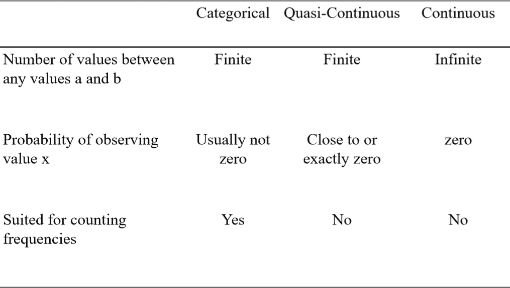
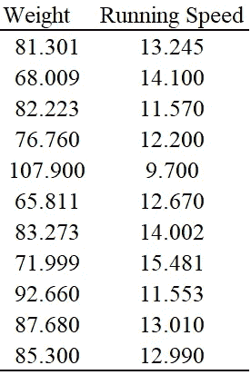

# 在 Python 中何时以及如何对连续变量进行分类

> 原文：<https://levelup.gitconnected.com/when-and-how-to-categorize-continuous-variables-in-python-f4c3b357dd46>

如果你正在学习用于数据分析的统计学，你可能已经遇到了连续变量和分类变量的概念。你们中的一些人可能知道这两者之间的区别，你们中的一些人甚至可能知道这两者需要不同的分析方法。

然而对于这篇文章，你的统计学背景并不重要，因为我会先给你一个简短的理论介绍。您将学习如何区分分类数据和连续数据，以及对连续数据进行分类有什么好处。在本文的第二部分，我将教您一种使用 NumPy 库对数据进行分类的快速简单的方法。

# 理论

重要的是不要混淆变量的基数(连续的或分类的)和它的测量水平(名义的、序数的、区间的或比率的)。那是完全不同的概念，虽然不是独立的。你可以在这里了解测量等级[。](https://medium.com/@mah.fay.g/levels-of-measurement-fca75361dbc1)

## 有什么区别？

让我们来看看如何区分连续变量和分类变量。关键的区别在于，连续变量在任何值 a 和 b 之间有无限多的值，而分类变量没有！

一个很好的例子是你的体重，单位是千克。甚至你的浴室秤都知道体重是连续的。这就是为什么它不仅以千克为单位告诉你你的体重，还以克为单位(78.5 千克=78，500 克)。如果你碰巧有一个专业的厨房秤和一个足够轻的人(任何新生婴儿都可以)，你甚至可以将你的测量精确到毫克。我们想走多远？微克？纳克？关键是，你可以无限深入。

一个典型的分类变量是一个人有多少兄弟姐妹。我有 2 个，你可能有 0 或 4 个。一个非常罕见的人会有 10 个，但这个世界上没有人有 4.5、0.2 或π个兄弟姐妹。人脑的神经元数量呢？根据[T3 网站的统计，平均有 860 亿人。这是一起边境案件。这个理论在这里是非常清楚的，因为根据定义它是绝对的。任何大脑都不可能有 86，000，000，001.356 个神经元。然而，在实践中，数据分析师认为:如果它表现得像一个连续变量，我们就称它为连续变量。理所当然！大多数值之间的差异将大于 100.000，这在实践中几乎是无穷大。](https://human-memory.net/brain-neurons-synapses/)

## 为什么要对连续变量进行分类？

对连续变量进行分类有两个主要原因:

## 原因 1:你想统计频率。

连续变量的一个关键问题是它们不能取任何特定的值，比如 79 kg。因为单位可以变得无限小，所以并不是千克度量的所有小数都可以为零。所以，任何一个人恰好体重 79 公斤，65.7 公斤，甚至 90.1934 公斤的概率是 0。当您想要计算特定值的频率时，这尤其成问题，因为所有的频率都是 0。上面提到的变量“神经元数量”的行为方式相同，尽管它在技术上是分类的。在我的样本中，有多少人恰好有 864.3 亿个神经元？可能没有，如果你非常幸运，可能有一个。无论如何，你会发现不值得切开一个人的大脑来计数神经元。

为了获得实际的见解，您可以计算在某个范围内的观察次数。例如，你想数一数有多少人体重在 75 到 80 公斤之间。这不太可能是 0。因此，如果你想对连续或准连续数据(神经元数量)进行频率描述性统计，你需要对它们进行分类——如果你愿意的话，把它们分类。

## 原因二:你想比较组均值。

也许你想知道，体重较高的人是否比体重较低的人跑步速度慢。由于上述问题，体重 85 公斤或 59 公斤的人的平均跑步速度是不确定的。你可以使用相关性或回归来获得相似的见解，但这不会告诉你任何关于群体差异的信息。您需要将数据分成两部分，一部分包含所有低体重的人，另一部分包含所有高体重的人。要做到这一点，你需要分类。总结见表 1。



表 1-分类数据、准连续数据和连续数据之间的差异总结。

# 应用

## 数据准备

表 1 显示了我为此分析得出的数据。第一栏显示体重，单位为千克，第二栏显示跑步速度，单位为千米/小时。你可以在这里下载数据[。](http://www.sharecsv.com/s/ac6989c21a92808c513210f549af971e/runners_weight.csv)



表 1

首先，我们需要导入 NumPy 并将数据集作为 NumPy 数组加载。为此，我们可以使用`genfromtxt()`函数。在这种情况下，我们需要将分隔符指定为“；”并告诉 NumPy 跳过第一行，这只是文本。

```
import numpy as nprunners_weight = np.genfromtxt("runners_weight.csv", delimiter = ";", skip_header = 1)print(runners_weight)
```

输出:

```
array([[ 81.301,  13.245],
       [ 68.009,  14.1  ],
       [ 82.223,  11.57 ],
       [ 76.76 ,  12.2  ],
       [107.9  ,   9.7  ],
       [ 65.811,  12.67 ],
       [ 83.273,  14.002],
       [ 71.999,  15.481],
       [ 92.66 ,  11.553],
       [ 87.68 ,  13.01 ],
       [ 85.3  ,  12.99 ]])
```

现在，让我们使用 NumPy 对我们的体重数据进行分类，以达到上述两个目的:获取频率和比较组。

## 获取频率

看数据，类别< 75, 75–85, 85–95, and > 95 似乎有道理。有很多方法可以做到这一点，但我们将坚持这一分类。该代码将为我们提供所有体重低于 75 公斤的跑步者的 2D 数组:

```
weight_under_75 = runners_weight[runners_weight[:,0] < 75]
```

您可以这样理解语法:

返回 runners_weight 数组的每一行，其中索引 0 (weight)处的列值小于 75。

输出是:

```
array([[68.009, 14.1  ],
       [65.811, 12.67 ],
       [71.999, 15.481]])
```

要理解这是如何工作的，请看这段代码，它是上面更大的代码的一部分。

```
runners_weight[:,0] < 75
```

“[:，0]”是一种仅索引 2D 数组中一列的方法。查看下面的伪代码，它向您展示了我们通常如何索引 2D 数组。

```
array[row_start : row_end, column_start : column_end]
```

现在我们可以解释“[:，0]”部分了。“:”给出了每一行，因为我们没有定义起点或终点，“，”将行索引与列索引分开，“0”是“0:1”的缩写，指定我们只想查看第一行。本质上，我们索引第 1 列的所有行(其索引为 0)，并使用“< 75” to check whether the values are lower than 75.

The function

```
runners_weight[:,0] < 75
```

returns:

```
array([False, True, False, False, False,  True, False, True, False,False, False])
```

In a way, this output represents the array of weights and marks every value lower than 75 with “True”. Now we can better understand this seemingly complex code I showed you earlier.

```
weight_under_75 = runners_weight[runners_weight[:,0] < 75]
```

We know the last part is an array of boolean values (“True” and “False”). Indexing the full runners_weight array with this boolean array will therefore return only those rows of runners_weight, where the boolean array has the value “True”.

If the operation worked, the rows in the output

```
array([[68.009, 14.1  ],
       [65.811, 12.67 ],
       [71.999, 15.481]])
```

should be at the indices 1, 5, and 7 in the original array. We can see in Table 1, that this is the case. Having understood this method, we can now write the code for the other categories in the same way.

```
weight_75_85 = runners_weight[np.logical_and(runners_weight[:,0] > 75, runners_weight[:,0] < 85)]weight_85_95 = runners_weight[np.logical_and(runners_weight[:,0] > 85, runners_weight[:,0] < 95)]weight_over_95 = runners_weight[runners_weight[:,0] > 95]
```

The first two look a bit different. This is because we need not one (< 75) but two conditions to be True (e.g. > 75 和< 85)。np.logical_and()将这些条件作为单个输入，同时应用这两个条件。标准的 python“and”操作符在这里不起作用！

我们获取权重类别频率的最后一步是对我们的新变量使用`len()`函数。

```
print(len(weight_under_75))
print(len(weight_75_85))
print(len(weight_85_95))
print(len(weight_over_95))
```

输出:

```
3
5
3
1
```

对你来说，这可能看起来很复杂，而且时间效率很低。你可以在更短的时间内数出频率。但是，您现在已经学会了使应用程序更快的方法。下一个例子将清楚地展示这样做的效率。此外，在处理大数据时，祝您好运。

## 比较两组

为了将两组精确地分成两半，我们需要计算中位数。

```
median = np.median(runners_weight[:,0])
```

现在，我们将数据分为两类，一类是所有值都高于中值的数据，另一类是所有值都低于中值的数据。我们将在后者中包含中间值本身。这两行代码完成了所有的拆分:

```
weight_low = runners_weight[runners_weight[:,0] <= median]
weight_high = runners_weight[runners_weight[:,0] > median]
```

现在您可以开始看到 NumPy 的这个过程实际上是多么简单和快速。在普通 Python 中，这将是一场 for-if-elif-else 大屠杀。

为了完成这个分析，我们想要比较两个类别的平均跑步速度。此代码计算并打印平均值:

```
print(np.mean(weight_low[:,1]))
print(np.mean(weight_high[:,1]))
```

输出:

```
13.210999999999999
12.251
```

这很简单。正如所料，体重较轻的人比体重较重的人跑得快。您现在可以应用 t 检验来测试统计显著性的差异。

我希望你喜欢这篇文章，并学到一些新的东西。如有任何问题或反馈，请随时给我发消息。感谢阅读！