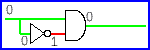
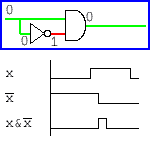
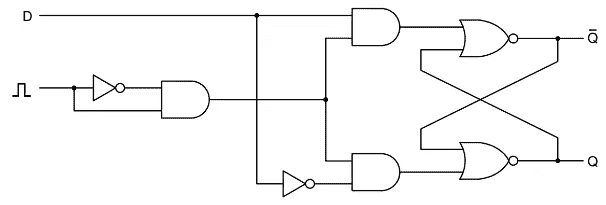

# 我制作了这个动画来向我的学生解释逻辑门和触发器

> 原文：<https://levelup.gitconnected.com/when-does-x-and-x-equal-true-177c87699a14>

简要介绍逻辑门和触发器

任何程序员都会说`x and !x`永远是假的。当然，如果`x`为真，那么`!x`为假，反之亦然。而`1 and 0`永远是`0`。

如果我说这不总是对的呢？我是说，不总是假的？此外，在计算机体系结构中，这经常被使用！

## 逻辑门基础

## 不

我们将使用两种类型的门:NOT 和 and。

非门

“非”门接受输入值并将其反转。因此，如果我们将 True (1)作为输入，我们将得到 False (0)作为输出，反之亦然。换句话说，它是一个`1-x`函数。

## 和

真真假假就是假

假的假的就是假的

真实和真实是真实的

只有当与门的两个输入都为真时，与门才为真。它相当于函数`x*y`，因为如果你把 0 乘以 1，或者 0 乘以 0，你得到 0。只有当你把 1 乘以 1，你才得到 1。

## 魔力

到目前为止够简单了。这是一个理论，这是很多开发者都知道的。开发人员通常不关心这些门的速度:

> 这些门需要时间来处理输入和改变输出。

让我们来看看非门动画。

仔细看。在一小段时间内，当从 1 切换到 0 或从 0 切换回来时，我们在门的两端有相同的值。

所以，我们已经有了一些魔法。短时间内我们有`!x==x`。

## 触发器

现在，你可能已经猜到了`x and !x`等于 True 是怎么回事:

当输入从 0 变为 1 时，非门还没有被触发，与门的两个输入都是 1。下一步，非门和与门一起被触发，我们在短时间内得到 1。

> 这样，与门的输入为`x`和`!x`。有时我们会输出一个真值。

让我们仔细看看:

这种逻辑电路叫做触发器。

## 我们为什么需要它？

在每台计算机中，我们都有一个所谓的总线时钟。它是一个以很高的频率将其值从 0 改变到 1 以及从 0 改变到 1 的单位。在这些转换之间，计算机上的所有导线都被设置为 0 和 1，准备保存到 RAM 或进行计算。处理器为下一次操作准备操作数，RAM 准备要传输给处理器的数据，依此类推。一旦每个人都准备好了，在时钟从 0 变到 1 的那一刻，操作就完成了。也就是说，“使能位”被设置为 1，这就是我们的触发器连接的地方。这些“使能位”启动操作。当它为零时，主板上的所有设备都在等待和准备，它们不接受任何输入并保持输出，直到时钟说“现在！”。

看这张照片:

D 触发器。图 3.26 摘自 Andrew S. Tanenbaum 的《结构化计算机组织》，第五版。

这里我们有一段记忆。为了保存一个新值，我们给`D`输入相应的 1 或 0。并且保持它直到左侧的触发器被触发。一旦触发，存储器从`D`读取数据并保存。从那一点开始，`Q`的值被改变，直到一个新值被保存。

假设，我们没有这个奇怪的带触发器的时钟。那么你如何知道`D`值是我们真正想要保存到内存中的，还是它已经保存了一些其他数据，可能正在被其他寄存器使用？还有，`D`输入本身不是内存，它保存要保存的信息，但之后它就失去了它的价值。

我希望这不是太无聊，你喜欢这篇文章。每个开发人员都应该知道他/她的计算机内部发生了什么。