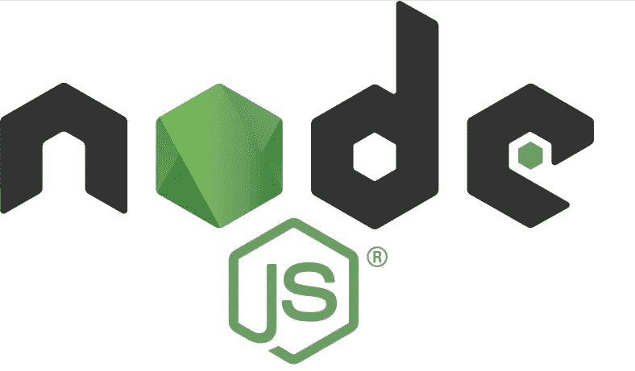
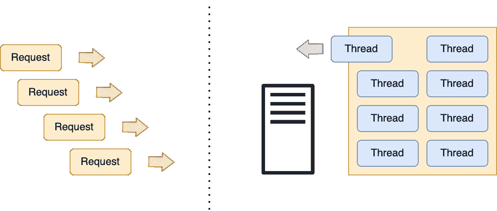
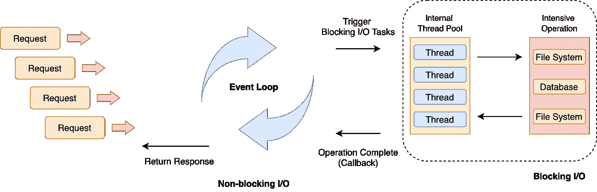
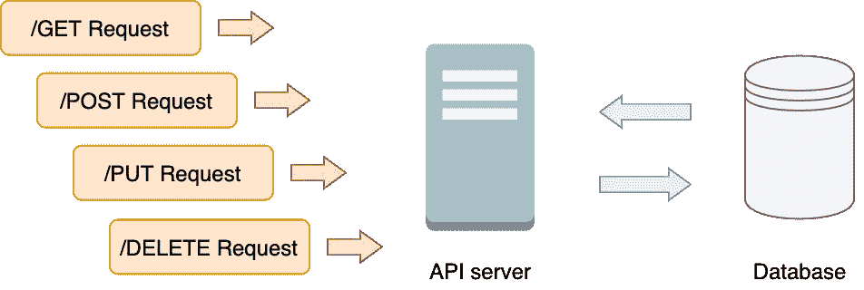
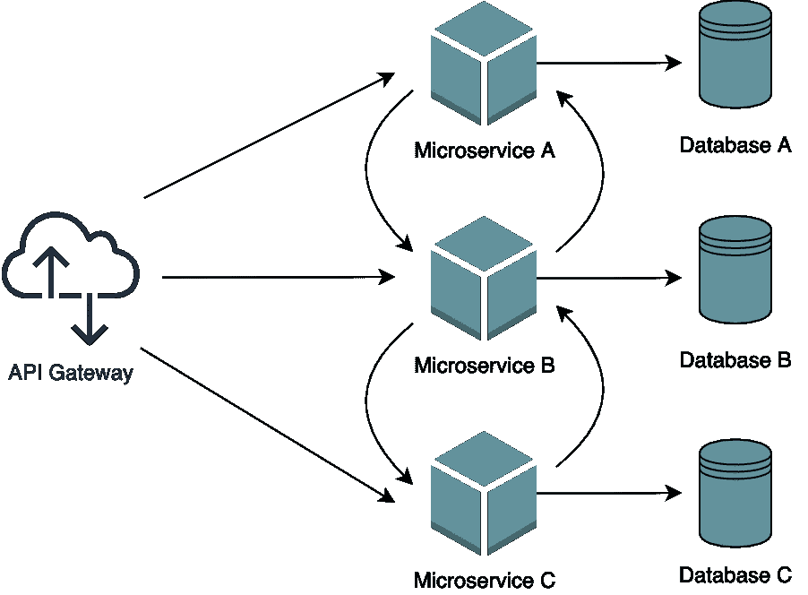

# 什么时候应该使用 Node.js？

> 原文：<https://levelup.gitconnected.com/when-should-you-use-node-js-727c7d97fd09>

## 有时候用它是个坏主意

有许多用于构建应用服务器的编程语言、开发平台、框架和工具。作为一名软件工程师，我们总是必须了解优点和缺点，并根据我们的需要决定何时使用哪种编程语言或工具。

传统 web 服务器模型

Node.js 兴起之前，大部分服务器都是遵循**传统 web 服务器模式**。在传统的 web 服务器模型中，有一个线程池维护多个线程来处理传入的请求。每个请求将由线程池中的特定线程处理。一旦一个线程被分配来处理一个传入的请求，它将返回线程池，直到它完成执行并返回一个响应。如果没有线程来完成请求，那么请求需要等待下一个可用的线程。

近几十年来，Node.js 不仅在初创企业，也在企业公司中迅速发展。亚马逊、网飞、易贝、LinkedIn、Paypal 等科技巨头都依赖 Node.js 作为他们的应用开发环境。

虽然选择 Node.js 进行服务器端开发似乎是一种趋势，但是在您的下一个项目中使用它之前，我们需要了解它到底是什么以及它的优缺点。

# Node.js 是什么？

Node.js 于 2009 年首次发布，我相信大多数开发人员都听说过它，并且可能正在将其用作 web 服务解决方案。但并不是每个人都真正了解它的特性。

## 运行时环境

首先，Node.js 不是编程语言或框架，而是一个 **JavaScript 运行时环境**。使用 Node.js，Javascript 代码可以在没有浏览器的情况下执行，这鼓励开发人员仅使用 JavaScript 构建全栈应用程序。

## **非阻塞 I/O 事件循环**

Node.js 与传统 web 服务器的另一个主要区别是 **Node.js 运行在一个带有事件循环**的单线程上，以执行非阻塞 I/O 操作。

Node.js 事件循环在其单线程上执行 Javascript 代码，并异步处理请求。如果请求由阻塞 I/O 任务组成，事件循环会将任务传递给内部线程池来处理任何密集型操作。一旦操作完成，负责的线程将通知事件循环。

这是 Node.js 的特性，它允许您分配更多的系统时间和内存来处理请求，而不是将空间和时间开销浪费在线程上(即上下文切换)。

总而言之:

*   Node.js 是一个 **Javascript 运行时环境**
*   Node.js 有一个**事件循环**来处理非阻塞和事件驱动的 I/O 操作

# 什么时候用 Node.js？

现在我们对 Node.js 有了一个简单的了解。让我们看看如何利用它的优势来最大化我们的应用程序性能。

## API 应用程序

对于用关系和非关系数据库构建 API 应用程序，Node.js 也是一个很好的选择。

Node.js 为什么适合？都是因为有事件循环的**单线程。这使得:**

*   Node.js 在单线程上运行，这使得处理多达 10，000 个并发请求变得更加容易
*   所有阻塞的 I/O 任务(即数据库访问)总是由内部线程异步处理，而不会中断主线程

这使得 Node.js 可以很好地处理请求、进行数据库操作以及为客户端公开 JSON 对象。过去，有人说 Node.js 只适合非关系数据库，因为缺少关系数据库的 ORM。但是现在有很多成熟的 ORM 解决方案，如[序列](https://sequelize.org/master/)来查询和操作关系数据库中的数据。

## 实时应用

由于事件驱动和异步的特性，Node.js 擅长构建实时应用程序，如消息传递、通知交付、直播和协作工具。

让我们以消息应用程序为例。消息应用程序是:

*   轻量级选手
*   高流量
*   数据密集型，但需要少量计算能力

Node.js 非常适合实现消息传递应用程序。

[Socket.io](https://socket.io/) ，一个用于实时和双向通信的 JavaScript 库，可用于更容易和更快地构建消息应用程序。它使用带有 HTTP 长轮询的 [WebSocket](https://en.wikipedia.org/wiki/WebSocket) 协议作为后备选项，不仅提供消息传递功能，还提供二进制流、文档协作和实时分析功能。

## 微服务

除此之外，Node 还可以用于构建微服务——一种基于将应用程序构建为小型服务集合的架构方法。每个微服务都有自己的数据模型，管理自己的数据。

构建微服务的编程语言有很多。其中一个就是 NodeJS。那么，Node.js 的特性如何让它成为微服务的最佳选择之一呢？

*   Node.js 将 I/O 任务分配给内部 IO 线程，而不会阻塞主线程
*   Node.js 使用可以高度解耦的事件驱动架构

有了微服务，大规模的系统可以分解成小块的微服务，并独立部署。每个微服务可以有更高的自主性，可以自由伸缩。

# 什么时候不用 Node.js？

然而，每种编程语言都有其缺点。

## CPU 密集型任务

当涉及到繁重的计算时，Node.js 并不是最好的解决方案。运行在单线程上的事件循环在处理 CPU 密集型任务方面很弱。

事件循环负责来自客户端的每个传入请求，并将 I/O 任务传递给内部线程。但是，这个事件循环运行在一个线程上。当线程被所有其他任务阻塞时，传入的请求必须等待线程被解除阻塞才能被处理。

# 结论

毫无疑问，Node.js 与传统的 web 服务器模型非常不同。它的事件循环尽可能将 I/O 操作卸载到系统内核。然而，我们必须意识到其事件循环的弱点。**千万不要用 Nodejs 来解决计算伸缩问题**。

希望你对 Node.js 的特点有更好的了解，以及什么时候应该使用。

要了解更多关于我的后端学习路径，请点击这里查看我的旅程:

 [## My Backend Developer Learning Journey 我的後端學習之旅

### 毕业一年多了。拥有 2 年以上的前端和后端工作经验…

mattchw.medium.com](https://mattchw.medium.com/my-backend-developer-learning-journey-%E6%88%91%E7%9A%84%E5%BE%8C%E7%AB%AF%E5%AD%B8%E7%BF%92%E4%B9%8B%E6%97%85-5315fe2fefc2)