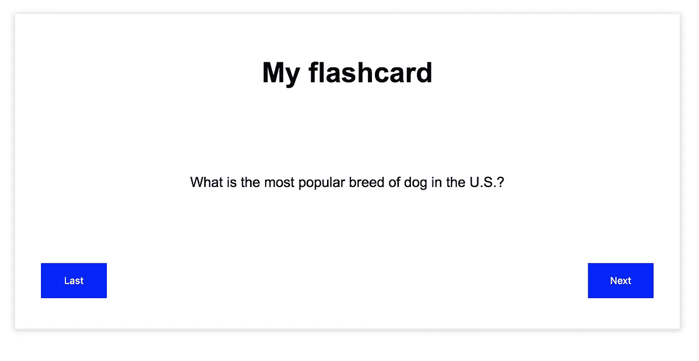

# CSS Flexbox 与 CSS 网格

> 原文：<https://levelup.gitconnected.com/when-to-use-css-flexbox-vs-grid-or-both-c1a5f01dc88a>

## 何时使用一个而不是另一个…或者两个都用！


你还记得花了几个小时摆弄位置、浮动和表格来设计你的网页吗？

谢天谢地，那些日子已经过去了。

当 CSS Flexbox 和 Grid 被引入时，它改变了我们开发网页的方式。我们不再花费宝贵的时间去弄清楚为什么我们的`float: left`不工作，或者仅仅为了使用他们的网格系统而引入 Bootstrap。

不幸的是，很难确定什么时候应该使用 Flexbox，什么时候应该使用 Grid。今天，我们将看看一些关键标识符以及一些示例应用程序，以便您可以有效地布局您的网页。

# Flexbox

一个常见的误解是应该使用 CSS Flexbox 来布局整个 web 应用程序。虽然这个*可能*是真的(取决于内容)，但最有可能的是你没有正确使用 Flexbox。

> Flexbox 布局最适合应用程序的组件和小规模布局，而[网格](http://css-tricks.com/snippets/css/complete-guide-grid/)布局适用于大规模布局。

Flexbox 在用于一维布局时确实大放异彩:也就是说，你不用试图沿着 x 轴和 y 轴定位元素。

让我们来看几个使用 CSS Flexbox 的用例。

## 例子 1:一个电子书架

比方说，你想开发一个非常简单的电子书架，记录你收藏的所有电子书。这将简单地在一个长列表中显示书籍，每行不超过 5 本。我们可以用 Flexbox！


以下是原则:

*   这些书将被包含在具有`display: flex`、`flex-wrap: wrap`和`justify-content: space-between`的包装部分中。这将确保在添加更多图书时，如果当前行没有空间，它们将换行。每本书在相邻书之间也有空间。
*   每本书都会有`display: flex`、`flex-direction: column`和`align-items: center`。这将确保标题、作者和图像都居中。

## **示例 2:图库动画**

假设你有五件想要在 hover 上种植的物品。也许这些是主页上的方框，或者它们是模糊显示内容的图像。我们可以使用 flexbox 轻松增加 hover 上的内容。


正规状态


悬停在中间元素上

以下是原则:

*   在容器类上添加一个`display: flex`和`justify-content: center`。
*   在元素类悬停时，设置`flex-grow: 1`。这将给被悬停的元素两倍于其他元素的空间。
*   为了使这个过渡平滑，在 item 类上添加一个`transition: flex-grow .1s linear`。

幸运的是，Flexbox 得到了很好的支持。所以今天就开始使用吧！


Flexbox 浏览器支持

如果你想要更深入的 Flexbox 教程，[请访问我的博客文章](https://medium.com/@emmabostian/css3-flexbox-the-cool-kid-on-the-block-cca8141cbee9)。

# CSS 网格

与 Flexbox 不同，CSS Grid 使您能够轻松创建二维布局。它有一些很棒的特性，比如能够给网格线/区域添加语义名称，并允许您使用`repeat()`函数重复列或行声明。

然而，网格并不意味着要取代 Flexbox。对于简单的一维布局，网格有太多的开销。让我们来看几个例子。

## 示例 1:抽认卡

假设您正在开发一个应用程序来练习抽认卡。



我们可以使用 flexbox，但是我们需要两个 flex 容器。嗯…让我们试试网格。


以下是原则:

*   有一个带有抽认卡类的容器，并在 CSS 中设置以下属性:

```
.flashcard
  **display**: grid
  **grid-template-columns**: [back-btn-start] 75px [back-btn-end main-content-col-start] calc(100% - 150px) [main-content-col-end next-btn-start] 75px [next-btn-end]
  **grid-template-rows**: [title-start] 75px [title-end main-content-row-start] calc(100% - 125px) [main-content-row-end btn-row-start] 50px [btn-row-end]
  **justify-items**: center
  **align-items**: center
```

这将创建一个包含以下区域的网格:


从这里，我们可以指定每个元素的网格区域:

```
.title
  **grid-column:** main-content-col-start / main-content-col-end
  **grid-row:** title-start / title-end.content
  **grid-column:** main-content-col-start / main-content-col-end
  **grid-row:** main-content-row-start / main-content-row-end

.back-btn
  **grid-column:** back-btn-start / back-btn-end
  **grid-row:** btn-row-start / btn-row-end

.next-btn
  **grid-column:** next-btn-start / next-btn-end
  **grid-row:** btn-row-start / btn-row-end
```

现在，每个元素都有一个家。

## 示例 2: Mosiac

CSS Grid 使得用 HTML 和 CSS 快速开发马赛克风格的模式变得非常容易。你所需要做的就是定义一个 5x5 的网格，并给每个方块分配一个网格区域。


带网格的马赛克

以下是原则:

*   使用以下网格定义一个 mosiac 容器

```
.mosaic__container
  **display:** grid
  **height:** 300px
  **width:** 50%
  **grid-template-columns:** repeat(5, 100px)
  **grid-template-rows:** repeat(5, 100px
```

*   接下来，定义镶嵌网格区域

```
 &--1
    background-color: #F5AB99
    grid-column: 1 / span 1
    grid-row: 1 / span 1
    z-index: 999 &--2
    background-color: #AED9DA
    grid-column: 2 / span 1
    grid-row: 2 / span 1

  &--3
    background-color: #FF7E5F
    grid-column: 3 / span 1
    grid-row: 3 / span 1

  &--4
    background-color: #765285
    grid-column: 4 / span 1
    grid-row: 4 / span 1

  &--5
    background-color: #FEB47B
    grid-column: 5 / span 1
    grid-row: 5 / span 1 &--6
    background-color: #F5AB99
    grid-column: 5 / span 1
    grid-row: 1 / span 1

  &--7
    background-color: #AED9DA
    grid-column: 4 / span 1
    grid-row: 2 / span 1

  &--8
    background-color: #FF7E5F
    grid-column: 3 / span 1
    grid-row: 3 / span 1 &--9
    background-color: #765285
    grid-column: 2 / span 1
    grid-row: 4 / span 1

  &--10
    background-color: #FEB47B
    grid-column: 1 / span 1
    grid-row: 5 / span 1
```

您也可以为每个块定义一个 mixin 和`@include`,但是为了详细起见，我显式声明了每个块的属性。

对于 Grid 来说，浏览器支持是相当不错的，但是在正式发布之前，一定要仔细检查你的浏览器是否受支持！


浏览器对网格的支持

# 让我们两个都用

最后，让我们看一个可以同时使用 Flexbox 和 Grid 的示例项目！我们要定义一个投资组合。


使用网格和 Flexbox 的投资组合布局

以下是原则:

*   用以下网格将内容包装在`div`中:

```
.grid
  **display**: grid
  **grid-template-columns:** [aside-start] 250px [aside-end main-col-start] calc(100vw - 250px) [main-col-end]
  **grid-template-rows:** [nav-start] 75px [nav-end main-row-start]     750px [main-row-end footer-start] 75px [footer-end]
```

*   给页面的每个区域(页眉、侧边、页脚、主页面)分配网格区域

```
.header
  **grid-column:** aside-start / main-col-end
  **grid-row:** nav-start / nav-end.main
  **grid-row:** main-row-start / main-row-end
  **grid-column:** main-col-start / main-col-end.aside
  **grid-row:** main-row-start / footer-end
  **grid-column:** aside-start / aside-end .footer
  **grid-row**: footer-start / footer-end
  **grid-column:** aside-start / main-end
```

*   使用 flexbox 在页眉中均匀地布局导航项目

```
.nav__list
  display: flex
  justify-content: space-around
  align-items: center
```

你也应该对页脚的社交媒体链接做同样的事情。

通过结合使用 Flex 和 Grid，我们创建了一个非常强大的布局，并且易于实现。

# 结论

希望现在你已经开始理解使用 Flexbox 和 Grid 的不同用例。理解这些不同的场景是很重要的，这样你就可以快速方便地设计你的网页。要了解更多信息，请点击下面的链接。

# **资源**

**我的 CSS Flexbox 指南:**[https://medium . com/@ emmabostian/css3-Flexbox-the-cool-kid-on-the-block-CCA 8141 cbee 9](https://medium.com/@emmabostian/css3-flexbox-the-cool-kid-on-the-block-cca8141cbee9)

【https://flexboxfroggy.com/】Flexbox Froggy:T6

**格子花园:**[https://cssgridgarden.com/](https://cssgridgarden.com/)

**Flexbox 防御:**http://www.flexboxdefense.com/

**网格完全指南:**[https://css-tricks.com/snippets/css/complete-guide-grid/](https://css-tricks.com/snippets/css/complete-guide-grid/)

**Flexbox 完全指南:【https://css-tricks.com/snippets/css/a-guide-to-flexbox/】T22**

如果你喜欢这篇文章，请给它一两下掌声，然后关注我！