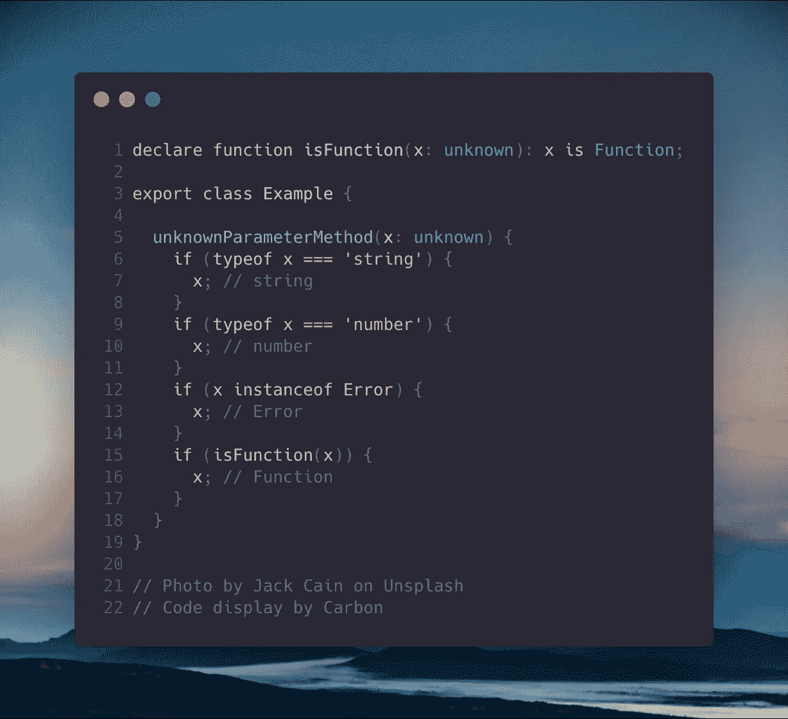
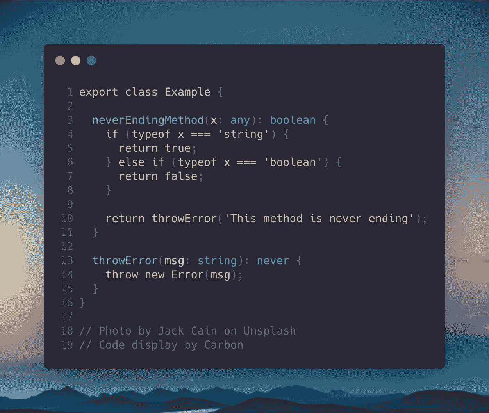
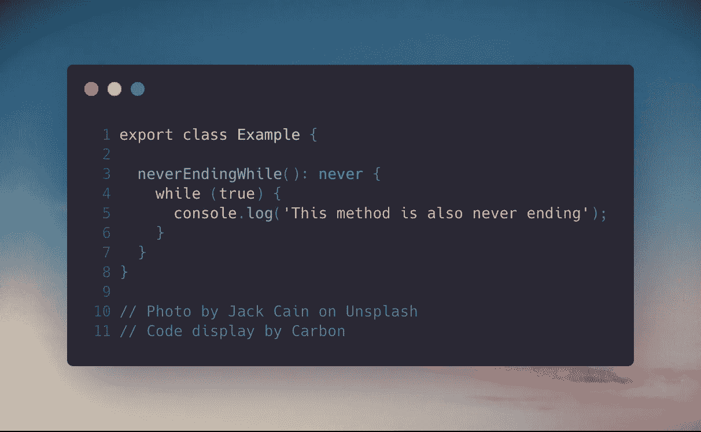

# 何时在 TypeScript 中使用“未知”和“从不”类型

> 原文：<https://levelup.gitconnected.com/when-to-use-unknown-and-never-types-in-typescript-6cd4a54b79b7>

由 [Max Nelson](https://unsplash.com/@maxcodes?utm_source=medium&utm_medium=referral) 在 [Unsplash](https://unsplash.com?utm_source=medium&utm_medium=referral) 上拍摄的照片

有两种类型是使用 TypeScript 的人通常不知道的，或者知道但从未使用过的…你看到我在那里做了什么吗？这篇博客只是简单地解释了如何以及何时可以使用这些类型。

# 这两种类型是

*   未知的
*   从不

## 使用的先决条件

*   TypeScript 3+为`unknown`类型
*   TypeScript 2+为`never`类型

# 未知类型

`unknown`型通常用来避免`any`型。我们不是没有类型或任何类型，而是将它分配给`unknown`。分配给这种类型的所有内容都会导致错误，除非您在某个时候将它分配给另一种类型。

所以基本上我们一开始不知道类型，但是**需要**稍后将它分配给一个已知的类型。现在，您被迫键入 check。

## `unknown`类型的示例:

# 从不型

使用`never`类型，我们可以检测不可到达的代码，或者检查一个函数/方法是否在应该返回的时候没有返回任何东西。有三种使用方法；

*   当函数/方法有返回类型时，它从不返回值
*   函数/方法总是会抛出错误
*   分配给`never`类型属性的函数/方法

## `never`型的例子:

如果我们不在`neverEndingMethod`中传递一个字符串或布尔值作为参数，那么它总是会抛出一个错误。

## 类型“never”与“void”不同

不同的是:

*   一个不返回任何东西的函数/方法，可以有返回类型:`void`。也可以赋值。
*   一个函数/方法，当它应该返回某个东西时，从不返回值，或者总是抛出一个错误，那么它可以有返回类型:`never`。它只能分配给另一个`never`。

# 感谢您的阅读！我的 [Github](https://github.com/jeroenouw/) 。如果你觉得这篇文章有用，可以考虑看看我的其他文章:

 [## 角度 10-与其他元件共享元件数据

### 使用 Angular 的输入、输出、EventEmitter 和 ViewChild 共享组件数据。

medium.com](https://medium.com/datadriveninvestor/angular-7-share-component-data-with-other-components-1b91d6f0b93f)  [## 理解 TypeScript 中的 Async/Await——只需几分钟

### 让我们不要浪费时间，快速了解 TypeScript 中的 async/await

medium.com](https://medium.com/@jeroenouw/understand-async-await-in-typescript-in-only-a-few-minutes-dedb5a18a2c)