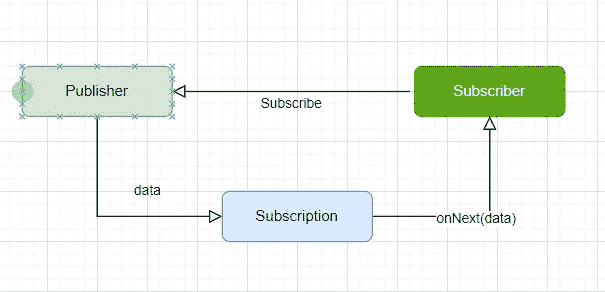
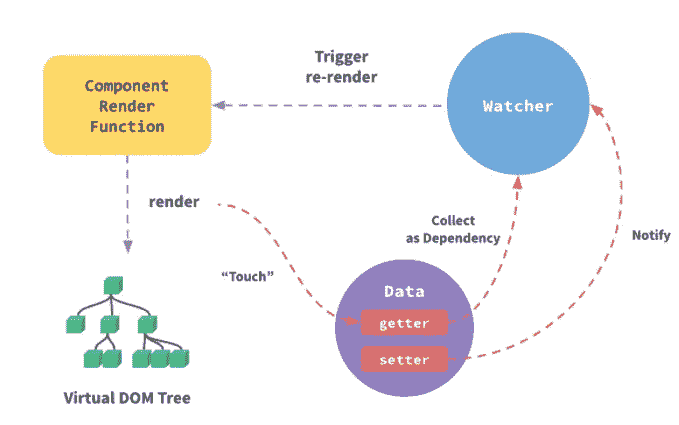

# 当 Vue 遇到代理

> 原文：<https://levelup.gitconnected.com/when-vue-meets-proxy-402e9e3c6722>

## 检查 vue 的内部。JS 揭示它如何使用代理来实现反应


照片由[克里斯蒂娜@ wocintechchat.com](https://unsplash.com/@wocintechchat?utm_source=unsplash&utm_medium=referral&utm_content=creditCopyText)在 [Unsplash](https://unsplash.com/s/photos/meet?utm_source=unsplash&utm_medium=referral&utm_content=creditCopyText) 上拍摄

反应性是每个现代 JavaScript 框架的基本特征，Vue.js 也不例外。但是反应性到底是什么意思呢？有很多不同的答案。其中许多都过于复杂和混乱。

让我试着简单解释一下。

向前跳:

*   [Vue 2 数据反应性](#e9c0)
*   [Vue 3 中的代理](#f598)
*   [ES6 中的代理](#7735)
*   [代理如何在 Vue 3 中工作](#8c49)

## 反应

反应性是让你的程序以声明的方式对异步数据流做出反应的能力。

反应性的典型例子如下:



上图通过 Rxjs 说明了反应性。订阅者(即 UI 组件)订阅发布者(即可观察)。当状态发生变化时，发布者将使用`.next`推送数据流，订阅者接收数据并对数据变化做出反应。

Vue.js 如何实现反应性？我们来看看 Vue 2。

## Vue 2 数据反应性

在 Vue 2 中，数据反应是通过遍历数据并利用`Object.definedProperty()`将其属性转换为 getter/setter 来实现的。它通过一个定制的 getter 收集数据依赖，并在一个定制的 setter 中监视数据更改和订阅事件。



图片来源:[https://vuejs.org/v2/guide/reactivity.html](https://vuejs.org/v2/guide/reactivity.html)

下面是 Vue 2 源代码关于反应性实现的要点。

该代码块是从`defineReactive`函数*中提取的。当初始化`Observer`时，数据对象的所有属性都调用`*defineReactive*`函数。您可以看到 getter 被定义为收集依赖项，该设置将监视数据更改并在检测到更改时发送通知。*

虽然上述机制有效，但它确实存在一些问题。两个主要的是:

*   **无法检测属性**的删除或添加。反应仅在应用程序初始化时应用。当您在运行时添加一个新属性时，这个新属性将不会是被动的。换句话说，属性值的改变不会触发反应性副作用。Vue 2 确实提供了一种变通的`.set`方法，允许开发人员手动添加一个属性来进行反应。
*   **性能**:对于一个大的和/或嵌套的数据集，性能可能会受到负面影响，因为 Vue 2 需要横切所有属性的数据和创建 getter/setter。

## Vue 3 中的代理

在[尤雨溪](https://evanyou.me/)的文章“[过程:制作 Vue 3](https://increment.com/frontend/making-vue-3/) ”中，他提到重写的原因之一是利用新的语言特性，如“代理”。

> 其中最值得注意的是[代理](https://developer.mozilla.org/en-US/docs/Web/JavaScript/Reference/Global_Objects/Proxy)，它允许框架拦截对象上的操作。Vue 的一个核心特性是能够监听对用户定义的状态所做的更改，并反应性地更新 DOM。Vue 2 通过用 getters 和 setters 替换状态对象的属性来实现这种反应性。切换到代理将允许我们消除 Vue 现有的限制，例如无法检测新的属性添加，并提供更好的性能。

在 Vue 3 中，使用代理是解决 Vue 2 中反应性相关问题的关键。

## ES6 中的代理

在 ES6 中引入的[代理](https://developer.mozilla.org/en-US/docs/Web/JavaScript/Reference/Global_Objects/Proxy)支持在不直接访问对象的情况下定义自定义行为。它的工作原理是作为中间代理进行拦截。

代理的使用很简单。

```
const proxy = new Proxy(target, handler);
```

上述声明包括:

*   目标:要代理的对象
*   处理程序:它包含“陷阱”方法。它们是覆盖原始行为的函数。对于任何可用的基本操作，都有相应的陷阱。

下面的例子展示了如何使用代理基于`firstName`和`surName`创建`name`属性。

```
const handler = {
  get: function(target, name) {
    return name=== 'Name' ? '${target.firstName} ${target.surName}' : target[name];
  }
}

const p = new Proxy({firstName: 'Peter;, surName: 'Lee'}, handler)
console.log(p.name) // 'Peter Lee'
```

请注意，使用 Proxy 会创建一个新的代理实例，而不是更改原来的目标对象。

## Vue 3 中代理的工作方式

让我们来看看 Proxy 在 Vue 3 中是如何实现的。Vue 3 中反应性的核心在`createReactiveObject`功能中实现。

上述代码的要点是:

*   原始类型的数据将被直接返回，因为我们在这里只想处理对象。Vue 3 使用 [ref](https://v3.vuejs.org/api/refs-api.html) 来处理原始类型。在内部，它还利用了反应式代理对象。
*   如果对象已经有了相应的代理，我们直接返回缓存的代理。
*   推断目标对象类型，vue3 将只为数组、对象、贴图、集合、WeakMap 和 WeakSet 创建代理。目标类型之外的对象将被设置为无效并被返回。
*   创建新的代理对象，并在返回之前将其保存到`proxyMap` 缓存中。

Proxy 如何解决 Vue 2 反应性问题？

通过使用代理对象，任何访问或修改对象的调用都将被拦截。自定义操作是在 getter 和 setter 中定义的。比如在`createSetter` 函数中，处理的是添加属性。

如果该属性不存在(`hadKey` 为假)，则使用 trigger 方法通知依赖项添加了新属性。这解决了 Vue 2 中无法检测添加属性的问题。类似地，`deleteProperty` 处理程序操作解决了无法检测 Vue 2 中删除属性的问题。

使用 Vue 3 中 reactivity API 的代理实现，不需要遍历数据中的所有属性。这在处理大型数据集时带来了显著的性能提升。

## 结论

在本文中，我们讨论如何从 Vue 2 到 Vue 3 实现反应性。

代理是一个强大的 [*元编程*](https://en.wikipedia.org/wiki/Metaprogramming) 特性。Vue 3 中代理的应用是一个优雅的解决方案。它不仅解决了来自 Vue 2 的警告，而且还打开了进一步扩展的潜力。

了解内部机制将有助于您编写更好的代码。

如果你觉得这篇文章有用，你也可以看看下面这篇。

[](/typescript-compiler-and-compiler-api-part-1-4bb0d24a565e) [## TypeScript 编译器和编译器 API(第 1 部分)

### 解释了 TypeScript 编译器的内部

levelup.gitconnected.com](/typescript-compiler-and-compiler-api-part-1-4bb0d24a565e) 

编码快乐！