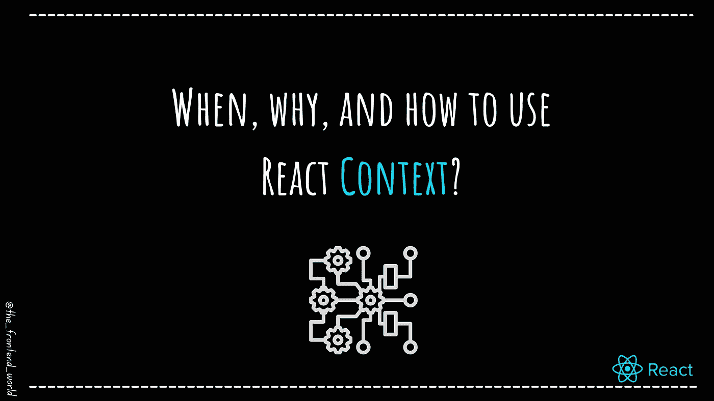

# 何时、为何以及如何使用 React 上下文

> 原文：<https://levelup.gitconnected.com/when-why-and-how-to-use-react-context-2f9832a3ebc4>

## React 中的上下文是什么？

作者:FAM

# 什么是反应上下文？

> “上下文提供了一种通过组件树传递数据的方式，而不必在每一级手动向下传递属性。”—做出反应

## 没有反应上下文…

当您需要告诉一个子组件由主体和根组件通知的状态变化时，我们将状态从一个组件传递到另一个组件，直到到达子组件。我们需要通知它这一变化。

*   **这个的问题:**

在某些时候，当我们从一个组件传递到另一个组件时，等等。我们有一种现象叫做道具训练。我们在改变状态的组件和需要知道的组件之间使用的组件本身不使用道具。他们只是传递它，直到它到达我们想要通知的子组件。

这些部件最终就像一座桥梁，通过 React props 传递数据。

## 使用 React 上下文挂钩…

Context 在 React 中的工作是在所有应用程序组件之间共享数据或应用程序状态。这意味着可以从任何组件访问道具。因此，不需要通过其他组件将它发送到我们的目标组件。更少的代码，更少的调试麻烦，以及更多的代码可见性。

# 何时使用 React 上下文

上下文旨在共享可被视为整个应用程序“全局”的数据。一个例子是 ***认证用户*** ，一个 ***主题*** ，或者 ***用户偏好*** 。

我已经在构建黑暗模式切换的实践指南中使用了上下文。如果您对我如何用 React 上下文实现这一点感兴趣，这里是:

 [## React 中的黑暗模式

### 如何在 react JS 中制作黑暗主题？

famzil.medium.com](https://famzil.medium.com/dark-mode-in-react-533faaee3c6e) 

**什么时候用语境好？标志:**

*   你想与不同嵌套层次的许多组件共享数据。(就像一个主题，例如，当您从白色变为黑色时，所有组件都需要切换它们的颜色、图标等等)
*   当同一个道具(数据)作为中间物通过几个组件传递时:

*   当状态被许多组件更改时，在这种情况下，每次更改都要手动将新数据传递给其他组件，这很复杂。将它们连接到同一个全局状态(一个真实的来源)会使代码更干净，更容易维护和调试。

> [来源](https://reactjs.org/docs/context.html#before-you-use-context)

# 如何使用 React 上下文？

*   `createContext()` API

*   将应用程序的主要组件包装在上下文中。`Provider`关键字是必不可少的。它表明这是我们道具和状态的全球供应商。

状态、道具数据在`value`属性中传递。我可以只发送`myTitle`道具，但是我想展示我们可以为多个道具传入字符串和对象。

*   访问共享状态和属性:

注意，我们这次使用了`useContext()`钩子来访问道具。这个钩子需要我们到目前为止创建的上下文来获取共享数据。

# 主题示例

如果你读过关于黑暗模式的文章，你可能已经注意到我用了`MyContext.Consumer`。

这是因为，在每次按钮切换之后，我需要更新上下文。该动作由组件树中某处的嵌套组件(本例中的 ToggleDark 组件)触发。在这种情况下，您可以通过上下文向下传递一个函数，以允许使用者更新上下文。

黑暗主题示例中传递的函数是`changeTheme`:

如果你喜欢这篇文章，并希望我介绍其他的 React 挂钩，请在评论中告诉我👇

 [## 如果你喜欢看我的文章...♥️

### 如果你喜欢看我的文章...♥️，当我的文章发表时，欢迎你第一个得到通知…

famzil.medium.com](https://famzil.medium.com/subscribe) 

> 谢谢你，❤

如果你有兴趣成为付费会员，你可以使用我的推荐链接。下次见

亲爱的读者，感谢你在我生命中的存在。

**让我们在** [**中**](https://medium.com/@famzil/)**[**Linkedin**](https://www.linkedin.com/in/fatima-amzil-9031ba95/)**[**脸书**](https://www.facebook.com/The-Front-End-World)**[**insta gram**](https://www.instagram.com/the_frontend_world/)**[**YouTube**](https://www.youtube.com/channel/UCaxr-f9r6P1u7Y7SKFHi12g)**或**上取得联系************

**参见我的关于网络要素和一般文化的电子书。**