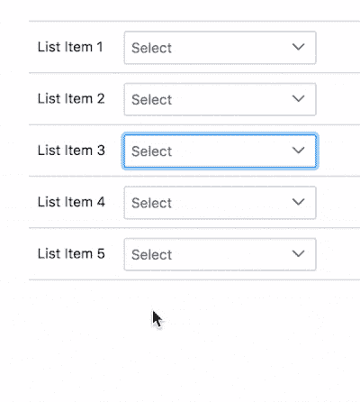
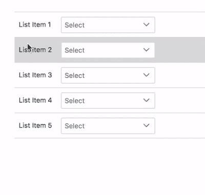
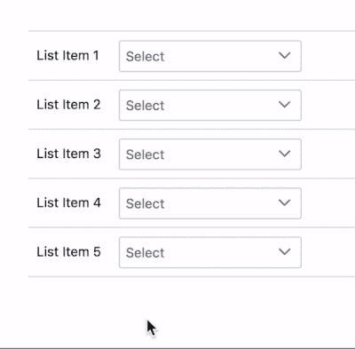
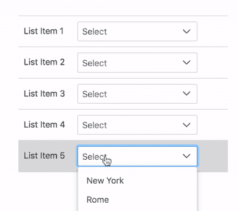

# 如何处理没有冒泡到文档的点击事件

> 原文：<https://levelup.gitconnected.com/when-your-click-listener-on-document-just-doesnt-get-the-message-e010072a4cc3>

## 用 Angular & RxJS 中的自定义事件流替换文档上的事件侦听器，以实现更好的控制

照片由 [MattiaATH](https://www.shutterstock.com/g/mattiaath) 在 [Shutterstock](https://www.shutterstock.com/image-photo/bottlenose-dolphin-tursiops-truncatus-blowing-bubbles-430202206) 上拍摄

# 最初快乐的场景

我最近遇到的一个有趣的场景是一个条目列表，每个条目包含一个下拉列表，如下所示:

每个列表项都是一个名为`ListItemComponent`的组件的实例。

dropdown 是一个 [PrimeNG Dropdown](https://www.primefaces.org/primeng/showcase/#/dropdown) ，和所有好心的组件开发者一样，PrimeNG 确保在下拉菜单外点击会触发它关闭。

他们通过[在`document`上附加一个点击事件监听器](https://github.com/primefaces/primeng/blob/master/src/app/components/dropdown/dropdown.ts#L1088)来实现这一点，当点击菜单外时，监听器会关闭菜单。

这一切都很好，直到情况发生了微小的变化。

# 麻烦制造者的场景

当列表项被扩展以允许可扩展/可折叠的细节行时，我们的快乐场景变成了一个麻烦制造者，如下所示:

你会问，为什么是麻烦制造者？很棒的问题！原因如下:

单击下拉气泡直至列表项摘要行，并触发详细信息行的展开/折叠。

用户体验非常差。非常非常非常糟糕。

# 寻找解决办法

最显而易见的解决方法是点击下拉菜单中的`stopPropagation`,以防止冒泡。

这给了我们:

这修复了不必要的细节行的展开/折叠，但是引入了一个新的问题:多个下拉菜单现在可以同时打开了！

当我们停止下拉菜单上的点击传播时，`document`上的点击监听器永远不会收到点击事件，因此不会关闭它们相关的下拉菜单。

# 不同的方法

为了解决这个问题，我们需要建立一个更可靠的事件通知系统，不能被一个无辜插入的`stopPropagation`所阻挠。

因为我们需要在可能不属于同一父子树结构的组件之间进行通信，所以我们需要寻找一个角度服务。

# 角服务& RxJS 来救援！

我们可以轻松地构建一个服务，作为与该接口相关的所有事件的通信中心。

下拉菜单上的点击事件可以报告给服务，服务可以通过 Observables 通知订阅者这些点击事件。

该服务的简单版本如下所示:

兴趣点:

*   该服务公开了一个名为`events$`的可观察对象，每当调用该服务的`notify`方法时，该可观察对象就会发出一个`EventNotification`对象。
*   我们在服务内部使用 Subject(`_events$`)来发出事件，但我们并不直接公开它，我们保留它`private`并公开它的可观察形式，因为一般来说，订阅者不应该访问原始 Subject，除非他们也将从它发出事件，但这里的情况不是这样。
*   我们创建了一个名为`EventType`的枚举，它目前只有一个成员事件`ListItemDropdownOpened`，但是当我们添加其他事件时，它将有助于保持组织有序。
*   我们创建了一个名为`EventNotification`的类型，它有一个用于`EventType`的`type`属性和一个可选的`details`属性。
*   可选的`details`属性属于`EventDetails`类型，它目前有一个可选属性`componentInstance`，该属性将指示事件中涉及了哪个`ListItemComponent`实例。订阅者将需要这些信息，以便他们知道他们是否收到了关于他们自己或关于不同的`ListItemComponent`实例的通知。

# 订阅事件

下面是我们的`ListItemComponent`如何订阅我们新服务的`events$`可观察内容并做出相应反应:

兴趣点:

*   我们创建了一个名为`otherDropdownOpened$`的可观察对象，它过滤服务的事件流中与`ListItemComponent` *实例相关联的`ListItemDropdownOpened`类型的事件，而不是*这个实例。
*   在接收到一个被过滤的事件时，我们通过调用`this.dropdown.hide()`来关闭下拉菜单。(这恰好是 PrimeNG 的 API，用于以编程方式关闭下拉菜单，当然，其他 API 可能会有所不同。)

# 触发事件

在前面的`ListItemComponent`代码示例中，您可能注意到我在剧透中泄露了文章的这一部分:一个名为`onShowDropdown`的方法调用了`EventNotificationService`的`notify`方法。

这是:

`notify`方法接受一个`EventNotification`对象。在那个对象上，我们将`type`设置为`ListItemDropdownOpened`(使用`EventType`枚举)，在`details`中，我们将`componentInstance`设置为`this`，这是对`ListItemComponent`实例的引用。

当组件的下拉菜单打开时，调用`onShowDropdown`方法。在我们的场景中，它是一个原始的下拉列表，所以我们的组件的模板看起来像这样，挂钩到下拉列表的`onShow`事件:

但是基本的想法是，你的组件将有某种方式知道它的下拉列表何时被打开，这样它就可以通知服务。

# 扩展服务

当您用更多的事件类型扩展服务时，您可以通过创建有用的预定义事件包来增强它，如下所示:

如果某些组件(如下拉菜单)需要对任何类型的组件打开本身做出反应，那么`allComponentOpenedEvents$`可观察性将对它们有用。

然后，如果有一天您添加了一个同样“打开”的新组件，您可以简单地将它的`EventType`添加到过滤器中，而不必查找和更新每个侦听组件“打开”事件的订阅者。

# 结论

下面是一个带有工作代码的 StackBlitz:

我希望这能提供一些有用的信息和想法。

勇往直前吧！

罗伯特·博德纳尔 T 在 [Shutterstock](https://www.shutterstock.com/image-photo/dog-stream-woods-704947561) 上拍摄的照片