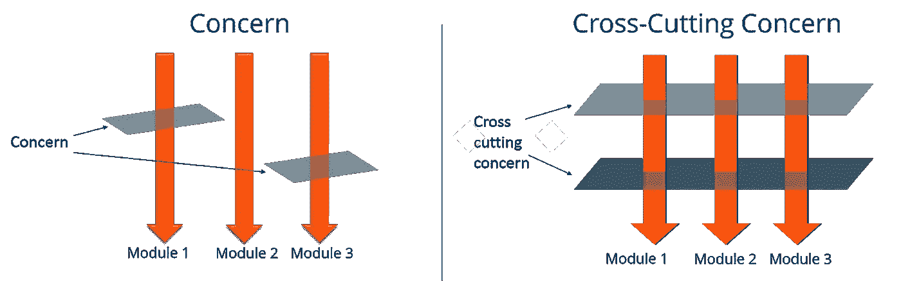
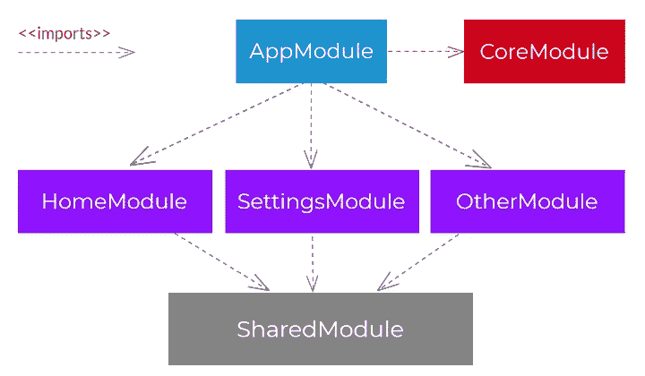

# “我该把它放在哪里？”—核心模块与角度共享模块

> 原文：<https://levelup.gitconnected.com/where-shall-i-put-that-core-vs-shared-module-in-angular-5fdad16fcecc>

## Angular 中核心和共享模块的主要特征，pro 提示和技巧，以及确定将 Angular 代码放入哪个模块的经验法则


照片由[罗曼·科瓦尔](https://www.pexels.com/@kovalrk?utm_content=attributionCopyText&utm_medium=referral&utm_source=pexels)从[派克斯](https://www.pexels.com/photo/brown-wooden-blocks-on-dark-blue-surface-3783425/?utm_content=attributionCopyText&utm_medium=referral&utm_source=pexels)拍摄

决定未来可维护性和代码清晰性的每个系统的一个重要方面是它的模块化结构，不管系统大小如何。本文将快速总结 Angular 应用程序中`core`和`shared`模块的用途，回答一些更深层次的相关问题，并介绍一条开发 Angular 应用程序时可以使用的经验法则。

关于它的模块化结构，Angular 是固执己见的，至少在其默认的代码生成器配置中是这样。Angular Style Guide 来自 Angular states 的创建者，他们提供了编写他们认为制作精良的单页应用程序所需的所有哲学和指导方针。

*现在，遵循风格指南的理由是什么？*

1.  大量的应用程序随之而来— *如果你遵循风格指南，新的团队成员在加入你的团队时不会有问题*,因为他们可能在过去也遵循过。这一点很重要，尤其是在人员变动很大的团队中，不管原因是什么。
2.  这份风格指南是由软件开发领域的专家整理出来的——在一句简单的话“用那种方式写/做 X”背后，肯定隐藏着许多事实和经验。
3.  *Angular CLI、linter 和 Angular 周围的更多工具将为您开箱即用*，无需任何额外的麻烦、定制生成器和浪费在重新发明轮子上的时间。

# 📦核心模块

你的`core`模块应该包含特定于你的应用程序的代码，并且实现你的应用程序的横切关注点——也就是你的房子的*“管道、电力和供暖”*,如果你愿意的话，可以把构建一个应用程序比作建造一座房子。这种代码例如可以是:

*   自定义错误处理程序，
*   用于特定于授权/环境的头的 HTTP 拦截器，
*   包装核心 Angular APIs 的服务，如`HttpClient`(一种常用于减少未来 Angular 接口变化影响的技术)，
*   日志服务。



贯穿各领域的问题。来自 edureka 的 code.reaper12！。

最后但同样重要的是，`core`模块应该被单独导入到你的根 Angular 模块中，比如`AppModule`，不管你给它起什么名字。

## 💂‍♀️核心模块输入防护装置

记住，*`*core*`*模块应该单独导入到你的*根角模块中。*

*实现这条规则的一个简单方法是在你的`CoreModule`类的代码中添加所谓的*导入保护*。下面的代码片段描述了一个示例实现:*

*可重复使用的进口保护级*

*上面的代码声明了一个类，该类封装了一个行为，用于在模块被导入到根应用程序模块之外的其他地方时抛出运行时异常。其用法相当简单，如下所示:*

```
*[@NgModule](http://twitter.com/NgModule)({
    declarations: [...],
    imports: [...],
    exports: [...],
    entryComponents: [...],
    providers: [...]
})
export class CoreModule **extends EnsureImportedOnceModule** {
    public constructor([**@SkipSelf**](http://twitter.com/SkipSelf)**()** [**@Optional**](http://twitter.com/Optional)**()** parent: CoreModule) {
        super(parent);
    }
}*
```

*`@SkipSelf`注释确保使用 `*CoreModule*`的模块的父模块*被 Angular DI 注入到`CoreModule`的构造函数中，而`@Optional`注释消除错误并强制 Angular DI 在该模块不可用的情况下提供`null`(即我们将`CoreModule`导入的模块位于 Angular 模块层次结构树的顶部)。总而言之，这意味着如果注入到`parent`参数中的值不是`null`，那么模块没有被导入到根应用程序模块中，代码将抛出一个运行时异常。**

*这只是实现导入保护的许多方法之一，其他方法本质上非常相似。*

# *🧰共享模块*

*你的`shared`模块应该包含有可能在你的应用中重用的代码，通常是你的*组件*、*指令*和*管道*。当把建造一个应用程序比作建造一所房子时，这可以比作你房子的装饰——家具可以在其他地方重复使用，而且可以在房子里四处移动。*

*与`core`模块相反，您的`shared`模块可以多次导入到您的应用程序中的许多不同模块。*

**

*共享与核心模块导入结构。来自 Angular Academy 的 Bartosz Pietrucha】。*

*因为你的`shared`模块中的代码可以被多次重用，并且将来可能在一个完全不同的应用程序中重用，所以向你的共享模块中引入更多的子模块是有利的——只要记住保持模块较小并分配它们各自的职责(例如一个模块用于*表单*、另一个模块用于*货币兑换*，另一个模块用于*数字格式化*等等)。).将你的`shared`模块的一部分用这样的模块化结构提取到一个单独的库中，在未来将是轻而易举的事情！*

## *等等…核心模块里没有组件？*

*嗯，这就是整个决策过程的模糊性*`*core*`*或者*`*shared*`*发挥作用的地方。是的，*就其本质而言，这些组件通常是可以重复使用的。但是——他们真的会被重用吗？那是你应该考虑的问题。像导航条、页脚、导航条/页脚布局、侧菜单等等。可能不会被重用，但所有这些都是组件。****

**任何特定于应用程序的代码，没有项目内的依赖性，在功能模块范围之外，即使它是一个组件、指令或管道，最有可能在`core`模块中结束。**

**这里只需要注意一点——项目内依赖关系是放在同一个项目(即应用程序)中但在不同(非核心)模块中的依赖关系。这个"*无项目内依赖"*条件是为了避免你在模块间声明循环依赖。**

## **那应该去特征模块还是共享模块？**

**如果你问自己这个问题，你通常应该考虑两件事:**

1.  **我们使用哪种开发方法？**
2.  **我的解决方案是否符合/违反我们团队的审核规则？**

**首先，在敏捷的工作环境中，如果你是一名开发人员，通常只考虑当前的功能需求来构建系统是有利的，也就是说*永远不要提前计划，而是使你的系统的模块化结构相对于当前的系统需求来说是正确的*——哦，当然了，*拥抱未来的持续重构*。**

**在非敏捷环境中，你绝对应该*考虑未来可能发生在你的系统上的事情*。比如技术方面的东西(谁以及如何整合我们——哪些模块可能会被整合？我们应该公开一个库还是一个支持 iframe 的部件？)或功能性的东西(我们对软件使用的看法在短期内会如何发展*？).如果很难做出这样的考虑，那么在软件设计阶段的最后，总是有可能回到这个问题。***

**请记住，如果您的模块化结构在评审阶段因为任何原因被拒绝，在您的团队中讨论这个问题总是最好的主意。**

# **🎁总结**

**您刚刚阅读了一些关于将代码放置到 Angular 应用程序的`core` / `shared`模块中的技巧。实际上，在某些场景*中，您关于将代码放入系统的这类模块的决定可能是模糊的*。这完全没问题！**

**然而，真正重要的是，整个团队理解你的决定，并且*在你的应用程序的模块化结构方面也是一样的*——毕竟，这都是团队合作的结果。**

**最后但同样重要的是，简介中承诺的经验法则:**

*   **代码是我的 app *(navbar，footer 等)独占的吗？)*它是否没有来自其他模块的项目内依赖关系？→ `core`**
*   **是不是“管道代码” *(Angular core API 包装器，错误处理程序，HTTP 拦截器等。)*？→ `core`**
*   **代码的职责*是打算*在许多地方重用吗？→ `shared`**
*   **这些规则对我的案子有冲突吗？→ *和队友讨论一下:)***

# **👓值得一看的文章**

**[](/auto-unsubscribing-in-angular-components-like-a-pro-742220b01d0c) [## 像专业人士一样自动退订角度组件

### 快速处理 unsubscribe()调用的 5 个技巧

levelup.gitconnected.com](/auto-unsubscribing-in-angular-components-like-a-pro-742220b01d0c) [](/handling-loading-indicators-in-angular-applications-the-right-way-11ff8b8896ba) [## 正确处理角度应用中的负载指示器

### 一个优雅的，没有麻烦的方式来摆脱无意义的技术管道在您的业务角组件。

levelup.gitconnected.com](/handling-loading-indicators-in-angular-applications-the-right-way-11ff8b8896ba) [](/this-angular-technique-will-significantly-lower-code-duplication-in-big-projects-28fd62c3eadd) [## 这种角度技术将显著降低大型项目中的代码重复

### 告别大型项目中 ng 模板的代码重复和性能问题

levelup.gitconnected.com](/this-angular-technique-will-significantly-lower-code-duplication-in-big-projects-28fd62c3eadd)**