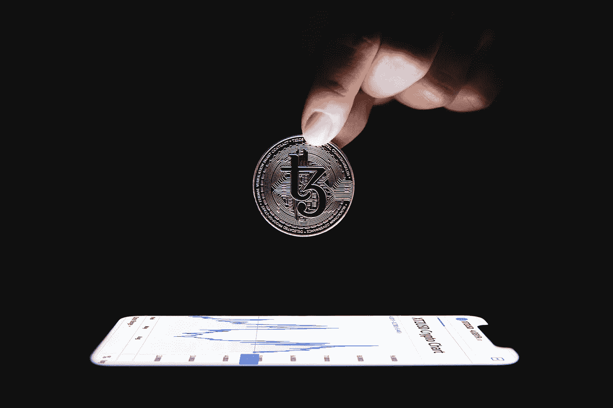

# 你应该把加密货币放在哪里？

> 原文：<https://levelup.gitconnected.com/where-should-you-keep-your-cryptocurrencies-eb29df78191b>

加密货币有多种存储方式，我们来讨论一下选项。

由[泰佐斯](https://unsplash.com/@tezos?utm_source=unsplash&utm_medium=referral&utm_content=creditCopyText)在 [Unsplash](https://unsplash.com/s/photos/crypto-wallet?utm_source=unsplash&utm_medium=referral&utm_content=creditCopyText) 上拍摄的照片

加密货币在过去一年里大受欢迎，该社区遵循的许多“规则”开始改变。自从比特币产生以来，加密爱好者一直在重复“不是你的钥匙，不是你的硬币”这句话。这个短语指的是人们如何存储他们的加密货币，以及什么样的钱包最安全，不会被盗。我将在下面更详细地解释这个短语，然而，它基本上意味着把你的硬币存放在一个兑换钱包里是一个坏主意。

虽然“不是你的钥匙，不是你的硬币”的基本原则今天仍然成立，但进入加密货币的人有新的理由考虑打破这一规则。随着加密世界的快速发展，交易所变得越来越大，有保险支持和更强的安全性，在交易所保留硬币的好处可能值得考虑。这一点在某些交易所尤为明显，这些交易所会为在平台上保存硬币提供奖励。在这篇文章中，我将分解最受欢迎的加密货币钱包，然后讨论交易所如何让他们的平台成为一个吸引人的地方来保存你的硬币。

# 背景

在我们深入比较存储您所拥有的硬币时可用的选项之前，让我们首先了解一些与加密钱包相关的基本概念和术语。

## 密钥和种子短语

当有人向你发送加密货币时，他们需要你的接收地址，也就是你的公钥。此公钥相当于您的 Venmo 帐户的电子邮件地址；你可以和任何人分享这个密钥，他们可以用它给你发送以太坊，但不能从你那里拿走以太坊。每种加密货币都在自己的区块链网络上运行，都有自己的密钥与之关联。因此，即使你使用一个可以存储多种硬币的钱包应用程序，每个硬币都有自己的公钥，人们可以用它来向你发送硬币。

每个以太坊帐户都有一个公钥和私钥对，在创建帐户时生成。私钥允许用户访问与该帐户相关的硬币，这意味着您的私钥类似于您的 Venmo 帐户的密码。如果有人获得了你的私人钥匙，他们可以轻松地移动你所有的硬币。

你可能会想，你从来没有见过你的钱包的私人钥匙，这是相当普遍的。许多钱包会生成一个叫做种子短语的东西给你，而不是马上给你看你的私钥。如果您丢失了对钱包的访问权限，可以使用种子短语来访问您的私钥。如果我今天把手机掉到海里，我可以用我的种子短语在新手机上解锁我的钱包，而不会丢失我的加密货币。

## 不是你的钥匙，不是你的硬币

让我们回到这句话“不是你的钥匙，不是你的硬币”，这意味着如果你不控制你的私人钥匙，那么你真的不“拥有”钱包里的硬币。一些钱包应用程序不会让你控制你自己的私钥，这意味着他们最终会控制你的资金。像这样的钱包被称为“保管钱包”，这意味着除了你之外的其他人保管你的钥匙和与之相关的硬币。

在加密货币成为主流之前，保管钱包通常被认为是存储加密货币的最糟糕的方式。虽然用非保管式钱包来控制自己的钥匙通常更好，但现在有了新的理由来考虑保管式解决方案，即通过可信的交易所来存储密码。像 Crypto.com 和比特币基地这样的交易所已经变得越来越大，越来越可靠，并且已经开发了奖励计划，可以为你账户中的硬币赚取利息。由于大型交易所现在有很好的保险，安全性更高，你的资产被黑客攻击的风险大大降低，潜在的好处也变得更加明显。对于不太精明的投资者来说，把硬币放在一个地方也简单得多，而且在钱包之间转移硬币时出错的可能性也更小。

让我们来分析一下您可以用来存储加密货币的最常见的钱包类型，并讨论使用交易所与传统的独立钱包应用程序的潜在优势。

# 非保管:掌控自己的钥匙

## 硬件钱包—最佳安全性

存储加密货币最安全的方式是使用一种叫做硬件钱包的东西，这是一种物理设备，可以安全地连接到手机上的应用程序，以允许转移资金。不使用时，它会断开与互联网的连接，不会受到损害。

对于一个拥有大量硬币的真正的密码爱好者来说，硬件钱包永远是保护它们安全的首选方式。然而，对于没有大量密码的人来说，花 100 多美元买一个存储硬币的设备没有多大意义。这就是软件钱包或“热”钱包发挥作用的地方，它仍然让你控制你的钥匙，而没有离线存储它们的额外安全性。

最受欢迎的两个硬件钱包品牌是 Ledger 和 Trezor。我个人更喜欢账本的界面，然而，我不认为大多数密码买家需要担心在 2022 年获得一个硬件钱包。

## 非托管软件钱包—安全又方便

软件钱包通常是我一直建议人们在投资加密货币时开始使用的东西。只要你小心使用你的种子短语，它们很容易建立并且仍然相当安全。

这些钱包通常被称为热钱包，因为它们易于存取和使用。在数据存储领域，“冷”数据预计不会经常被访问，而“热”数据会经常被读取和写入。人们通常使用硬件钱包作为冷存储，然后使用软件(热)钱包来实现更容易的日常硬币兑换。也就是说，更多拥有加密货币的人使用软件钱包作为他们存储资产的主要方式。

一些流行的可以存储一系列货币的软件钱包包括 Exodus 和 Atomic Wallet。这些钱包应用程序中的一些也可以促进一种硬币到另一种硬币的转换，这使它们非常有用。软件钱包也有很多选择，旨在处理特定的硬币，如推荐用于 Cardano 存储和赌注的 Yoroi 钱包。

# 保管兑换钱包

当你在 Crypto.com 等交易所购买以太坊时，它会进入你在 Crypto.com 应用程序中的以太坊钱包。此钱包由交换机控制，您无法访问私钥。要获得资金，你只需登录你的交易所应用程序，不需要恢复种子短语，因为你的账户是交易所的，而不是区块链自己的。

这是任何人都应该考虑使用的唯一一种保管钱包；由于大型交易所有保险和顶级的安全性，只要你使用强密码、双重认证和可信的交易所，在你的账户中保留硬币是合理的。

## 好处:简单，费用低，有回报

对于普通投资者来说，在交易所管理一个账户要比建立一个软件钱包来转移他们的购买要容易得多。把硬币放在兑换钱包里也能省下一大笔交易费；随着加密技术的快速发展，主要网络上的交易费用一直很高，如果有人将他们购买的所有硬币都转移到软件钱包中，费用可能会增加。尤其是对于经常买卖硬币的人来说，把它们放在交易所里比从你自己的钱包里拿出来要便宜得多。

交易所也在实施不同的方法来赚取你持有的硬币的奖励。大多数交易所都提供某种形式的硬币赌注，使用赌注证明，一些交易所推出了自己的奖励计划，不依赖于赌注。Crypto.com 有一个软赌注计划，你可以通过把某些硬币放在你的 Crypto.com 钱包里来赚取利息，即使这些硬币没有使用赌注证明。其他交易所也提供不同形式的软赌注，如币安的灵活赌注计划，你可以用定制的时间承诺来下注硬币。下表显示了 Crypto.com 软赌注计划的百分比:

该表仅显示了作为该计划一部分的硬币的一部分，完整的表格将在下面的参考资料部分链接。虽然软下注提供的回报比实际下注赌注硬币的回报少，但它提供了更简单的体验和对通常不能下注的硬币的兴趣。对于某些支持“正常”赌注的硬币，如 ATOM 或 ETH，软赌注提供了一种更灵活的选择，没有时间承诺和每日支付奖励。例如，在 ETH 2.0 正式推出之前，任何标在信标链上的 ETH 都不能撤回，但是，放在你 Crypto.com 钱包里的 ETH 可以随时移动。

## 缺点:保管解决方案

把你的硬币放在交换钱包里的主要缺点是对你的私人钥匙缺乏控制。这意味着您的硬币的安全性依赖于交易所的安全性以及您的个人账户安全性，如密码和双重认证。好的一面是，大型交易所有更好的安全性和损失保险，有助于减轻因黑客攻击等原因实际损失任何资产的风险，但重要的是要承认风险是存在的，托管钱包永远不会像非托管解决方案那样安全。

有人丢失存储在交易所的硬币的最可能的方式是拥有一个弱的或共享的密码，允许小偷访问他们的帐户。这个问题不是加密交易所独有的，然而，与信用卡不同，区块链交易不能简单地被逆转。这意味着，如果有人登录到您的帐户并转移了您所有的硬币，您可能再也看不到这些硬币了。无论如何，我们应该始终使用强密码和双因素身份验证！如果你目前没有密码管理器，我强烈推荐。

最近几天，加拿大出现了另一个有趣的负面消息，政府试图冻结流向抗议者的现金。加拿大法院试图要求几个软件钱包应用程序阻止抗议者转移资金，但由于这些抗议者管理他们的私钥，这些应用程序在技术上不可能控制任何用户钱包的活动。对许多人来说，这不是一个需要担心的问题，但是，它强调了加密货币被设计为分散化并由每个个人用户而不是像银行这样的中央实体控制的原因之一。

# 包扎

当谈到存储加密货币时，有很多选择，幸运的是，其中许多都是完全可行的。如果你重视安全胜过一切，硬件钱包将是你的选择。如果你想要一些简单的东西和奖励计划，简单地使用你的 exchange 钱包和良好的帐户安全是一个不错的选择。最后，一个你可以控制你的私人钥匙的软件钱包提供了安全性和便利性的结合。

选择哪个选项是最好的将取决于每个人的具体使用情况。对于那些只买不卖的人来说，把他们的硬币放在交换钱包里可能会非常开心，而那些打算长期持有硬币的人可能会更喜欢更安全的选择，尤其是如果他们拥有大量硬币的话。

## 多亏了 Crypto.com

这篇文章的写作是由 Crypto.com 赞助的，这很酷，因为他们支持创建教育区块链内容，以帮助更多的人了解加密。正如本帖中所讨论的，Crypto.com 有一个独特的软赌注计划，奖励你在钱包中持有特定硬币的利息。他们还有一个推荐项目，你可以通过链接[crypto.com/app/will](http://crypto.com/app/will)注册他们的 Visa 借记卡，获得价值 25 美元的 CRO。

他们的借记卡就像任何其他预付费借记卡一样，只是它有类似信用卡的奖励，奖励根据你下注的 CRO 多少而增加。需要说明的是，我不需要在这里讨论或推广这个项目，但是，这绝对是一个交易所将密码带入我们日常生活的更具前瞻性的方式之一。

> **注意:**如果你喜欢在 Medium 上阅读我和其他人的内容，考虑使用下面的链接订阅，以支持这样的内容创作，并解锁无限的故事！

 [## 用我的推荐链接加入媒体-威尔·诺里斯

### 作为一个媒体会员，你的会员费的一部分会给你阅读的作家，你可以完全接触到每一个故事…

medium.com](https://medium.com/@willmnorris/membership) 

# 资源

*   【Crypto.com 软赌注奖励
*   [Crytpo 钱包深度指南](/a-crypto-wallet-is-not-what-it-seems-daf4557ad566)
*   [我的首选硬件钱包——莱杰 Nano X](https://shop.ledger.com/products/ledger-nano-x)
*   [我最喜欢的软件钱包——Exodus](https://www.exodus.com/)

***免责声明*** *:我不是理财顾问，本文所写的任何内容都不应被视为理财建议。我所有的内容都是个人研究和经验的结果。Crypto.com 赞助了这篇文章的创作，然而，他们并没有影响文章的内容，在向公众发布之前，他们也没有得到批准的副本。*