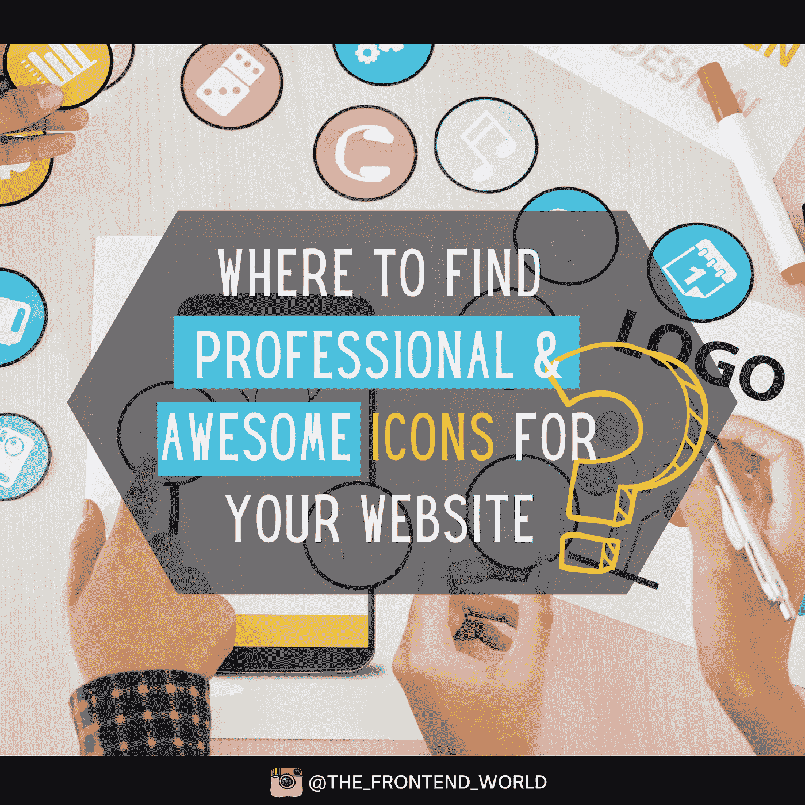
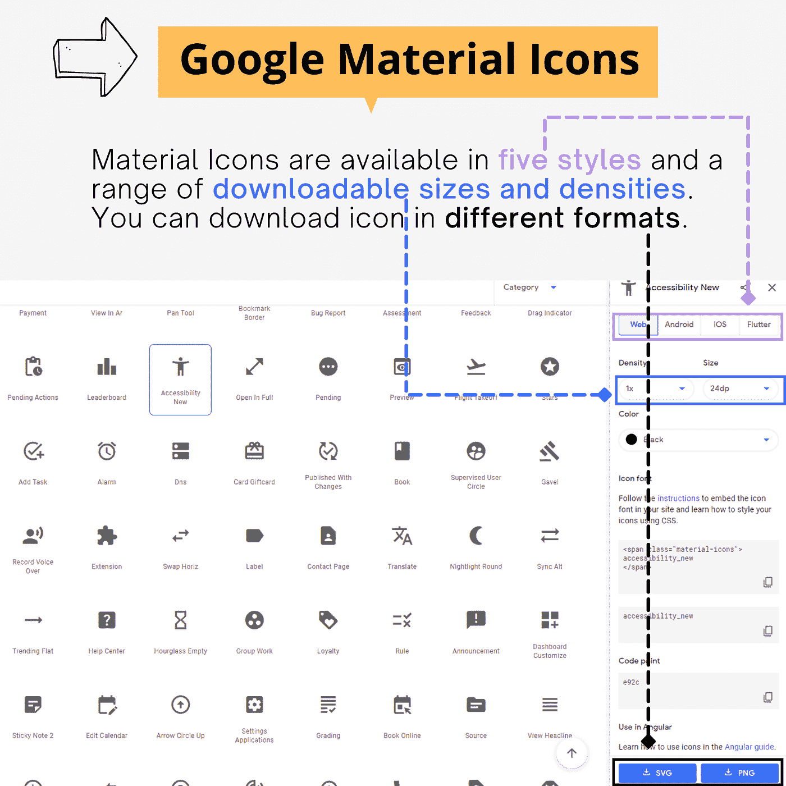
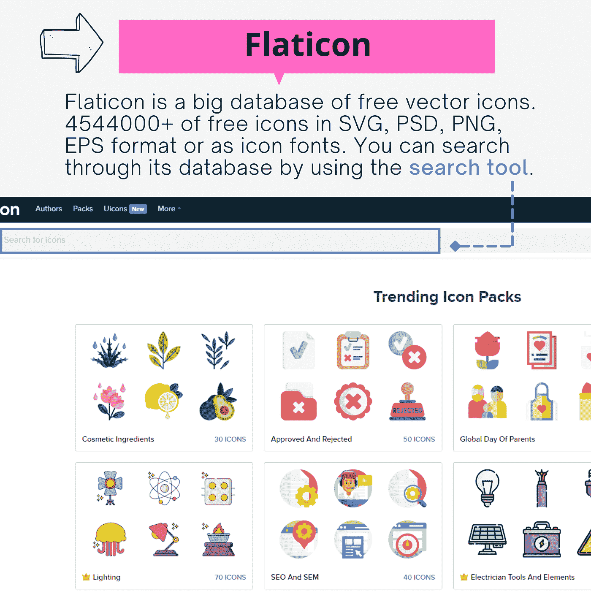
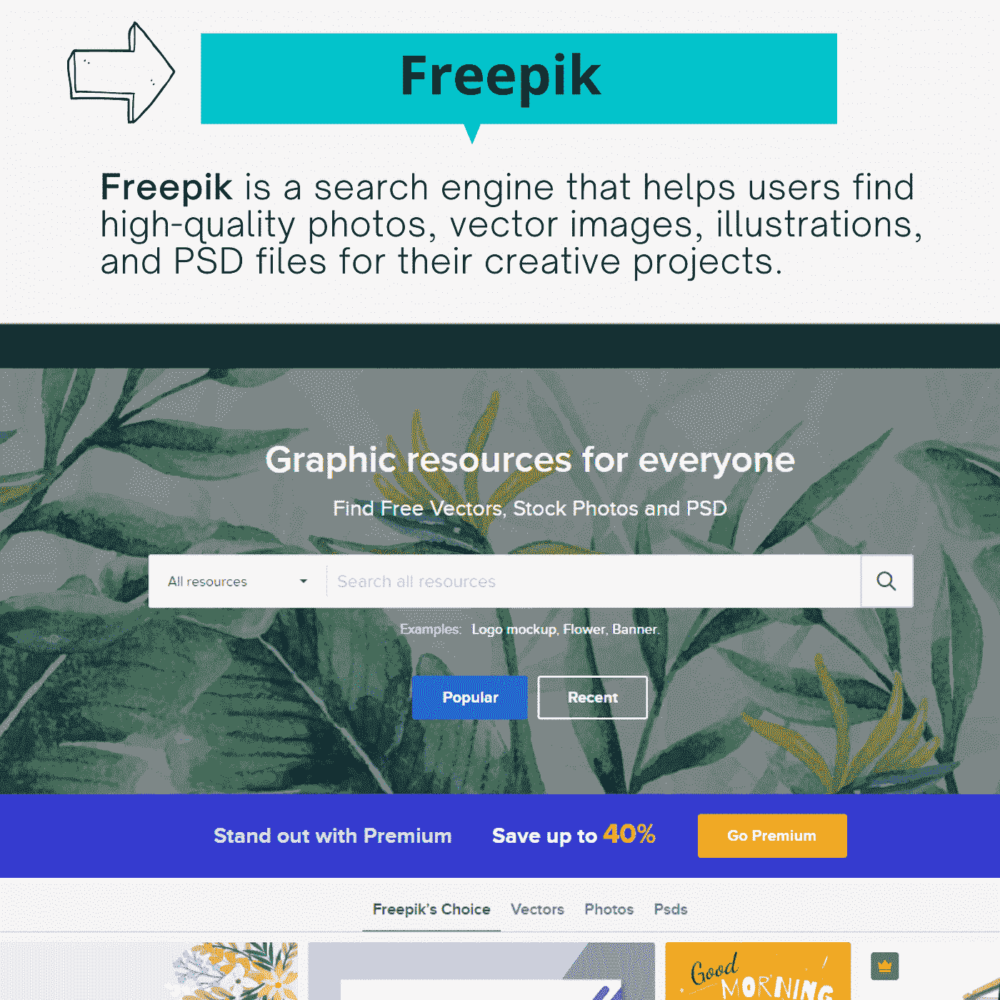
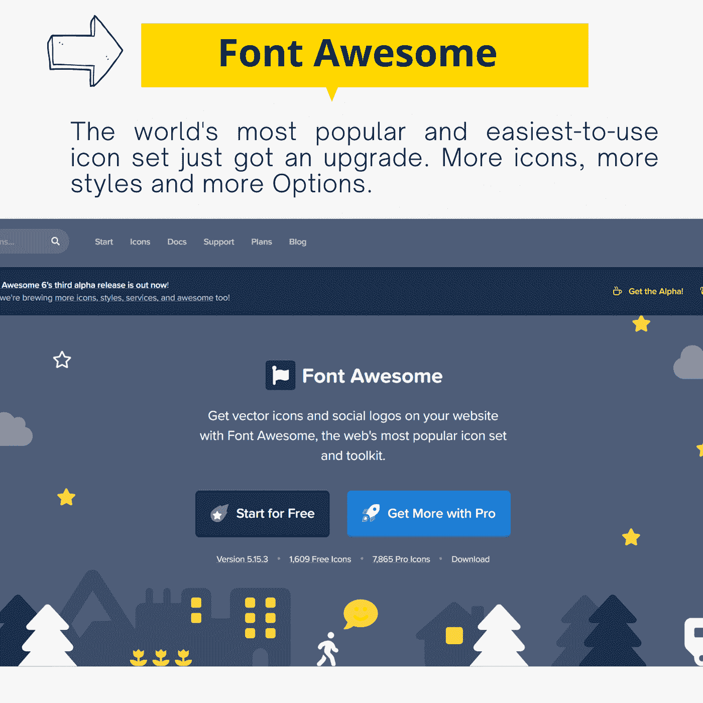
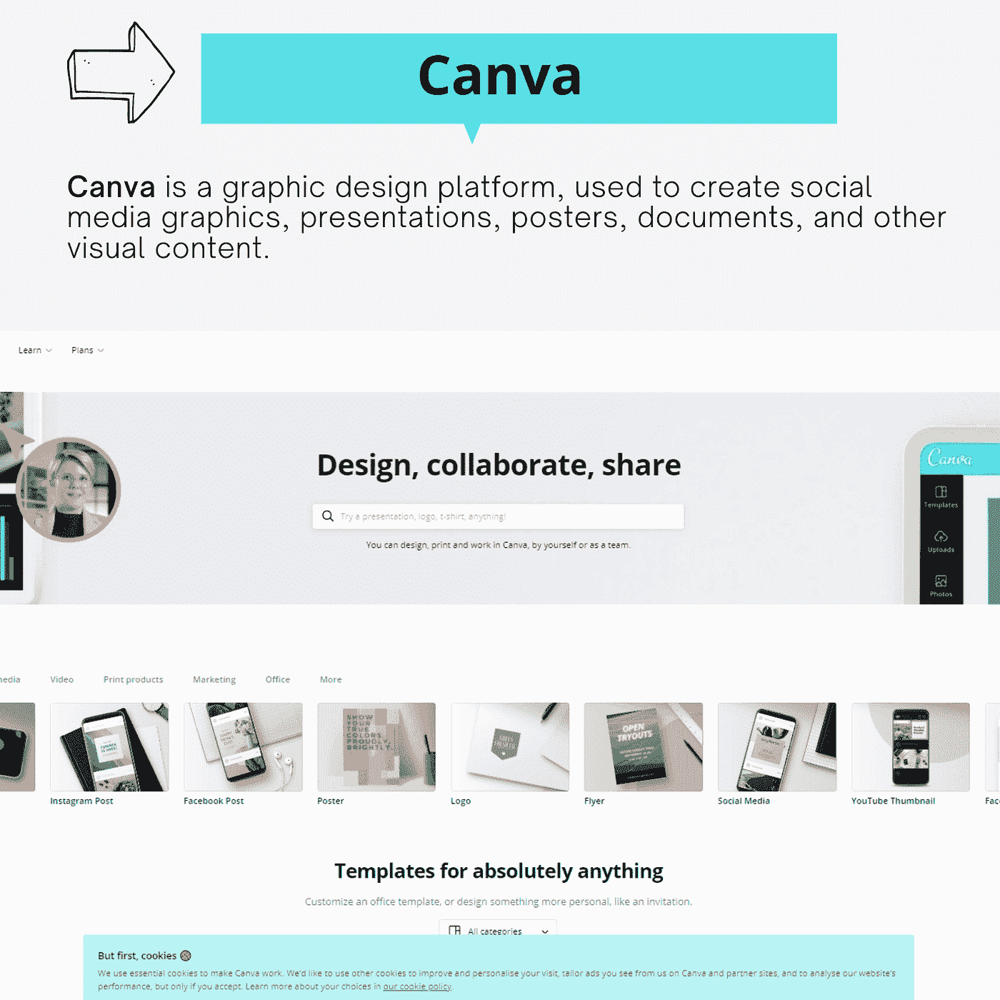

# 哪里可以找到免费的专业和令人敬畏的图标为您的网站？

> 原文：<https://levelup.gitconnected.com/where-to-find-free-professional-and-awesome-icons-for-your-website-9675fd0607c2>

## 我的 5 大免费图标资源！

哪里可以找到免费的专业和令人敬畏的图标为您的网站？

# #1-谷歌材料图标

我喜欢这个。设计的图标简单、现代、友好，有时还有点古怪。每个图标通常在整个用户界面中使用。为确保大小尺寸的可读性和清晰度，这些图标已经过优化，可在所有常见平台和显示分辨率上实现美观显示，并免费提供给所有用户！

谷歌材料图标

下面是链接，自己去探索一下。

 [## 谷歌字体

### 通过出色的排版使网页更加漂亮、快捷和开放

fonts.google.com](https://fonts.google.com/icons?selected=Material+Icons:accessibility_new) 

# #2-扁平图标

Flaticon 有许多 SVG、PSD、PNG、EPS 格式的自由矢量图标，或者作为图标字体。最大的免费矢量图标数据库中的数千个免费图标！我通常用它的图标为我的文章设计动画。😆

扁平图标

以下是链接:

 [## Flaticon，最大的免费矢量图标数据库

### 4，544，000+SVG、PSD、PNG、EPS 格式或作为图标字体的自由矢量图标。成千上万的免费图标在最大的…

www.flaticon.com](https://www.flaticon.com/) 

# #3-免费赠送

**Freepik** 是一个搜索引擎，帮助用户为他们的创意项目找到高质量的照片、矢量图像、插图和 PSD 文件。

弗里皮克

以下是链接:

 [## 面向所有人的免费图片资源

### 数百万免费图文资源。Vectors、库存照片、PSD、图标，所有您需要的创意…

www.freepik.com](https://www.freepik.com/) 

# #4-字体真棒

这是最受开发者欢迎的。它的库可以快速安装，并在您的网站或 web 应用程序上轻松使用。你有更多的图标，更多的风格，更多的选择。

字体真棒

以下是链接:

 [## 字体真棒

### 世界上最受欢迎和最容易使用的图标集刚刚得到了升级。更多图标。更多款式。更多选择。

fontawesome.com](https://fontawesome.com/) 

# 第五名-坎瓦

Canva 不是一个图标数据库，而是一个设计和创建你自己的设计和图标的平台。当我需要设计一个特定的东西时，这通常是我的选择。我用它来创建图标，我的 Instagram 帖子，甚至设计书籍封面和演示文稿。它的免费计划资源丰富，但你也可以尝试付费计划获得更多美丽的资源。

坎瓦

这些是我建立漂亮的网站和网络应用程序以及准备我的演讲、文章和书籍的基本要素。你认识他们吗？你使用它们吗？你知道其他令人敬畏的资源，请与我们分享❤

# 回顾一下？

哪里可以找到免费的和令人敬畏的图标？

**永远享受！亲爱的读者，我希望这很清楚并且有用。我希望你和你的家人无论在哪里都平安无事！坚持住。明天会更好！**

**联系一下** [**中**](https://medium.com/@famzil/)**[**Linkedin**](https://www.linkedin.com/in/fatima-amzil-9031ba95/)**[**脸书**](https://www.facebook.com/The-Front-End-World)**[**insta gram**](https://www.instagram.com/the_frontend_world/)**，或者**[**Twitter**](https://twitter.com/FatimaAMZIL9)**。********

****[www.fam-front.com](http://www.fam-front.com/)****