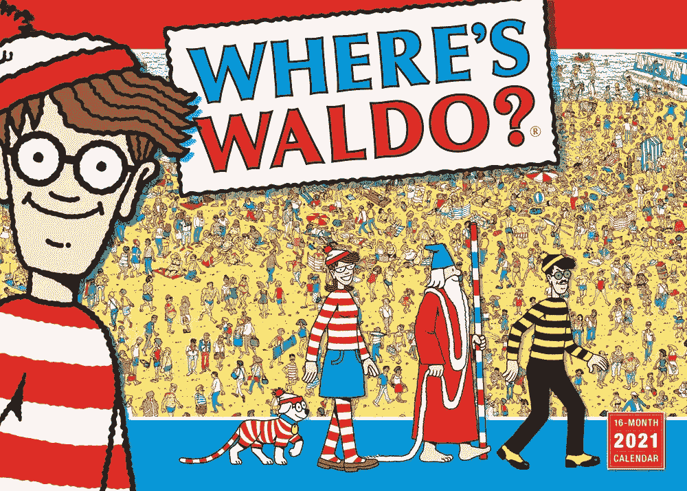

# 沃尔多在哪？我不知道。

> 原文：<https://levelup.gitconnected.com/wheres-waldo-i-dunno-b259bea64c95>

沃尔多在哪？2021 年挂历
英文版由 Sellers 出版公司出版。

一个**交互证明**，非正式地说，是一个双方**协议**，其中一个参与者(*证明者*)可以说服另一个人(*验证者*)某个陈述的有效性。(证明者应该能够这样做，当且仅当命题确实有效时。)

如果由*证明者*给出的证明(可能在方便的多项式时间内)具有令人信服的显著特性，并且除了断言确实有效之外不产生任何其他东西，那么交互式证明系统就是**零知识的**。

让我们举一个简单的例子，不像格非-菲亚特-沙米尔零知识证明那样复杂，让我们来谈谈瓦尔多。

插画师马丁·汉福德于 1987 年创作的沃尔多是儿童拼图书中的小雕像，每一页都是一群不同的角色。想法是找到沃尔多，不管他藏在哪里。
由于我们处理大量的数据，以及一个真实的陈述，在瓦尔多的书中隐藏着一个有趣的密码问题。

所以我们有两个演员，证明者爱丽丝和验证者鲍勃。爱丽丝和鲍勃正在玩智力问答书。爱丽丝喊道:“沃尔多，你来了！”鲍勃并不相信。他不能自己找到沃尔多吗？所以他要求爱丽丝在不透露角色位置的情况下证明她的大胆陈述。事实上，他想以后也为自己找到它。爱丽丝想出了这个简单的零知识协议。她会给这本书拍一张照片，然后在一个应用程序的帮助下，把沃尔多的照片裁剪出来，给鲍勃看。裁剪是必要的，因为她不想给出 Waldo 周围的任何信息，如颜色或形状。那将证明她知道沃尔多在哪里，而且除此之外，鲍勃不会得到任何其他信息。

这种一步式协议的问题是显而易见的。爱丽丝能不能在手机里藏一张沃尔多的照片，然后给鲍勃看，而不需要找到这个角色，也许是一张预先剪辑好的照片？避免这个问题的一个方法是搜索她的手机，或者使用新买的手机。但是，也许可以使用更好的协议。

在要求爱丽丝裁剪图片之前，他会用他的手机生成一个随机的图案，如圆形或正方形，并要求她在裁剪中使用它。这样，爱丽丝就不能预先裁剪沃尔多的任何图像。
这个协议在本质上具有交互的细微差别，并且可以在网络上播放。

唯一可能出现的问题是，如果 Alice 决定不裁剪给定的图片，而是使用另一本 Waldo 的书的已知图片。鲍勃无法检查是否有开关。在这种情况下，恐怕我们需要第三方。那将是一个独立的演员，一边接受来自 Bob 的图片和随机形状，另一边接受 Alice 的坐标。

另一个低技术含量的证明可以用有一个洞的大纸板来安排，爱丽丝应该能够慢慢地移动书，让瓦尔多从洞里偷看。

最后，协议的所有这些版本都是零知识的，因为它们满足三个特性:

1.  完整性:如果陈述是真的，鲍勃将被爱丽丝说服。
2.  **可靠性**:如果陈述是假的，爱丽丝不能说服鲍勃它是真的，除非有一些小概率。
3.  **零知识**:如果陈述是真的，鲍勃除了知道爱丽丝知道沃尔多在哪里之外，还知道了任何事情。