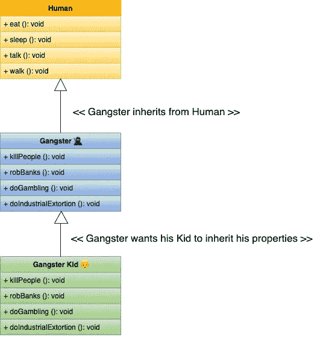
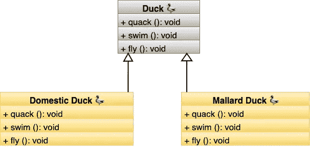
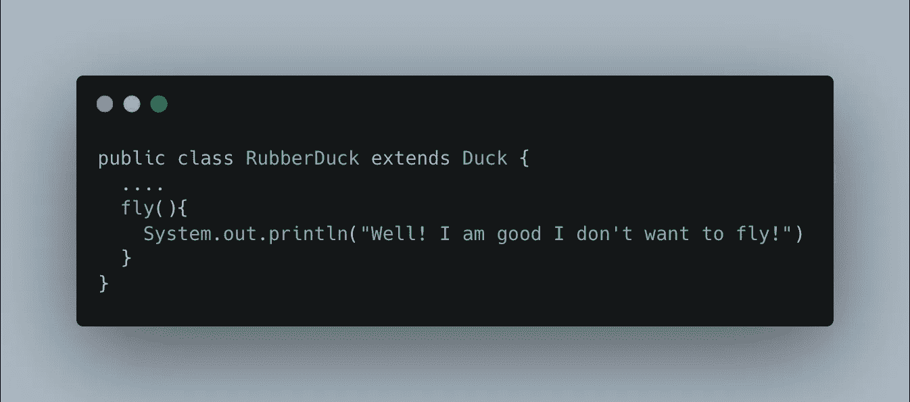
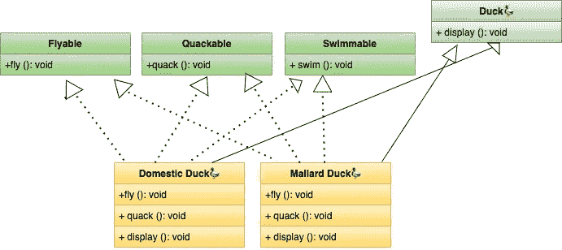
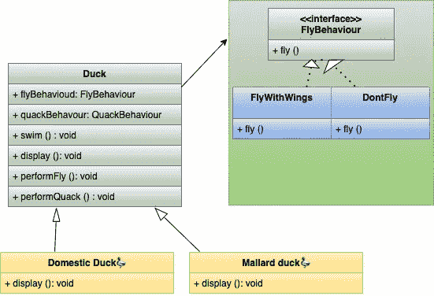
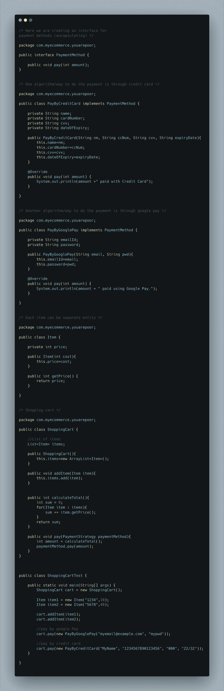
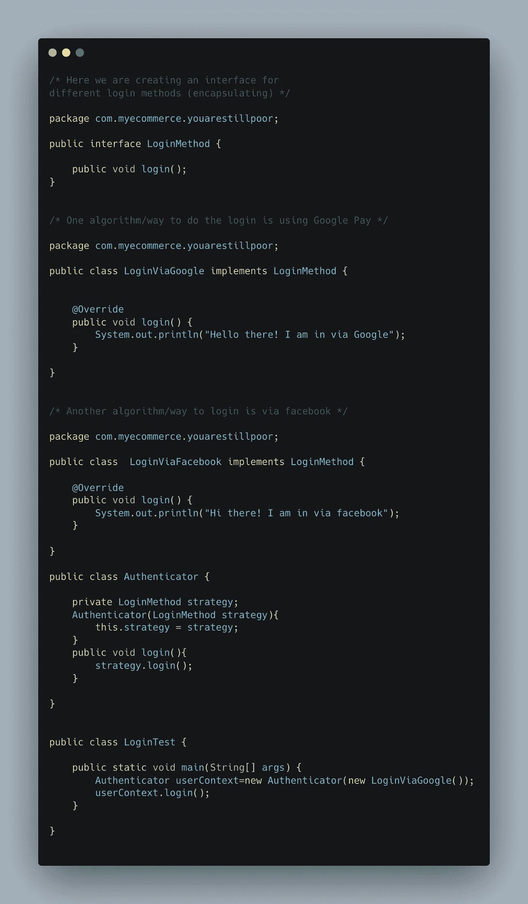
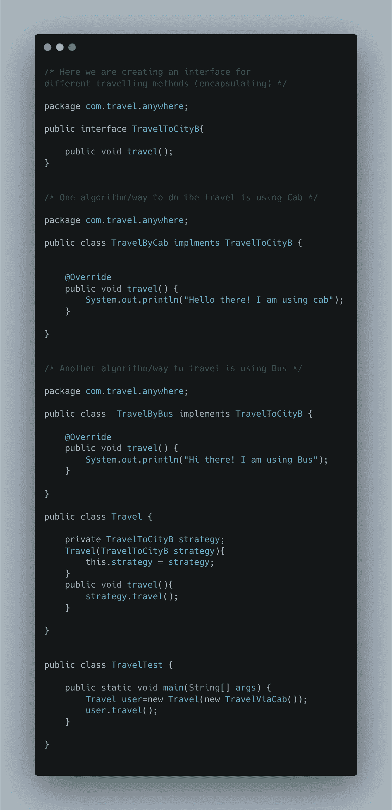
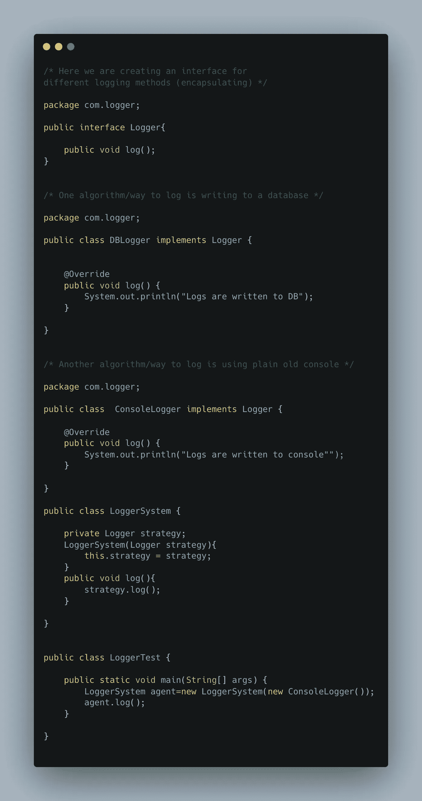

# 无论我去哪里，我都在寻找模式。

> 原文：<https://levelup.gitconnected.com/wherever-i-go-i-look-for-patterns-1e78aeaa00ba>

## 策略很重要！

米蒂亚·伊万诺夫在 [Unsplash](https://unsplash.com?utm_source=medium&utm_medium=referral) 上拍摄的照片

设计图案就像“ ***超能*** ”。有时，我认为我有一些这样的能力，但问题是，我不知道什么时候使用哪种能力。可能这是因为我的工程师经历吧。所以，这一次我想到了去了解每一种超能力，深入了解每一种超能力，并以清晰易懂的方式记录每一件事。大部分的学习将来自 Head first Design Patterns book 和一些帮助掌握模式的附加资源。基本上对于每种模式，我都会尝试回答以下问题:

它解决了什么问题？

W ***图案到底是什么？***

有哪些现实生活中的例子？

作为一名程序员，给人留下深刻印象的奇特定义是什么？

## ***我们来谈谈问题***

在深入模式之前，我们将从理解一些基础知识和问题开始。每当我阅读任何与面向对象设计相关的博客时，我经常会遇到一句话，那就是“ ***宁要组合不要继承*** ”。但是我们被教导了所有关于继承的好东西，对吗？喜欢

*   代码可重用性
*   代码可读性
*   减少代码冗余

现在，让我们举一个非常琐碎的例子(与编码无关)来理解为什么继承会不好。

从上面的类图中，我们可以看到默认情况下强盗'**是-a** '人类，他也希望他的孩子继承他的行为，他的属性，不管这个孩子是否真的想成为强盗。

> 看吧！遗传如何成为一个问题。如果孩子不想继承父母的一切怎么办？他的孩子不想成为流氓。他想过简单的生活。他想上大学，他想交朋友，他想成为一个受人尊敬的人。
> 
> 嗯，他总是可以这样做，因为我们是人类，人类不受“**软件工程**”法律的约束。

现在让我们直接从第一本书开始举一个例子。考虑一个鸭子模拟游戏，你有各种类型的鸭子，它们有一些常见的行为，比如鸭子会发出声音，它们会游泳，一些鸭子会飞。我不确定鸭子是否真的会飞😂但是让我们考虑一下这个。所以我们有一个初始的类层次结构，如下所示:

因此，我们可以看到有一个父类 duck，所有类型的 Duck 都继承了这个 Duck 类，以及 Duck 可以拥有的所有行为和属性。起初，使用继承似乎没有什么不妥。一切都有道理。

> 但是在软件的生命中唯一不变的是**变化**

在一个晴朗的日子里，一个要求来了，要求团队引进一种新的鸭子，比如说“ ***橡皮鸭”。***

现在我们可以选择添加一个新的类 RubberDuck，它将扩展 Duck，一切都会好的。对吗？？？

不，你可能已经想到橡皮鸭不会飞。我的意思是我们可以编程让它飞起来😂但实际问题是，可能橡皮鸭不想飞。它不想从其父节点继承该属性。我们又一次遇到了与我前面的例子中讨论的相同的情况，即，

> **孩子希望有自己的身份。他们想要一些自己特有的行为。他们只是不想盲目继承父母的一切。请不要强迫他们 to❤️**

解决这个问题的一个快速方法是覆盖 **RubberDuck** 类中的 fly 方法

但我们很快会意识到，由于以下原因，这在未来可能会变得混乱:

1.  向我们的 duck 类添加新的 Duck 行为打破了[开闭原则](https://www.digitalocean.com/community/conceptual_articles/s-o-l-i-d-the-first-five-principles-of-object-oriented-design)，即 ***对象或实体*** ***应该为扩展而打开，为修改而关闭*。**这里要添加一个新的行为，我们需要修改 Duck 中的代码。
2.  在许多子类中覆盖行为并不是一个好的做法。假设将来会有 1000 多种鸭子。维护这样的代码可能会成为一场噩梦。

我们能想到的另一个解决方案是从 Duck 类中取出行为，并为每种行为创建接口，如飞、嘎嘎叫、游泳等。让我们看看类图来更好地理解这一点

这个解决方案也导致了痛苦，因为现在我们在接口/契约中分离得太多了。每个实现接口的类都必须为每种行为编写逻辑。将会有大量代码重复。

现在我们就来看看 ***到底是什么模式/问题*** 在哪些地方需要注意

> 从上面的例子中我们可以看到，有一些行为可以用不同的方式执行，但最终结果是一样的。我们可以将“行为”一词与算法/策略互换，这些算法/策略可以有不同的实现。

我们能做的就是利用这套算法。封装它们。在上面的例子中，我们可以从 duck 类中取出飞行行为和呱呱行为，并封装它们。让我们看看最终重构代码的类图。

让我们理解上图显示的内容:

*   这里我们已经创建了一个 FlyBehaviour 接口，并且有具体的飞行行为来实现它。
*   鸭子不再与苍蝇或任何行为紧密联系在一起。
*   子鸭类可以在运行时选择它们的飞行方式。

**😒**

如果事情不是那么清楚，请原谅我。我们将通过大量的例子来完全理解这一点😊

**例 1:** 我们都爱购物对吧？就我个人而言，我喜欢浏览 Myntra、亚马逊、flipkart，看看我买不起的东西。那是另一种痛苦。但是让我们考虑任何购物 app。当我们想购物时会发生什么。我们通常有 3-4 个选择来决定如何付款。可以通过以下方式:

*   Google Pay
*   电话支付
*   Paytm
*   RazorPay
*   用借记卡支付
*   用信用卡支付

现在认为最终结果是一样的。最终的结果是，我们想付钱给供应商，这样我们就可以买到自己喜欢的东西。我们的支付方式不同。同样，我们可以看到我们处于相同的情况，对吗？我们可以封装算法集，客户端可以决定使用哪一个。类图已经够多了。让我们做一些编码🥷

这是一大堆代码。让我们明白我们实际上做了什么。我们将经常变化的部分代码封装在一个不同的保护伞下。现在增加一种新的支付方式真的很简单。只需创建一个类并实现 PaymentMethod 接口，然后客户端就可以使用新添加的方法。我们可以一直争论这有什么好处。我可以对不同类型的付款使用 if/else 块。好吧，我想说的是，对于好/坏的编码实践来说，没有界限或门槛😁使用模式的整体思想是使代码可理解、可扩展、可维护。如果我们认为添加新的支付方式只是添加额外的 If 语句，那么我们再次违反了'**开闭原则**。

**例 2:** 现在让我们考虑另一个场景，我们仍然在使用购物网站。但这次我们将讨论如何登录购物网站。我们通常有登录应用程序的选项:

*   通过谷歌登录
*   通过 facebook 登录
*   通过 snapchat 登录
*   通过 twitter 登录

同样，最终结果是一样的。我们想登录到应用程序，但我们可以选择不同的方式来做到这一点。让我们再看一下代码:

现在我们看到我们是如何识别情况和模式，并遵循相同的程序来编写漂亮的代码的。我们总是可以通过实现 LoginMethod 接口来集成新的登录方法，而无需修改现有代码。

**例 3:** 现在我们来看另一个例子。考虑这样一个场景，当我们想在城市 A 和城市 B 之间旅行时，有多种交通方式可供选择:

*   乘出租车旅行
*   乘飞机旅行
*   坐火车旅行
*   乘公共汽车旅行

这种情况有印象吗？🐥

是啊！和之前的情况一样。最终目标是从 A 到达 B 城市，有多种交通方式可以实现。让我们再看一下代码。

我们已经成功地确定了一些可以利用这种模式的常见场景。我认为我们现在更好地理解了这种模式和情况，这是有用的。让我们举最后一个例子😁

**例 4:** 这次我们来构建一个日志系统。我们知道正确调试生产问题时日志有多重要。所以，让我们试着确定以下几点:

## 我们可以概括哪些策略？

*   我们知道日志可以使用任何类型的记录器。一个日志记录器可以简单地写入文件，并将文件保存在开发人员的机器中。
*   另一个可以上传日志到像 S3 这样的云服务提供商。
*   另一个可以将日志存储到关系数据库中。

因此，我们可以看到，我们有几种方法来进行日志记录，最终目标都是一样的，即我们希望生成日志。我们可以像在前面的例子中一样使用策略模式。让我们再看一下代码:

最后，我们可以看到这种模式是多么美丽，以及我们如何能够在不同的情况下使用它。

> 那么这种模式的官方定义是什么呢？

根据 GOF 的书，“*定义一个算法族，封装每一个算法，并使它们可以互换。策略让算法独立于使用它的客户端而变化"*

就是这样。我们已经成功地介绍了战略模式。请通过参考更好地理解，请不要恨我，如果你发现任何错误的🥺。我在努力做得更好，❤️

参考资料:

*   [https://spring framework . guru/四人组设计模式/策略模式/](https://springframework.guru/gang-of-four-design-patterns/strategy-pattern/)
*   [https://www . tautvidas . com/blog/2014/03/the-strategy-pattern-design-patterns/](https://www.tautvidas.com/blog/2014/03/the-strategy-pattern-design-patterns/)
*   [https://www . journal dev . com/1754/strategy-design-pattern-in-Java-example-tutorial](https://www.journaldev.com/1754/strategy-design-pattern-in-java-example-tutorial)
*   [https://www . oreilly . com/library/view/head-first-design/0596007124/](https://www.oreilly.com/library/view/head-first-design/0596007124/)