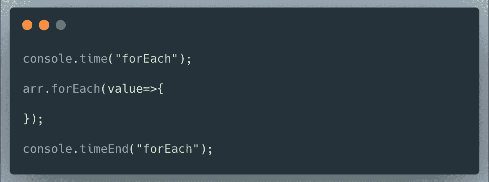

# JavaScript 中的 for、for…of 和 forEach 循环哪个更快

> 原文：<https://levelup.gitconnected.com/which-is-faster-for-for-of-foreach-loops-in-javascript-18dbd9ffbca9>

[Djim Loic](https://unsplash.com/@loic?utm_source=medium&utm_medium=referral) 在 [Unsplash](https://unsplash.com?utm_source=medium&utm_medium=referral) 上拍摄的照片

在 JavaScript 中有不同的方法来循环数组，但是很难选择正确的方法。有一个经典的 JavaScript for 循环，JavaScript forEach 方法，以及在 EcmaScript 第六版( **ES6** )中引入的 **for…of loop** ，允许程序员在实际的可迭代对象上**循环**。

循环提供了一种快速简单的方法来重复做某事。在这一章中，我将讨论 JavaScript 中不同的迭代语句，以及哪一个执行速度更快，性能更好。

## **循环迭代数组**

1.  **为**
2.  **为……的**
3.  **forEach**

为了迭代数组，让我们创建一个包含 50000 个元素的数组来计算执行时间。我们可以通过两种方法创建一个包含 50000 个元素的数组。

## **为循环**

JavaScript 中最基本的迭代方法是 for 循环。它需要三个表达式；一个变量声明，一个在每次迭代前计算的表达式，以及一个在每次迭代结束时计算的表达式。

`**JavaScript for loop**` *迭代元素固定次数*。如果迭代次数已知，则应使用它。下面给出了循环的语法。

让我们通过使用 JavaScript 中的`**console.time()**`和`**console.timeEnd()**`语句来计算执行时间。让我们看看如何使用这些语句。

## for…of 循环

`**for...of**` 语句创建一个遍历可迭代对象的循环，包括 JavaScript 中内置的`String`、`Array`、类似数组的对象(如`arguments`或`NodeList`)、`TypedArray`、`Map`和`Set`

`**for...of**`对于小数据集来说，循环是最快的，但是对于大数据集来说，它们的伸缩性很差。它是最慢的，但是对于循环来说是语法上的优势。

让我们用同样的方法检查一下`**for...of**`循环的执行时间

## forEach 循环

Javascript 中的`**forEach**` 方法遍历数组的元素，并按顺序调用为每个元素提供的函数。

`**forEach**`的执行时间受到每次迭代中发生的事情的显著影响。它速度很快，是为功能代码设计的。

让我们用 forEach 遍历数组，并检查执行时间

现在是时候检查所有三个循环方法的执行时间了。javascript 的执行实际上取决于各种因素，如 Windows 等操作系统的类型和 Chrome、IE、Firefox 等浏览器的类型。

结果很有趣，不是我所期待的。

用于循环的传统**是最快的，所以你应该总是使用它，对吗？没那么快——性能不是唯一重要的东西。你很少需要在前端 JS 应用程序中循环超过 100 万个条目。 ***代码可读性*** 通常更重要，所以默认为适合你的应用的风格。**

如果你更喜欢写函数代码，那么 **forEach** 是理想的，而 **for-of** 则是很好的选择。更少的代码行意味着更短的开发时间和更少的维护开销——首先优化开发人员的满意度，然后才是性能。

感谢阅读。在这里找到[源代码](https://github.com/jayanthbabu123/for-for..of-and-forEach-in-javascript-which-is-fast/blob/master/loops.js)。