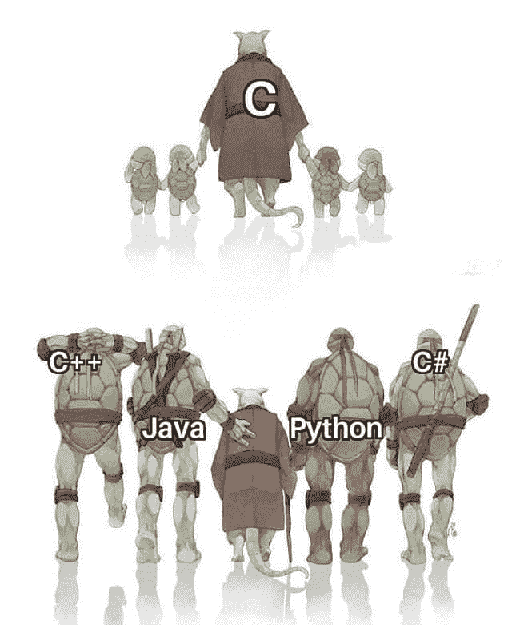
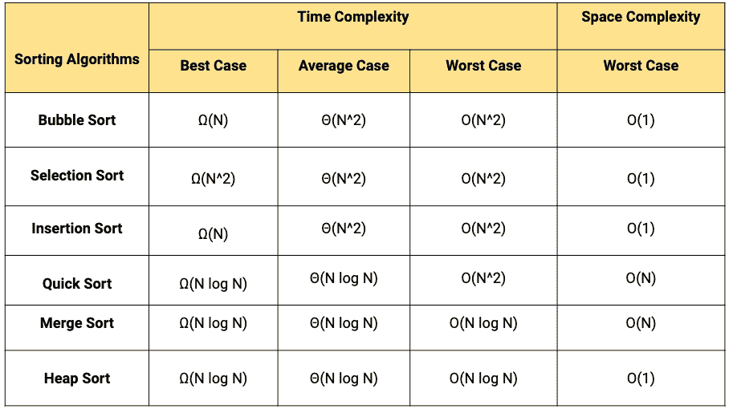
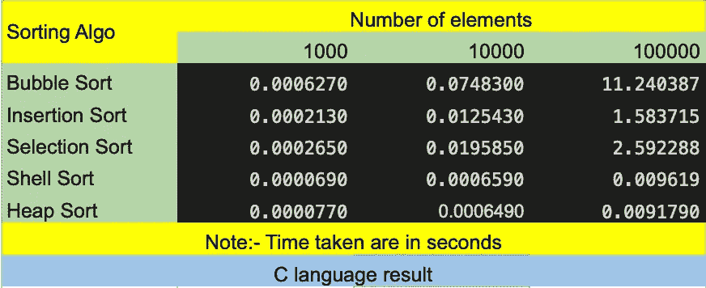
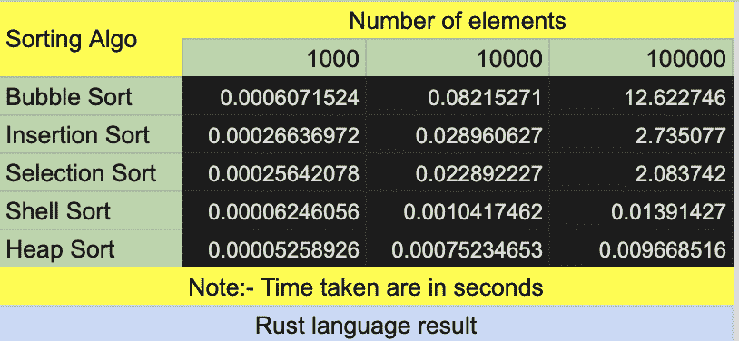
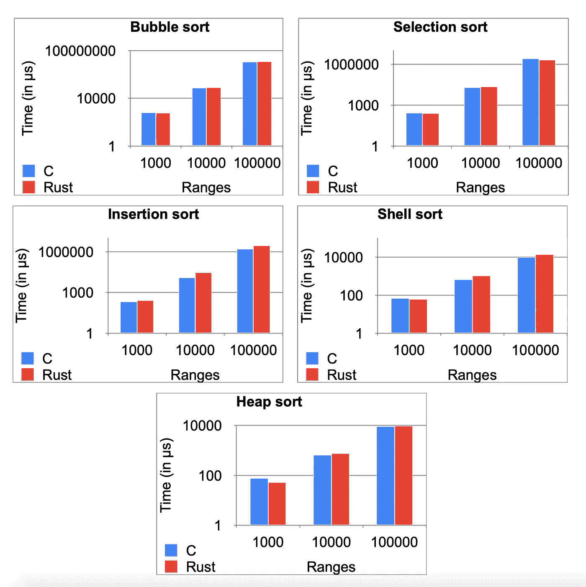

# Rust 和 C 哪个更快？让我们来看看谁是编程界的尤塞恩·博尔特。

> 原文：<https://levelup.gitconnected.com/which-is-faster-rust-or-c-lets-find-out-who-is-the-usain-bolt-87495c774c8>

使用流行排序算法对 C 和 Rust 语言速度的比较研究。

# 忍者神龟的主人

C 是古怪的，有缺陷的，但却是巨大的成功

——[T3【丹尼斯里奇】T4](https://www.inspiringquotes.us/author/6242-dennis-ritchie)

[**C**](https://en.wikipedia.org/wiki/C_(programming_language)) ，最早的编程语言之一，是一种命令式通用计算机编程语言，可追溯到 1969 年。 [**丹尼斯里奇**](https://en.wikipedia.org/wiki/Dennis_Ritchie) 是 C 编程语言之父。1989 年，美国国家标准协会和国际标准化组织为 c 开发了新的共识标准。它仍然是一种通用的、广泛使用的编程语言，是一种简单的、跨平台工作的低级编程语言。

比方说，C++和 Java 可能比普通的 C 增长得更快，但我打赌 C 仍将存在

*—* [***丹尼斯里奇***](https://www.inspiringquotes.us/author/6242-dennis-ritchie)

微波炉、洗衣机和数码相机等流行的家用设备正变得日益复杂。包含在这些机器中的微处理器、操作系统和软件提供了这种知识。这些程序不仅要高效运行，还要在少量内存上工作。这样的程序是用 c 写的并不令人吃惊。

像 Windows、UNIX、Linux 这样的流行操作系统的主要部分仍然是用 C 编写的，这是因为即使在今天，当谈到性能(执行速度)时，也没有什么能胜过 C(但从现在开始不会了)。此外，如果要扩展操作系统以与新设备一起工作，就需要编写设备驱动程序。这些程序完全是用 c 语言编写的。

c 语言对 IT 行业有着巨大的影响，并且仍然发挥着至关重要的作用。

# Rust，每个领域的潜在竞争者

[**Rust**](https://en.wikipedia.org/wiki/Rust_(programming_language)) 是一种专注于性能和安全，尤其是安全并发的多范式编程语言。Rust 在语法上类似于 C++，它不使用垃圾收集，而是通过使用借用检查系统来提供内存安全。

Rust 最初是由 T4 Mozilla 公司 T5 研究所的格雷顿·霍尔设计的。

*生锈

铁锈主要集中在以下几个方面

1.并发性。

2.安全。

3.速度。

**记忆安全**

Rust 的一个主要卖点是，它在编译时保证你的应用程序不会被取消引用空指针或悬空指针。铁锈也使内存泄漏变得困难。

**性能**

Rust 语言在设计上没有垃圾收集器(GC)。Rust 会知道变量何时超出范围或者它的生命周期何时在编译时结束，从而插入相应的 LLVM/assembly 指令来释放内存。这提高了运行时的性能。

这就是 Rust 处理记忆的方式。

**多线程**

在 Rust 中，由于所有权的原因，线程自动相互“隔离”。只有当线程拥有可变的访问权限时，写入才会发生，无论是通过拥有数据还是通过可变地借用数据。无论哪种方式，都保证线程是当时唯一可以访问的线程

**腹板组装支架**

Web Assembly 有助于在浏览器、嵌入式设备或任何其他地方执行高计算密集型算法。它以本机代码的速度运行。Rust 可以编译成 Web 程序集，以便快速、可靠地执行。

# **比较 C 的速度&生锈**

## 方法学

比较这两种语言速度的方法是编写最流行的排序算法，针对不同的元素范围运行它们，并比较哪种语言在排序元素时花费的时间最长。我使用的排序算法是:-

1.[冒泡排序](https://en.wikipedia.org/wiki/Bubble_sort)。

2.[插入排序](https://en.wikipedia.org/wiki/Insertion_sort)。

3.[选择排序](https://en.wikipedia.org/wiki/Selection_sort)。

4.[贝壳分类](https://en.wikipedia.org/wiki/Shellsort)。

5.[堆排序](https://en.wikipedia.org/wiki/Heapsort)。

*流行排序算法的时间复杂度

以上是流行排序算法的时间复杂度，通过观察最坏情况下的复杂度，我们可以大致了解哪种排序技术在它们之间表现最差。

冒泡排序的最坏情况复杂度为 O(N ),与其他排序技术相比，它的性能肯定是最差的。我们将生成的结果矩阵还将帮助我们通过比较排序元素所需的时间来理解时间方面的最坏情况的复杂性。

所以，我用 C & Rust 写了上面的 5 个算法。出于输入的目的，我使用了一个整数数组，并使用随机数生成器函数 [**rand** ()](http://www.cplusplus.com/reference/cstdlib/rand/) 在 C 语言中以及 [**rand::Rng**](https://docs.rs/rand/*/rand/trait.Rng.html) 在 Rust 语言中用随机数填充该数组。这个数组作为排序算法的输入，输出记录在一个矩阵中。测试三个范围 1000、10000 & 100000 个元素的算法性能。

这种设置已经运行了 100 次迭代，求平均值以产生输出矩阵。

# 性能比较设置

完成并运行上述设置的系统配置是:-

马科斯·卡特琳娜

MacBook Pro (16 英寸，2019 年)

处理器:- 2.3 GHz 8 核英特尔酷睿 i9 处理器

内存:- 16 GB 2667 MHz DDR4

clang 版本 12.0.0(优化标志-O3)

rustc 1.45.2(优化标志-发布)

# 性能统计

以下是生成的输出矩阵

* C 语言在不同排序算法上的性能。

* Rust 语言在不同排序算法上的性能。

从输出矩阵中可以清楚地看出，结果在某种程度上是相等的。对于每种排序技术和输入数组范围，在某些情况下 Rust 性能更好，在某些情况下 C 性能更好。在较低范围的元素(1000 个元素)中，Rust 的表现更好，除了在插入排序中。对于 10000 个元素的范围，C 对于每种排序技术都表现得更好。

*图形表示。

柱状图还显示，所有情况下的结果几乎相同。

您可以尝试在自己的系统上实现它。

项目的 Github 链接:-[https://github.com/imrushabh/C_vs_Rust](https://github.com/imrushabh/C_vs_Rust)

# **结论**

很难说哪种语言更快，因为这取决于具体情况。但是我们可以说 Rust 在速度上是 C 的竞争对手，它比许多其他流行语言如 Java 和 Python 都要快。Rust 提供了许多功能，如它专注于速度、内存安全和并行性，并且是开源的，我们可以使用 Rust 创建各种新的软件应用程序，如游戏引擎、操作系统、文件系统、浏览器组件和虚拟现实的模拟引擎。在接下来的时间里，我们肯定会看到锈无处不在！！！

## 请给我买杯咖啡来支持我:-[buymeacoffee.com/rushabh](http://buymeacoffee.com/rushabh)