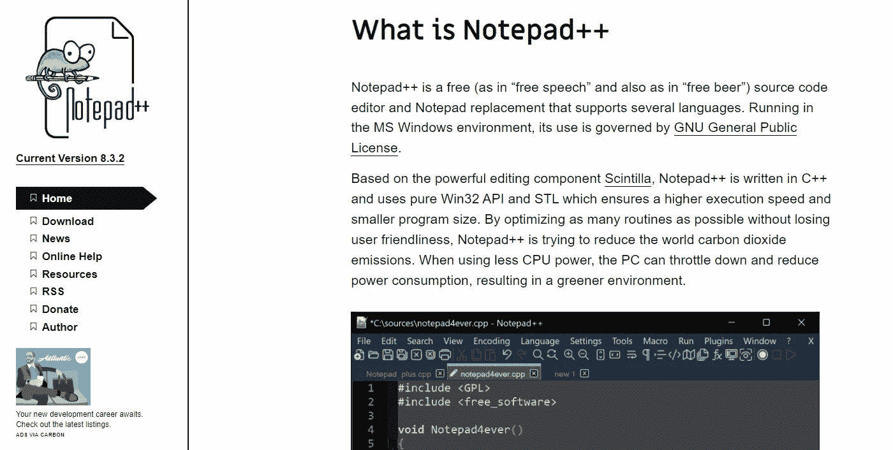
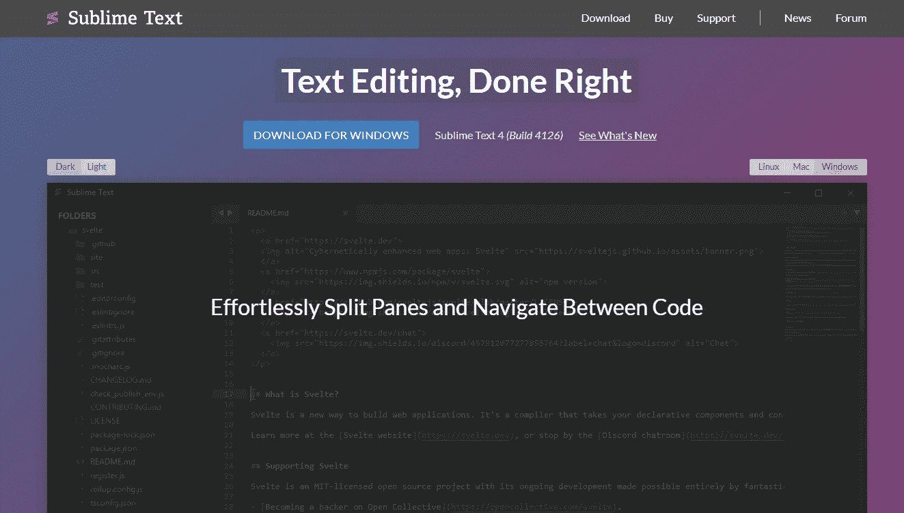
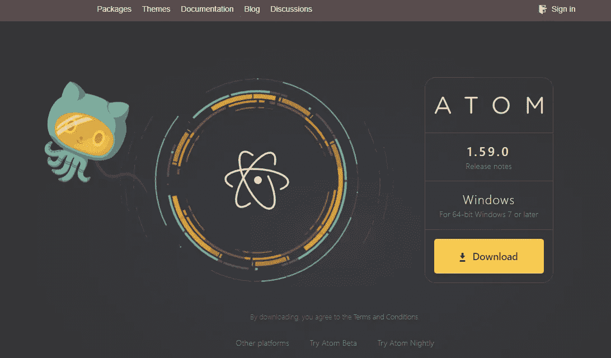
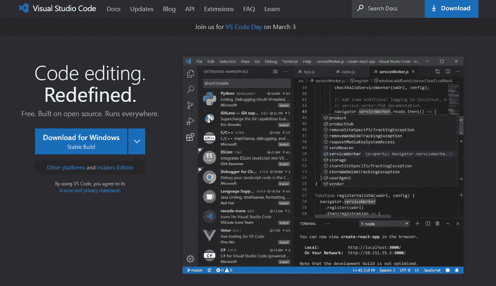
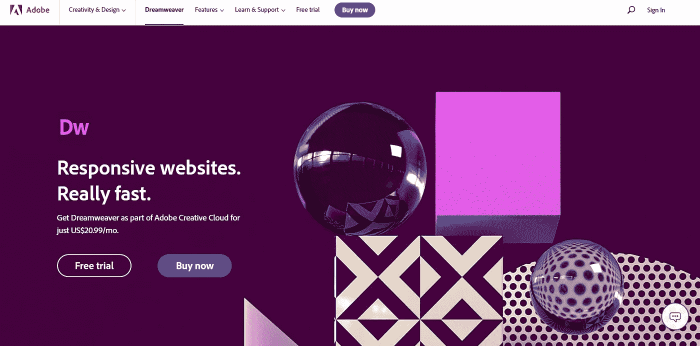

# 2022 年最好的 HTML 编辑器是哪个？

> 原文：<https://levelup.gitconnected.com/which-is-the-best-html-editor-in-2022-194111c779a1>

## Web 开发人员最好的朋友！

## 如果你是一个网页开发者，那么你需要使用最好的 HTML 编辑器！

如果你正在寻找一个好的 HTML 编辑器，那么已经有很多了。但是哪一个是最好的或者我应该说是最受欢迎的呢？这就是我们今天要发现的！

照片由 [Unsplash](https://unsplash.com?utm_source=medium&utm_medium=referral) 上的 [Clément Hélardot](https://unsplash.com/@clemhlrdt?utm_source=medium&utm_medium=referral) 拍摄

我不会做出任何像“这个编辑器比另一个编辑器有更多的功能”这样的声明，因为它不是这样的。这完全取决于你的需求、喜好，以及你想花多少时间去学习新事物。

在我继续这篇文章的其余部分之前，首先让我们简单解释一下什么是 HTML 编辑器。

# 什么是 HTML 编辑器？

HTML 编辑器是允许你直接编辑 HTML 代码的软件。你可以用这个工具来创建网站、博客、电子书等。基本上，它帮助你更好地以更有效的方式编写 HTML 代码。

HTML 编辑器可以是独立的应用程序，也可以是另一个 IDE(集成、开发、环境)的一部分。无论如何，那个应用程序应该帮助你以一种更干净和更有效的方式编写 HTML 代码。

整个网络上超过 90%的网站使用 HTML。

HTML 编辑器应该具备的一些特性:

*   误差检测
*   功能的自动完成
*   语法突出显示
*   代码最小化
*   搜索和替换

# 2022 年最佳 HTML 编辑器:

# 1-记事本++

Notepad++是由 Michael Meeks 开发的开源文本编辑器。支持 C、Java、PHP、JavaScript、CSS、SQL、Python、Ruby、Perl、VBScript 等多种语言。它还提供对 FTP、SSH、GIT 等的支持。

这个程序非常容易使用，任何使用 Windows 的人都会有宾至如归的感觉。它附带了许多有用的插件，允许你做许多不同的任务。这是每个新的 web 开发人员的踏脚石，也是我第一次开始用 HTML 编写的程序。

以下是一些最重要的功能:

*   它有插件
*   启用 FTP 连接
*   它有文档结构图
*   它同时适用于 Windows 和 Linux
*   这是一个快速的 HTML 编辑器

# 2-崇高的文本

Sublime Text 是一个用 Python 编写的开源跨平台文本编辑器。它由杰夫·阿特伍德创作，并在 GPLv3 许可下发行。它支持 40 多种编程语言的语法高亮显示，包括 HTML、XML、Markdown、CSS、Javascript、TypeScript、PHP、Python、Bash、SQL、JSON、YAML、Makefile、Vim、Emacs Lisp、Objective-C 等等。

这是一个功能强大的文本编辑器，与其他程序配合良好。这个编辑器的界面类似于 Notepad++的界面，这很好，因为这意味着它相当简单。如果你需要开发一个网站或博客，这是一个很好的选择。

它是免费和开源的，所以每个人都可以从他们的网站上下载。以下是它的主要特点:

*   简单的界面
*   支持 Git
*   能处理大文件
*   有一个内置终端
*   它是跨平台的
*   它是高度可定制的

# 三原子

Atom 是一个基于 Electron 的跨平台文本编辑器，这使得它轻量级且快速。它由 GitHub 设计，并在麻省理工学院的许可下发布。它支持 50 多种编程语言的语法高亮和自动完成，包括 HTML、CSS、JS、CoffeeScript、Rust、Go、Swift、Haskell、Clojure、Scala、Elixir、F、OCaml、Scheme、Erlang、Common Lisp、Visual Basic、Assembly、Pascal 和许多其他语言。

对于那些想开始开发网站的人来说，这是一个很好的选择，因为它超级直观。它也非常强大，可以处理大型项目。它不仅是一个文本编辑器，也是一个开发环境。这就是它非常适合开发者的原因。

以下是一些最重要的功能:

*   它具有智能自动完成功能
*   它使用语法高亮系统
*   有多个窗格分割界面
*   它有一个内置的包管理器

# 4- Visual Studio 代码

Visual Studio Code 是微软开发的跨平台代码编辑器。它适用于 Windows、macOS 和 Linux。它支持多种语言，如 HTML、CSS、JavaScript、PHP、Python、Ruby、C 等等。它还是一个全功能的 IDE(集成开发环境),允许您创建、编辑、调试、测试、部署和管理您的应用程序。

绝对是专业编码人员的工具。你会在里面找到所有你需要的工具。这是一个适用于任何项目的完整解决方案。这也是学习如何编码的好方法。这也是我最喜欢的编辑器，也是我在所有项目中使用的编辑器，所以我强烈推荐它。

以下是一些最重要的功能:

*   同时处理多个项目
*   它有代码片段
*   它允许简单的调试
*   干净简单的界面
*   许多可定制的特性

# 5- Dreamweaver

Dreamweaver 是 Adobe Systems 开发的网页设计软件。它适用于 Mac OS X、Windows、iOS、Android 和 Linux。它提供了一个拖放界面，用户可以轻松地插入图像、视频、链接等等。他们可以使用预构建的模板自定义页面的外观，也可以构建自己的设计。

这是一个非常受设计师和开发者欢迎的程序。它也被用来制作响应网站。如果你在寻找真正强大的东西，这是正确的选择。然而，与列表中的其他选择不同，这是一个付费应用。只需每月 20.99 美元，你就可以得到它和它的所有功能。

以下是一些最重要的功能:

*   它提供了 Git 支持
*   你可以访问创意云图书馆
*   它有初学者模板
*   它有反应

# 结束语

我希望你喜欢阅读这篇关于最好的 HTML 编辑器的文章。现在您已经知道了它们各自提供的功能，您应该能够选择符合您需求的产品。你喜欢哪一个？

如果你对这篇文章有任何问题或建议，请不要犹豫，在评论区回复。喜欢你读的东西吗？为什么不关注我的媒体简讯，这样你就不会错过我未来的任何文章了？很简单，点击[这里](https://kgabeci.medium.com/subscribe)输入你的邮箱地址，然后按订阅。

你喜欢阅读媒体上的文章吗？考虑成为会员，有很多功能，你将获得所有创作者的内容，每月只需 5 美元。使用[这个链接](https://kgabeci.medium.com/membership)，你也帮我赚一小笔佣金，点击成为会员，输入你的信息。