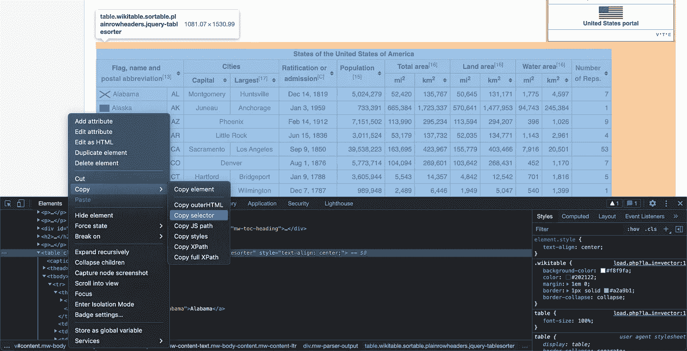
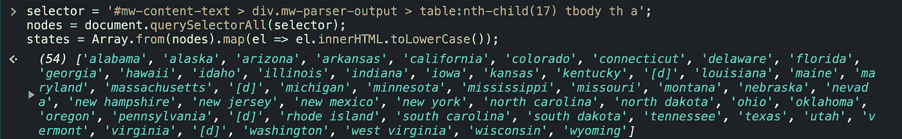
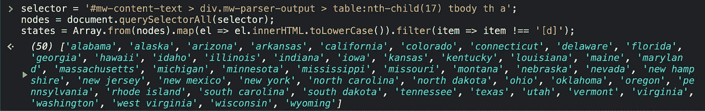
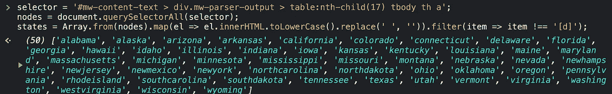

# 哪些字母没有出现在任何美国州名中——软件工程师的解决方案

> 原文：<https://levelup.gitconnected.com/which-letter-does-not-appear-in-any-us-state-name-a-solution-from-a-software-engineer-b41799909ec7>


汉斯·艾萨克森在 [Unsplash](https://unsplash.com/?utm_source=unsplash&utm_medium=referral&utm_content=creditCopyText) 拍摄的照片

最近偶然发现这个问题:

> 哪些字母没有出现在美国的州名中？

我想知道答案。我太想知道答案了，所以我放下了手头的一切去寻找答案。

然后我懒惰的大脑开启了。有许多信件要检查。我不想检查每个出现在州名中的字母。同时，用谷歌搜索答案感觉像是作弊和放弃。

幸运的是，我们有电脑，我知道如何编码。所以，我会让计算机为我找到答案。

总的想法是找到美国州名中所有独特的字母，与英语字母表中的所有字母进行比较，差异将是我们正在寻找的答案。

# 步骤 1-获取输入数据

第一步是收集数据。

维基百科有一个很好的美国所有州和地区的列表。我们可以用它来提取我们需要的数据。

我打开 DevTools 并选择了包含州的表。然后我右键单击`<table>`元素并复制它的选择器。



选择器看起来像这样:

```
#mw-content-text > div.mw-parser-output > table:nth-child(17)
```

如果你不明白，不要担心。可以把它看作是美国各州表的惟一标识符。我们将使用它来告诉脚本从哪里获取数据。

但是在我们使用它之前，我们必须修改选择器，以将带有州名的表格单元格作为目标。

```
#mw-content-text > div.mw-parser-output > table:nth-child(17) tbody th a
```

有了它，我们可以开始构建一个提取州名的脚本。

这个脚本使用我们的选择器来获取包含州名的所有节点，提取名称并以列表的形式返回它们。该脚本还将所有字母转换为小写，这样我们就不必区分大写字母和小写字母——这将使我们以后的生活更容易。

在 DevTools 控制台中运行该脚本会导致:



这几乎是我们所需要的。问题是我们在清单上有 54 个项目，而我们应该只有 50 个。那是因为我们那里有那些多余的`[d]`。

让我们移除它们。我们可以手动完成，但因为我们正在编码，我们可以让计算机为我们做。

filter 函数遍历列表中的每个元素，并检查元素是否等于`[d]`(现在所有元素都是小写)。如果有，则被过滤掉。



好多了！

在这个阶段，我们可以做的最后一件小事是删除所有空格——我们不需要它们。

这是最终的结果——我们的州名数据集。



# 第二步——计算答案

有了这些数据，我们现在可以编写代码来获得这个问题的答案——哪些字母没有出现在任何美国州名中？

回答问题的算法有很多种写法。在我看来，最简单的方法是使用集合。

在计算机科学中，集合是包含不同元素的数据结构。如果你给这个集合输入一个类似于`1, 1, 2, 3, 4, 4, 4, 5`的数字列表，那么这个集合中就会有一个唯一的数字列表——在这个例子中就是`1, 2, 3, 4, 5`。

我们可以在集合上做的一个有用的操作是两个集合之间的差。给定两个集合 A 和 B，集合 A 和 B 之间的差将返回在集合 A 中但不在集合 B 中的元素。

这正是我们所需要的。我们可以计算出英语字母表中的所有字母与美国州名中所有独特字母之间的差异，剩下的就是我们要寻找的答案。

这里我要用 Python。Python 语言内置了集合，Python 中的集合有计算差异的方法。

下面的脚本首先将州名粘合成一个大字符串(`''.join(states)`)，并使用这个长字符串创建美国州名中所有唯一字母的集合。

然后，该脚本计算英语字母表中所有字母的集合与美国州名中所有唯一字母的集合之间的差异，瞧！

剩下的就是运行脚本和…

# 答案是…

> Q

唯一没有出现在美国任何一个州的字母是字母 q。

这就是你作为一个软件工程师如何回答一个简单的问题。

*更新 17.05.2022:我已经更新了最终的 Python 脚本，使其更加清晰。感谢每一个留下反馈让它变得更好的人！*