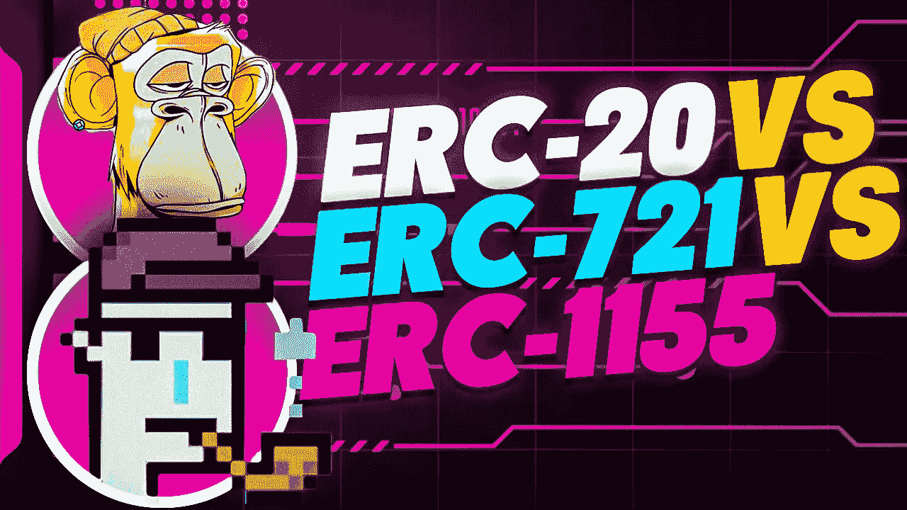

# ERC-20 vs ERC-721 vs ERC-1155 以太坊令牌智能合约——选哪个？

> 原文：<https://levelup.gitconnected.com/which-one-to-choose-erc-20-vs-erc-721-vs-erc-1155-ethereum-token-smart-contract-red-pill-9bb827148671>

如果你在这里，那是因为你想知道你应该选择哪种智能合约来创建你的 NFTs。

这个问题的答案可能不是你所期待的。事实上，我也一直在宣扬最昂贵的智能合同。但是请允许我看看不同之处！仔细阅读这篇文章，你会明白这些 ERC 令牌标准之间的差异。

ERC 代表以太坊征求意见。但是什么是 ERC-20，ERC-721 和 ERC-1155？让我们更深入地研究一下每一个问题。

> 最初我以为以太坊是一个会被人用来写简单金融脚本的东西。事实证明，人们在它上面写了类似占卜的东西。维塔利克·布特林

…我想补充一下 Vitalik 的话，在以太坊的 ERC-721 令牌合同的帮助下，人们正在建立巨大的数十亿英镑的市场…或者是 ERC-1155？？？😵

进入 ERC 以太坊矩阵！我们去拿 ERC 红丸吧！(顺便问一下，她为什么拿着一个发光的避孕套？🙄)

## ERC-20

让我们回到基础。我相信你们中的许多人已经听说过 ERC-20，它是第一个也是最广泛使用的令牌标准，由以太坊区块链网络批准在生态系统中运行，并已成为令牌实现的技术标准。它于 2015 年提出，并最终在 2017 年与区块链以太坊整合。它列出了一套所有基于以太坊的令牌都必须遵守的准则。**20 是用于相同实体的可替换令牌**，这对于创建稳定硬币(Tether、和戴是几个主要的例子)、ICO(首次硬币发行)等非常有用。ERC20 令牌是可替换的令牌，这意味着每个令牌都具有完全相同的值。

2017 年和 2018 年，发行了大量不同的 ERC-20 代币，用于为新区块链风险投资公司筹集资金，这造成了大量的区块链炒作。直到今天，ERC-20 标准仍然被广泛使用，并在区块链和以太坊生态系统中发挥着重要作用。

**⚠️crypto Henri**[**YouTube**](https://www.youtube.com/channel/UCRXmxbm5pAGLPMdJXxzGKuQ)**⚠️**

## ERC-721

与 ERC-20 不同， **ERC-721 专注于不可替代的代币**。最近对 NFTs 的大肆宣传通常归功于 ERC-721 的出现，它是 NFTs 的基本规则集。NFT 是不可替换的唯一令牌，其值不同于属于同一智能合约的其他令牌。如果游戏中的所有物品都被标记化，它们就会变得不可替代，一些物品的价值会高于其他物品，通常是根据它们的稀有程度、年龄和视觉吸引力，即使它们是同一智能合约的一部分。ERC-721 基本上引入了一个在以太坊上构建 NFT 的标准。

ERC-721 的想法最初是由一群人提出的，其中包括 CryptoKitties 的创始人兼首席技术官迪特·雪莉(Dieter Shirley)，作为 2017 年以太坊的改进提案(EIP)。区块链政府/治理随后于 2018 年获得批准。

就像许多其他的 ERC 一样，ERC-721 也为 NFTs 提供一些功能。一些示例包括提供获取账户当前令牌余额、网络上令牌的总供应量以及特定令牌所有者信息等的能力。它也有助于从一个账户到另一个账户的 NFT 交易。

由于 ERC-721，它提供了一个独特的机会，为艺术家，游戏玩家或基本上任何有价值或独特的东西出售的人创造一个市场。

## ERC-1155

2019 年，ERC-1155 首次推出。综上所述， **ERC-1155 是 ERC-20 和 ERC-721** 的杂交体。

ERC-20 和 ERC-721 令牌的局限性导致了 ERC-1155 的产生。在 ERC-20 令牌中，当用户不小心将令牌发送到错误的地址时，由于缺乏解决这些转移事件的方法，他们已经转移的内容将永远丢失。另一方面，ERC-20 和 ERC-721 标准基于为每个令牌类型或集合分别部署新的智能合约。此外，不可能直接获得令牌标识符，这使得使用这些令牌进行交易很困难。想象一下，一个买家决定从你这里买一套 5 NFTs。为了将它们转移给购买者，而不是同时转移所有 5 个代币，你将不得不进行 5 次单独的交易，以及所有的交易费用和网络的负载操作。这些冗余的字节码也使以太坊区块链不堪重负，导致高昂的汽油费和延长的交易时间。

除此之外，ERC-20 和 ERC-721 令牌之间的不兼容性是另一个问题。由于许多 DApps 同时使用这两种令牌，这变得非常复杂，因为它们的契约是以非常不同的方式创建的。

这些是 ERC-1155 被引进的一些原因。此外，ERC-1155 允许每个令牌 ID 代表一种可配置的新令牌类型。这可以大大减少区分不同令牌所需的数据量。除此之外，它还允许在单个事务中发送不同类型的 NFT，而不是为每个不同的令牌进行单独的事务。这些功能最终导致减少网络拥堵，并大大减少你要支付的煤气费。

另一方面，使用 ERC-1155 的 DApp 开发商可以允许其用户通过使用相同的合同和相同的地址来注册可替换和不可替换的令牌。这是因为可替换的代币被用作支付货币或游戏中的硬币，而不可替换的代币被用于游戏或 DApp 中的收藏品或可交换物品。因此，这是一种更有效利用资源的方式。

ERC-1155 的另一个重要特征是安全令牌传输。ERC-1155 智能合约包括一个功能，可以帮助验证交易是否已经执行，如果没有，它可以帮助恢复交易，将令牌的控制权归还给发行者。这非常有用，因为当我们转移代币时，有时会在接收者的地址上出错。出现这种情况时，交易可以作废；发行者可以恢复令牌，并允许它再次验证地址，并进行另一个新的交易。为了避免重复消费，还介绍了一些有助于防止此类行为的规则。

由于其独特的效用，我们可以预见越来越多的项目采用 ERC-1155 标准。

那么，你对这三个 ERC 有什么看法呢？你铸造过 NFT 吗？你用过哪个 ERC 标准？

**🚀如果你喜欢这些内容，请关注我，也可以查看我的🧱区块链和 NFT 课程:**

**📖** [**完整 NFTs 教程**](https://www.udemy.com/course/the-complete-nft-course-learn-everything-about-nfts/?referralCode=AAEE908D13D0E2276B19)

**👨‍🎓** [**Unblockchain 课程**](https://www.udemy.com/course/blockchain-deep-dive-from-bitcoin-to-ethereum-to-crypto/?referralCode=B8463EE382E6D313304B) **—脑洞大开的区块链课程**