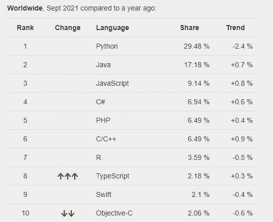
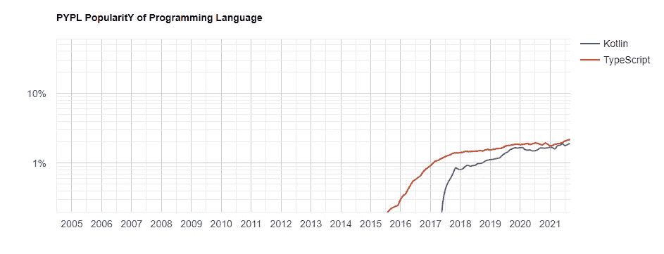
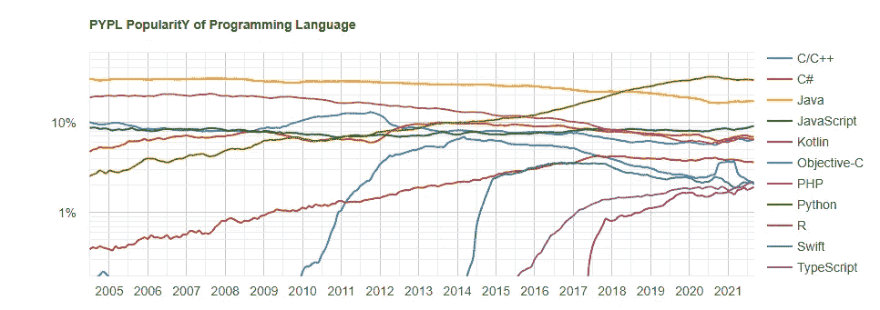
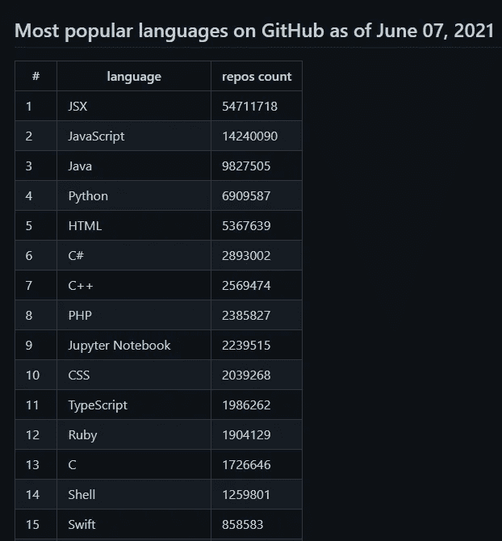

# 2021 年学哪门编程语言？

> 原文：<https://levelup.gitconnected.com/which-programming-language-to-learn-in-2021-1bade64368c7>

如果您想知道学习哪种编程语言，并且不确定从哪里开始，那么您已经找到了正确的文章。这里我给大家展示一下为什么需要学习 Python，越快越好。

照片由 [Fotis Fotopoulos](https://unsplash.com/@ffstop?utm_source=medium&utm_medium=referral) 在 [Unsplash](https://unsplash.com?utm_source=medium&utm_medium=referral) 上拍摄

这是这个话题的第二版，自从去年我写了一篇题为；[2020 年学哪门编程语言](https://medium.com/temple-of-tech/which-programming-language-to-learn-in-2020-9280bfe68ce3)。我想，既然第一次表现得很好，为什么今年不再做一次呢？此外，我很想知道一年来发生了什么变化。现在我们继续这篇文章。

# 谷歌编程语言的流行

此[信息的来源。](https://pypl.github.io/PYPL.html)

我将从分析这个排名和去年的开始。除了一些百分比之外，没有太大的变化，前 10 名中还有一个新人。我在上一篇文章中提到了 TypeScript，这种趋势一直保持不变。去年它不在这个名单上，但现在它拥有令人印象深刻的市场份额，排名第八。

这一变化将 Matlab 推到了第 12 位，事实上，它就在 Kotlin 之下，kot Lin 是我去年选择的编程语言。

Objective-C 也出现了大幅下滑，失去了两个位置和超过 0.3%的市场份额。而且，它有 0.6%的负趋势，这意味着它将继续下跌，除非发生什么事情。

Kotlin & TypeScript 似乎有上升趋势，在不久的将来可能会进入前 5 名。看一下下面的图表，你会看到这两者都在稳步上升。

让我们来看看他们与榜单前十名相比表现如何。

他们还需要占领更多的地盘，但是想到他们比一些主要的公司更新，你就会有希望。除非发生重大事件，否则他们可以在几年内爬上顶峰。

# 截至 2021 年 GitHub 上最受欢迎的语言

与去年相比，我们今年看到的最大不同是 JSX 加入了名单。它是 JavaScript XML，它允许你用 JavaScript 写 HTML 代码，它调用 React。

一些显著的变化:

*   HTML 从去年的第三位跌至第五位。
*   Python 保持不变。
*   PHP 下降了几个点。
*   C#仍然保持强势，事实上，它是一种优势。
*   Ruby 已经退出前 10 了。

# 结束语

有很多优秀的编程语言，但是选择一种适合你的可能是一个乏味的过程。你需要考虑很多事情，比如特定语言的人才库、未来前景等等。

考虑到所有这些，我意识到 **Python** 是最好的选择。随着这种语言越来越适应现实世界的项目，它将继续存在并占据主导地位。

如果你对这篇文章有任何问题，请不要犹豫，在下面留下你的评论。考虑订阅时事通讯，这样就不会错过这样的内容。