# 带有 React Native 和 Babel 的白标移动应用程序

> 原文：<https://levelup.gitconnected.com/white-label-mobile-app-with-react-native-and-babel-490363ec59>

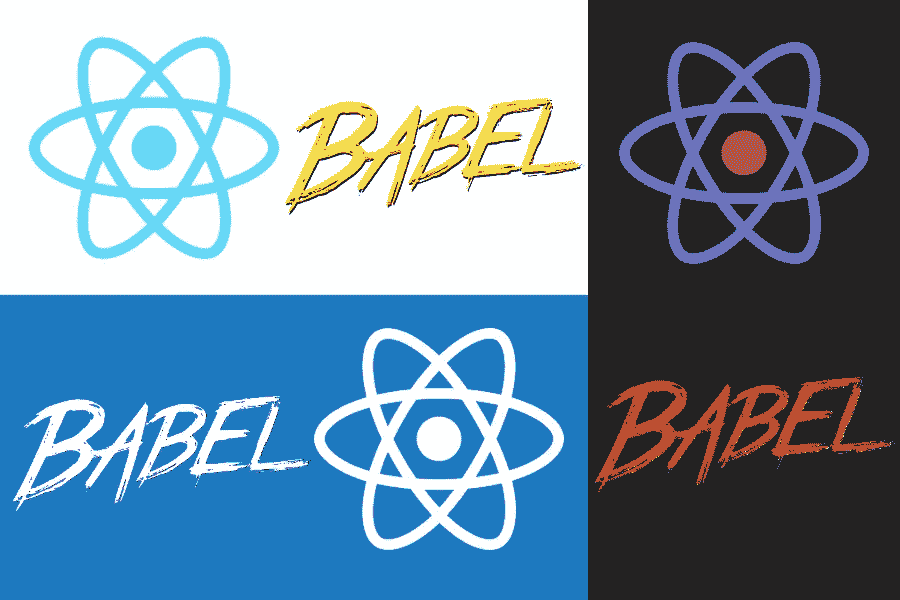

在我的[上一篇文章](https://medium.com/swlh/white-label-web-app-with-reactjs-and-webpack-bb3a94a83fe6)中，我描述了一个白色标签网络应用的解决方案，我在之前的一个项目中使用过。我计划在我目前的项目中使用同样的方法。问题是，在当前项目中，我们还构建了移动应用程序，如果能够在 React Native world 中解决以下挑战，那就太好了:

*   每个品牌应用不同的风格/主题
*   迎合内容差异
*   迎合不同品牌之间的布局/结构和行为差异
*   从一个代码库生产多个产品

# 研究

[现有](https://hackernoon.com/setting-up-android-like-product-flavors-in-react-native-39b6c011061b) [篇](https://medium.com/flawless-app-stories/react-native-white-label-101-163c1967c12a) [篇](https://medium.com/@dzigorium/one-code-base-for-a-mobile-application-6fe086f24fdd)关于如何在打包层面(bundle IDs，assets 等)实现 React 原生 app 的白色标签化。)通过利用 [Android 风格](https://developer.android.com/studio/build/build-variants)和 [iOS 目标](https://developer.apple.com/library/archive/documentation/ToolsLanguages/Conceptual/Xcode_Overview/WorkingwithTargets.html)。这些将对我们有用，但将只涵盖我们需求的一个子集。提到的文章也试图解决主题化和特性集的差异，但主要是通过平面配置文件和`if () ... else ...`逻辑，我认为从长远来看这是不可维护的，所以我继续寻找。

来自 WellD Tech 的那个在处理代码级别的差异上更加详细，但是他们的解决方案对我们来说不够灵活，因为它只允许配置给定版本中包含的顶级模块列表。

我能找到的最符合我们标准的解决方案是[使用自定义文件扩展名](https://medium.com/rbi-tech/a-b-tested-feature-flagged-white-label-apps-with-webpack-fddd4c629f1f)。链接的文章使用了 Webpack，但是 Metro 的`[sourceExts](https://facebook.github.io/metro/docs/configuration/#sourceexts)`设置也可以达到同样的效果。不过，我们可能会对这种方法有所挑战，因为我们使用了一个[应用引擎](https://www.youi.tv/youi-engine/)，它包装了 React Native，并有自己的内部文件扩展名列表及其优先级，我不想弄乱它。

此时，我决定不再寻找现成的解决方案，自己想办法。

# 第一次尝试(失败)

既然我已经为 ReactJS 解决了这个问题，我想在 React Native 中肯定也有类似的方法。我的第一次尝试是看看 Metro bundler(作为 Webpack 的等价物)和它的`[extraNodeModules](https://facebook.github.io/metro/docs/configuration/#extranodemodules)`。它看起来很有前途，尤其是与代理对象相结合，代理对象通常在[从项目根](https://medium.com/@dushyant_db/how-to-import-files-from-outside-of-root-directory-with-react-native-metro-bundler-18207a348427)外部引用文件时使用。

不幸的是，事实证明，使用这种配置设置，没有办法实现我在 Web 白标应用程序中非常重视的回退机制。

# 一个解决方案

我的“最终”解决方案是基于`[babel-plugin-module-resolver](https://github.com/tleunen/babel-plugin-module-resolver)`及其处理模块多个根位置的能力。它允许我们在 JS 捆绑构建阶段解决品牌模块导入，并为不需要为某些品牌定制的模块提供一个备用位置。

**#1 基础项目** 作为工作演示的基础，我将使用来自 [ReactNativeSchool](https://www.reactnativeschool.com/) 的示例[计算器应用](https://github.com/ReactNativeSchool/react-native-calculator)。他们的项目使用了 [Expo](https://expo.io/) ，但这不是必需的，即使你不使用 Expo，所描述的解决方案也能工作。最初的项目结构是:

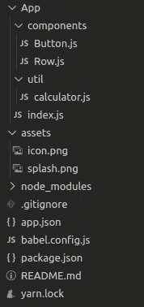

请参见[该提交](https://github.com/jar0s/reactNative-babel-wla/commit/a6ab4a6b02411de1c4535f7cb23d67e6e04d7de9)

运行`yarn run android`会显示以下应用程序:

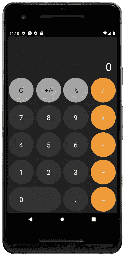

基本应用

**#2 引入模块解析器** 让我们添加`[babel-plugin-module-resolver](https://github.com/tleunen/babel-plugin-module-resolver)`，引入一个`brands`文件夹，从组件中提取样式。

更新的文件夹结构:

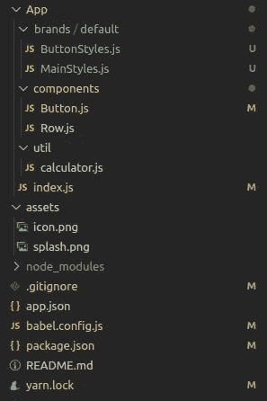

在[中看到它这个 commit](https://github.com/jar0s/reactNative-babel-wla/commit/d234f6650f6e2ea6dc7ca655cef9d18b77db58f1)

相应的代码更改如下:

在[提交](https://github.com/jar0s/reactNative-babel-wla/commit/d234f6650f6e2ea6dc7ca655cef9d18b77db58f1)中查看

此时，我们得到的仍然是同一个应用程序，但结构略有不同。如果您查看新的独立样式的导入语句，您会发现它们没有提供任何相对路径(例如`import ButtonStyles from “ButtonStyles"`)。由于新添加的模块解析器，Babel 将负责解析实际路径。我们将在下一步中利用这一点。

**#3 添加更多品牌** 我们添加`acme`和`calc_co`作为新品牌，分别定制按钮和显示。

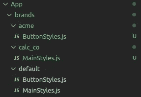

在[提交](https://github.com/jar0s/reactNative-babel-wla/commit/80fe6f8aa9b3edd58b28bacaedcd1258f000af12)中查看

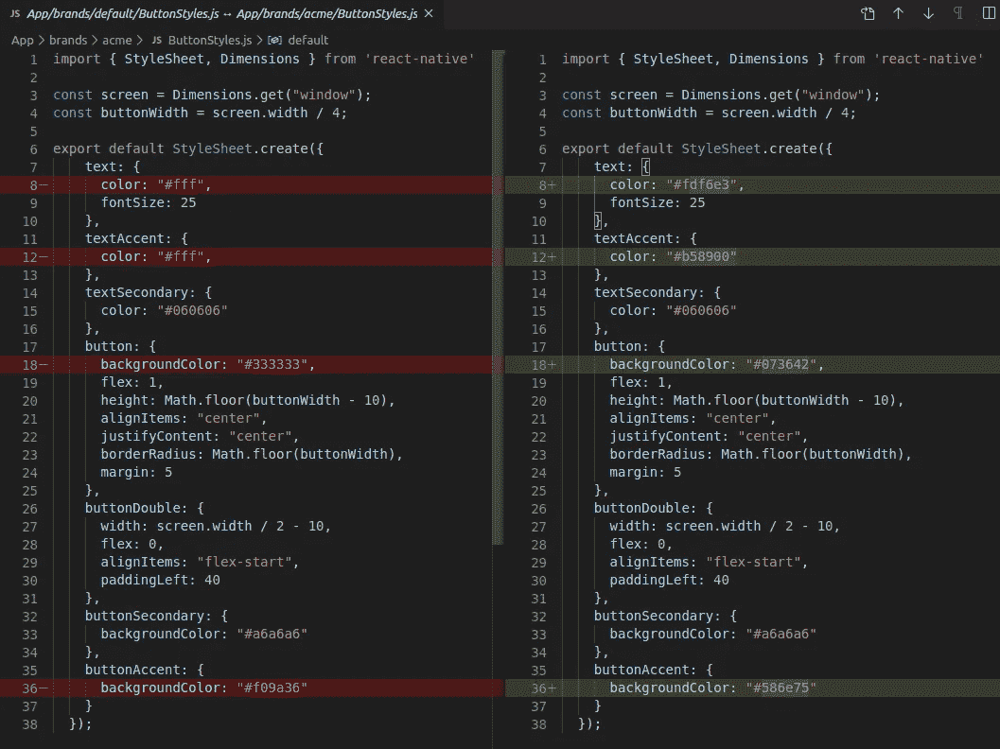

我选择只为 Acme 品牌定制按钮的颜色。左边默认，右边 acme。

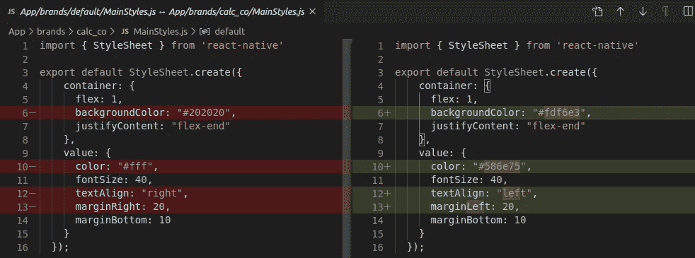

我选择自定义 Calc Co 显示的颜色和文本对齐。左边是默认，右边是 calc_co。

我们还需要如下更新`babel.config.js`:

在[提交](https://github.com/jar0s/reactNative-babel-wla/commit/80fe6f8aa9b3edd58b28bacaedcd1258f000af12)中查看

这一步需要注意的是`acme`和`calc_co`都没有完整的文件集。由于默认的回退机制，他们不需要这样做。我们告诉 Babel 首先在应用程序根中寻找模块，然后在`APP_BRAND`环境变量中定义的品牌的文件夹中，然后在默认的备用位置中。

现在，我们可以使用`APP_BRAND={brand_name} yarn run android`构建针对特定品牌的应用程序，以获得以下内容:

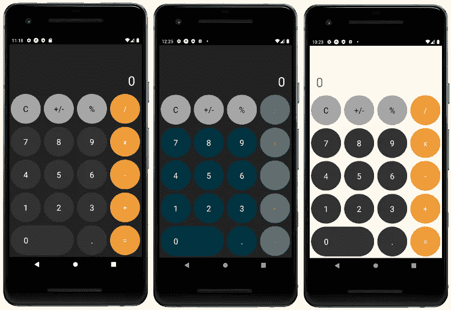

分别为“纱线运行安卓系统”、“APP_BRAND=acme 纱线运行安卓系统”和“APP_BRAND=calc_co 纱线运行安卓系统”的结果。

酷，我们得到不同风格的计算器。因为不同的风格只是众多需求中的一个。接下来让我们进入一些更有趣的东西。

**#4 支持结构&内容差异** 作为这一步的准备，我对应用进行了一点重新分解，将其分解为更小的组件。[变更](https://github.com/jar0s/reactNative-babel-wla/commit/06188f8ad4f1173db06766a43cff0a00c22f7035)主要是增加了`Calc`和`ButtonPanel`部件。

为了进一步区分品牌，除了造型，让我们引入包装对象(是的，命名很难；)).他们的目的是在避免代码重复的同时，使品牌之间的结构和内容差异成为可能(或者将其保持在最低限度)。这个想法是，主要的业务逻辑和渲染留在顶级组件中(不是特定于品牌的)，但是这些组件通过 props 进行参数化，以便它们可以根据这些参数有不同的外观或行为。感觉这是一种干净的方式，可以保持特定品牌代码的合理大小，并包含在给定品牌的文件夹中。

这里有一个例子:

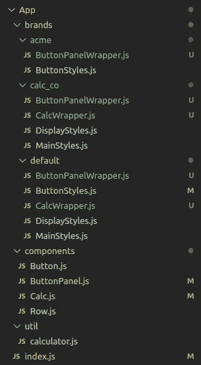

新包装对象。在[提交](https://github.com/jar0s/reactNative-babel-wla/commit/3b224518d726f76c2d3bf1abe9f9044deca0d9d8)中查看它们。

下面是我如何参数化主要组件:

为了让包装组件生效，您需要导入它们，而不是主组件。来自`index.js`的例子:

我使用`CalcWrapper`将 Calc Co 品牌的计算器显示屏放在底部:

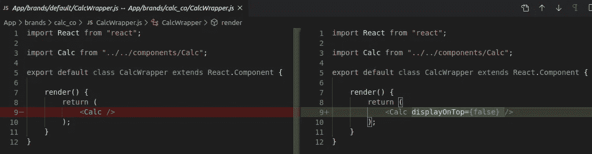

左边是默认，右边是计算公司。

我对 Acme 按钮使用了罗马数字:

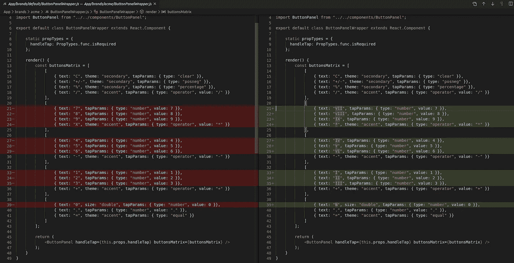

默认在左边，顶点在右边。

我用完全定制的按钮布局为 Calc Co:

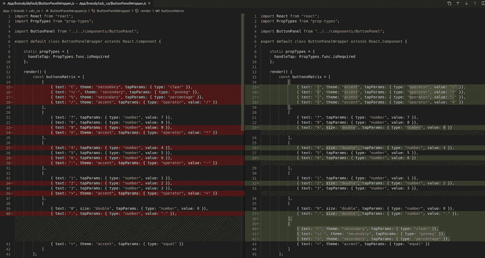

左边是默认，右边是计算公司。

最终结果如下:

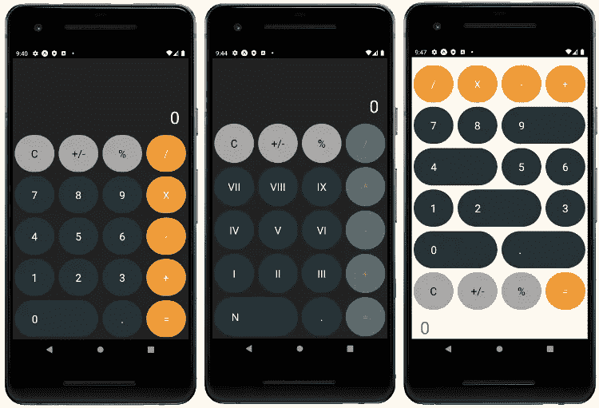

分别为“纱线运行安卓系统”、“APP_BRAND=acme 纱线运行安卓系统”和“APP_BRAND=calc_co 纱线运行安卓系统”的结果。

正如你所看到的，使用这种方法，你不需要太多额外的代码就可以得到明显不同的应用程序。一旦你将主要组件参数化，你就可以很容易地用它们的各种组合来构建应用程序。

# 生产解决方案

**ESLint**
如巴别模块解析器[文档](https://github.com/tleunen/babel-plugin-module-resolver#editors-autocompletion)所述。如果你正在使用 ESLint，你应该使用 [eslint-plugin-import](https://github.com/benmosher/eslint-plugin-import) 和[ESLint-import-resolver-babel-module](https://github.com/tleunen/eslint-import-resolver-babel-module)来移除 falsy 未解析的模块。

**IDE 支持**
如巴别塔模块解析器[文档](https://github.com/tleunen/babel-plugin-module-resolver#editors-autocompletion)所述，您可以使用以下方法

*   Atom:使用 [atom 自动完成模块](https://github.com/nkt/atom-autocomplete-modules)并启用`babel-plugin-module-resolver`选项。
*   IntelliJ/WebStorm:你可以添加自定义资源根目录，确保它与你在这个插件中拥有的相匹配。
*   VS 代码:配置`jsconfig.json``tsconfig.json`中的[路径映射](https://www.typescriptlang.org/docs/handbook/module-resolution.html#path-mapping)，例如:

```
{
  "compilerOptions": {
    "baseUrl": ".",
    "paths": {
      "*": ["App/*", "App/brands/default/*"],
    }
  }
}
```

不幸的是，jsconfig 无法使其动态化，也无法根据环境变量处理其他品牌。

有了 tsconfig，虽然没有对 a `tsconfig.js`的[官方支持，但是有一个](https://github.com/microsoft/TypeScript/issues/25271) [npm 包](https://www.npmjs.com/package/tsconfig.js)可以让你拥有适合这个用例的动态类型脚本配置，因为你可以在其中引用`process.env.APP_BRAND`。

# 结论

现在你知道如何利用`[babel-plugin-module-resolver](https://github.com/tleunen/babel-plugin-module-resolver)`来让一个白色标签的 React 原生应用程序从一个代码库构建多个不同品牌的产品。

我创建的示例项目的源代码可以在 [GitHub](https://github.com/jar0s/reactNative-babel-wla) 上找到。