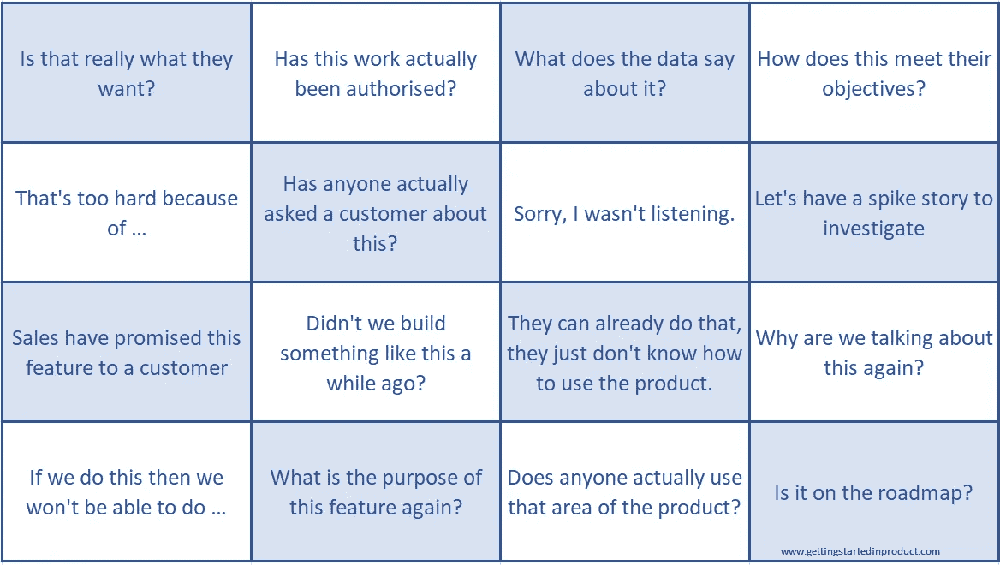

# 谁想玩产品见面会宾果游戏？

> 原文：<https://levelup.gitconnected.com/who-fancies-a-game-of-product-meeting-bingo-69fcae3954e2>

如果你参与到产品中，那么根据定义，你会参与很多会议。

你要和客户开会讨论他们的需求。与利益相关者会面，了解业务战略、优先事项和路线图。与工程团队开会确定工作的大小，然后计划它们的交付。会议，会议，会议。

你可以保证，在会议期间，同样的话会从某人嘴里说出来。

发生这种情况的原因是，通常是因为应该发生的事情没有发生，这导致陈词滥调的句子被推出。

这些常用短语包含在下面的产品会议宾果板中。

你的产品会议宾果板。

> 但是，为什么我们经常听到这些短语呢？

# 你没有把事情解释清楚

如果你没有真正解释你在会议上讨论的功能背后的目标，那么你会听到下面这样的短语。这是人们寻求被问问题的保证的地方，因为你还不能理解这个特征背后的原因。

*   这真的是他们想要的吗？
*   数据是怎么说的？
*   这如何满足他们的目标？
*   有人问过顾客这个问题吗？
*   为什么我们又要谈论这个？
*   有人真正使用产品的这个区域吗？

# 你没有经历这个过程

如果由于某种原因，一个正在呈现的特性没有必要通过这个过程到达它所在的位置，那么观众的工作就是对此提出疑问，以确保遵循正确的步骤。这意味着你可能会听到下面这样的短语，因为观众发现你可能错过了一些研究、授权检查或技术验证。

*   这项工作实际上得到授权了吗？
*   让我们有一个故事来调查
*   销售人员已经向客户承诺了这一功能
*   为什么我们又要谈论这个？
*   如果我们这样做，我们就不能那样做
*   有人真正使用产品的这个区域吗？
*   它在路线图上吗？

# 您的产品缺少一些关键的可用性、帮助页面或发行说明

如果没有正确的产品知识，客户就有可能不清楚他们能够用你的产品做什么，但你也有可能去寻找已经解决的问题的解决方案。

*   我们不久前不是造了一个这样的东西吗？
*   他们已经可以做到这一点，只是不知道如何使用产品

# 你得到了一个有技术债务的产品

如果你不小心，那么你的产品就有可能失去控制，这反过来会限制你将来满足客户需求的能力。当你听到这样的短语时，你就知道了:

*   那太难了，因为…

# 你的团队没有订婚

当然，你可以经历整个过程，提供所有正确的背景信息，并解释如何在当前产品设置下交付该功能，但如果你没有以一种让团队参与的方式完成，他们就不会与你同行。

*   那太难了，因为…
*   抱歉，我没在听
*   这个功能的目的是什么？

# 想要更多这样的内容？

如果你想收到更多类似的产品管理内容，请订阅我下面的简讯，让它直接进入你的收件箱。

单击该图像将带您进入产品入门，您可以在此注册订阅时事通讯

# 关于罗柏

在涉足软件产品之前，Rob 是一名足球运动员、电影院经理和招聘顾问。20 多年来，他一直在照看产品和雇佣产品团队，目前是奢侈品手表零售商 Watchfinder 的产品负责人，并写了一些关于那些想进入产品领域的人如何去做的文章。