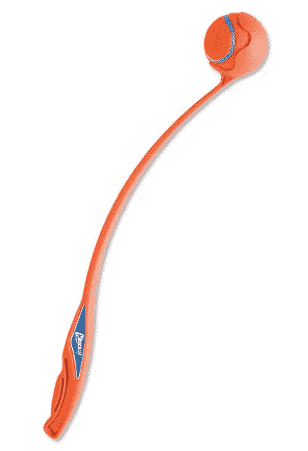

# 谁是好帮手功能？

> 原文：<https://levelup.gitconnected.com/whos-a-good-helper-function-1d465145d153>


## 通过提取调用的抽象保持干燥

如果你曾经和一只狗玩过捡东西，你可能知道它比看起来要难很多。最初的几次投掷是好的，但是你很快就会发现反复投掷和捡球会对你的身体造成压力。再加上第三次扔球后球上沾满了口水，你可能再也不想玩捡球了。

这就是为什么 [Chuckit！](http://chuckit-toys.co.uk/our-products/launchers.html)被发明了。



这个简单的工具可以让狗主人玩几个小时，而不用担心身体疲劳或流口水的手。

作为程序员，你可能经历过类似的现象。每次你必须对一个 API 做一个`fetch`的时候，你必须打出这么多的信息，导致 web 开发的这个关键方面成为一个巨大的阻力。

在这篇文章中，我希望通过演示如何制作 Chuckit，来减轻您的负担，并帮助您的代码不至于变得湿漉漉的(即保持干燥)!作为你的代码库。

比方说，你正在为狗主人建立一个社交媒体网站，展示他们毛茸茸的同伴。你要做的第一件事是允许狗主人注册到该网站。为了做到这一点，您必须对您的 API 做一个`fetch`来创建一个新用户。该提取将类似于以下内容:

注册后，主人想在他们的页面上添加关于他们的狗的信息，这意味着你必须制作另一个`fetch`，看起来像这样:

这里面有相当多的重复。也许这个获取可以被抽象。

从顶部开始，您会注意到 URL 几乎是相同的。通过将 URL 存储在一个常量中，您可以利用这一点:

```
const URL = 'http://localhost:3000/api/v1'
```

现在，这不仅是可重用的，而且当你把你的网站投入生产，你将不必改变每一个`fetch`的网址。

但是你不应该就此打住。很可能会有许多不同的狗和主人路径获取。为什么不通过存储狗和主人的 URL 来利用这一点呢？

```
const OWNERS_URL = URL + '/owners'
const DOGS_URL = URL + '/dogs'
```

这看起来稍微好一点，但是还有更多你可以抽象的。`fetch`的叫声本身非常相似。您可以很容易地将它抽象成一个助手函数，如下所示:

现在你可以像这样写`createOwner`和`createDog`看起来更干净、更干燥:

太好了，现在你的网站有了自己的 Chuckit！因为你的社交媒体网站可能会非常大，所以储存你的 Chuckit 是个好主意！在另一个文件中，以便在需要时导入。如果您将它与处理所有请求方法的其他获取一起构建，您将得到如下结果:

这样，您就可以调用`getChuckit`来处理对 API 的所有 GET 请求，调用`postPatchChuckit`来处理 POST 或 PATCH 请求，调用`deleteChuckit`来处理 DELETE 请求。

现在你有自己的 Chuckit 了！这样做你可以毫不费力地`fetch`一整天，玩个痛快！